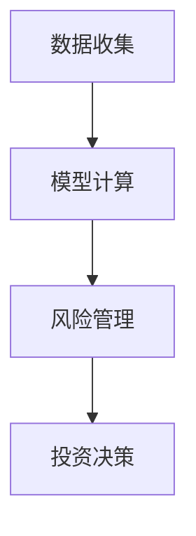

                 


# 马克·莫比乌斯的新兴市场价值投资策略

## 关键词：新兴市场，价值投资，马克·莫比乌斯，投资策略，风险管理

## 摘要：马克·莫比乌斯是新兴市场价值投资领域的权威，他的策略强调低估值和长期持有。本文详细分析了莫比乌斯的投资理念、选股标准、风险管理策略，并通过多因子模型和Python代码展示了其算法原理，最后以印度市场为例进行了实战分析。

---

## 第一部分：背景介绍

### 第1章：新兴市场与价值投资的背景

#### 1.1 新兴市场的定义与特点

- **新兴市场的定义**：新兴市场是指那些经济快速发展但尚未完全工业化的国家，如中国、印度、巴西等。
- **新兴市场的特点**：
  - 经济增长快，但波动性大。
  - 市场流动性较低，公司治理不完善。
  - 投资机会多，但风险较高。
- **与成熟市场的对比**：
  | 特性 | 成熟市场 | 新兴市场 |
  |------|----------|----------|
  | 市场流动性 | 高 | 中等 |
  | 公司治理 | 透明 | 相对不透明 |
  | 投资机会 | 稳定 | 快速变化 |

#### 1.2 价值投资的核心概念

- **价值投资的定义**：寻找市场价格低于内在价值的股票，长期持有。
- **价值投资的基本原则**：
  - 买入低估的资产。
  - 长期持有，避免短期波动。
  - 重视公司的基本面。
- **新兴市场中的价值投资**：在新兴市场中，价值投资需要考虑更多的风险和不确定性，但潜在回报也更高。

#### 1.3 马克·莫比乌斯的贡献

- **马克·莫比乌斯的背景**：他是新兴市场的投资专家，著有多本投资书籍。
- **莫比乌斯的策略**：
  - 专注于新兴市场，寻找低估值的股票。
  - 重视公司的基本面，尤其是盈利能力。
  - 风险管理是其策略的重要组成部分。
- **与其他投资者的对比**：
  | 投资者 | 投资策略 | 优缺点 |
  |--------|----------|--------|
  | 本杰明·格雷厄姆 | 价值投资 | 适合稳定市场 |
  | 马克·莫比乌斯 | 新兴市场价值投资 | 适合高增长市场，风险较高 |

---

## 第二部分：莫比乌斯的价值投资策略

### 第2章：莫比乌斯策略的核心要素

#### 2.1 投资理念

- **买入便宜货的原则**：莫比乌斯认为，投资的核心是找到市场价格低于内在价值的股票。
- **长期投资的重要性**：新兴市场波动大，长期持有可以平滑短期波动带来的影响。

#### 2.2 选股标准

- **低市盈率与市净率**：
  - 市盈率（P/E）= 股价 / 每股收益。
  - 市净率（P/B）= 股价 / 每股净资产。
- **公司基本面分析**：
  - 盈利能力：ROE（净资产收益率）。
  - 偿债能力：债务与 equity 比例。
  - 发展能力：收入增长率。
- **行业地位与竞争优势**：选择行业龙头，具备竞争优势的企业。

#### 2.3 风险管理

- **投资组合的风险分散**：将资金分配到不同的行业和公司，降低单一投资的风险。
- **估值安全边际**：买入价格低于内在价值，留有安全边际。

---

## 第三部分：投资策略的数学模型与算法

### 第3章：多因子价值评估模型

#### 3.1 模型概述

- **多因子模型的定义**：通过多个因子（如市盈率、市净率、ROE等）来评估股票的内在价值。
- **各因子的权重分配**：根据经验或数据驱动的方法确定每个因子的权重。

#### 3.2 算法实现

- **使用Python进行数据处理**：
  ```python
  import pandas as pd
  import numpy as np

  # 示例数据
  data = {'公司': ['A', 'B', 'C'],
          '市盈率': [10, 15, 20],
          '市净率': [2, 3, 4],
          'ROE': [0.1, 0.2, 0.15]}
  df = pd.DataFrame(data)

  # 计算综合得分
  weights = {'市盈率': 0.3, '市净率': 0.3, 'ROE': 0.4}
  df['综合得分'] = 0
  for i in range(len(df)):
      score = 0
      for col in ['市盈率', '市净率', 'ROE']:
          score += df.iloc[i][col] * weights[col]
      df.iloc[i]['综合得分'] = score
  print(df)
  ```

- **数学公式**：综合得分公式为：
  $$综合得分 = \sum_{i=1}^{n} (因子_i \times 权重_i)$$
  其中，$n$ 是因子的数量。

#### 3.3 数学公式

- 市盈率计算：
  $$市盈率 = \frac{股价}{每股收益}$$
- 市净率计算：
  $$市净率 = \frac{股价}{每股净资产}$$
- 内在价值公式：
  $$内在价值 = \frac{预期现金流}{折现率}$$

---

## 第四部分：系统架构与投资组合管理

### 第4章：投资组合的设计与管理

#### 4.1 系统架构

- **数据收集模块**：收集新兴市场的股票数据。
- **模型计算模块**：计算股票的综合得分。
- **风险管理模块**：评估投资组合的风险。

#### 4.2 系统流程图



#### 4.3 风险管理策略

- **投资组合的动态调整**：定期重新评估股票的综合得分，调整投资组合。
- **风险因子的监控与应对**：监控市场的波动性，及时调整投资策略。

---

## 第五部分：实战案例分析

### 第5章：印度市场的投资策略

#### 5.1 案例背景

- **印度市场的现状**：经济增长快，但市场波动大。
- **莫比乌斯的策略在印度市场的应用**：寻找低市盈率、高ROE的公司。

#### 5.2 数据收集与分析

- **环境安装**：
  - 安装Python和必要的库（pandas, numpy, matplotlib）。
  - 获取印度市场的股票数据（如使用Yahoo Finance API）。

#### 5.3 代码实现

```python
import pandas as pd
import numpy as np

# 假设我们已经收集了印度市场的股票数据
data = {'公司': ['Reliance', 'TCS', 'Infosys'],
        '市盈率': [15, 18, 20],
        '市净率': [2.5, 3.0, 2.8],
        'ROE': [0.1, 0.2, 0.15]}
df = pd.DataFrame(data)

# 计算综合得分
weights = {'市盈率': 0.3, '市净率': 0.3, 'ROE': 0.4}
df['综合得分'] = 0
for i in range(len(df)):
    score = 0
    for col in ['市盈率', '市净率', 'ROE']:
        score += df.iloc[i][col] * weights[col]
    df.iloc[i]['综合得分'] = score

print(df)
```

#### 5.4 案例分析与结果解读

- **综合得分分析**：Reliance的综合得分最高，可能是最佳投资标的。
- **投资组合建议**：将资金分配到Reliance和TCS，分散风险。

---

## 第六部分：总结与展望

### 第6章：总结与最佳实践

#### 6.1 最佳实践

- **定期评估投资组合**：至少每季度评估一次。
- **关注公司基本面**：ROE、负债率等是关键指标。
- **分散投资风险**：避免过度集中于某一只股票或行业。

#### 6.2 未来趋势

- **技术驱动投资**：AI在新兴市场的应用将越来越广泛。
- **ESG投资的重要性**：环境、社会和治理因素将影响投资决策。

---

## 结论

马克·莫比乌斯的新兴市场价值投资策略为投资者提供了在高增长市场中获取超额收益的机会。通过多因子模型和风险管理策略，投资者可以在新兴市场中找到低估的股票，实现长期稳定的回报。随着技术的进步和市场的变化，新兴市场的投资策略也将不断创新，为投资者提供更多的机会。

---

**Tips**：

- **风险管理是投资成功的关键**。
- **长期投资需要耐心和信心**。
- **持续学习和适应市场变化**。

