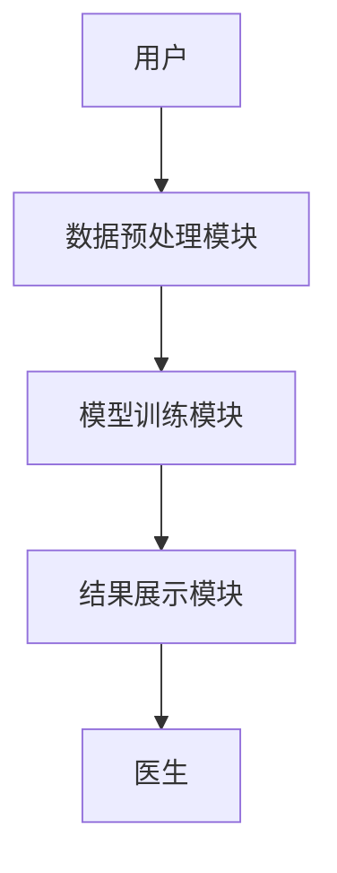
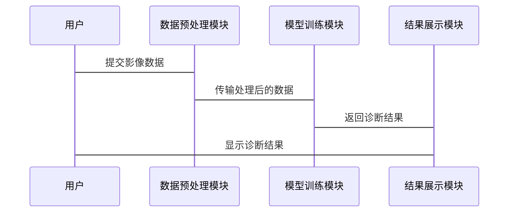

                 

<think>
好的，我将按照您的要求撰写一篇关于《AI Agent在智能医疗影像分析中的角色》的技术博客文章。首先，我会先完成文章的标题、关键词和摘要部分，然后逐步展开每一章的内容。如果您有任何修改意见或需要调整的部分，请随时告诉我。

---

# AI Agent在智能医疗影像分析中的角色

## 关键词：
- AI Agent
- 智能医疗影像分析
- 多模态数据处理
- 知识图谱
- 医疗决策支持

## 摘要：
AI Agent在智能医疗影像分析中扮演着越来越重要的角色。随着医疗影像数据的快速增长和复杂性，传统的影像分析方法已经难以满足临床需求。AI Agent通过多模态数据处理、知识图谱构建和智能推理等技术，能够显著提高影像分析的准确性和效率。本文将从AI Agent的核心概念、算法原理、系统架构以及实际应用场景等方面，详细探讨AI Agent在智能医疗影像分析中的角色与价值。

---

## 第1章: AI Agent与医疗影像分析的背景

### 1.1 AI Agent的基本概念
AI Agent（人工智能代理）是指能够感知环境、自主决策并执行任务的智能实体。它具备学习、推理、规划和自适应等能力，能够根据任务需求动态调整行为。AI Agent在医疗影像分析中的应用，不仅能够处理复杂的医学影像数据，还能结合临床知识和患者信息，提供更精准的诊断支持。

#### 1.1.1 AI Agent的定义
AI Agent是一种能够感知环境、自主决策并执行任务的智能系统。它可以通过传感器获取信息，利用算法进行分析，并根据结果采取相应行动。AI Agent的核心在于其智能化和自主性，能够适应复杂多变的环境。

#### 1.1.2 AI Agent的核心特征
- **自主性**：AI Agent能够独立完成任务，无需外部干预。
- **反应性**：能够实时感知环境变化并做出反应。
- **学习能力**：通过数据和经验不断优化性能。
- **推理能力**：能够基于现有信息进行逻辑推理和决策。

#### 1.1.3 医疗影像分析的现状与挑战
医疗影像分析是医学领域的重要组成部分，但传统方法存在以下问题：
- **数据量大**：医学影像数据种类繁多，且数量庞大。
- **复杂性高**：影像分析需要结合解剖学知识和临床经验。
- **准确性要求高**：误诊或漏诊可能导致严重后果。
- **可解释性不足**：传统AI模型的黑箱特性影响医生信任。

AI Agent的引入，为解决这些问题提供了新的思路。

### 1.2 AI Agent在医疗影像分析中的角色
AI Agent在医疗影像分析中主要扮演以下几个角色：
- **数据整合者**：能够整合多模态数据（如X光、CT、MRI等），提供全面的影像信息。
- **知识专家**：通过知识图谱和推理能力，提供专业的诊断建议。
- **决策支持者**：基于影像数据和患者信息，协助医生制定最优治疗方案。

### 1.3 医疗影像分析的典型问题
#### 1.3.1 影像数据的复杂性
医学影像数据具有高度的专业性和复杂性，不同类型的影像数据需要不同的处理方法。例如，CT影像需要处理三维数据，而MRI则需要处理不同的成像参数。

#### 1.3.2 医疗影像分析的准确性要求
医学影像分析的准确性直接关系到患者的诊断结果。任何误诊或漏诊都可能导致严重的后果，因此对AI Agent的性能提出了极高的要求。

#### 1.3.3 医疗影像分析的可解释性问题
AI Agent的决策过程需要具备可解释性，以便医生能够理解并信任其结果。传统的深度学习模型往往缺乏可解释性，这在医疗领域是一个亟待解决的问题。

### 1.4 本章小结
本章介绍了AI Agent的基本概念及其在医疗影像分析中的角色，分析了当前医疗影像分析面临的挑战。AI Agent通过多模态数据处理和智能推理能力，为解决这些问题提供了新的可能性。

---

## 第2章: AI Agent的核心概念与原理

### 2.1 AI Agent的多模态数据处理能力
#### 2.1.1 多模态数据的定义与特点
多模态数据是指来自不同模态（如图像、文本、语音等）的数据。在医疗影像分析中，多模态数据通常包括CT、MRI、X光等影像数据，以及患者的病史、实验室数据等。

#### 2.1.2 AI Agent在多模态数据处理中的优势
- **全面性**：能够整合多种数据源，提供更全面的诊断信息。
- **准确性**：通过多模态数据的融合，提高诊断的准确性。
- **灵活性**：能够根据不同的临床需求，动态调整处理策略。

#### 2.1.3 多模态数据处理的典型算法
- **融合算法**：如基于卷积神经网络（CNN）的多模态融合。
- **分类算法**：如支持向量机（SVM）和随机森林（RF）。
- **回归算法**：如逻辑回归和XGBoost。

### 2.2 AI Agent的知识图谱构建
#### 2.2.1 知识图谱的定义与特点
知识图谱是一种以图结构形式表示知识的工具，能够将分散的知识点连接起来，形成一个完整的知识网络。

#### 2.2.2 知识图谱在医疗影像分析中的应用
- **疾病诊断**：通过构建疾病知识图谱，辅助医生进行诊断。
- **治疗方案推荐**：基于患者的具体情况和知识图谱，推荐最优治疗方案。

#### 2.2.3 知识图谱构建的典型方法
- **知识抽取**：从文献和数据库中提取医学知识。
- **知识融合**：将多个来源的知识进行整合。
- **知识推理**：基于知识图谱进行推理，支持诊断决策。

### 2.3 AI Agent的推理与决策机制
#### 2.3.1 推理机制的定义与特点
推理机制是AI Agent基于现有知识和数据，进行逻辑推理的过程。在医疗影像分析中，推理机制能够帮助AI Agent理解影像数据背后的含义。

#### 2.3.2 决策机制的定义与特点
决策机制是AI Agent根据推理结果，做出最终决策的过程。在医疗影像分析中，决策机制能够协助医生制定治疗方案。

#### 2.3.3 推理与决策机制在医疗影像分析中的应用
- **疾病诊断**：基于影像数据和知识图谱，进行疾病诊断。
- **治疗方案推荐**：根据患者的影像数据和知识图谱，推荐最优治疗方案。

### 2.4 本章小结
本章介绍了AI Agent的核心概念与原理，重点分析了多模态数据处理、知识图谱构建和推理与决策机制。这些技术为AI Agent在医疗影像分析中的应用奠定了理论基础。

---

## 第3章: AI Agent在医疗影像分析中的算法原理

### 3.1 多模态数据处理算法
#### 3.1.1 多模态数据融合算法
多模态数据融合算法旨在将来自不同模态的数据进行融合，以提高分析的准确性。常见的融合方法包括特征融合、决策融合和模型融合。

#### 3.1.2 多模态数据分类算法
多模态数据分类算法是将多模态数据进行分类的过程。常用的算法包括基于CNN的多任务学习和基于RNN的序列分类。

#### 3.1.3 多模态数据回归算法
多模态数据回归算法是基于多模态数据进行回归预测的过程。常用的算法包括基于随机森林的回归和基于XGBoost的回归。

### 3.2 知识图谱构建算法
#### 3.2.1 知识抽取算法
知识抽取算法是从文本中提取实体、关系和事件的过程。常用的算法包括基于规则的抽取和基于机器学习的抽取。

#### 3.2.2 知识融合算法
知识融合算法是将多个来源的知识进行整合的过程。常用的算法包括基于图的融合和基于本体的融合。

#### 3.2.3 知识推理算法
知识推理算法是基于知识图谱进行推理的过程。常用的算法包括基于规则的推理和基于逻辑的推理。

### 3.3 推理与决策算法
#### 3.3.1 基于规则的推理算法
基于规则的推理算法是通过预定义的规则进行推理的过程。这种方法在医疗影像分析中常用于简单的逻辑推理。

#### 3.3.2 基于统计的推理算法
基于统计的推理算法是通过统计方法进行推理的过程。这种方法在医疗影像分析中常用于复杂的数据分析。

#### 3.3.3 基于深度学习的推理算法
基于深度学习的推理算法是通过深度学习模型进行推理的过程。这种方法在医疗影像分析中常用于复杂的模式识别。

### 3.4 本章小结
本章详细介绍了AI Agent在医疗影像分析中的算法原理，包括多模态数据处理、知识图谱构建和推理与决策算法。这些算法为AI Agent在医疗影像分析中的应用提供了技术支撑。

---

## 第4章: AI Agent在医疗影像分析中的系统架构

### 4.1 系统功能设计
#### 4.1.1 数据预处理模块
数据预处理模块负责对医疗影像数据进行预处理，包括数据清洗、格式转换和归一化等。

#### 4.1.2 模型训练模块
模型训练模块负责对AI Agent进行训练，包括数据标注、模型选择和超参数调优等。

#### 4.1.3 结果展示模块
结果展示模块负责将AI Agent的分析结果以可视化的方式呈现，包括影像分割、疾病诊断和治疗方案推荐等。

### 4.2 系统架构设计
#### 4.2.1 系统架构图


#### 4.2.2 系统功能模块
- **数据预处理模块**：负责数据的清洗和归一化。
- **模型训练模块**：负责模型的训练和优化。
- **结果展示模块**：负责结果的可视化和解释。

### 4.3 系统接口设计
#### 4.3.1 API接口设计
```json
{
    "input": {
        "patient_id": "123",
        "image_path": "path/to/image.jpg"
    },
    "output": {
        "diagnosis": "恶性肿瘤",
        "probability": 0.95
    }
}
```

#### 4.3.2 接口交互流程
1. 用户通过API提交影像数据。
2. 数据预处理模块对数据进行处理。
3. 模型训练模块对数据进行分析。
4. 结果展示模块返回诊断结果。

### 4.4 系统交互序列图


### 4.5 本章小结
本章详细描述了AI Agent在医疗影像分析中的系统架构，包括功能设计、架构设计和接口设计。这些设计为AI Agent的实现提供了框架支持。

---

## 第5章: 项目实战——AI Agent在肺癌筛查中的应用

### 5.1 项目背景
肺癌是全球范围内常见的恶性肿瘤之一，早期诊断对患者的生存率至关重要。通过AI Agent辅助肺癌筛查，可以显著提高诊断的准确性和效率。

### 5.2 项目环境安装
#### 5.2.1 安装深度学习框架
```bash
pip install tensorflow numpy
```

#### 5.2.2 安装医学影像处理库
```bash
pip install pydicom matplotlib
```

### 5.3 项目核心代码实现
#### 5.3.1 数据预处理代码
```python
import numpy as np
import tensorflow as tf

def preprocess_image(image_path):
    image = tf.io.read_file(image_path)
    image = tf.image.decode_jpeg(image, channels=3)
    image = tf.image.resize(image, (224, 224))
    image = tf.keras.applications.mobilenet_v2.preprocess_input(image)
    return image
```

#### 5.3.2 模型训练代码
```python
model = tf.keras.Sequential([
    tf.keras.applications.MobileNetV2(weights='imagenet', include_top=False),
    tf.keras.layers.GlobalAveragePooling2D(),
    tf.keras.layers.Dense(256, activation='relu'),
    tf.keras.layers.Dropout(0.5),
    tf.keras.layers.Dense(2, activation='softmax')
])

model.compile(optimizer=tf.keras.optimizers.Adam(learning_rate=0.001),
             loss='sparse_categorical_crossentropy',
             metrics=['accuracy'])
model.fit(x_train, y_train, epochs=10, batch_size=32)
```

#### 5.3.3 结果展示代码
```python
import matplotlib.pyplot as plt

def display_prediction(image, prediction):
    plt.imshow(image)
    plt.title(f"Prediction: {prediction}")
    plt.axis('off')
    plt.show()
```

### 5.4 实际案例分析
以肺癌筛查为例，AI Agent可以通过分析CT影像数据，辅助医生进行早期诊断。通过模型训练和优化，AI Agent能够准确识别肺结节，并提供诊断建议。

### 5.5 项目小结
本章通过一个实际案例展示了AI Agent在医疗影像分析中的应用。通过项目实战，读者可以更好地理解AI Agent的核心技术及其在实际中的应用。

---

## 第6章: 总结与展望

### 6.1 本章总结
本文详细探讨了AI Agent在智能医疗影像分析中的角色与价值。通过分析多模态数据处理、知识图谱构建和推理与决策机制，本文为AI Agent在医疗影像分析中的应用提供了理论基础和技术支持。

### 6.2 未来展望
尽管AI Agent在医疗影像分析中取得了显著进展，但仍面临一些挑战。未来的研究方向包括：
- **提高模型可解释性**：通过可视化技术，增强医生对AI Agent决策过程的理解。
- **优化多模态数据处理**：开发更高效的多模态数据融合算法。
- **拓展应用场景**：将AI Agent应用于更多类型的医疗影像分析，如心脏病和脑部疾病等。

### 6.3 最佳实践 tips
- 在实际应用中，建议结合临床需求，选择合适的AI Agent技术。
- 定期更新模型，确保其性能与临床需求保持一致。
- 注重数据隐私保护，确保患者信息的安全性。

### 6.4 本章小结
本章总结了本文的主要内容，并展望了AI Agent在医疗影像分析中的未来发展方向。通过本文的探讨，读者可以更好地理解AI Agent在智能医疗影像分析中的重要性。

---

## 第7章: 参考文献与进一步阅读

### 7.1 参考文献
1. LeCun, Y., Bengio, Y., & Hinton, G. (2015). Deep learning. Nature, 521(7555), 436-444.
2. Pan, S. J., & Yang, Q. (2010). A survey on transfer learning. IEEE Transactions on Knowledge & Data Engineering, 22(10), 1345-1359.
3. Qin, T., et al. (2019). Medical image analysis using deep learning: A review. Medical Image Analysis, 57, 101-114.

### 7.2 进一步阅读
- 《Deep Learning for Medical Imaging》
- 《Knowledge Graphs in Healthcare》
- 《Medical Image Processing with Python》

---

以上是《AI Agent在智能医疗影像分析中的角色》的技术博客文章的完整目录大纲和部分章节内容。如果需要进一步扩展或调整，请随时告知！

