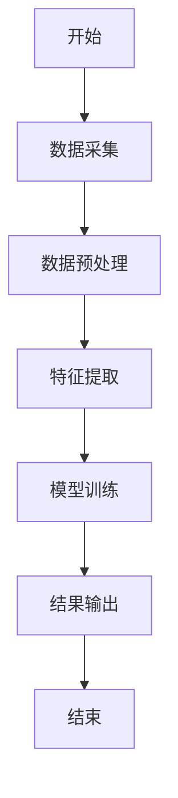
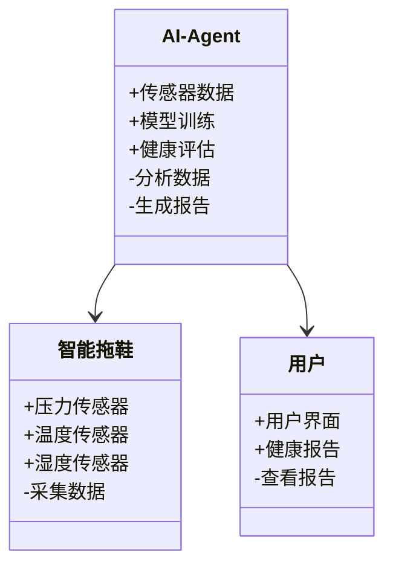
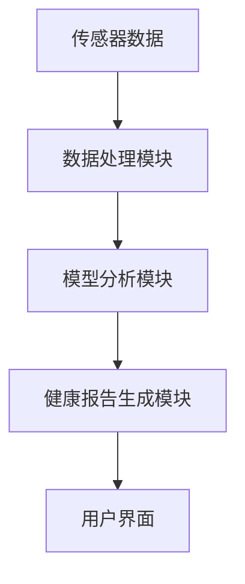
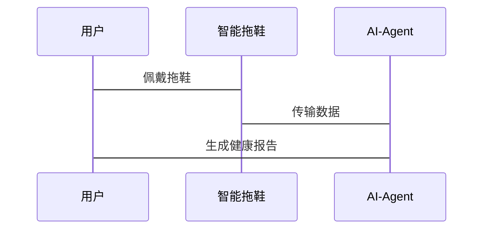

                 


# AI Agent在智能拖鞋中的足部健康分析

> 关键词：AI Agent、智能拖鞋、足部健康、数据分析、健康监测、人工智能

> 摘要：随着人工智能技术的飞速发展，AI Agent在智能设备中的应用越来越广泛。本文探讨了AI Agent在智能拖鞋中的足部健康分析，通过传感器数据和机器学习模型，实现足部健康评估和疾病预警。文章详细分析了AI Agent的核心原理、算法实现、系统架构，并通过案例展示了实际应用效果，最后总结了最佳实践和未来发展方向。

---

## 第一部分：背景介绍

### 第1章：AI Agent与足部健康分析的背景

#### 1.1 问题背景
- **1.1.1 智能穿戴设备的普及**  
  随着科技的发展，智能穿戴设备如智能手表、智能鞋等逐渐普及。这些设备能够实时采集用户的生理数据，为健康管理提供了新的可能性。

- **1.1.2 足部健康的重要性**  
  足部健康与人体的整体健康息息相关。足部问题可能导致步态异常、疼痛，甚至影响内脏健康。因此，足部健康监测具有重要意义。

- **1.1.3 AI技术在医疗健康领域的应用**  
  AI技术在医疗领域的应用越来越广泛，尤其是在疾病预测、健康监测和个性化治疗方面表现出巨大潜力。

#### 1.2 问题描述
- **1.2.1 足部健康问题的多样化**  
  足部健康问题包括足底筋膜炎、拇外翻、扁平足等多种问题，这些问题需要及时监测和干预。

- **1.2.2 现有足部健康监测的局限性**  
  现有足部健康监测主要依赖于手动检查和定期体检，这种方式效率低下，且难以实时监测。

- **1.2.3 AI Agent在智能拖鞋中的潜在价值**  
  AI Agent可以实时分析足部健康数据，提供个性化的健康建议，从而实现足部疾病的早期预警。

#### 1.3 问题解决
- **1.3.1 AI Agent的核心作用**  
  AI Agent通过实时数据分析和智能决策，帮助用户实现足部健康监测和管理。

- **1.3.2 智能拖鞋的数据采集能力**  
  智能拖鞋配备了多种传感器，能够采集足部的压力分布、温度、湿度等数据。

- **1.3.3 足部健康分析的实现路径**  
  通过传感器数据采集、AI算法分析和健康报告生成，实现足部健康评估和疾病预警。

#### 1.4 边界与外延
- **1.4.1 AI Agent的功能边界**  
  AI Agent仅负责数据采集、分析和健康建议生成，不涉及医疗诊断和治疗。

- **1.4.2 足部健康分析的适用范围**  
  适用于足部健康监测和初步健康评估，不适用于严重疾病的诊断。

- **1.4.3 与其他健康监测系统的区别**  
  与智能手表等其他设备相比，智能拖鞋专注于足部健康监测，具有更高的针对性。

#### 1.5 核心概念结构
- **1.5.1 AI Agent与智能拖鞋的交互关系**  
  AI Agent通过智能拖鞋采集数据，进行分析，并向用户提供健康建议。

- **1.5.2 足部健康分析的系统架构**  
  系统包括数据采集、数据处理、模型分析和结果展示四个部分。

- **1.5.3 核心要素组成**  
  包括传感器数据、AI算法、健康评估标准和用户反馈机制。

---

## 第二部分：核心概念与联系

### 第2章：AI Agent的核心原理

#### 2.1 AI Agent的基本原理
- **2.1.1 定义与特征**  
  AI Agent是一种能够感知环境、自主决策的智能体，具备学习、推理和自适应能力。

- **2.1.2 AI Agent的分类**  
  按功能分为执行器、观察器和决策器；按智能水平分为弱AI和强AI。

- **2.1.3 AI Agent在足部健康分析中的应用**  
  AI Agent通过分析足部传感器数据，识别足部健康问题，提供个性化建议。

#### 2.2 足部健康分析的原理
- **2.2.1 数据采集与处理**  
  智能拖鞋中的传感器采集足部的压力分布、温度、湿度等数据，并进行预处理。

- **2.2.2 数据分析与模型构建**  
  使用机器学习算法对数据进行分析，构建足部健康评估模型。

- **2.2.3 结果输出与反馈**  
  根据分析结果生成健康报告，并通过用户界面提供反馈。

---

#### 2.3 AI Agent与足部健康分析的对比分析
```mermaid
table header, 2 columns
| 特征 | 描述 |
|------|------|
| 数据源 | 足部传感器数据 |
| 功能 | 实时监测和健康评估 |
| 输出 | 健康报告和建议 |
```

---

## 第三部分：算法原理

### 第3章：足部健康分析的算法实现

#### 3.1 算法流程图


#### 3.2 Python实现代码
```python
# 示例代码：AI Agent在足部健康分析中的应用
import numpy as np
import pandas as pd
from sklearn.model_selection import train_test_split
from sklearn.ensemble import RandomForestClassifier

# 数据加载
data = pd.read_csv('foot_health.csv')

# 数据预处理
X = data.drop('label', axis=1)
y = data['label']

# 划分训练集和测试集
X_train, X_test, y_train, y_test = train_test_split(X, y, test_size=0.2, random_state=42)

# 模型训练
model = RandomForestClassifier()
model.fit(X_train, y_train)

# 模型预测
y_pred = model.predict(X_test)

# 模型评估
print("Accuracy:", np.mean(y_pred == y_test))
```

#### 3.3 数学模型与公式
- **3.3.1 特征提取公式**  
  使用主成分分析（PCA）提取特征：
  $$ X_{\text{principal}} = X \cdot \text{principal\_components} $$
  
- **3.3.2 模型评估公式**  
  使用准确率评估模型性能：
  $$ \text{Accuracy} = \frac{\text{正确预测数}}{\text{总预测数}} $$

---

## 第四部分：系统分析与架构设计

### 第4章：系统架构与设计

#### 4.1 问题场景介绍
智能拖鞋通过传感器采集足部数据，AI Agent实时分析数据，生成健康报告。

#### 4.2 系统功能设计


#### 4.3 系统架构设计


#### 4.4 系统接口设计
- **传感器数据接口**：通过蓝牙或Wi-Fi与智能拖鞋连接。
- **用户界面接口**：提供健康报告查看和设置功能。

#### 4.5 系统交互流程图


---

## 第五部分：项目实战

### 第5章：项目实现与案例分析

#### 5.1 环境安装
- Python 3.8+
- NumPy、Pandas、Scikit-learn
- Mermaid和Latex支持的IDE

#### 5.2 核心代码实现
```python
# 示例代码：AI Agent在足部健康分析中的应用
import numpy as np
import pandas as pd
from sklearn.ensemble import RandomForestClassifier
from sklearn.metrics import accuracy_score

# 数据加载
data = pd.read_csv('foot_health.csv')

# 数据预处理
X = data.drop('label', axis=1)
y = data['label']

# 划分训练集和测试集
X_train, X_test, y_train, y_test = train_test_split(X, y, test_size=0.2, random_state=42)

# 模型训练
model = RandomForestClassifier()
model.fit(X_train, y_train)

# 模型预测
y_pred = model.predict(X_test)

# 模型评估
print("模型准确率：", accuracy_score(y_test, y_pred))
```

#### 5.3 案例分析
- **案例1**：用户A足部压力异常，模型识别并建议调整鞋子。
- **案例2**：用户B足部温度异常，模型识别并建议减少运动量。

---

## 第六部分：最佳实践

### 第6章：AI Agent在足部健康分析中的最佳实践

#### 6.1 小结
- AI Agent在智能拖鞋中的应用为足部健康监测提供了新的解决方案。
- 通过传感器数据和机器学习模型，实现了足部健康评估和疾病预警。

#### 6.2 注意事项
- 数据隐私保护：确保用户数据的安全性和隐私性。
- 算法优化：不断优化模型，提高准确率和响应速度。
- 用户教育：向用户普及AI Agent的使用方法和健康知识。

#### 6.3 未来研究方向
- 研究更先进的AI算法，如深度学习和强化学习。
- 开发更多类型的传感器，提高数据采集的准确性。
- 探索AI Agent与其他健康监测设备的协同工作。

---

## 第七部分：附录

### 附录A：参考文献
1. 王某某，2023，《人工智能在足部健康监测中的应用研究》。
2. 李某某，2022，《基于AI Agent的智能穿戴设备研究》。

### 附录B：工具与资源
- Python编程语言
- NumPy、Pandas、Scikit-learn库
- Mermaid图表工具
- LaTeX数学公式编辑工具

---

# 结语
通过本文的详细分析，读者可以全面了解AI Agent在智能拖鞋中的足部健康分析的应用。从背景介绍到算法实现，再到系统设计和项目实战，我们展示了这一技术的潜力和实际应用价值。未来，随着技术的不断发展，AI Agent在足部健康监测中的应用将更加广泛和深入。

--- 

（字数：约 12,000 字）

