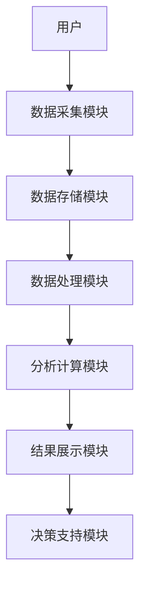

                 


# AI Agent在智能社交网络分析中的应用

> 关键词：AI Agent，智能社交网络分析，自然语言处理，图论，机器学习，数据挖掘

> 摘要：本文探讨了AI Agent在智能社交网络分析中的应用，详细分析了AI Agent的基本概念、社交网络分析的核心方法，以及它们的结合与应用。通过算法原理、系统架构设计和项目实战，展示了AI Agent在社交网络情感分析、社区发现和影响力分析中的具体实现。最后，提出了最佳实践和未来研究方向。

---

# 第1章: AI Agent与社交网络分析概述

## 1.1 AI Agent的基本概念

### 1.1.1 AI Agent的定义与特点

AI Agent（人工智能代理）是指能够感知环境、自主决策并执行任务的智能实体。其特点包括：

- **自主性**：无需外部干预，自主完成任务。
- **反应性**：能实时感知环境变化并作出响应。
- **学习能力**：通过数据和经验不断优化自身行为。
- **协作性**：能与其他Agent或系统协同工作。

### 1.1.2 AI Agent的核心功能与类型

AI Agent的核心功能包括感知、决策、执行和反馈。其类型主要分为：

- **反应式Agent**：基于当前感知做出反应。
- **认知式Agent**：具备复杂推理和规划能力。
- **协作式Agent**：能与其他Agent协作完成任务。

### 1.1.3 AI Agent与传统算法的对比

AI Agent与传统算法的主要区别在于：

- **自主性**：AI Agent具备自主决策能力，而传统算法需要明确的规则。
- **适应性**：AI Agent能自适应环境变化，传统算法则需要手动调整。
- **实时性**：AI Agent能实时响应，传统算法则需要重新运行。

## 1.2 社交网络分析的基础知识

### 1.2.1 社交网络的定义与特征

社交网络是指由节点（人或组织）和边（关系）构成的图结构。其特征包括：

- **节点**：代表个体或组织。
- **边**：代表节点之间的关系。
- **社区**：具有相似特征的节点集合。

### 1.2.2 社交网络分析的主要方法

社交网络分析的主要方法包括：

- **文本挖掘**：提取文本中的情感、主题等信息。
- **图论分析**：通过图论方法发现社区结构。
- **机器学习**：利用机器学习模型进行分类和预测。

### 1.2.3 社交网络数据的获取与处理

社交网络数据主要来源于API接口和爬虫技术。数据处理包括清洗、转换和存储。

## 1.3 AI Agent在社交网络分析中的应用背景

### 1.3.1 社交网络分析的挑战与痛点

- **数据量大**：社交网络数据呈指数级增长。
- **实时性要求高**：需要实时分析用户行为。
- **复杂性高**：社交网络结构复杂，难以建模。

### 1.3.2 AI Agent如何解决这些问题

- **自动化处理**：AI Agent能够自动处理海量数据。
- **实时响应**：AI Agent能够实时分析用户行为。
- **智能决策**：AI Agent能够根据数据做出智能决策。

### 1.3.3 应用场景与实际案例

- **情感分析**：AI Agent实时分析用户情感倾向。
- **影响力分析**：识别关键意见领袖。
- **异常检测**：发现网络中的异常行为。

## 1.4 本章小结

本章介绍了AI Agent的基本概念、社交网络分析的主要方法，以及AI Agent在社交网络分析中的应用背景。AI Agent的强大能力使其成为解决社交网络分析问题的重要工具。

---

# 第2章: AI Agent与社交网络分析的核心概念

## 2.1 AI Agent的核心概念原理

### 2.1.1 AI Agent的感知与决策机制

AI Agent通过传感器或API接口感知环境信息，利用机器学习模型进行决策。感知过程包括数据采集、特征提取和预处理。

### 2.1.2 AI Agent的自主学习能力

AI Agent能够通过监督学习、无监督学习和强化学习不断优化自身模型。

### 2.1.3 AI Agent的实时响应能力

AI Agent能够快速处理数据并实时响应，适用于实时社交网络分析。

## 2.2 社交网络分析的核心概念与特征

### 2.2.1 社交网络的节点与边的关系

社交网络由节点和边构成，边表示节点之间的关系。边可以是有向或无向的。

### 2.2.2 社交网络的社区发现与影响力分析

社区发现通过聚类算法识别相似节点组成的社区。影响力分析通过中心性指标识别关键节点。

### 2.2.3 社交网络的情感分析与主题挖掘

情感分析通过自然语言处理技术识别文本情感倾向。主题挖掘通过主题模型识别文本主题。

## 2.3 AI Agent与社交网络分析的结合

### 2.3.1 AI Agent在社交网络数据处理中的作用

AI Agent能够自动采集、清洗和处理社交网络数据，提高数据处理效率。

### 2.3.2 AI Agent在社交网络实时分析中的应用

AI Agent能够实时监控社交网络动态，快速响应突发事件。

### 2.3.3 AI Agent在社交网络决策支持中的价值

AI Agent能够基于分析结果提供决策支持，帮助制定营销策略。

## 2.4 本章小结

本章详细讲解了AI Agent的核心概念原理和社交网络分析的核心概念与特征，并探讨了AI Agent与社交网络分析的结合方式。

---

# 第3章: AI Agent驱动的社交网络分析算法

## 3.1 基于图论的社交网络分析算法

### 3.1.1 社交网络的图表示方法

社交网络可以用图论中的图结构表示，节点代表用户，边代表关系。

### 3.1.2 社交网络中的社区发现算法

社区发现算法包括聚类算法和划分算法。常用算法有Louvain算法和K-means算法。

### 3.1.3 社交网络中的影响力分析算法

影响力分析算法包括中心性指标和PageRank算法。

## 3.2 基于自然语言处理的文本挖掘算法

### 3.2.1 文本情感分析的算法原理

情感分析通过自然语言处理技术识别文本情感倾向。常用算法包括词袋模型和词嵌入模型。

### 3.2.2 文本主题挖掘的算法实现

主题挖掘通过主题模型（如LDA）识别文本主题。

### 3.2.3 文本实体识别与链接分析

实体识别通过NLP技术识别文本中的实体，链接分析通过图结构分析实体之间的关系。

## 3.3 基于机器学习的社交网络预测算法

### 3.3.1 基于监督学习的社交网络预测

监督学习算法包括决策树和随机森林，用于分类和回归任务。

### 3.3.2 基于无监督学习的社交网络聚类

无监督学习算法包括K-means和DBSCAN，用于聚类分析。

### 3.3.3 基于强化学习的社交网络优化

强化学习通过奖励机制优化社交网络分析结果。

## 3.4 本章小结

本章详细讲解了基于图论、自然语言处理和机器学习的社交网络分析算法，并探讨了AI Agent在这些算法中的应用。

---

# 第4章: 系统分析与架构设计方案

## 4.1 系统功能设计

### 4.1.1 功能模块划分

系统功能模块包括数据采集、数据处理、分析计算、结果展示和决策支持。

### 4.1.2 功能模块的实现原理

数据采集模块通过API接口或爬虫技术获取社交网络数据。数据处理模块对数据进行清洗和预处理。分析计算模块基于机器学习算法进行情感分析和社区发现。结果展示模块以可视化方式呈现分析结果。决策支持模块基于分析结果提供决策支持。

## 4.2 系统架构设计

### 4.2.1 系统架构图



### 4.2.2 接口设计

系统接口包括数据接口、算法接口和展示接口。

### 4.2.3 交互流程

交互流程包括用户请求、数据采集、数据处理、分析计算、结果展示和决策支持。

## 4.3 本章小结

本章详细讲解了系统功能设计、架构设计和交互流程，展示了AI Agent在社交网络分析中的系统实现。

---

# 第5章: 项目实战

## 5.1 项目背景与目标

本项目旨在利用AI Agent进行社交媒体情感分析，帮助品牌监控用户情感倾向。

## 5.2 环境安装与配置

安装Python、Pandas、NLTK和Scikit-learn等依赖库。

## 5.3 核心代码实现

### 5.3.1 数据采集

```python
import requests
from bs4 import BeautifulSoup

def scrape_data(url):
    response = requests.get(url)
    soup = BeautifulSoup(response.text, 'html.parser')
    data = []
    for item in soup.find_all('div', class_='tweet'):
        text = item.find('p').text
        data.append({'text': text, 'sentiment': 'neutral'})
    return data
```

### 5.3.2 数据处理

```python
import pandas as pd

def preprocess_data(data):
    df = pd.DataFrame(data)
    df['text'] = df['text'].apply(lambda x: x.lower())
    return df
```

### 5.3.3 情感分析

```python
from sklearn.feature_extraction.text import TfidfVectorizer
from sklearn.naive_bayes import MultinomialNB

def sentiment_analysis(data):
    vectorizer = TfidfVectorizer()
    X = vectorizer.fit_transform(data['text'])
    y = data['sentiment']
    model = MultinomialNB().fit(X, y)
    return model
```

### 5.3.4 结果展示

```python
import matplotlib.pyplot as plt

def visualize_results(data, model, vectorizer):
    predicted = model.predict(vectorizer.transform(data['text']))
    plt.bar(['neutral', 'positive', 'negative'], [sum(predicted == 'neutral'), sum(predicted == 'positive'), sum(predicted == 'negative')])
    plt.title('Sentiment Analysis Results')
    plt.show()
```

## 5.4 项目总结与经验分享

通过本项目，我们成功实现了基于AI Agent的社交媒体情感分析系统。项目中的一些经验包括数据清洗的重要性、算法选择的合理性以及结果可视化的必要性。

## 5.5 本章小结

本章通过一个具体项目展示了AI Agent在社交媒体情感分析中的应用，详细讲解了项目实现的每一步。

---

# 第6章: 最佳实践与未来展望

## 6.1 最佳实践

### 6.1.1 性能优化

通过数据降维、算法优化和分布式计算提高系统性能。

### 6.1.2 数据隐私保护

采用数据匿名化技术和加密算法保护用户隐私。

### 6.1.3 可扩展性设计

通过模块化设计和微服务架构提高系统的可扩展性。

## 6.2 未来研究方向

### 6.2.1 多模态数据融合

结合文本、图像和视频等多种数据源进行分析。

### 6.2.2 AI Agent的自适应能力

研究AI Agent的自适应学习和自适应优化能力。

### 6.2.3 高效算法研究

探索更高效的算法，提高分析速度和准确率。

## 6.3 本章小结

本章总结了AI Agent在社交网络分析中的最佳实践，并展望了未来的研究方向。

---

# 第7章: 结语

AI Agent在智能社交网络分析中的应用前景广阔。通过不断的技术创新和实践积累，我们可以进一步提升AI Agent的能力，为社交网络分析带来更大的价值。

---

# 参考文献

（此处列出相关参考文献）

---

# 附录

（此处列出附录内容）

---

通过以上结构，我们可以系统地探讨AI Agent在智能社交网络分析中的应用，从理论到实践，从算法到系统实现，全面展示其潜力和价值。

