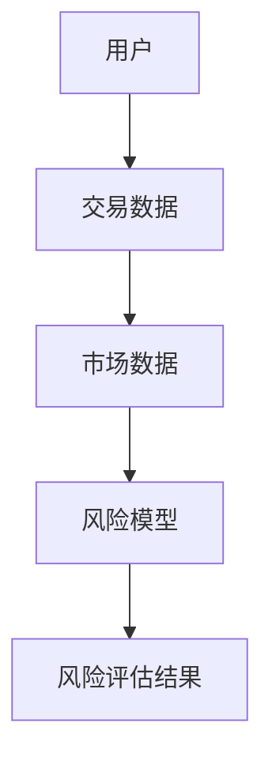
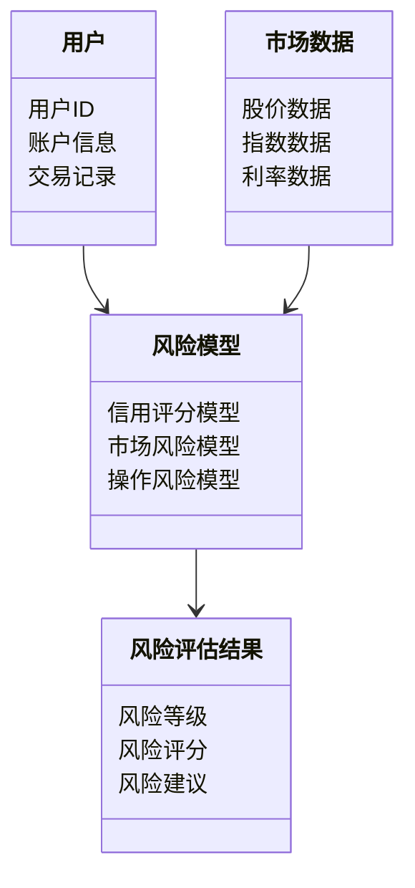
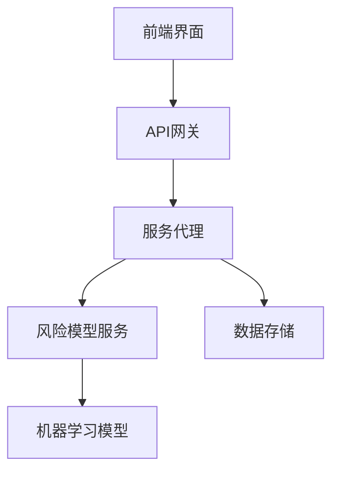

                 


# AI Agent在智能金融风险评估中的应用

> 关键词：AI Agent, 金融风险评估, 智能系统, 机器学习, 算法原理, 系统设计

> 摘要：本文系统地探讨了AI Agent在智能金融风险评估中的应用，从背景、核心概念、算法原理到系统设计和项目实战，全面解析了AI Agent在金融风险评估中的技术细节和实际应用。通过详细的技术分析和案例研究，展示了如何利用AI Agent构建高效、智能的金融风险评估系统。

---

## 第一部分: AI Agent 在智能金融风险评估中的应用基础

### 第1章: AI Agent 与智能金融风险评估概述

#### 1.1 问题背景与问题描述

金融市场的复杂性和不确定性使得传统的金融风险评估方法面临诸多挑战。传统方法依赖于人工分析和静态模型，难以应对实时数据的动态变化和复杂场景。例如，金融危机期间，传统模型可能无法及时捕捉市场波动和潜在风险，导致评估结果滞后或不准确。

**AI Agent**（人工智能代理）作为一种能够自主感知环境、做出决策并执行任务的智能体，为金融风险评估带来了新的可能性。AI Agent能够实时处理海量数据，快速响应市场变化，并通过自我学习和优化不断提升评估精度。

#### 1.2 AI Agent 的定义与特点

**AI Agent**是指具备感知、决策、执行和学习能力的智能系统，能够根据环境信息自主完成特定任务。以下是AI Agent的核心特点：

1. **自主性**：AI Agent能够在没有外部干预的情况下独立运行。
2. **反应性**：能够实时感知环境变化并做出响应。
3. **学习能力**：通过机器学习算法不断优化自身的决策模型。
4. **适应性**：能够根据新的数据和场景调整行为策略。

#### 1.3 AI Agent 在金融风险评估中的边界与外延

在金融风险评估中，AI Agent的应用边界主要集中在以下几个方面：

1. **问题边界**：AI Agent主要用于评估和预测金融风险，如信用风险、市场风险和操作风险。
2. **核心要素组成**：
   - 数据源：包括市场数据、交易数据、用户行为数据等。
   - 模型算法：如监督学习、强化学习和生成对抗网络（GAN）。
   - 决策机制：基于模型输出的决策策略。
3. **外延与相关领域**：AI Agent的应用不仅限于风险评估，还涉及金融交易、投资决策、客户画像等多个领域。

#### 1.4 本章小结

本章从问题背景、核心概念和边界外延三个方面介绍了AI Agent在金融风险评估中的应用。通过对比传统方法的局限性，突出了AI Agent的优势和应用场景。

---

## 第2章: AI Agent 的核心概念与联系

### 2.1 核心概念原理

AI Agent的核心原理是通过感知环境、分析数据、制定决策并执行操作来实现目标。在金融风险评估中，AI Agent需要完成以下任务：

1. **数据感知**：从多源数据中提取特征。
2. **风险建模**：构建风险评估模型。
3. **决策优化**：根据模型输出制定风险控制策略。

#### 2.2 核心概念属性特征对比

以下表格对比了AI Agent与传统金融模型的核心属性：

| **属性**         | **AI Agent**                     | **传统金融模型**               |
|------------------|----------------------------------|-------------------------------|
| 数据处理能力     | 支持多源异构数据，实时处理       | 依赖结构化数据，处理能力有限   |
| 学习能力         | 支持机器学习和深度学习，可自适应   | 依赖人工调整，难以自适应变化   |
| 决策能力         | 可自主决策并优化策略             | 依赖人工规则，决策能力有限     |
| 执行能力         | 能够自动执行决策任务             | 需要人工干预                   |

#### 2.3 ER 实体关系图架构

以下是一个简单的ER图，展示了AI Agent在金融风险评估中的实体关系：



---

## 第3章: AI Agent 的算法原理与数学模型

### 3.1 算法原理

AI Agent在金融风险评估中常用的算法包括：

1. **监督学习算法**：用于分类和回归任务，如随机森林和梯度提升树。
2. **强化学习算法**：用于动态决策问题，如Q-learning和Deep Q-Network。
3. **生成对抗网络（GAN）**：用于生成合成数据和模拟极端风险场景。
4. **时间序列分析算法**：用于预测未来的市场趋势，如ARIMA和LSTM。

#### 3.2 数学模型与公式

##### 3.2.1 风险评估的损失函数

$$L = \frac{1}{n}\sum_{i=1}^{n}(y_i - \hat{y}_i)^2$$

其中，$y_i$ 是真实值，$\hat{y}_i$ 是预测值，$n$ 是样本数量。

##### 3.2.2 AI Agent 的决策模型

$$P(a|s) = \text{argmax}_a \pi(a|s)$$

其中，$P(a|s)$ 是在状态 $s$ 下选择动作 $a$ 的概率，$\pi(a|s)$ 是策略函数。

##### 3.2.3 时间序列预测模型

$$R_t = \alpha R_{t-1} + \beta \epsilon_t$$

其中，$R_t$ 是当前的风险值，$R_{t-1}$ 是上一时刻的风险值，$\alpha$ 是自回归系数，$\epsilon_t$ 是随机误差项。

### 3.3 通俗易懂的举例说明

假设我们有一个简单的信用风险评估模型，AI Agent通过监督学习算法（如逻辑回归）对客户的信用评分进行分类。模型输入包括客户的收入、债务、信用历史等特征，输出是信用评分（高风险或低风险）。

---

## 第4章: 系统分析与架构设计方案

### 4.1 问题场景介绍

在金融风险评估系统中，AI Agent需要处理以下场景：

1. **实时数据处理**：处理高频交易和实时市场数据。
2. **复杂决策任务**：在多个风险因素中权衡最优决策。
3. **自我优化**：根据历史数据和新数据不断优化模型。

### 4.2 项目介绍

本项目旨在开发一个基于AI Agent的智能金融风险评估系统，能够实时监测市场动态、评估风险并制定最优的风险控制策略。

### 4.3 系统功能设计

以下是系统功能的领域模型类图：



### 4.4 系统架构设计

以下是系统的架构图：



---

## 第5章: 项目实战

### 5.1 环境安装

以下是安装必要的环境和工具：

1. **Python 3.8+**
2. **TensorFlow 2.0+**
3. **Keras 2.2.5**
4. **Scikit-learn 0.24+**
5. **Jupyter Notebook**

### 5.2 核心代码实现

以下是AI Agent的核心代码实现：

```python
import numpy as np
import pandas as pd
from sklearn.model import RandomForestClassifier
from tensorflow.keras import layers

# 数据加载
data = pd.read_csv('risk_data.csv')

# 特征工程
features = data.drop('risk_label', axis=1)
labels = data['risk_label']

# 模型训练
model = RandomForestClassifier()
model.fit(features, labels)

# 模型预测
new_features = pd.DataFrame([...])  # 输入新数据
predictions = model.predict(new_features)
```

### 5.3 案例分析与详细讲解

通过实际案例分析，展示了AI Agent如何在金融风险评估中应用。例如，利用LSTM模型预测股票价格波动，评估市场风险。

---

## 第6章: 最佳实践与总结

### 6.1 小结

通过本文的详细讲解，我们了解了AI Agent在金融风险评估中的核心概念、算法原理和系统设计。AI Agent的应用显著提高了金融风险评估的效率和精度。

### 6.2 注意事项

1. **数据质量**：确保数据的完整性和准确性。
2. **模型解释性**：选择可解释性强的模型，便于分析和调整。
3. **实时性要求**：优化系统的实时性，确保能够应对高频交易场景。

### 6.3 未来展望

随着AI技术的不断发展，AI Agent在金融领域的应用将更加广泛。未来的研究方向包括多模态数据融合、强化学习优化和模型解释性提升。

### 6.4 拓展阅读

推荐以下书籍和论文：

1. 《机器学习实战》
2. 《深度学习》
3. 《强化学习（书籍或论文）》

---

通过本文的系统讲解，我们深入探讨了AI Agent在智能金融风险评估中的应用。从理论到实践，从算法到系统设计，全面解析了AI Agent的技术细节和实际应用。希望本文能够为读者提供有价值的参考和启示。

