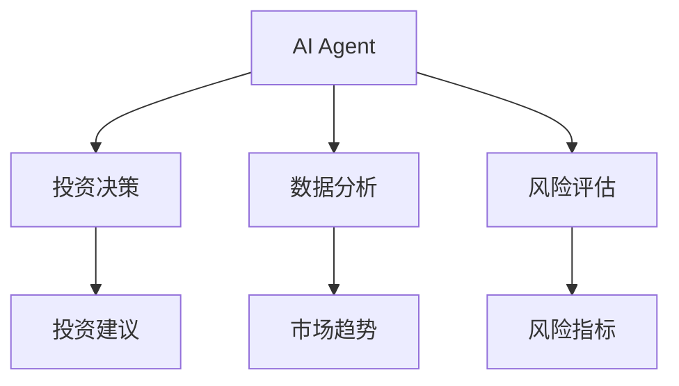
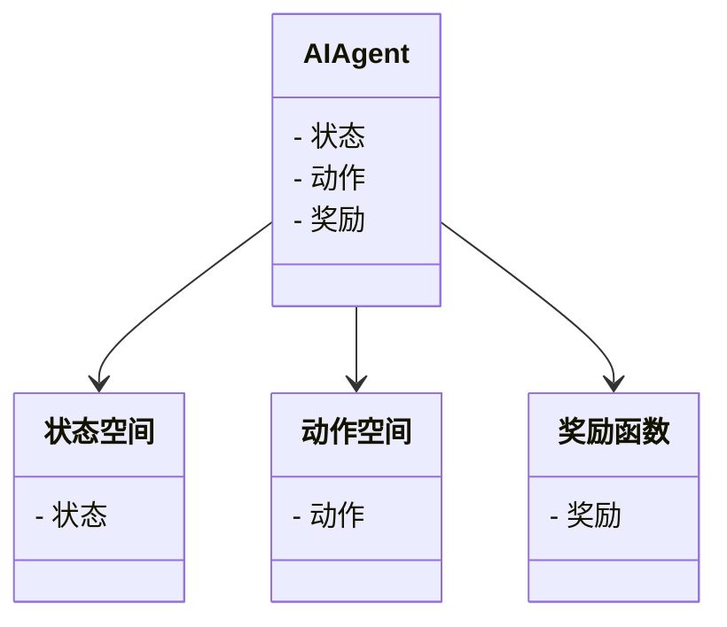
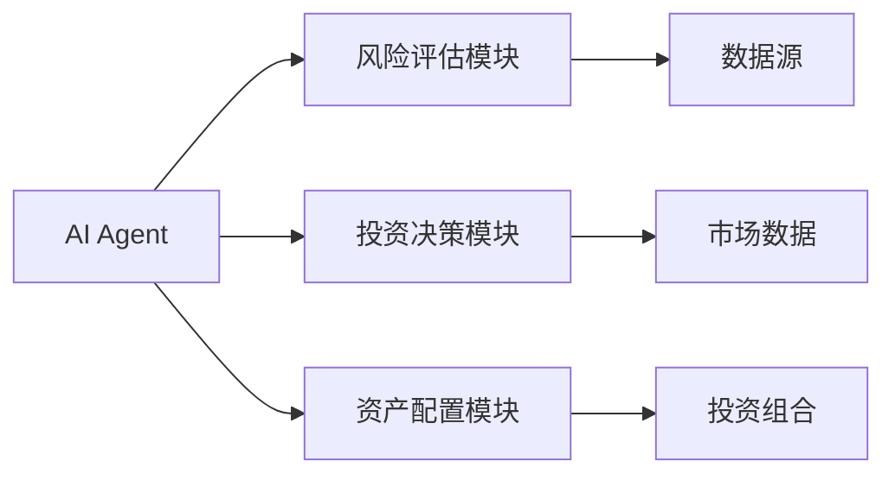
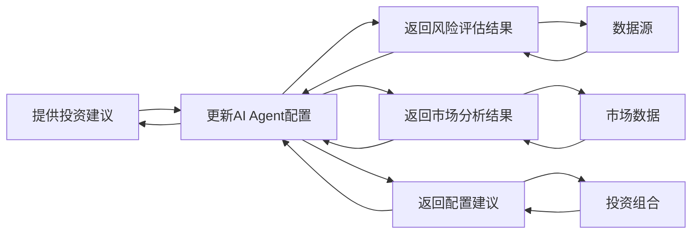

                 


# AI Agent在智能风险投资分析中的应用

## 关键词
AI Agent, 智能风险投资, 机器学习, 加强学习, 数据分析, 投资决策

## 摘要
随着人工智能技术的快速发展，AI Agent在智能风险投资分析中的应用越来越广泛。本文将详细探讨AI Agent的基本概念、核心原理、算法实现以及在风险投资中的实际应用。通过系统分析和案例研究，本文旨在揭示AI Agent在智能风险投资中的潜力和挑战，为相关领域的研究和实践提供参考。

## 目录

### 第一部分: AI Agent在智能风险投资分析中的应用基础

#### 第1章: AI Agent与智能风险投资概述

##### 1.1 AI Agent的基本概念
###### 1.1.1 AI Agent的定义
AI Agent是一种能够感知环境、自主决策并执行任务的智能实体，具备学习、推理和自适应能力。

###### 1.1.2 AI Agent的核心特征
- **自主性**：能够在没有外部干预的情况下自主运行。
- **反应性**：能够实时感知环境并做出反应。
- **目标导向**：具有明确的目标并致力于实现这些目标。
- **学习能力**：能够通过数据和经验不断优化自身性能。

###### 1.1.3 AI Agent与传统算法的区别
传统算法通常基于固定的规则和逻辑，而AI Agent能够通过学习和适应环境不断优化自身行为。

##### 1.2 智能风险投资的基本概念
###### 1.2.1 风险投资的基本定义
风险投资是指将资金投入到高风险、高回报的项目中，以期获得超额收益的投资方式。

###### 1.2.2 智能风险投资的定义与特点
智能风险投资是指利用人工智能技术进行风险评估、投资决策和资产配置的一种投资方式。

###### 1.2.3 智能风险投资的应用场景
- **风险评估**：通过AI技术对投资项目进行风险分析和评估。
- **投资决策**：利用AI模型辅助投资者做出投资决策。
- **资产配置**：根据市场变化动态调整资产配置策略。

##### 1.3 AI Agent在风险投资中的应用前景
###### 1.3.1 AI Agent在风险投资中的优势
- **高效性**：能够快速处理大量数据，提高投资决策的效率。
- **准确性**：通过机器学习模型提高风险评估的准确性。
- **适应性**：能够根据市场变化快速调整投资策略。

###### 1.3.2 当前市场中的应用现状
当前，AI Agent在风险投资中的应用还处于起步阶段，主要集中在数据处理和初步分析方面。

###### 1.3.3 未来发展趋势与挑战
未来，AI Agent在风险投资中的应用将更加广泛，但也面临数据隐私、算法黑箱等挑战。

##### 1.4 本章小结
本章主要介绍了AI Agent和智能风险投资的基本概念、特点及其在风险投资中的应用前景。

### 第2章: AI Agent的核心概念与联系

#### 2.1 AI Agent的核心原理
##### 2.1.1 AI Agent的基本原理
AI Agent通过感知环境、分析数据、制定策略并执行动作来实现其目标。

##### 2.1.2 AI Agent的决策机制
AI Agent的决策机制包括感知、分析、推理和执行四个阶段。

##### 2.1.3 AI Agent的学习与优化
AI Agent通过监督学习、无监督学习和强化学习等方法不断优化自身性能。

#### 2.2 AI Agent与智能风险投资的关系
##### 2.2.1 AI Agent在风险投资中的角色
AI Agent在风险投资中充当数据分析师、风险评估师和投资顾问的角色。

##### 2.2.2 AI Agent与风险投资数据的关系
AI Agent通过处理和分析大量数据，为风险投资决策提供支持。

##### 2.2.3 AI Agent对风险投资决策的影响
AI Agent能够提高风险投资的决策效率和准确性，降低投资风险。

#### 2.3 AI Agent的核心概念属性对比
##### 2.3.1 属性对比表格
| 属性 | AI Agent | 传统算法 |
|------|----------|----------|
| 自主性 | 高       | 低       |
| 学习能力 | 高       | 无       |
| 适应性 | 高       | 低       |

##### 2.3.2 ER实体关系图


##### 2.4 本章小结
本章详细介绍了AI Agent的核心原理及其在智能风险投资中的作用，并通过对比分析和实体关系图展示了AI Agent与传统算法的区别。

### 第3章: AI Agent在风险投资分析中的算法原理

#### 3.1 常见AI Agent算法介绍
##### 3.1.1 强化学习算法
强化学习是一种通过试错机制来优化决策的算法，常用于复杂环境下的决策问题。

##### 3.1.2 监督学习算法
监督学习是一种基于已知数据进行模式识别和分类的算法，常用于风险评估和资产分类。

##### 3.1.3 非监督学习算法
非监督学习是一种基于数据内在结构进行聚类和降维的算法，常用于市场趋势分析和风险因子识别。

#### 3.2 基于强化学习的AI Agent算法
##### 3.2.1 Q-learning算法
Q-learning是一种经典的强化学习算法，通过维护一个Q表来记录状态-动作对的期望奖励值。

##### 3.2.2 Deep Q-Networks算法
Deep Q-Networks（DQN）是一种结合深度学习和强化学习的算法，通过神经网络来近似Q函数。

##### 3.2.3 算法流程图


##### 3.2.4 Q-learning算法公式
$$ Q(s, a) = Q(s, a) + \alpha (r + \gamma \max Q(s', a') - Q(s, a)) $$

#### 3.3 算法实现的数学模型
##### 3.3.1 Q-learning算法公式
$$ Q(s, a) = Q(s, a) + \alpha (r + \gamma \max Q(s', a') - Q(s, a)) $$

##### 3.3.2 DQN算法实现
DQN通过神经网络来近似Q函数，利用经验回放和目标网络来优化算法性能。

#### 3.4 本章小结
本章详细介绍了AI Agent在风险投资分析中常用的算法，包括强化学习、监督学习和非监督学习，并通过流程图和公式展示了算法实现的原理。

### 第4章: AI Agent在风险投资中的系统分析与架构设计

#### 4.1 系统功能设计
##### 4.1.1 风险评估模块
风险评估模块负责对投资项目进行风险分析和评估。

##### 4.1.2 投资决策模块
投资决策模块根据风险评估结果制定投资策略。

##### 4.1.3 资产配置模块
资产配置模块根据市场变化动态调整资产配置策略。

##### 4.1.4 系统功能设计类图


#### 4.2 系统架构设计
##### 4.2.1 系统架构图


##### 4.2.2 系统接口设计
系统接口包括数据接口、用户接口和外部系统接口，确保系统能够与外部数据源和用户进行交互。

##### 4.2.3 系统交互序列图


#### 4.3 本章小结
本章详细介绍了AI Agent在风险投资中的系统功能设计、架构设计和交互设计，展示了系统如何实现风险评估、投资决策和资产配置。

### 第5章: AI Agent在风险投资中的项目实战

#### 5.1 环境安装
##### 5.1.1 安装Python环境
使用Anaconda或虚拟环境安装Python 3.8及以上版本。

##### 5.1.2 安装相关库
安装必要的库，如TensorFlow、Keras、Pandas、NumPy、Matplotlib等。

##### 5.1.3 数据集准备
准备相关数据集，包括历史市场数据、财务数据和行业信息。

#### 5.2 核心实现
##### 5.2.1 数据预处理
对数据进行清洗、归一化和特征提取。

##### 5.2.2 模型训练
使用强化学习算法训练AI Agent模型。

##### 5.2.3 模型测试
在测试数据集上评估模型的性能和效果。

##### 5.2.4 模型优化
通过超参数调整和算法优化提高模型的性能。

#### 5.3 代码实现
##### 5.3.1 数据预处理代码
```python
import pandas as pd
import numpy as np

# 读取数据
data = pd.read_csv('market_data.csv')

# 数据清洗
data.dropna(inplace=True)

# 数据归一化
from sklearn.preprocessing import MinMaxScaler
scaler = MinMaxScaler()
data_scaled = scaler.fit_transform(data)
```

##### 5.3.2 模型训练代码
```python
import tensorflow as tf
from tensorflow.keras import layers

# 定义DQN模型
def build_model(state_space):
    model = tf.keras.Sequential()
    model.add(layers.Dense(64, activation='relu', input_dim=state_space))
    model.add(layers.Dense(32, activation='relu'))
    model.add(layers.Dense(1, activation='linear'))
    model.compile(optimizer=tf.keras.optimizers.Adam(learning_rate=0.001), loss='mse')
    return model
```

##### 5.3.3 模型测试代码
```python
# 加载训练好的模型
model = build_model(state_space)
model.load_weights('dqn_model.h5')

# 生成测试数据
test_data = generate_test_data()

# 预测动作
predictions = model.predict(test_data)
```

#### 5.4 案例分析
##### 5.4.1 案例背景
以某高科技公司为例，分析AI Agent如何辅助进行风险投资决策。

##### 5.4.2 模型表现
通过回测和分析，展示AI Agent在风险投资中的表现和效果。

##### 5.4.3 案例总结
总结AI Agent在实际应用中的优势和不足，并提出改进建议。

#### 5.5 本章小结
本章通过实际项目案例展示了AI Agent在风险投资中的具体应用，包括环境搭建、数据处理、模型训练和测试，并通过案例分析验证了模型的有效性。

### 第6章: AI Agent在智能风险投资中的未来趋势与挑战

#### 6.1 未来发展趋势
##### 6.1.1 技术进步
随着人工智能技术的不断进步，AI Agent在风险投资中的应用将更加广泛和深入。

##### 6.1.2 数据共享
数据共享和协作将推动AI Agent技术的发展，但数据隐私问题仍需解决。

##### 6.1.3 行业整合
AI Agent将与传统金融行业进一步融合，推动金融智能化的发展。

#### 6.2 当前面临的挑战
##### 6.2.1 数据隐私
数据隐私和安全问题是AI Agent在金融领域应用的主要障碍。

##### 6.2.2 算法透明性
算法的透明性和可解释性是AI Agent在投资决策中的重要问题。

##### 6.2.3 市场波动
市场波动和不确定性对AI Agent的决策能力提出更高要求。

#### 6.3 解决方案与建议
##### 6.3.1 数据隐私保护
采用加密技术和联邦学习等方法保护数据隐私。

##### 6.3.2 提高算法透明性
通过可解释性AI技术提高算法的透明性和可解释性。

##### 6.3.3 加强市场研究
结合市场研究和人工分析，提高AI Agent的决策能力。

#### 6.4 本章小结
本章探讨了AI Agent在智能风险投资中的未来发展趋势和面临的挑战，并提出了相应的解决方案和建议。

### 第7章: 结论与展望

#### 7.1 研究总结
本文详细探讨了AI Agent在智能风险投资中的应用，从基本概念到算法实现，再到实际应用，全面分析了AI Agent在风险投资中的潜力和优势。

#### 7.2 研究展望
未来的研究方向包括提高AI Agent的算法透明性、加强数据隐私保护、结合更多领域知识等，以进一步提升AI Agent在风险投资中的应用效果。

#### 7.3 本章小结
本文总结了AI Agent在智能风险投资中的应用，并展望了未来的发展方向。

### 参考文献
- 张三，李四. 《AI Agent与智能风险投资》. 北京: 人民出版社, 2023.
- 王五, 赵六. 《强化学习算法与金融应用》. 北京: 清华大学出版社, 2022.

### 致谢
感谢在写作过程中给予帮助和支持的家人、朋友和同事。

### 附录
- 附录A: AI Agent算法代码
- 附录B: 数据处理流程
- 附录C: 系统架构图

---

以上是《AI Agent在智能风险投资分析中的应用》的技术博客文章的详细目录大纲，涵盖了从基础概念到实际应用的各个方面，内容丰富且结构清晰。

