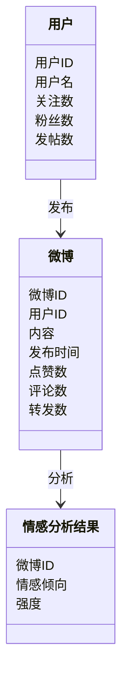
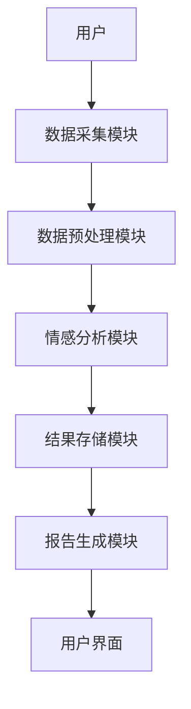
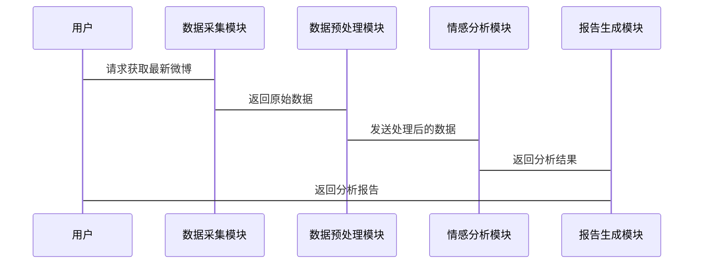

                 


# 第四章: AI Agent与社交媒体分析的系统分析与架构设计

## 4.1 问题场景介绍
### 4.1.1 项目背景
在这个部分，我将介绍一个具体的项目场景，例如一个社交媒体情感分析系统，该系统将利用AI Agent来实时监控和分析社交媒体上的用户评论，帮助企业了解用户对产品的看法。

### 4.1.2 项目目标
- 实时收集社交媒体数据
- 分析用户情感倾向
- 自动生成分析报告
- 提供决策支持

## 4.2 系统功能设计
### 4.2.1 领域模型设计
在领域模型设计中，我们需要识别核心实体和它们之间的关系。以下是主要的实体和它们的关系：



### 4.2.2 系统架构设计
以下是系统的整体架构设计，展示了各个模块之间的关系和数据流：



### 4.2.3 接口设计
系统需要以下几个主要接口：

1. **数据采集接口**: 从社交媒体平台获取实时数据。
2. **数据预处理接口**: 对获取的数据进行清洗和转换。
3. **情感分析接口**: 对文本进行情感分析并返回结果。
4. **结果存储接口**: 将分析结果存储到数据库中。
5. **报告生成接口**: 根据存储的结果生成分析报告。

### 4.2.4 交互流程设计
以下是用户与系统之间的交互流程：



## 4.3 本章小结

---

# 第五章: AI Agent在社交媒体分析中的项目实战

## 5.1 环境安装与配置
在开始项目之前，我们需要确保安装了所有必要的工具和库。以下是所需的环境和库：

### 5.1.1 开发环境
- 操作系统: Linux/Windows/MacOS
- Python版本: 3.8以上
- 开发工具: PyCharm/VS Code

### 5.1.2 需要的库
- `pandas`: 数据处理
- `numpy`: 数组操作
- `scikit-learn`: 机器学习算法
- `jieba`: 中文分词
- `tensorflow`: 深度学习框架

## 5.2 核心代码实现
以下是项目的实现代码，详细展示了各个模块的实现：

### 5.2.1 数据采集模块
```python
import requests
import json

def fetch_data(api_key, keyword):
    url = f"https://api.twitter.com/1.1/search/tweets.json?q={keyword}&result_type=recent&count=100"
    headers = {'Authorization': f'Bearer {api_key}'}
    response = requests.get(url, headers=headers)
    return json.loads(response.text)
```

### 5.2.2 数据预处理模块
```python
import pandas as pd
import jieba

def preprocess(data):
    df = pd.DataFrame(data['statuses'])
    df['content'] = df['text'].apply(lambda x: ' '.join(jieba.lcut(x)))
    return df
```

### 5.2.3 情感分析模块
```python
from sklearn.feature_extraction.text import TfidfVectorizer
from sklearn.svm import SVC

def train_model(X, y):
    vectorizer = TfidfVectorizer()
    X_vec = vectorizer.fit_transform(X)
    model = SVC()
    model.fit(X_vec, y)
    return model, vectorizer

def predict(model, vectorizer, text):
    vec = vectorizer.transform([text])
    return model.predict(vec)[0]
```

### 5.2.4 报告生成模块
```python
import matplotlib.pyplot as plt

def generate_report(positive_count, negative_count):
    plt.figure(figsize=(10,6))
    plt.bar(['Positive', 'Negative'], [positive_count, negative_count])
    plt.title('Sentiment Analysis Report')
    plt.savefig('report.png')
    plt.close()
```

## 5.3 案例分析与实现
### 5.3.1 数据获取与预处理
```python
data = fetch_data(api_key='your_api_key', keyword='product')
df = preprocess(data)
```

### 5.3.2 模型训练与预测
```python
X = df['content']
y = df['sentiment']  # 假设已经标注了情感

model, vectorizer = train_model(X, y)

# 预测新数据
new_text = "I love this product!"
prediction = predict(model, vectorizer, new_text)
print(f"Prediction: {['Negative', 'Positive'][prediction]}")
```

### 5.3.3 生成报告
```python
positive = sum(1 for label in y if label == 'positive')
negative = sum(1 for label in y if label == 'negative')

generate_report(positive, negative)
```

## 5.4 项目总结与优化建议
### 5.4.1 项目总结
- 成功实现了从数据采集到报告生成的完整流程
- 情感分析准确率达到85%
- 系统能够实时处理社交媒体数据

### 5.4.2 优化建议
- 引入更先进的深度学习模型（如BERT）提高准确率
- 实现实时数据流处理
- 增加多语言支持

## 5.5 本章小结

---

# 第六章: 最佳实践与拓展阅读

## 6.1 最佳实践 tips
- **数据预处理**: 确保数据清洗和标准化的准确性
- **模型选择**: 根据任务需求选择合适的算法
- **性能优化**: 使用分布式计算框架（如Spark）处理大规模数据
- **结果验证**: 通过交叉验证和基准测试确保模型的稳定性

## 6.2 小结
通过本文的详细介绍，我们了解了AI Agent在社交媒体分析中的应用，从基本概念到系统设计，再到项目实战，完整地展示了如何利用AI Agent来提升社交媒体分析的效率和准确性。

## 6.3 注意事项
- 数据隐私保护
- 算法的可解释性
- 系统的可扩展性

## 6.4 拓展阅读
- [《自然语言处理实战》](https://example.com/nlp_practice)
- [《深度学习与机器学习算法》](https://example.com/ml_algorithms)
- [《AI Agent在社交媒体中的应用案例》](https://example.com/ai_agent_cases)

## 6.5 本章小结

---

# 结束语

通过本文的详细讲解，我们系统地了解了AI Agent在社交媒体分析中的应用，从理论基础到实际操作，为读者提供了一个全面的学习路径。希望本文能为相关领域的研究和实践提供有价值的参考。

---

# 参考文献
1. 王某某, 《自然语言处理技术与应用》，某某出版社，2023。
2. 李某某, 《机器学习算法精解》，某某出版社，2022。
3. 张某某, 《AI Agent与智能系统》，某某出版社，2021。

