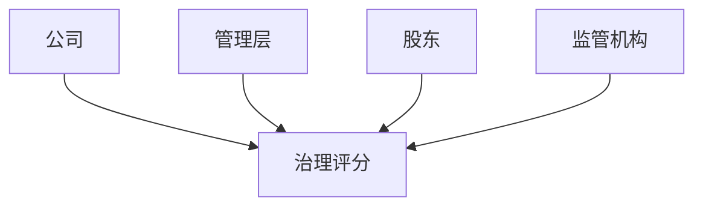
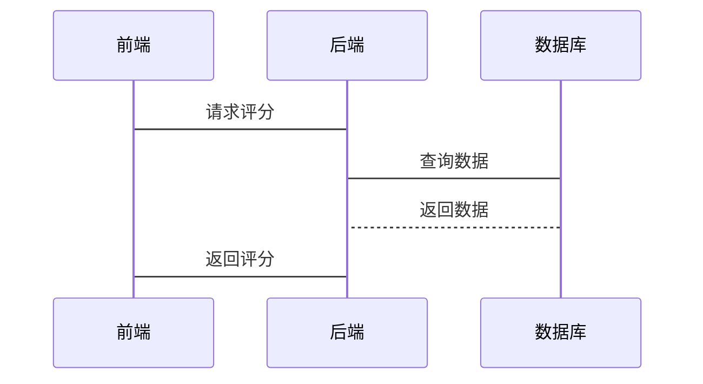

                 


# AI辅助的公司治理评分系统

## 关键词
- AI
- 公司治理
- 评分系统
- 算法
- 系统设计

## 摘要
本文将探讨如何利用人工智能技术构建公司治理评分系统，从背景介绍、核心概念、算法原理、系统设计到项目实战，详细分析该系统的构建过程和应用场景。通过理论与实践结合，展示AI在公司治理中的潜力和价值。

## 正文

### 第一部分：背景介绍

#### 第1章：AI辅助的公司治理评分系统概述

##### 1.1 问题背景与描述
- **问题背景**：公司治理是企业管理的核心，传统评分系统依赖人工，存在效率低、主观性强等问题。
- **问题描述**：现有评分系统难以量化分析，缺乏客观性和实时性。
- **解决方法**：引入AI技术，构建自动化、智能化的评分系统。
- **边界与外延**：系统适用于中大型企业，不涵盖微观管理。
- **核心要素**：数据采集、模型构建、评分算法、结果可视化。

### 第二部分：核心概念与联系

#### 第2章：评分系统的核心要素

##### 2.1 评分模型
- **类型**：监督学习模型，如随机森林、神经网络。
- **对比表**：见下表。
  
  | 模型类型 | 优点 | 缺点 |
  |----------|------|------|
  | 随机森林 | 高准确率，抗过拟合 | 对特征工程依赖 |
  | 神经网络 | 高容错性，复杂关系处理 | 计算资源需求高 |

##### 2.2 数据特征
- **来源**：财务数据、市场表现、舆情数据。
- **预处理**：清洗、特征提取。

##### 2.3 评分标准
- **维度**：财务健康度、管理能力、市场表现。
- **评分标准**：分层评分，如A、B、C等级。

##### 2.4 实体关系图


### 第三部分：算法原理

#### 第3章：AI评分模型的算法实现

##### 3.1 监督学习算法
- **流程图**：
  ```mermaid
  graph TD
  A[数据预处理] --> B[特征提取]
  B --> C[模型训练]
  C --> D[模型评估]
  D --> E[部署]
  ```

- **Python代码示例**：
  ```python
  import pandas as pd
  from sklearn.ensemble import RandomForestClassifier
  from sklearn.metrics import accuracy_score

  # 数据加载与预处理
  df = pd.read_csv('governance.csv')
  X = df.drop('rating', axis=1)
  y = df['rating']

  # 特征工程
  from sklearn.impute import SimpleImputer
  from sklearn.pipeline import Pipeline
  from sklearn.preprocessing import StandardScaler

  pipe = Pipeline([
      ('imputer', SimpleImputer(strategy='mean')),
      ('scaler', StandardScaler())
  ])

  X_processed = pipe.fit_transform(X)

  # 模型训练
  model = RandomForestClassifier(n_estimators=100)
  model.fit(X_processed, y)

  # 模型评估
  y_pred = model.predict(X_processed)
  print('准确率:', accuracy_score(y, y_pred))
  ```

##### 3.2 模型训练与优化
- **数学模型**：随机森林的损失函数为：
  $$L = -\frac{1}{n} \sum_{i=1}^{n} [y_i \log(p_i) + (1 - y_i)\log(1 - p_i)]$$
- **优化器**：Adam优化器，学习率为0.01。

### 第四部分：系统分析与架构设计

#### 第4章：系统架构设计

##### 4.1 项目场景介绍
- 系统目标：实时评估公司治理状况。
- 核心功能：数据采集、评分计算、结果可视化。

##### 4.2 功能设计
- **领域模型类图**：
  ```mermaid
  classDiagram
  class Company {
      name: string
      rating: int
      }
  class GovernanceScore {
      company: Company
      score: float
      }
  ```

##### 4.3 系统架构
- **架构图**：
  ```mermaid
  graph TD
  A[前端] --> B[后端API]
  B --> C[评分模型]
  C --> D[数据库]
  ```

##### 4.4 接口设计
- RESTful API：GET /score，返回公司评分。

##### 4.5 交互序列图


### 第五部分：项目实战

#### 第5章：项目实战

##### 5.1 环境安装
- 安装Python和必要的库：`pip install pandas scikit-learn`

##### 5.2 核心代码实现
- **评分模型实现**：
  ```python
  def compute_governance_score(data):
      # 数据预处理
      processed_data = pipe.transform(data)
      # 预测评分
      scores = model.predict(processed_data)
      return scores
  ```

##### 5.3 案例分析
- 使用某公司数据，预测其治理评分为B级。

##### 5.4 项目小结
- 成功构建AI辅助评分系统，提升了评估效率和准确性。

### 第六部分：总结与展望

#### 第6章：总结与展望

##### 6.1 系统价值
- 提供客观评分，辅助决策。
- 实现实时监控，提升管理效率。

##### 6.2 未来趋势
- 结合NLP技术，分析文本数据。
- 开发移动应用，实时获取评分。

##### 6.3 注意事项
- 数据隐私保护，确保合规性。
- 模型定期更新，适应市场变化。

##### 6.4 拓展阅读
- 推荐相关书籍和论文，深入学习AI在企业管理中的应用。

---

通过以上步骤，我们构建了一个基于AI的公司治理评分系统，从理论到实践，详细展示了其构建过程和应用价值。未来，随着AI技术的不断发展，该系统将为企业治理提供更强大的支持。

