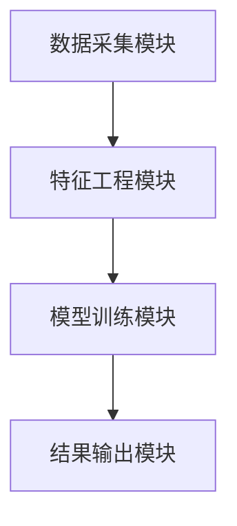

                 


# AI驱动的企业创新生态系统评估：内外部创新能力量化模型

> 关键词：AI驱动，企业创新生态系统，创新能力量化模型，内外部能力，系统架构设计

> 摘要：本文提出了一种基于人工智能的企业创新生态系统评估模型，旨在量化评估企业的内外部创新能力。通过分析企业内外部创新的关键维度，结合AI技术构建量化模型，帮助企业优化创新能力，提升竞争力。

---

# 第一章: AI驱动的企业创新生态系统概述

## 1.1 问题背景与定义

### 1.1.1 企业创新生态系统的核心概念

企业创新生态系统是指由企业内部资源、技术、组织结构以及外部环境、合作伙伴、用户等共同构成的创新网络。其核心在于通过内外部资源的协同作用，实现持续创新能力的提升。

- **内部资源**：包括技术、资金、人才等企业内部可控的资源。
- **外部资源**：包括合作伙伴、客户、供应商、政策环境等外部因素。

### 1.1.2 AI在企业创新中的作用

人工智能技术的快速发展为企业创新生态系统评估提供了新的工具和方法。AI可以通过数据分析、模式识别等技术，帮助企业发现创新机会、优化创新流程、提升创新效率。

### 1.1.3 企业内外部创新能力的定义与区别

- **内部创新能力**：指企业在技术研发、组织管理、资源配置等方面的能力。
- **外部创新能力**：指企业在市场适应、生态合作、用户反馈等方面的外部资源整合能力。

---

## 1.2 企业创新生态系统评估的必要性

### 1.2.1 传统企业创新评估的局限性

传统的企业创新评估方法往往依赖主观判断，难以量化和动态调整。例如，企业创新能力的评估通常基于经验判断，缺乏数据支持和动态调整。

### 1.2.2 AI驱动评估的优势与价值

AI驱动的评估方法能够通过大数据分析和机器学习模型，量化企业的创新能力，提供客观、动态的评估结果。例如，通过自然语言处理技术分析企业专利数据，评估企业的技术研发能力。

### 1.2.3 企业创新生态系统评估的目标与意义

评估目标：量化企业内外部创新能力，发现改进方向，优化资源配置。  
评估意义：帮助企业提升创新能力，增强竞争力，推动企业可持续发展。

---

# 第二章: 企业内外部创新能力的评估框架

## 2.1 内部创新能力的评估维度

### 2.1.1 技术创新能力

技术能力是企业内部创新能力的核心。通过分析企业的研发投入、专利数量、技术领域分布等指标，评估企业的技术优势和创新潜力。

- **研发投入**：企业的研发支出占总收入的比例。
- **专利数量**：企业拥有的发明专利数量。

### 2.1.2 组织创新能力

组织能力包括企业的组织结构、管理效率、团队协作能力等。例如，企业的扁平化管理结构能够提高创新效率。

- **组织结构**：矩阵式、项目式、事业部式等。
- **管理效率**：决策速度、流程效率。

### 2.1.3 资源配置效率

资源配置效率是指企业在资源分配上的合理性。例如，企业是否将资源优先投向高潜力的技术领域。

- **资源分配**：研发投入、市场拓展、产品开发等领域的资源分配比例。
- **资源配置优化**：通过数据分析优化资源配置。

---

## 2.2 外部创新能力的评估维度

### 2.2.1 市场适应能力

市场适应能力是指企业对外部市场变化的敏感性和适应能力。例如，企业是否能够快速响应市场需求。

- **市场反馈**：用户反馈、市场需求分析。
- **市场反应速度**：新产品推出周期、市场策略调整速度。

### 2.2.2 生态合作能力

生态合作能力是指企业与外部合作伙伴（如供应商、客户、合作伙伴）的协同创新能力。

- **合作伙伴数量**：企业拥有的战略合作伙伴数量。
- **合作深度**：合作的领域、合作的效果。

### 2.2.3 用户反馈与创新

用户反馈是外部创新能力的重要来源。企业可以通过用户反馈了解市场需求，优化产品和服务。

- **用户反馈收集**：通过 surveys、社交媒体、客服渠道收集用户反馈。
- **用户反馈分析**：通过自然语言处理技术分析用户反馈，提取创新方向。

---

## 2.3 企业内外部创新能力的关联性分析

### 2.3.1 内部与外部能力的协同效应

企业内部创新能力（如技术研发能力）与外部创新能力（如市场适应能力）密切相关。例如，强大的技术研发能力可以提升企业的市场适应能力。

### 2.3.2 能力评估的动态性与平衡性

企业创新能力是一个动态变化的过程。需要定期评估和调整，确保内外部能力的平衡发展。

---

# 第三章: AI驱动的创新生态系统评估模型

## 3.1 模型设计思路

### 3.1.1 数据输入与特征提取

模型输入包括企业内外部能力相关的数据，例如技术研发数据、市场数据、用户反馈数据等。

- **技术研发数据**：专利数量、研发投入、技术领域分布。
- **市场数据**：市场份额、市场增长率、竞争对手分析。
- **用户反馈数据**：用户满意度、用户需求反馈。

### 3.1.2 模型训练与优化

通过机器学习算法（如随机森林、神经网络）对数据进行建模，优化模型参数，提升模型预测能力。

### 3.1.3 结果输出与可视化

模型输出企业创新能力的量化评分，并通过可视化工具（如图表）展示评估结果。

---

## 3.2 模型的数学基础

### 3.2.1 数据预处理与特征工程

数据预处理包括数据清洗、特征提取、数据标准化等步骤。例如，使用主成分分析（PCA）进行特征降维。

### 3.2.2 算法选择与参数调优

选择适合的机器学习算法（如随机森林）进行模型训练，并通过交叉验证调优模型参数。

### 3.2.3 模型评估与验证

使用混淆矩阵、ROC曲线等指标评估模型性能，并通过留出验证集进行模型验证。

---

## 3.3 模型的实现与应用

### 3.3.1 系统架构设计

系统架构包括数据采集模块、特征工程模块、模型训练模块、结果输出模块。

### 3.3.2 系统功能模块实现

- **数据采集模块**：从企业内外部数据源采集数据。
- **特征工程模块**：进行数据清洗、特征提取。
- **模型训练模块**：训练机器学习模型，生成量化评分。
- **结果输出模块**：输出量化评分，并进行可视化展示。

### 3.3.3 系统部署与测试

将系统部署到企业内部，进行功能测试和性能测试，确保系统稳定运行。

---

# 第四章: 企业创新能力量化模型的算法原理

## 4.1 算法选择与实现

### 4.1.1 算法选择

选择随机森林算法进行模型训练，因为其适合处理高维数据，且具有较高的准确率。

### 4.1.2 算法实现

使用Python的scikit-learn库实现随机森林算法。

#### 代码示例：

```python
from sklearn.ensemble import RandomForestClassifier
from sklearn.metrics import accuracy_score
from sklearn.model_selection import train_test_split

# 数据预处理
X = ...  # 特征矩阵
y = ...  # 标签

# 划分训练集和测试集
X_train, X_test, y_train, y_test = train_test_split(X, y, test_size=0.2, random_state=42)

# 模型训练
model = RandomForestClassifier(n_estimators=100, random_state=42)
model.fit(X_train, y_train)

# 模型预测
y_pred = model.predict(X_test)

# 模型评估
accuracy = accuracy_score(y_test, y_pred)
print(f"模型准确率：{accuracy}")
```

---

## 4.2 算法的数学模型

### 4.2.1 随机森林算法的数学模型

随机森林是一种基于树的集成学习算法。每个决策树的预测结果取平均值或投票结果作为最终预测结果。

公式：
$$
y = \text{多数投票}(\text{决策树}_1(y), \text{决策树}_2(y), \ldots, \text{决策树}_n(y))
$$

---

## 4.3 模型的优化与调优

### 4.3.1 参数调优

通过网格搜索（Grid Search）优化模型参数，例如调整决策树的数量、树的深度等。

#### 代码示例：

```python
from sklearn.model_selection import GridSearchCV

# 定义参数网格
param_grid = {
    'n_estimators': [100, 200],
    'max_depth': [None, 5, 10],
    'min_samples_split': [2, 5, 10]
}

# 网格搜索优化
grid_search = GridSearchCV(RandomForestClassifier(), param_grid, cv=5, verbose=2)
grid_search.fit(X_train, y_train)

# 输出最优参数
best_params = grid_search.best_params_
print(f"最优参数：{best_params}")
```

---

# 第五章: 系统架构设计与实现

## 5.1 系统架构设计

### 5.1.1 系统功能模块

- **数据采集模块**：采集企业内外部数据。
- **特征工程模块**：数据预处理和特征提取。
- **模型训练模块**：训练随机森林模型。
- **结果输出模块**：展示评估结果。

### 5.1.2 系统架构图



---

## 5.2 系统实现细节

### 5.2.1 数据采集模块

- 数据来源：企业内部数据库、公开数据集。
- 数据格式：结构化数据（如CSV、Excel）和非结构化数据（如文本、图像）。

### 5.2.2 特征工程模块

- 数据清洗：处理缺失值、异常值。
- 特征提取：使用PCA进行降维。

---

## 5.3 系统部署与测试

### 5.3.1 系统部署

将系统部署到企业内部服务器，提供API接口供其他系统调用。

### 5.3.2 系统测试

- 功能测试：确保系统各模块正常运行。
- 性能测试：测试系统的处理能力。

---

# 第六章: 项目实战

## 6.1 项目背景

假设我们是一家科技企业的创新能力评估项目。目标是通过AI技术量化评估企业的内外部创新能力。

---

## 6.2 项目实现

### 6.2.1 环境安装

安装Python、scikit-learn、pandas、numpy等依赖库。

#### 代码示例：

```bash
pip install scikit-learn pandas numpy
```

---

### 6.2.2 数据准备

准备企业内外部能力相关的数据，例如技术研发数据、市场数据、用户反馈数据。

#### 代码示例：

```python
import pandas as pd

# 读取数据
data = pd.read_csv('企业创新数据.csv')

# 查看数据描述
print(data.describe())
```

---

### 6.2.3 模型训练

使用随机森林算法训练模型，生成创新能力评分。

#### 代码示例：

```python
from sklearn.ensemble import RandomForestClassifier
from sklearn.model_selection import train_test_split

# 划分训练集和测试集
X_train, X_test, y_train, y_test = train_test_split(X, y, test_size=0.2, random_state=42)

# 模型训练
model = RandomForestClassifier(n_estimators=200, max_depth=10, random_state=42)
model.fit(X_train, y_train)

# 模型预测
y_pred = model.predict(X_test)
```

---

### 6.2.4 结果分析

通过混淆矩阵、ROC曲线等指标分析模型性能。

#### 代码示例：

```python
from sklearn.metrics import confusion_matrix, roc_curve, auc

# 混淆矩阵
cm = confusion_matrix(y_test, y_pred)
print(cm)

# ROC曲线
fpr, tpr, thresholds = roc_curve(y_test, y_pred)
roc_auc = auc(fpr, tpr)
print(f"ROC AUC: {roc_auc}")
```

---

## 6.3 项目总结

通过项目实战，我们成功构建了一个基于AI的企业创新生态系统评估模型，为企业提供了量化创新能力的工具。

---

# 第七章: 总结与展望

## 7.1 总结

本文提出了一种基于AI的企业创新生态系统评估模型，通过量化评估企业的内外部创新能力，帮助企业优化创新流程，提升创新能力。

## 7.2 展望

未来，随着AI技术的不断发展，企业创新生态系统评估模型将更加智能化和精准化。例如，结合图神经网络技术，进一步提升模型的预测能力。

---

## 7.3 最佳实践 tips

- 数据质量是模型性能的关键，需重视数据清洗和特征工程。
- 模型调优是提升模型性能的重要步骤，需耐心优化参数。
- 系统部署是模型应用的重要环节，需确保系统的稳定性和可扩展性。

---

通过以上步骤，我们系统地构建了一个基于AI的企业创新生态系统评估模型，为企业创新管理提供了新的思路和工具。

