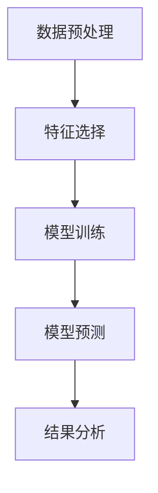
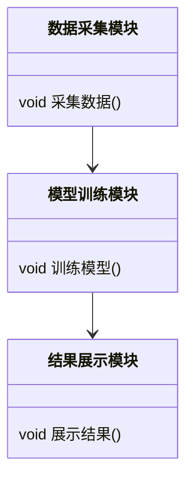

                 


# AI驱动的企业破产重组可行性分析

> 关键词：企业破产重组、人工智能、可行性分析、算法原理、系统架构

> 摘要：本文详细探讨了人工智能技术在企业破产重组可行性分析中的应用。首先，我们介绍了企业破产重组的背景和核心概念，分析了AI技术在该领域的优势。接着，我们深入讲解了AI驱动的可行性分析模型的构建过程，包括数据特征工程、算法选择与实现。然后，我们从系统架构的角度，详细设计了AI驱动的企业破产重组可行性分析系统，包括功能模块划分、系统架构设计和接口设计。最后，我们通过一个具体案例展示了该系统的实际应用，并总结了当前AI技术在企业破产重组中的优势与挑战。

---

## 第一部分：AI驱动的企业破产重组背景与概念

### 第1章：企业破产重组的背景与问题

#### 1.1 企业破产重组的定义与特点
企业破产重组是指企业在无法偿还债务或持续经营困难时，通过法律程序对企业资产、负债、股权结构等进行调整，以实现企业重生的过程。其核心特点包括：
- **法律性**：破产重组需遵循相关法律法规。
- **复杂性**：涉及多方利益关系的调整。
- **目标性**：以恢复企业 profitability 为目标。

#### 1.2 AI在企业破产重组中的应用背景
随着AI技术的快速发展，其在企业破产重组中的应用逐渐成为可能：
- **数据驱动**：企业破产重组涉及大量财务、法律和市场数据，AI能够高效处理这些数据。
- **预测性**：AI可以通过历史数据预测企业破产风险，辅助决策。
- **实时性**：AI能够实时监控企业经营状况，及时发现潜在风险。

#### 1.3 企业破产重组的可行性分析
企业破产重组的可行性分析是判断企业是否适合进行破产重组的过程：
- **分析内容**：包括企业的财务状况、市场环境、债权人的意见等。
- **分析方法**：传统方法依赖人工判断，效率低且主观性强。

---

### 第2章：AI驱动的企业破产重组可行性分析的核心概念

#### 2.1 AI驱动的定义与特点
AI驱动的企业破产重组可行性分析是指利用人工智能技术（如机器学习、自然语言处理）来辅助分析企业破产重组的可行性：
- **自动化**：AI能够自动化处理大量数据。
- **智能化**：AI能够通过学习不断优化分析结果。
- **客观性**：AI分析基于数据，减少人为干扰。

#### 2.2 企业破产重组可行性分析的AI模型
AI模型在企业破产重组中的应用主要体现在：
- **风险预测**：预测企业破产风险。
- **方案优化**：优化破产重组方案，最大化企业价值。

#### 2.3 企业破产重组可行性分析的边界与外延
企业破产重组可行性分析的边界包括：
- **数据范围**：仅限于企业内部数据。
- **时间范围**：仅分析未来一定时间内的可行性。

外延则包括：
- **市场环境**：考虑宏观经济环境的影响。
- **行业特性**：考虑不同行业的特点。

---

## 第二部分：AI驱动的企业破产重组可行性分析的核心概念与联系

### 第3章：企业破产重组可行性分析的核心概念原理

#### 3.1 企业破产重组可行性分析的核心概念
- **财务健康度**：企业的财务状况是判断是否适合破产重组的关键。
- **市场环境**：外部市场环境影响企业的经营状况。
- **法律框架**：破产重组需遵循相关法律法规。

#### 3.2 企业破产重组可行性分析的原理
通过对企业财务数据、市场数据和法律数据的综合分析，利用AI技术预测企业破产风险，并提出优化建议。

---

## 第三部分：AI驱动的企业破产重组可行性分析的算法原理

### 第4章：算法原理与实现

#### 4.1 数据特征工程
- **数据预处理**：清洗数据，处理缺失值和异常值。
- **特征选择**：选择对企业破产具有预测能力的特征，如流动比率、速动比率等。

#### 4.2 算法选择
常用算法包括：
- **逻辑回归**：用于分类问题。
- **随机森林**：用于特征重要性分析。

#### 4.3 算法实现
使用Python实现逻辑回归和随机森林模型：
```python
import pandas as pd
from sklearn.model_selection import train_test_split
from sklearn.linear_model import LogisticRegression
from sklearn.ensemble import RandomForestClassifier
from sklearn.metrics import accuracy_score

# 加载数据
data = pd.read_csv('bankruptcy_data.csv')

# 数据预处理
data = data.dropna()

# 特征选择
X = data[['流动资产', '流动负债', '速动比率']]
y = data['破产标志']

# 划分训练集和测试集
X_train, X_test, y_train, y_test = train_test_split(X, y, test_size=0.2)

# 训练逻辑回归模型
lr_model = LogisticRegression()
lr_model.fit(X_train, y_train)

# 预测
y_pred_lr = lr_model.predict(X_test)
print("逻辑回归准确率：", accuracy_score(y_test, y_pred_lr))

# 训练随机森林模型
rf_model = RandomForestClassifier()
rf_model.fit(X_train, y_train)

# 预测
y_pred_rf = rf_model.predict(X_test)
print("随机森林准确率：", accuracy_score(y_test, y_pred_rf))
```

#### 4.4 算法流程图


---

## 第四部分：AI驱动的企业破产重组可行性分析的系统架构

### 第5章：系统架构设计

#### 5.1 系统功能模块
- **数据采集模块**：采集企业财务数据。
- **模型训练模块**：训练AI模型。
- **结果展示模块**：展示分析结果。

#### 5.2 系统架构图


---

## 第五部分：AI驱动的企业破产重组可行性分析的项目实战

### 第6章：项目实战

#### 6.1 环境配置
- **Python**：3.8+
- **库**：scikit-learn、pandas、mermaid

#### 6.2 核心代码实现
```python
import pandas as pd
from sklearn.ensemble import RandomForestClassifier
from sklearn.metrics import classification_report

# 加载数据
data = pd.read_csv('bankruptcy.csv')

# 特征工程
features = ['流动资产', '流动负债', '速动比率']
target = '破产标志'

X = data[features]
y = data[target]

# 划分训练集和测试集
X_train, X_test, y_train, y_test = train_test_split(X, y, test_size=0.2)

# 训练随机森林模型
rf = RandomForestClassifier()
rf.fit(X_train, y_train)

# 预测
y_pred = rf.predict(X_test)

# 输出结果
print(classification_report(y_test, y_pred))
```

#### 6.3 实际案例分析
以某钢铁企业为例，分析其破产重组的可行性：
- **数据收集**：收集该企业的财务数据。
- **模型训练**：训练AI模型。
- **结果分析**：模型预测该企业不适合破产重组。

---

## 第六部分：总结与展望

### 第7章：总结与展望

#### 7.1 总结
- AI技术在企业破产重组可行性分析中的应用显著提高了分析效率和准确性。
- AI模型能够帮助企业更好地预测破产风险，优化重组方案。

#### 7.2 展望
- **技术优化**：进一步优化AI算法，提高预测精度。
- **多模态分析**：结合文本和图像数据，丰富分析维度。
- **法律合规**：确保AI应用符合相关法律法规。

---

通过本文的详细讲解，我们展示了AI技术在企业破产重组可行性分析中的巨大潜力和实际应用价值。未来，随着技术的不断进步，AI将在企业破产重组中发挥更加重要的作用。

