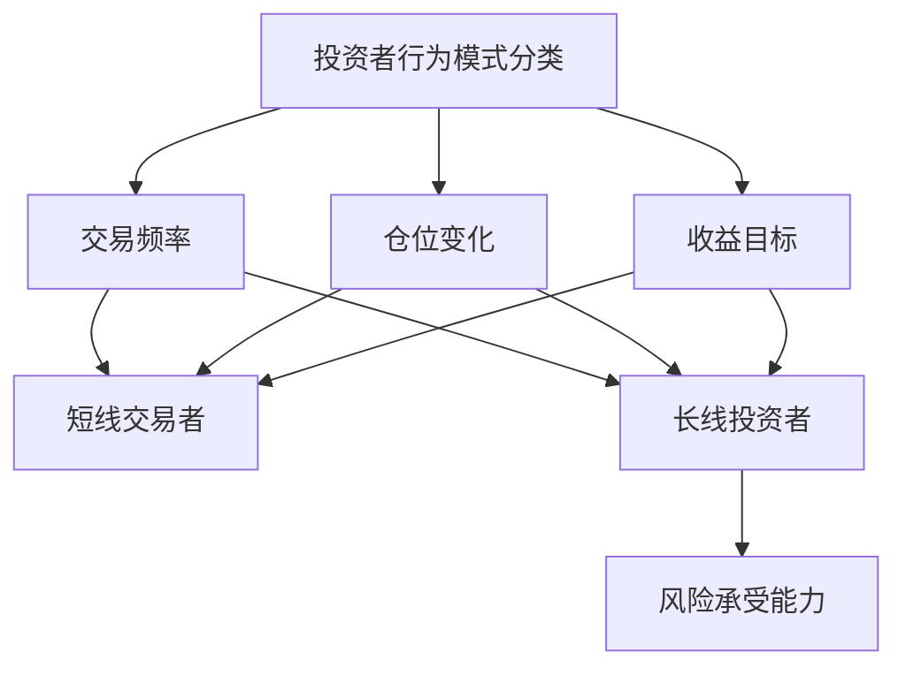
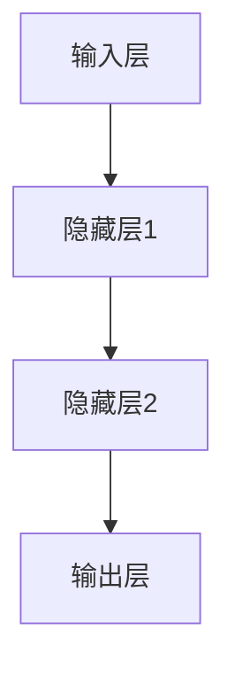
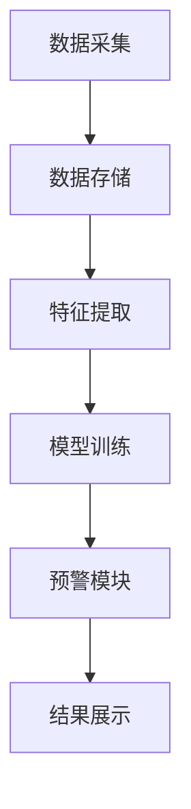
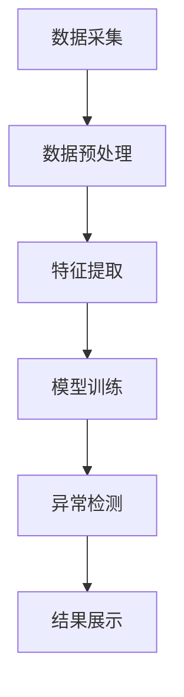
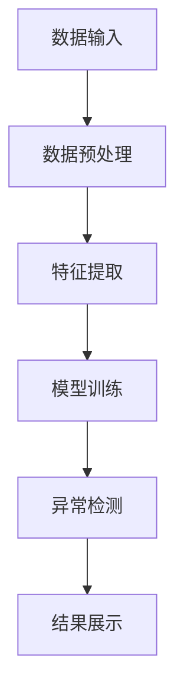
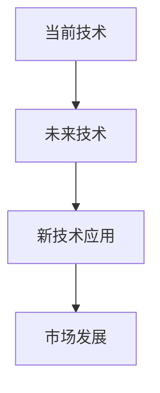

                 


```markdown
# AI驱动的投资者行为模式识别与异常预警

## 关键词：AI，投资者行为，模式识别，异常预警，机器学习，金融数据分析

## 摘要：本文探讨了AI在投资者行为分析中的应用，通过模式识别和异常预警技术，帮助投资者优化决策。文章结合行为金融学和机器学习算法，详细讲解了投资者行为模式识别的理论基础、算法实现和系统架构，最后通过案例分析展示了实际应用效果。

---

# 第1章: AI驱动的投资者行为模式识别与异常预警概述

## 1.1 投资者行为模式识别的背景与意义

### 1.1.1 传统投资行为分析的局限性
传统的投资行为分析依赖于经验判断和市场数据，难以捕捉复杂市场环境中的隐含信号。投资者行为受情绪、认知偏差等影响，导致决策的不理性。

### 1.1.2 AI技术在投资行为分析中的优势
AI技术能够处理海量数据，识别复杂模式，提供实时反馈，帮助投资者做出更明智的决策。机器学习算法能够捕捉人类难以察觉的行为特征。

### 1.1.3 行为模式识别在投资决策中的作用
通过识别投资者行为模式，AI可以预测市场趋势，发现潜在风险，优化投资组合。行为模式识别帮助投资者理解市场参与者的心理和行为特征，提升决策效率。

## 1.2 异常交易行为的定义与特征

### 1.2.1 异常交易行为的定义
异常交易行为指违背常规市场行为的交易活动，可能由市场操纵、内幕交易或极端情绪驱动。

### 1.2.2 异常交易行为的分类
- 市场操纵行为：如拉高出货、散布虚假信息。
- 内幕交易：利用未公开信息进行交易。
- 集中交易：短时间内大量买入或卖出某只股票。

### 1.2.3 异常交易行为对市场的影响
异常交易行为破坏市场公平性，导致价格扭曲，影响市场稳定性。

## 1.3 AI驱动的投资者行为模式识别与异常预警的目标

### 1.3.1 提高投资决策的准确性
通过识别投资者行为模式，AI帮助投资者做出更准确的决策。

### 1.3.2 实时监控市场异常行为
AI能够实时分析市场数据，及时发现和预警异常交易行为。

### 1.3.3 优化投资组合管理
根据投资者行为分析结果，优化投资组合配置，降低风险。

## 1.4 本书内容概述

### 1.4.1 本书的主要内容
本书将详细讲解AI技术在投资者行为模式识别中的应用，包括理论基础、算法实现和系统设计。

### 1.4.2 本书的结构安排
- 第1章：概述投资者行为模式识别的背景与意义。
- 第2章：介绍投资者行为模式识别的理论基础。
- 第3章：讲解AI驱动的投资者行为模式识别的算法原理。
- 第4章：探讨异常交易行为的识别方法。
- 第5章：设计投资者行为模式识别系统的架构。
- 第6章：项目实战，实现投资者行为模式识别系统。
- 第7章：通过案例分析展示系统应用效果。

### 1.4.3 本书的适用读者
本书适用于金融从业者、数据科学家、AI工程师以及对投资者行为分析感兴趣的研究者。

---

# 第2章: 投资者行为模式识别的理论基础

## 2.1 行为金融学基础

### 2.1.1 行为金融学的定义与核心理论
行为金融学研究投资者心理和行为对市场的影响，挑战传统有效市场假定。

### 2.1.2 投资者心理与行为模式的关系
投资者心理偏差（如过度自信、从众心理）影响其行为模式，导致非理性决策。

### 2.1.3 行为金融学对投资行为模式识别的启示
通过识别投资者心理偏差，可以预测其行为模式，优化投资策略。

## 2.2 数据特征与行为模式的关系

### 2.2.1 时间序列数据的特征分析
投资者行为数据具有时序特性，如趋势性、周期性、波动性。

### 2.2.2 投资者行为模式的分类
- 短线交易者：频繁买卖，追求短期收益。
- 长线投资者：长期持有，注重基本面分析。
- 抢涨停者：集中买入即将涨停股票。

### 2.2.3 数据特征对行为模式识别的影响
通过分析交易频率、仓位变化、收益目标等特征，识别投资者类型。

## 2.3 AI技术在投资者行为模式识别中的应用

### 2.3.1 机器学习在行为模式识别中的应用
使用监督学习分类投资者类型，无监督学习发现隐含模式。

### 2.3.2 深度学习在投资者行为分析中的优势
深度学习能够捕捉复杂非线性关系，适合处理多维度金融数据。

### 2.3.3 自然语言处理在投资者行为分析中的应用
分析投资者评论、社交媒体数据，识别情绪指标。

---

## 图2.1: 投资者行为模式分类的层次结构



---

# 第3章: AI驱动的投资者行为模式识别算法原理

## 3.1 算法原理概述

### 3.1.1 机器学习算法
- 监督学习：用于分类投资者类型。
- 无监督学习：用于聚类投资者行为模式。
- 回归分析：预测投资行为。

### 3.1.2 深度学习算法
- 卷积神经网络（CNN）：用于处理图像型金融数据。
- 循环神经网络（RNN）：处理时间序列数据。
- Transformer：用于长序列分析。

## 3.2 投资者行为模式识别流程

### 3.2.1 数据预处理
- 清洗数据：处理缺失值、异常值。
- 标准化：归一化处理。
- 特征提取：提取交易频率、仓位变化等特征。

### 3.2.2 模型训练
- 使用训练数据训练模型。
- 选择合适的算法，调整超参数。

### 3.2.3 模型评估
- 使用测试数据评估模型性能。
- 采用准确率、召回率等指标衡量效果。

## 3.3 算法实现的数学模型

### 3.3.1 分类问题的损失函数
分类问题中常用的损失函数是交叉熵损失：
$$ \text{交叉熵损失} = -\sum_{i=1}^{n} y_i \log p_i + (1 - y_i) \log (1 - p_i) $$

### 3.3.2 聚类问题的距离计算
聚类算法如K-means使用欧氏距离：
$$ \text{距离} = \sqrt{\sum_{i=1}^{d} (x_i - y_i)^2} $$

### 3.3.3 神经网络结构
神经网络包括输入层、隐藏层和输出层，每层节点通过激活函数处理：
$$ a_j^{(l+1)} = \sigma\left( \sum_{k} w_{jk} a_k^{(l)} + b_j \right) $$

---

## 图3.1: 神经网络结构



---

# 第4章: 异常交易行为识别

## 4.1 异常交易行为识别的挑战

### 4.1.1 数据稀疏性
异常交易行为数据量小，难以训练模型。

### 4.1.2 噪声干扰
正常交易行为与异常行为难以区分。

### 4.1.3 实时性要求
需要快速识别和预警，避免损失。

## 4.2 基于时间序列的异常检测方法

### 4.2.1 马尔可夫链模型
分析交易行为的转移概率，识别异常状态。

### 4.2.2 长短期记忆网络（LSTM）
处理时间序列数据，捕捉长期依赖关系。

### 4.2.3 Isolation Forest算法
用于无监督异常检测，通过隔离点进行分类。

## 4.3 异常交易行为的特征分析

### 4.3.1 交易量突变
短时间内交易量激增，可能预示异常行为。

### 4.3.2 价格波动异常
价格短时间内大幅波动，偏离基本面。

### 4.3.3 交易行为一致性
异常行为往往表现为不一致的交易模式。

---

## 图4.1: 时间序列异常检测流程


---

# 第5章: 投资者行为模式识别系统架构设计

## 5.1 系统功能设计

### 5.1.1 数据采集模块
实时采集交易数据，包括价格、成交量、交易时间等。

### 5.1.2 特征提取模块
从原始数据中提取特征，如交易频率、仓位变化等。

### 5.1.3 模型训练模块
训练机器学习模型，识别投资者行为模式。

### 5.1.4 预警模块
实时监控市场，发现异常行为及时预警。

## 5.2 系统架构设计

### 5.2.1 分层架构
- 数据层：存储原始数据和特征数据。
- 服务层：提供数据处理和模型训练服务。
- 应用层：展示结果和预警信息。

### 5.2.2 微服务架构
采用微服务设计，各模块独立开发和部署，提高系统扩展性。

---

## 图5.1: 系统架构设计



---

# 第6章: 项目实战——投资者行为模式识别系统实现

## 6.1 环境配置

### 6.1.1 安装Python环境
使用Anaconda安装Python 3.8以上版本。

### 6.1.2 安装依赖库
安装numpy、pandas、scikit-learn、tensorflow等库。

## 6.2 数据预处理

### 6.2.1 数据清洗
处理缺失值和异常值。

### 6.2.2 特征提取
提取交易频率、仓位变化、收益目标等特征。

## 6.3 模型训练

### 6.3.1 划分训练集和测试集
使用训练数据训练模型，测试数据验证效果。

### 6.3.2 模型调优
调整超参数，优化模型性能。

## 6.4 系统实现

### 6.4.1 数据采集模块
编写代码实时采集交易数据。

### 6.4.2 特征提取模块
使用pandas进行特征工程。

### 6.4.3 模型训练模块
使用scikit-learn训练分类模型。

### 6.4.4 预警模块
设置阈值，实时监控交易行为。

## 6.5 代码示例

### 6.5.1 数据预处理代码

```python
import pandas as pd
import numpy as np

# 加载数据
data = pd.read_csv('交易数据.csv')

# 处理缺失值
data = data.dropna()

# 标准化处理
from sklearn.preprocessing import StandardScaler
scaler = StandardScaler()
scaled_data = scaler.fit_transform(data)
```

### 6.5.2 模型训练代码

```python
from sklearn.model_selection import train_test_split
from sklearn.ensemble import RandomForestClassifier

# 划分训练集和测试集
X_train, X_test, y_train, y_test = train_test_split(scaled_data, data['标签'], test_size=0.2)

# 训练模型
model = RandomForestClassifier()
model.fit(X_train, y_train)

# 预测
y_pred = model.predict(X_test)
```

## 6.6 案例分析

### 6.6.1 案例背景
分析某次市场崩盘中的投资者行为，识别异常交易行为。

### 6.6.2 数据分析
提取交易数据，识别异常交易模式。

### 6.6.3 结果展示
展示异常交易行为识别结果，优化投资策略。

---

## 图6.1: 项目流程图



---

# 第7章: 案例分析与实际应用

## 7.1 案例背景

### 7.1.1 案例描述
分析某次市场崩盘中的投资者行为，识别异常交易行为。

## 7.2 数据分析

### 7.2.1 异常行为识别
使用系统识别出异常交易行为，如集中抛售某只股票。

### 7.2.2 模型表现
评估模型在案例中的表现，识别准确率和召回率。

## 7.3 实际应用效果

### 7.3.1 投资者行为分析
通过系统识别出投资者类型，优化投资组合。

### 7.3.2 风险管理
及时发现异常行为，降低投资风险。

---

## 图7.1: 案例分析流程图



---

# 第8章: 总结与展望

## 8.1 总结

### 8.1.1 核心内容回顾
AI技术在投资者行为模式识别中的应用，帮助优化投资决策。

### 8.1.2 技术优势总结
AI能够处理海量数据，识别复杂模式，提供实时反馈。

## 8.2 未来展望

### 8.2.1 技术进步
AI技术不断进步，投资者行为分析将更加精准。

### 8.2.2 新技术的应用
结合NLP、区块链等技术，提升投资者行为分析能力。

### 8.2.3 市场发展
随着金融市场的复杂化，投资者行为分析需求将增加。

---

## 图8.1: 未来技术发展路线图



---

## 参考文献
[1] 书籍或论文1
[2] 书籍或论文2
[3] 书籍或论文3
[4] 书籍或论文4
[5] 书籍或论文5

---

## 致谢
感谢读者的支持，感谢合作伙伴的帮助，感谢家人鼓励。

---

## 附录
附录内容，如数据集说明、代码片段等。
```

