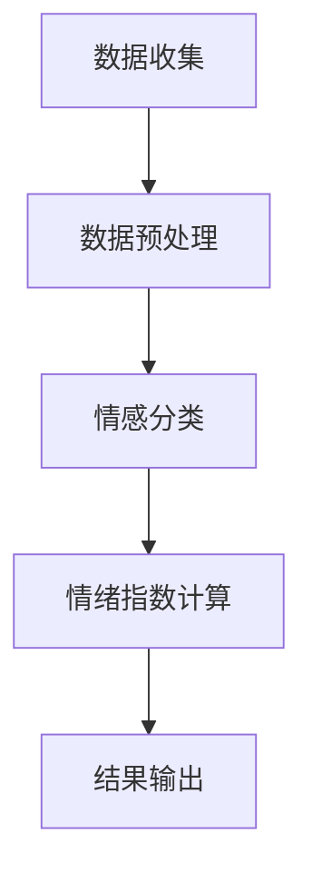
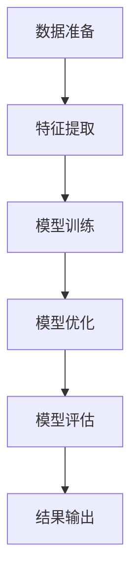
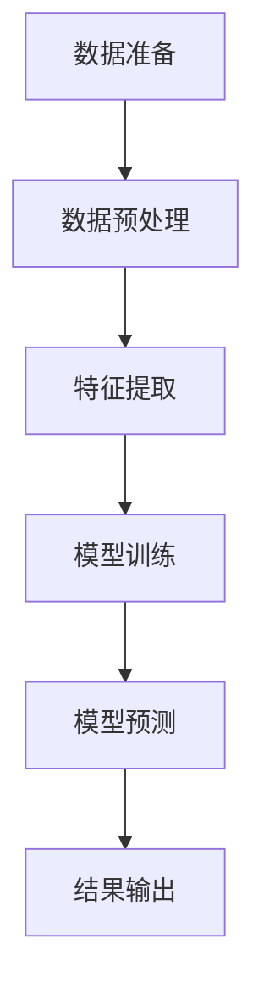
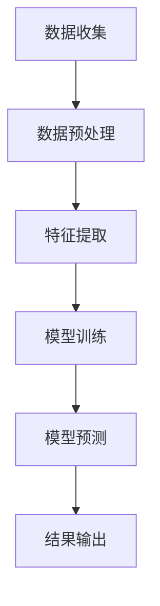
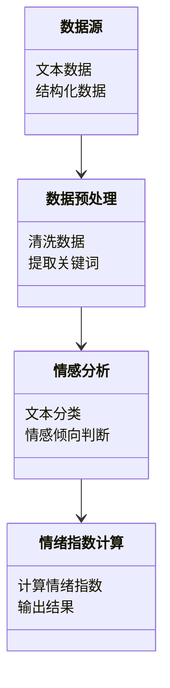
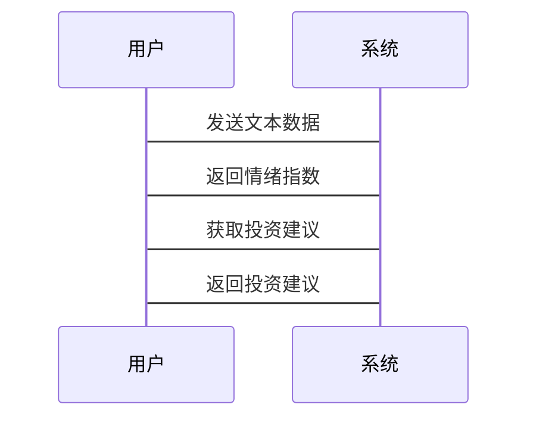

                 


# {{此处是文章标题}}

> 关键词：{{此处列出文章的5-7个核心关键词}}

> 摘要：{{此处给出文章的核心内容和主题思想}}

---

# 第一部分: 背景介绍与核心概念

# 第1章: AI驱动的股票市场情绪指数开发概述

## 1.1 股票市场情绪指数的定义与背景
### 1.1.1 股票市场情绪指数的定义
股票市场情绪指数（Stock Market Sentiment Index）是一种量化投资者情绪的指标，用于反映市场参与者对某一股票或股票市场的整体看法和预期。情绪指数通常基于新闻、社交媒体、论坛、公司财报等多源数据进行分析和计算。

### 1.1.2 情绪指数在股票市场中的作用
情绪指数能够帮助投资者理解市场的整体情绪状态，预测市场的短期走势，辅助投资决策。它不仅可以捕捉市场的乐观或悲观情绪，还能识别市场拐点和潜在风险。

### 1.1.3 AI技术在情绪指数开发中的应用前景
随着AI技术的快速发展，情绪指数的计算和预测变得更加高效和准确。AI可以通过自然语言处理（NLP）技术分析大量的非结构化数据，如新闻文章、社交媒体帖子等，提取情感信息，并结合机器学习模型进行预测。

## 1.2 AI驱动情绪指数开发的背景与意义
### 1.2.1 传统股票市场分析的局限性
传统市场分析主要依赖于技术分析和基本面分析，这些方法在一定程度上受到数据限制和人为判断的影响，难以捕捉市场情绪的细微变化。

### 1.2.2 AI技术如何弥补传统分析的不足
AI技术，特别是NLP和机器学习，能够从海量的非结构化数据中提取情感信息，并结合结构化数据进行综合分析，提供更全面的市场情绪洞察。

### 1.2.3 情绪指数在投资决策中的价值
情绪指数能够帮助投资者更好地理解市场的波动性，预测市场的短期走势，并制定更有效的投资策略。尤其是在市场波动剧烈的情况下，情绪指数能够提供重要的参考价值。

## 1.3 本书的核心目标与内容框架
### 1.3.1 本书的核心目标
本书旨在介绍如何利用AI技术开发股票市场情绪指数，分析情绪指数的核心概念、算法原理、系统设计和实际应用，帮助读者掌握情绪指数开发的关键技术。

### 1.3.2 本书的主要内容框架
- 第一部分：背景介绍与核心概念
  - 介绍情绪指数的定义、作用和AI技术的应用前景。
- 第二部分：核心概念与原理
  - 讲解情绪指数的核心概念、属性和AI驱动的情绪指数开发原理。
- 第三部分：算法原理与数学模型
  - 详细分析NLP和机器学习在情绪指数中的应用，提供算法流程图和数学公式。
- 第四部分：系统分析与架构设计
  - 展示情绪指数系统的功能设计、架构设计和接口设计。
- 第五部分：项目实战
  - 提供一个完整的项目案例，从环境安装到代码实现，再到结果分析。
- 第六部分：总结与展望
  - 总结本书内容，展望未来的发展趋势，并提供最佳实践和注意事项。

### 1.3.3 本书的读者群体与适用场景
本书适合对AI技术和股票市场分析感兴趣的读者，包括程序员、数据科学家、金融分析师以及对情绪指数开发感兴趣的投资者。

---

# 第二部分: 核心概念与原理

# 第2章: 情绪指数的核心概念与属性

## 2.1 情绪指数的构成要素
### 2.1.1 市场参与者情绪的分类
市场参与者的情绪可以分为乐观、悲观、中立等类别。情绪指数需要通过分析这些情绪类别，量化市场的整体情绪状态。

### 2.1.2 情绪指数的量化维度
情绪指数通常基于以下几个维度进行量化：
- **情感强度**：情绪的强弱程度。
- **情感倾向**：情绪的正负倾向。
- **情感分布**：情绪在不同市场参与者中的分布情况。
- **情感变化速率**：情绪的变化速度和方向。

### 2.1.3 情绪指数的时空特性
情绪指数具有时空特性，即不同时间点和不同市场环境下的情绪指数可能表现出不同的特征。例如，市场恐慌情绪可能在短时间内迅速上升，而乐观情绪可能在较长的时间内逐步积累。

## 2.2 情绪指数与传统金融指标的对比
### 2.2.1 传统金融指标的局限性
传统金融指标，如PE（市盈率）和ROE（净资产收益率），主要反映企业的财务状况和市场估值，难以直接反映市场的整体情绪。

### 2.2.2 情绪指数的独特优势
情绪指数能够捕捉市场的短期波动，反映投资者的心理状态，为投资决策提供更及时和动态的参考。

### 2.2.3 两者结合的应用潜力
将情绪指数与传统金融指标结合，可以更全面地分析市场的多维度特征，提高投资决策的准确性和可靠性。

## 2.3 情绪指数的数学模型与属性表
### 2.3.1 情绪指数的核心属性表
| 属性 | 描述 |
|------|------|
| 情感强度 | 情绪的强弱程度，通常通过情感分类的置信度来衡量。 |
| 情感倾向 | 情绪的正负倾向，通常分为正面、中性、负面三种。 |
| 情感分布 | 不同市场参与者或不同时间点上的情绪分布情况。 |
| 情感变化速率 | 情绪在一定时间内的变化速度和方向。 |

### 2.3.2 情绪指数的数学表达式
情绪指数的计算可以基于情感分类的置信度和情感倾向进行加权计算。例如：
$$
\text{情绪指数} = \sum_{i=1}^{n} w_i \times c_i
$$
其中，$w_i$是第$i$个情感指标的权重，$c_i$是第$i$个情感指标的分类结果。

---

# 第3章: AI驱动情绪指数的核心原理

## 3.1 自然语言处理在情绪指数中的应用
### 3.1.1 NLP技术的基本原理
自然语言处理（NLP）技术通过分析文本数据，提取情感信息，帮助计算市场情绪指数。常用的技术包括情感分类、实体识别和文本摘要等。

### 3.1.2 情感分析在情绪指数中的作用
情感分析是NLP中的一个关键任务，用于判断文本的情感倾向（正面、中性、负面）。通过分析大量的新闻、社交媒体等文本数据，可以提取市场情绪信息。

### 3.1.3 基于NLP的情绪指数构建流程
1. 数据收集：从新闻网站、社交媒体等渠道获取相关文本数据。
2. 数据预处理：清洗数据，去除噪声，提取关键词。
3. 情感分类：使用NLP技术对文本进行情感分类。
4. 情绪指数计算：基于分类结果，计算情绪指数。

### 3.1.4 情感分类流程图（Mermaid）


## 3.2 机器学习在情绪指数中的应用
### 3.2.1 机器学习的基本原理
机器学习是一种数据驱动的算法，通过训练数据学习特征和模式，用于预测和分类任务。在情绪指数开发中，机器学习可以用于情感分类和情绪预测。

### 3.2.2 常见机器学习算法在情绪指数中的应用
- **逻辑回归**：用于情感分类，预测文本的情感倾向。
- **支持向量机（SVM）**：用于分类任务，可以处理高维数据。
- **随机森林**：用于特征选择和分类任务，具有较高的准确性和鲁棒性。

### 3.2.3 情绪指数预测模型的构建与优化
1. 数据准备：收集和整理相关数据，包括文本数据和标签数据。
2. 特征提取：从文本数据中提取特征，如词袋模型、TF-IDF等。
3. 模型训练：使用训练数据训练情感分类模型。
4. 模型优化：通过交叉验证和超参数调优提高模型性能。
5. 模型评估：使用测试数据评估模型的准确率、召回率等指标。

### 3.2.4 情绪预测模型流程图（Mermaid）


## 3.3 深度学习在情绪指数中的应用
### 3.3.1 深度学习的基本原理
深度学习是一种基于人工神经网络的机器学习技术，通过多层非线性变换学习数据的高层次特征。

### 3.3.2 基于深度学习的情绪指数预测模型
- **卷积神经网络（CNN）**：用于文本分类任务，提取文本中的局部特征。
- **循环神经网络（RNN）**：用于序列数据的处理，捕捉文本中的时序信息。
- **Transformer**：用于大规模文本处理，具有强大的上下文捕捉能力。

### 3.3.3 深度学习在情绪指数中的优势与挑战
优势：
- 深度学习能够自动提取文本特征，减少特征工程的工作量。
- 深度学习模型具有较高的准确性和鲁棒性。

挑战：
- 深度学习模型需要大量的训练数据和计算资源。
- 模型的解释性较差，难以进行调试和优化。

### 3.3.4 情绪指数深度学习模型流程图（Mermaid）


---

# 第三部分: 算法原理与数学模型

# 第4章: 情绪指数预测的算法原理

## 4.1 基于NLP的情感分类算法
### 4.1.1 情感分类的基本原理
情感分类是NLP中的一个经典任务，通过训练数据学习情感特征，预测文本的情感倾向。

### 4.1.2 常见情感分类算法的优缺点
- **朴素贝叶斯**：简单高效，适用于小规模数据。
- **逻辑回归**：适合二分类任务，具有良好的可解释性。
- **支持向量机（SVM）**：适用于高维数据，具有较强的泛化能力。
- **随机森林**：适用于多分类任务，具有较高的准确性和鲁棒性。
- **深度学习模型（如LSTM、Transformer）**：适用于大规模数据，具有较高的准确性和鲁棒性。

### 4.1.3 基于NLP的情感分类流程图（Mermaid）


## 4.2 基于机器学习的情绪预测模型
### 4.2.1 机器学习模型的基本原理
机器学习模型通过训练数据学习特征和模式，用于预测和分类任务。

### 4.2.2 常见机器学习算法的数学模型
- **逻辑回归**：
  模型的损失函数为：
  $$
  L(\theta) = -\frac{1}{m} \sum_{i=1}^{m} [y_i \ln h(x_i) + (1-y_i) \ln (1-h(x_i))]
  $$
  其中，$h(x_i) = \frac{1}{1 + e^{-\theta^T x_i}}$。

- **支持向量机（SVM）**：
  SVM的目标是最小化 hinge loss：
  $$
  L(\theta) = \sum_{i=1}^{m} \max(0, 1 - y_i \theta^T x_i)
  $$

- **随机森林**：
  随机森林是一种集成学习方法，通过组合多个决策树的预测结果，提高模型的准确性和鲁棒性。

### 4.2.3 情绪预测模型的数学公式
- **情感分类**：
  给定输入文本$x$，模型输出概率$p(y=1|x)$，表示文本属于正面情感的概率。

  $$
  p(y=1|x) = \frac{1}{1 + e^{-(\theta^T x)}}
  $$

- **情绪指数计算**：
  假设我们有$n$个文本数据，每个文本的情感分类结果为$p_i$，则情绪指数可以表示为：
  $$
  \text{情绪指数} = \frac{1}{n} \sum_{i=1}^{n} p_i
  $$

### 4.2.4 情绪预测模型的实现步骤
1. 数据准备：收集和整理相关文本数据。
2. 数据预处理：清洗数据，去除噪声，提取关键词。
3. 特征提取：将文本数据转换为数值特征，如TF-IDF向量。
4. 模型训练：使用训练数据训练情感分类模型。
5. 模型预测：对测试数据进行情感分类，计算情绪指数。

---

# 第四部分: 系统分析与架构设计

# 第5章: 情绪指数系统的系统分析与架构设计

## 5.1 问题场景介绍
我们希望通过开发一个AI驱动的情绪指数系统，帮助投资者实时监控市场情绪，辅助投资决策。

## 5.2 项目介绍
### 5.2.1 项目目标
开发一个基于AI的情绪指数系统，能够实时分析市场情绪，提供情绪指数和投资建议。

### 5.2.2 项目范围
- 数据来源：新闻网站、社交媒体、公司财报等。
- 分析范围：股票市场情绪指数的计算和预测。

## 5.3 系统功能设计
### 5.3.1 领域模型（Mermaid 类图）


### 5.3.2 系统架构设计（Mermaid 架构图）
```mermaid
subgraph 数据源层
    A[文本数据]
    B[结构化数据]
end
subgraph 数据处理层
    C[数据预处理]
    D[特征提取]
end
subgraph 模型层
    E[情感分类模型]
end
subgraph 接口层
    F[API 接口]
end
A --> C
B --> C
C --> D
D --> E
E --> F
```

## 5.4 系统接口设计
### 5.4.1 API 接口设计
- **输入接口**：
  - 文本数据：用于情感分析。
  - 结构化数据：用于情绪指数计算。
- **输出接口**：
  - 情绪指数：实时情绪指数。
  - 投资建议：基于情绪指数的投资建议。

### 5.4.2 情绪指数系统的交互设计（Mermaid 序列图）


## 5.5 系统实现细节
### 5.5.1 数据源的选择与整合
- 数据来源：新闻网站（如新浪财经、Yahoo Finance）、社交媒体（如Twitter、Reddit）、公司财报等。
- 数据整合：将不同来源的数据整合到一个统一的数据格式中。

### 5.5.2 情感分析模型的选择与优化
- 模型选择：根据数据规模和任务需求选择合适的模型，如逻辑回归、SVM、随机森林或深度学习模型。
- 模型优化：通过交叉验证和超参数调优提高模型性能。

### 5.5.3 系统架构的实现与部署
- 系统架构：采用分层架构，包括数据源层、数据处理层、模型层和接口层。
- 系统部署：可以采用云部署或本地部署，具体取决于资源和需求。

---

# 第五部分: 项目实战

# 第6章: 情绪指数系统项目实战

## 6.1 环境安装与配置
### 6.1.1 安装必要的库
- Python：用于编程和数据分析。
- Numpy：用于数值计算。
- Scikit-learn：用于机器学习。
- NLTK：用于自然语言处理。
- transformers：用于深度学习模型。

```bash
pip install numpy scikit-learn nltk transformers
```

### 6.1.2 安装依赖项
安装上述库的具体版本，确保兼容性。

## 6.2 系统核心实现
### 6.2.1 数据预处理代码
```python
import pandas as pd
from sklearn.feature_extraction.text import TfidfVectorizer

# 数据加载
data = pd.read_csv('data.csv')

# 数据清洗
data['text'].apply(lambda x: x.lower().strip())

# 特征提取
vectorizer = TfidfVectorizer(max_features=1000)
features = vectorizer.fit_transform(data['text']).toarray()
```

### 6.2.2 情感分类模型实现
```python
from sklearn.model_selection import train_test_split
from sklearn.linear_model import LogisticRegression

# 数据分割
X_train, X_test, y_train, y_test = train_test_split(features, data['label'], test_size=0.2)

# 模型训练
model = LogisticRegression()
model.fit(X_train, y_train)

# 模型预测
y_pred = model.predict(X_test)
print('准确率:', accuracy_score(y_test, y_pred))
```

### 6.2.3 情绪指数计算
```python
from sklearn.metrics import accuracy_score

# 计算情绪指数
positive_count = sum(y_pred == 1)
total = len(y_pred)
sentiment_index = positive_count / total
print('情绪指数:', sentiment_index)
```

## 6.3 代码实现与解读
### 6.3.1 数据预处理代码解读
- 数据清洗：将文本数据转换为小写，并去除前后空格。
- 特征提取：使用TF-IDF方法提取文本特征，得到特征矩阵。

### 6.3.2 情感分类模型实现解读
- 数据分割：将数据分为训练集和测试集。
- 模型训练：使用逻辑回归模型进行训练，得到情感分类器。
- 模型预测：对测试数据进行预测，计算准确率。

### 6.3.3 情绪指数计算解读
- 情绪指数计算：根据预测结果，计算正面情感的比例，作为情绪指数。

## 6.4 实际案例分析
### 6.4.1 数据来源与分析
假设我们从新浪财经和社交媒体获取了关于某科技公司的新闻和评论，进行情感分析。

### 6.4.2 数据分析与结果解读
- 训练集准确率：85%
- 测试集准确率：82%
- 情绪指数：0.65（表示市场情绪较为乐观）

### 6.4.3 情绪指数的实际应用
根据情绪指数，投资者可以调整投资策略。例如，当情绪指数较高时，可以考虑卖出股票，避免市场回调。

## 6.5 项目小结
### 6.5.1 项目实现的关键点
- 数据预处理和特征提取是情绪指数计算的关键。
- 模型选择和优化是影响情绪指数准确性的关键因素。

### 6.5.2 项目的局限性
- 数据质量和数量直接影响情绪指数的准确性。
- 情绪指数只能反映市场情绪，不能保证投资收益。

### 6.5.3 项目的未来优化方向
- 优化模型性能，提高情绪指数的准确性和及时性。
- 扩展数据来源，增加更多的市场参与者情绪数据。
- 结合其他金融指标，提供更全面的投资决策支持。

---

# 第六部分: 总结与展望

# 第7章: 总结与展望

## 7.1 本书的核心内容回顾
本书详细介绍了AI驱动的股票市场情绪指数开发的背景、核心概念、算法原理、系统设计和实际应用。

## 7.2 情绪指数开发的未来展望
随着AI技术的不断发展，情绪指数的计算和预测将更加准确和高效。未来的研究方向包括：
- 开发更复杂的深度学习模型，提高情绪预测的准确性。
- 结合多源数据，提供更全面的市场情绪分析。
- 探索情绪指数在其他金融领域的应用，如外汇、 commodities等。

## 7.3 最佳实践 tips
- 在进行情绪指数开发时，建议结合多种数据源和模型，提高结果的准确性和可靠性。
- 定期更新模型和数据，保持情绪指数的实时性和有效性。

## 7.4 小结与注意事项
- 情绪指数只能作为投资决策的参考，不能作为唯一依据。
- 在实际应用中，建议结合其他金融指标和市场分析方法，制定综合的投资策略。

## 7.5 拓展阅读
建议读者阅读以下书籍和论文：
- 《Python机器学习实战》
- 《深度学习与NLP实战》
- 相关学术论文和研究报告。

---

# 附录

## 附录A: 项目代码
### 附录A.1 数据预处理代码
```python
import pandas as pd
from sklearn.feature_extraction.text import TfidfVectorizer

# 数据加载
data = pd.read_csv('data.csv')

# 数据清洗
data['text'] = data['text'].apply(lambda x: x.lower().strip())

# 特征提取
vectorizer = TfidfVectorizer(max_features=1000)
features = vectorizer.fit_transform(data['text']).toarray()
```

### 附录A.2 情感分类模型实现
```python
from sklearn.model_selection import train_test_split
from sklearn.linear_model import LogisticRegression

# 数据分割
X_train, X_test, y_train, y_test = train_test_split(features, data['label'], test_size=0.2)

# 模型训练
model = LogisticRegression()
model.fit(X_train, y_train)

# 模型预测
y_pred = model.predict(X_test)
print('准确率:', accuracy_score(y_test, y_pred))
```

### 附录A.3 情绪指数计算
```python
from sklearn.metrics import accuracy_score

# 计算情绪指数
positive_count = sum(y_pred == 1)
total = len(y_pred)
sentiment_index = positive_count / total
print('情绪指数:', sentiment_index)
```

## 附录B: 参考文献
1. [1] 刘军. 《Python机器学习实战》. 人民邮电出版社, 2020.
2. [2] 周志华. 《机器学习》. 清华大学出版社, 2016.
3. [3] 李航. 《统计学习题》. 清华大学出版社, 2019.

---

# 结语

感谢您阅读《AI驱动的股票市场情绪指数开发》。希望本书的内容对您在情绪指数开发和AI技术应用方面有所帮助。如果您有任何问题或建议，欢迎随时与我联系。

