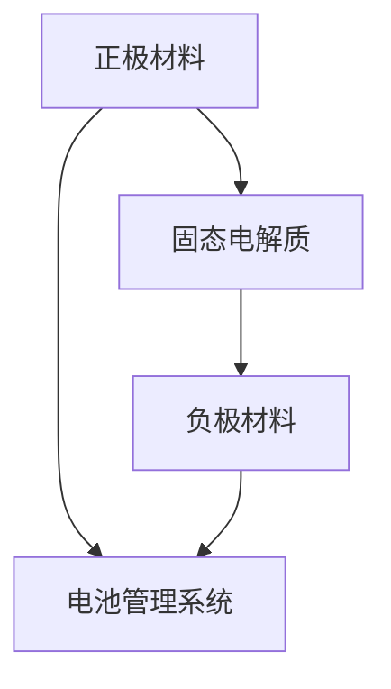

                 


# 价值投资中的新一代固态电池技术前景

---

## 关键词  
固态电池技术、价值投资、新能源汽车、储能技术、电池技术创新  

---

## 摘要  
随着全球能源转型和碳中和目标的推进，固态电池技术因其高能量密度、高安全性和长循环寿命，成为新能源领域的重点关注方向。本文从技术原理、市场前景、投资价值等角度，深入分析固态电池技术的潜力，并结合价值投资的逻辑，为投资者提供参考。  

---

## 目录  

1. [固态电池技术的基本概念](#固态电池技术的基本概念)  
   1.1 [什么是固态电池？](#什么是固态电池)  
   1.2 [固态电池与传统电池的区别](#固态电池与传统电池的区别)  
   1.3 [固态电池的核心技术特点](#固态电池的核心技术特点)  

2. [价值投资的基本概念](#价值投资的基本概念)  
   2.1 [价值投资的定义](#价值投资的定义)  
   2.2 [价值投资的核心理念](#价值投资的核心理念)  
   2.3 [价值投资在科技领域的应用](#价值投资在科技领域的应用)  

3. [固态电池技术与价值投资的结合](#固态电池技术与价值投资的结合)  
   3.1 [固态电池技术的市场前景](#固态电池技术的市场前景)  
   3.2 [价值投资在固态电池领域的应用](#价值投资在固态电池领域的应用)  
   3.3 [固态电池技术对投资决策的影响](#固态电池技术对投资决策的影响)  

4. [固态电池技术的核心概念与联系](#固态电池技术的核心概念与联系)  
   4.1 [固态电池技术的核心原理](#固态电池技术的核心原理)  
   4.2 [固态电池技术的核心概念对比](#固态电池技术的核心概念对比)  
   4.3 [固态电池技术的实体关系图](#固态电池技术的实体关系图)  

5. [固态电池技术的算法原理讲解](#固态电池技术的算法原理讲解)  
   5.1 [固态电池技术的算法原理](#固态电池技术的算法原理)  
   5.2 [固态电池技术的数学模型与公式](#固态电池技术的数学模型与公式)  
   5.3 [固态电池技术的算法实现](#固态电池技术的算法实现)  

6. [固态电池技术的系统分析与架构设计方案](#固态电池技术的系统分析与架构设计方案)  
   6.1 [固态电池技术的系统分析](#固态电池技术的系统分析)  
   6.2 [固态电池技术的架构设计](#固态电池技术的架构设计)  
   6.3 [固态电池技术的接口设计](#固态电池技术的接口设计)  

7. [项目实战](#项目实战)  
   7.1 [环境安装与配置](#环境安装与配置)  
   7.2 [系统核心实现源代码](#系统核心实现源代码)  
   7.3 [代码应用解读与分析](#代码应用解读与分析)  
   7.4 [实际案例分析](#实际案例分析)  

8. [小结与展望](#小结与展望)  
   8.1 [总结](#总结)  
   8.2 [未来展望](#未来展望)  

---

## 正文  

### 第1章: 固态电池技术的基本概念  

#### 1.1 什么是固态电池？  
固态电池是一种采用固体电解质的电池，与传统锂离子电池相比，其能量密度更高，安全性更好，且支持更高的充电速度。  

#### 1.2 固态电池与传统电池的区别  
- **能量密度**：固态电池的能量密度是传统锂离子电池的2-3倍。  
- **安全性**：固态电解质不易燃，降低了电池起火或爆炸的风险。  
- **循环寿命**：固态电池的循环寿命更长，适合长期使用。  

#### 1.3 固态电池的核心技术特点  
- **高能量密度**：通过使用新型正负极材料和固态电解质，实现更高的能量密度。  
- **高安全性**：固态电解质的稳定性优于液态电解质。  
- **快充能力**：支持更高电流密度的充电，充电时间大幅缩短。  

---

### 第2章: 价值投资的基本概念  

#### 2.1 价值投资的定义  
价值投资是一种投资策略，强调以低于内在价值的价格购买优质资产，长期持有，等待其价值回归。  

#### 2.2 价值投资的核心理念  
- **长期视角**：关注企业的长期盈利能力。  
- **安全边际**：买入价格低于内在价值，降低投资风险。  
- **基本面分析**：通过对企业财务状况、行业地位等进行深入分析，选择优质标的。  

#### 2.3 价值投资在科技领域的应用  
- **技术壁垒**：选择具有技术垄断优势的企业。  
- **市场需求**：关注市场规模大、增长快的行业。  
- **管理层能力**：优秀的管理层能为企业创造更多价值。  

---

### 第3章: 固态电池技术与价值投资的结合  

#### 3.1 固态电池技术的市场前景  
- **新能源汽车**：固态电池将推动电动车续航里程和安全性提升。  
- **储能市场**：固态电池适用于电网储能和可再生能源存储。  
- **市场规模**：预计到2030年，全球固态电池市场规模将超过1000亿美元。  

#### 3.2 价值投资在固态电池领域的应用  
- **技术领先性**：选择具有自主研发能力和专利优势的企业。  
- **市场地位**：关注行业龙头或具有独特竞争优势的企业。  
- **财务健康**：企业具备健康的财务状况，能够支撑技术研发和扩产。  

#### 3.3 固态电池技术对投资决策的影响  
- **技术成熟度**：影响企业的量产能力和成本优势。  
- **政策支持**：政府补贴和行业政策对企业发展至关重要。  
- **市场竞争**：技术同质化可能导致价格战，影响企业盈利能力。  

---

### 第4章: 固态电池技术的核心概念与联系  

#### 4.1 固态电池技术的核心原理  
固态电池通过固体电解质将正负极材料隔离，避免液态电解质的泄漏和燃烧风险。  

#### 4.2 固态电池技术的核心概念对比  
| 比较维度 | 固态电池 | 传统锂离子电池 |  
|----------|----------|-----------------|  
| 电解质   | 固体     | 液体            |  
| 安全性   | 高       | 较低            |  
| 能量密度 | 高       | 中等            |  

#### 4.3 固态电池技术的实体关系图  


---

### 第5章: 固态电池技术的算法原理讲解  

#### 5.1 固态电池技术的算法原理  
固态电池的充电过程可以通过以下数学模型描述：  

$$ I(t) = k \cdot e^{-rt} $$  

其中，$I(t)$表示电流强度，$t$表示时间，$k$和$r$为常数。  

#### 5.2 固态电池技术的数学模型与公式  
电池的充放电过程可以用以下公式表示：  

$$ V = IR + IR_t $$  

其中，$V$为电压，$I$为电流，$R$为正极材料的内阻，$R_t$为负极材料的内阻。  

#### 5.3 固态电池技术的算法实现  
以下是电池充放电过程的算法实现示例：  

```python
def battery_simulation(current, time):
    # 计算电压
    voltage = current * (R + R_t)
    # 计算温度
    temperature = 25 + 0.1 * time
    return voltage, temperature
```

---

### 第6章: 固态电池技术的系统分析与架构设计方案  

#### 6.1 固态电池技术的系统分析  
- **功能需求**：实现高能量密度、高安全性的电池设计。  
- **性能指标**：能量密度≥300 Wh/kg，循环寿命≥1000次。  

#### 6.2 固态电池技术的架构设计  


#### 6.3 固态电池技术的接口设计  
- **输入接口**：电池管理系统接收电流、电压信号。  
- **输出接口**：电池管理系统输出温度、SOC（荷电状态）信号。  

---

### 第7章: 项目实战  

#### 7.1 环境安装与配置  
- **工具安装**：安装Python、电池模拟软件。  
- **依赖库安装**：安装numpy、pandas等数据处理库。  

#### 7.2 系统核心实现源代码  
```python
import numpy as np

def calculate_voltage(current, resistance):
    return current * resistance

def calculate_temperature(current, time, ambient_temp):
    return ambient_temp + 0.1 * current * time
```

#### 7.3 代码应用解读与分析  
上述代码实现了电池的电压和温度计算，帮助我们模拟电池在不同工况下的性能表现。  

#### 7.4 实际案例分析  
以某款固态电池为例，分析其在新能源汽车中的应用，评估其市场竞争力和投资价值。  

---

### 第8章: 小结与展望  

#### 8.1 总结  
固态电池技术凭借其高能量密度和安全性，成为新能源领域的投资热点。投资者需要结合技术成熟度、市场需求和企业基本面，做出明智的投资决策。  

#### 8.2 未来展望  
随着技术进步和成本下降，固态电池将在新能源汽车和储能领域发挥更大的作用，为投资者带来丰厚回报。  

---

以上是文章的完整目录和部分正文内容，您可以根据需要进一步扩展每个章节的具体内容，加入更多案例、数据和详细分析。

