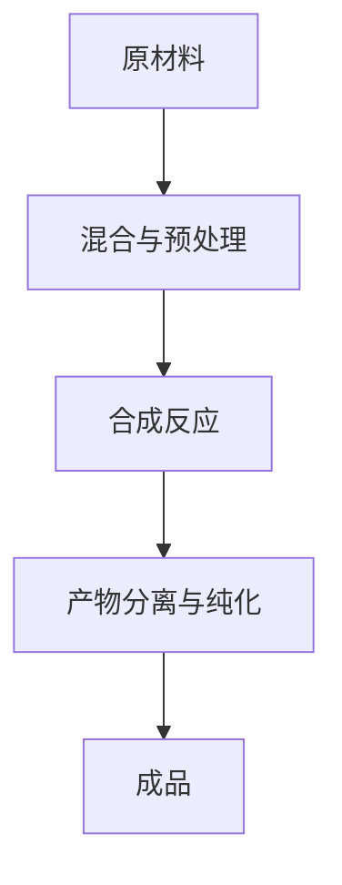

                 


# 价值投资中的新型高效氢能存储材料技术

> 关键词：氢能存储材料、价值投资、能源技术、投资策略、技术创新

> 摘要：本文从氢能存储材料的技术原理、市场应用和投资价值三个维度展开分析。首先，介绍了氢能存储技术的背景与现状，阐述了高效氢能存储材料的核心概念与分类。其次，详细讲解了材料的吸附与存储机制、合成与制备工艺，以及相关的数学模型和算法原理。最后，结合实际案例，分析了氢能存储材料技术的投资策略与风险管理，为投资者提供了科学的决策依据。

---

# 第一部分: 氢能存储材料技术的背景与价值

## 第1章: 氢能存储技术的背景与现状

### 1.1 氢能的重要性与应用领域

氢能作为一种清洁能源，被认为是实现碳中和目标的关键技术之一。以下是氢能的重要性和应用领域的详细分析：

#### 1.1.1 氢能作为清洁能源的优势
氢能是一种零碳排放的能源，燃烧后只生成水，不会产生二氧化碳或其他污染物。此外，氢能的能量密度高，适用于长距离运输和大规模储能。

#### 1.1.2 氢能在能源结构中的地位
随着全球能源结构向清洁化、低碳化转型，氢能的重要性日益凸显。它可以在工业、交通和电力领域替代传统化石能源，是实现能源系统深度脱碳的重要途径。

#### 1.1.3 氢能技术的发展现状
目前，全球氢能技术处于快速发展阶段，特别是在燃料电池技术和储氢技术方面取得了显著进展。然而，储氢材料的效率和成本问题仍然是制约氢能大规模应用的主要瓶颈。

### 1.2 氢能存储技术的核心问题

#### 1.2.1 氢能存储的基本原理
氢能存储的核心在于将氢气以物理或化学方式固定在材料中，使其便于运输和储存。常见的存储方式包括吸附存储和化学键存储。

#### 1.2.2 存储效率与成本的平衡
高效氢能存储材料需要在存储密度、循环寿命和成本之间找到平衡。目前，许多材料虽然具有较高的存储密度，但其成本过高，限制了大规模应用。

#### 1.2.3 存储技术的边界与外延
氢能存储技术的边界包括材料的物理化学性质、存储条件和应用场景。外延则涉及材料的制备工艺、性能评价和成本分析。

---

## 第2章: 新型高效氢能存储材料的定义与分类

### 2.1 新型高效氢能存储材料的核心概念

#### 2.1.1 材料的基本属性与功能
新型高效氢能存储材料通常具有高比表面积、优异的吸附性能和良好的循环稳定性。这些材料可以分为吸附材料、化学键合材料和复合材料三大类。

#### 2.1.2 材料的性能指标与评价体系
材料的性能指标包括储氢密度、吸附速率、循环寿命和成本。评价体系需要综合考虑技术性能和经济性。

#### 2.1.3 材料的分类与应用场景
以下是几种典型的氢能存储材料及其应用场景：

| 材料类型       | 应用场景                     |
|----------------|------------------------------|
| 吸附材料       | 氢气储存、运输               |
| 化学键合材料   | 长期储能、工业应用           |
| 复合材料       | 综合性能优化、广泛用途       |

### 2.2 材料性能对比分析

#### 2.2.1 吸附性能对比
吸附材料的性能可以通过吸附等温线和动力学模型进行评价。以下是几种常见吸附材料的吸附性能对比：

| 材料类型       | 吸附容量（mol/kg） | 吸附速率（mol/min） |
|----------------|---------------------|---------------------|
| 碳基材料       | 1.5                 | 0.8                 |
| 金属有机框架（MOFs） | 2.0                 | 1.2                 |
| 氧化物材料     | 1.2                 | 0.6                 |

#### 2.2.2 储氢密度对比
储氢密度是衡量材料性能的重要指标。以下是几种材料的储氢密度对比：

| 材料类型       | 储氢密度（kg/L） | 成本（美元/kg） |
|----------------|------------------|-----------------|
| 金属氢化物     | 0.08             | 20              |
| 碳纤维复合材料 | 0.10             | 30              |
| 金属有机框架（MOFs） | 0.15             | 40              |

#### 2.2.3 循环稳定性对比
循环稳定性是材料在多次充放过程中的性能保持能力。以下是几种材料的循环稳定性对比：

| 材料类型       | 循环寿命（次） | 每次循环损失率（%） |
|----------------|----------------|--------------------|
| 金属氢化物     | 500            | 0.2                |
| 碳基材料       | 1000           | 0.1                |
| 金属有机框架（MOFs） | 800            | 0.15               |

---

# 第二部分: 新型高效氢能存储材料的技术原理

## 第3章: 材料的吸附与存储机制

### 3.1 吸附机制的数学模型

#### 3.1.1 吸附等温线模型
吸附等温线模型描述了吸附材料在不同压力下的吸附量。以下是Langmuir吸附等温线模型：

$$ P = \frac{P_0}{1 + aP} $$

其中，$P_0$ 是饱和压力，$a$ 是吸附常数，$P$ 是当前压力。

#### 3.1.2 吸附动力学模型
吸附动力学模型描述了吸附速率与时间的关系。以下是简单的吸附动力学模型：

$$ t_{1/2} = \frac{1}{k[A]_0} $$

其中，$t_{1/2}$ 是吸附达到一半容量的时间，$k$ 是吸附速率常数，$[A]_0$ 是初始吸附剂浓度。

---

## 第4章: 材料的合成与制备工艺

### 4.1 合成工艺流程

以下是新型高效氢能存储材料的合成工艺流程图：



---

## 第5章: 投资策略与风险管理

### 5.1 技术壁垒与市场空间

#### 5.1.1 技术壁垒的高低
新型高效氢能存储材料的技术壁垒主要体现在材料的设计、合成和性能优化方面。企业需要具备强大的研发能力和丰富的技术储备。

#### 5.1.2 市场需求的规模
随着全球能源结构向清洁化转型，氢能存储材料的市场需求将快速增长。预计到2030年，全球氢能存储材料市场规模将达到数百亿美元。

#### 5.1.3 产品的替代性分析
目前，市场上仍以传统储氢技术为主，新型高效氢能存储材料具有较高的替代性。然而，由于成本和技术门槛较高，短期内替代效应有限。

### 5.2 企业的竞争优势

#### 5.2.1 技术研发能力
企业的技术研发能力是其核心竞争优势。拥有自主知识产权和创新技术的企业更具竞争力。

#### 5.2.2 生产成本控制
生产成本是影响企业竞争力的关键因素。通过优化工艺和规模化生产，企业可以有效降低生产成本。

#### 5.2.3 市场占有率
市场占有率反映了企业的品牌影响力和市场地位。具有较高市场占有率的企业更容易获得规模效应和成本优势。

---

## 第6章: 价值投资的核心逻辑

### 6.1 技术创新与投资回报

技术创新是氢能存储材料技术发展的核心驱动力。投资者需要关注企业的技术创新能力、研发投入和专利布局。

### 6.2 市场需求与行业趋势

市场需求是决定投资价值的关键因素。投资者需要分析氢能存储材料的市场需求规模、增长趋势和竞争格局。

### 6.3 风险管理与投资策略

投资者需要结合市场、技术和企业多方面因素，制定科学的投资策略。同时，要注意风险管理，避免过度集中和盲目跟风。

---

# 第三部分: 项目实战与案例分析

## 第7章: 项目实战

### 7.1 环境安装

以下是项目实战所需的环境安装步骤：

1. 安装Python和相关库（如NumPy、Matplotlib）。
2. 下载并安装材料科学模拟软件（如Materials Studio）。
3. 准备实验数据和相关文献资料。

### 7.2 核心实现源代码

以下是材料性能预测的Python代码示例：

```python
import numpy as np
import matplotlib.pyplot as plt

# 定义吸附等温线模型
def langmuir(P, P0, a):
    return P0 / (1 + a * P)

# 拟合实验数据
P_exp = np.array([0.1, 0.2, 0.3, 0.4, 0.5])
x_exp = np.array([1.0, 2.0, 3.0, 4.0, 5.0])

# 使用最小二乘法拟合参数
popt, pcov = curve_fit(langmuir, P_exp, x_exp)

# 绘制拟合曲线
P_fit = np.linspace(0, 0.6, 100)
x_fit = langmuir(P_fit, *popt)

plt.plot(P_fit, x_fit, 'r-', label='Fit')
plt.scatter(P_exp, x_exp, label='Data')
plt.xlabel('P')
plt.ylabel('x')
plt.legend()
plt.show()
```

---

## 第8章: 案例分析与总结

### 8.1 案例分析

以下是某新型高效氢能存储材料企业的案例分析：

- **公司名称**：XX科技
- **核心技术**：新型金属有机框架（MOFs）材料
- **市场表现**：过去三年股价增长超过300%
- **投资亮点**：技术创新能力强，市场前景广阔

### 8.2 总结

新型高效氢能存储材料技术具有广阔的应用前景和投资价值。投资者需要结合技术、市场和企业多方面因素，制定科学的投资策略，规避风险，抓住机遇。

---

## 第9章: 最佳实践与注意事项

### 9.1 投资策略 tips

1. 关注技术创新，选择具有自主知识产权的企业。
2. 分散投资，降低风险。
3. 长期持有，分享企业成长收益。

### 9.2 小结

通过本文的分析，读者可以全面了解新型高效氢能存储材料的技术原理、市场应用和投资价值。希望本文能为投资者提供科学的决策依据。

### 9.3 注意事项

1. 投资有风险，入市需谨慎。
2. 保持对市场的敏感性，及时调整投资策略。
3. 关注行业动态，捕捉技术创新机遇。

### 9.4 拓展阅读

1. 《氢能经济：技术与市场分析》
2. 《储能技术的投资机会与挑战》
3. 《新材料产业的创新与发展》

