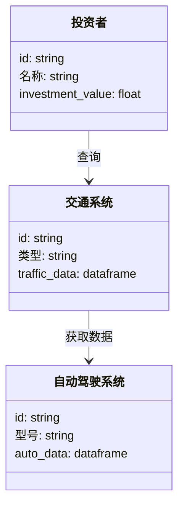
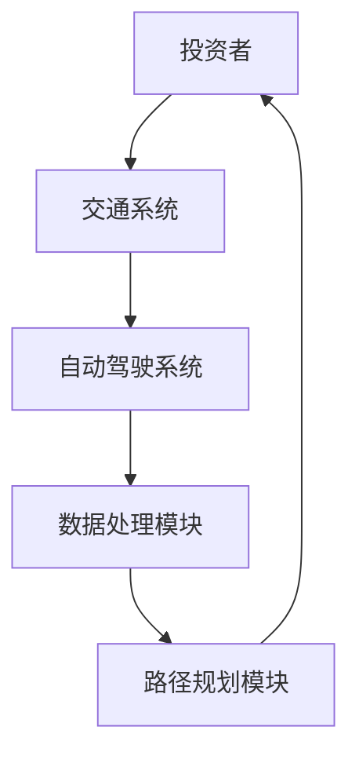
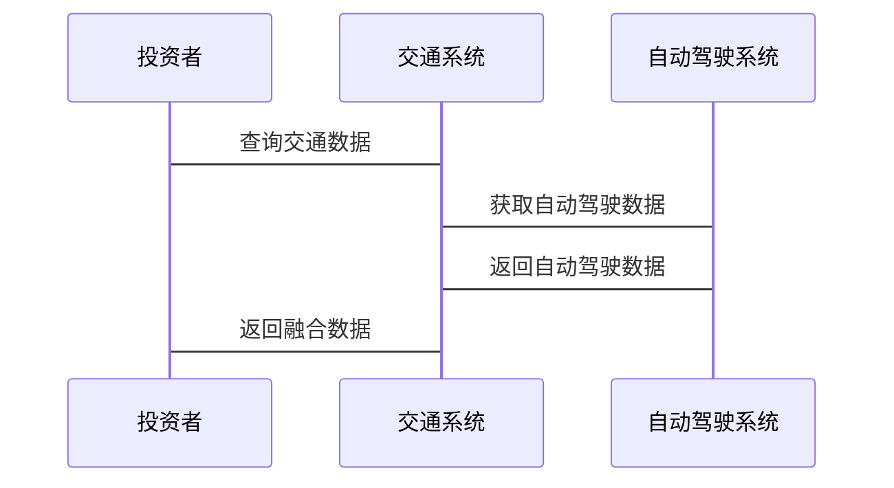

                 


```markdown
# 价值投资中的智能交通自动驾驶协同系统分析

## 关键词
- 智能交通系统
- 自动驾驶技术
- 价值投资
- 协同系统
- 算法原理
- 系统架构

## 摘要
智能交通系统与自动驾驶技术的协同应用正在改变现代交通体系，而价值投资在这一领域中的潜力巨大。本文系统地分析了智能交通自动驾驶协同系统的背景、核心概念、算法原理、系统架构，并通过实例展示了其在价值投资中的应用，探讨了协同系统的数学模型和实际案例，最后提出了系统的最佳实践建议。

---

## 第一部分: 价值投资中的智能交通自动驾驶协同系统背景介绍

### 第1章: 背景介绍
#### 1.1 问题背景
- **智能交通系统的发展现状**：智能交通系统（ITS）的普及和应用，如交通监控、智能信号灯等，正在优化城市交通流量。
- **自动驾驶技术的崛起**：自动驾驶技术的进步，如特斯拉、Waymo等企业的技术发展，推动了汽车智能化进程。
- **价值投资在交通领域的应用潜力**：投资者通过分析智能交通和自动驾驶的技术、市场和经济指标，寻找投资机会。

#### 1.2 问题描述
- **智能交通与自动驾驶协同的必要性**：智能交通系统需要实时数据和高效决策，自动驾驶技术提供了丰富的数据源和决策支持，两者协同可以进一步提升交通效率。
- **当前交通系统中的痛点**：交通拥堵、交通事故、能源消耗等问题严重，智能交通和自动驾驶协同可以有效解决这些痛点。
- **价值投资对协同系统的需求**：投资者需要了解协同系统的技术成熟度、市场潜力和经济价值，以便做出明智的投资决策。

#### 1.3 问题解决
- **协同系统的核心目标**：通过数据共享和协同决策，优化交通流量、减少事故、提升自动驾驶的安全性和效率。
- **协同系统的实现路径**：构建数据共享平台，开发协同算法，制定协同决策机制。
- **价值投资中的协同收益**：协同系统可以降低投资风险，提高投资回报率。

#### 1.4 边界与外延
- **协同系统的边界定义**：协同系统仅限于智能交通和自动驾驶的交互，不涉及其他领域。
- **相关领域的外延影响**：协同系统可能影响能源、环境、保险等行业。
- **系统与外部环境的交互关系**：协同系统需要与政府政策、市场需求、技术标准等外部因素交互。

#### 1.5 核心概念
- **智能交通系统的核心要素**：交通数据采集、交通管理、交通预测。
- **自动驾驶的关键技术**：环境感知、路径规划、决策控制。
- **价值投资的评估指标**：投资回报率、风险评估、市场潜力。

### 第2章: 核心概念与联系
#### 2.1 智能交通系统与自动驾驶的协同原理
- **数据流的协同机制**：自动驾驶车辆实时发送数据到交通系统，交通系统反馈指令给自动驾驶车辆。
- **信息处理的协同过程**：协同系统整合交通数据和自动驾驶数据，进行综合分析和决策。
- **决策支持的协同模式**：协同系统提供最优路径、交通预测等决策支持。

#### 2.2 核心概念属性对比
| 核心概念 | 智能交通系统 | 自动驾驶系统 | 价值投资 |
|----------|---------------|--------------|----------|
| 核心目标 | 优化交通流量 | 提高驾驶安全 | 追求收益 |
| 技术基础 | 信息技术 | 自动化技术 | 金融分析 |
| 应用场景 | 城市交通管理 | 自动驾驶车辆 | 投资决策 |

#### 2.3 ER实体关系图
```mermaid
erDiagram
    actor 投资者 {
        <string> id
        <string> 名称
    }
    actor 交通系统 {
        <string> id
        <string> 类型
    }
    actor 自动驾驶系统 {
        <string> id
        <string> 型号
    }
    investor o-|> traffic_system : 投资关系
    traffic_system o-|> autonomous_driving_system : 协同关系
```

### 第3章: 协同系统算法原理
#### 3.1 数据融合算法
- **数据融合方法**：将交通数据和自动驾驶数据进行融合，消除冗余和冲突。
- **数据融合流程**：数据采集、数据清洗、特征提取、数据融合。

#### 3.2 路径规划算法
- **路径规划方法**：基于实时交通数据和自动驾驶需求，计算最优路径。
- **路径规划流程**：数据输入、路径候选生成、路径评估、最优路径选择。

#### 3.3 投资决策算法
- **投资决策模型**：基于协同系统的收益预测和风险评估，制定投资策略。
- **投资决策流程**：数据输入、分析评估、决策输出。

#### 3.4 数学模型与公式
- **数据融合模型**：
  $$ \text{融合数据} = f(\text{交通数据}, \text{自动驾驶数据}) $$
- **路径规划模型**：
  $$ \text{最优路径} = \argmin_{\text{路径}} \sum_{i=1}^{n} \text{权重}_i \times \text{成本}_i $$
- **投资决策模型**：
  $$ \text{投资价值} = \alpha \times \text{交通收益} + \beta \times \text{自动驾驶收益} $$

### 第4章: 算法实现与案例分析
#### 4.1 算法实现
- **环境安装**：安装Python、NumPy、Pandas、Scikit-learn等工具。
- **核心代码实现**：
  ```python
  import numpy as np
  import pandas as pd

  # 数据融合
  def data_fusion(traffic_data, auto_data):
      return pd.merge(traffic_data, auto_data, on='时间戳')

  # 路径规划
  def path_planning(risk_factors):
      return np.argmin(risk_factors)

  # 投资决策
  def investment_decision(value_factors):
      return np.dot(value_factors, [0.5, 0.5])
  ```

#### 4.2 案例分析
- **案例背景**：某城市实施智能交通和自动驾驶协同系统，投资者分析其经济价值。
- **数据来源**：交通流量、自动驾驶测试数据。
- **分析过程**：数据融合、路径规划、投资决策。
- **结果解读**：协同系统提升了交通效率，降低了投资风险。

---

## 第二部分: 系统分析与架构设计

### 第5章: 系统分析
#### 5.1 问题场景介绍
- **交通拥堵**：协同系统优化信号灯，减少拥堵。
- **自动驾驶测试**：协同系统提供实时交通数据，支持测试。

### 第6章: 系统架构设计
#### 6.1 领域模型类图


#### 6.2 系统架构图


#### 6.3 接口设计
- **交通系统接口**：提供交通数据查询接口。
- **自动驾驶系统接口**：提供自动驾驶数据接口。

#### 6.4 交互流程图


---

## 第三部分: 项目实战

### 第7章: 项目实战
#### 7.1 环境安装
- **工具安装**：安装Python、Jupyter Notebook、Mermaid等工具。

#### 7.2 核心代码实现
- **数据融合代码**：
  ```python
  import pandas as pd

  traffic_data = pd.DataFrame({
      '时间戳': [1, 2, 3],
      '路段': ['A', 'A', 'B']
  })
  auto_data = pd.DataFrame({
      '时间戳': [1, 2, 3],
      '车辆ID': ['X1', 'X2', 'X3']
  })
  merged_data = pd.merge(traffic_data, auto_data, on='时间戳')
  print(merged_data)
  ```

- **路径规划代码**：
  ```python
  import numpy as np

  risk_factors = np.array([0.5, 0.3, 0.8])
  optimal_path = np.argmin(risk_factors)
  print(optimal_path)
  ```

- **投资决策代码**：
  ```python
  import numpy as np

  value_factors = np.array([0.6, 0.4])
  investment_value = np.dot(value_factors, [0.5, 0.5])
  print(investment_value)
  ```

#### 7.3 案例分析
- **案例背景**：某城市交通系统与自动驾驶协同，投资者分析其价值。
- **数据分析**：分析交通数据和自动驾驶数据，评估协同系统的经济价值。
- **结果解读**：协同系统提升了交通效率，降低了投资风险。

---

## 第四部分: 最佳实践、小结与注意事项

### 第8章: 最佳实践
#### 8.1 小结
- **协同系统的优势**：提升交通效率、降低投资风险。
- **系统的局限性**：技术成熟度、数据隐私问题。

#### 8.2 注意事项
- **数据隐私**：保护用户数据隐私，遵守相关法律法规。
- **技术成熟度**：关注协同系统的技术发展和市场接受度。

### 第9章: 拓展阅读
- **相关书籍**：推荐《智能交通系统原理》、《自动驾驶技术详解》。
- **学术论文**：推荐《智能交通与自动驾驶的协同优化研究》。

---

## 结语
通过本文的详细分析，读者可以深入了解智能交通和自动驾驶协同系统的价值投资潜力，掌握其算法原理和系统架构设计，为未来的投资决策提供有力支持。
```

