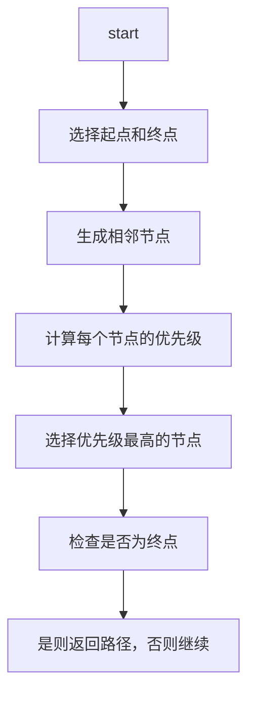
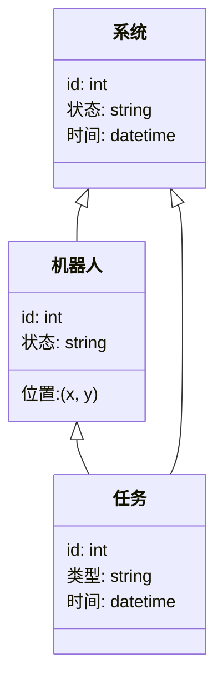
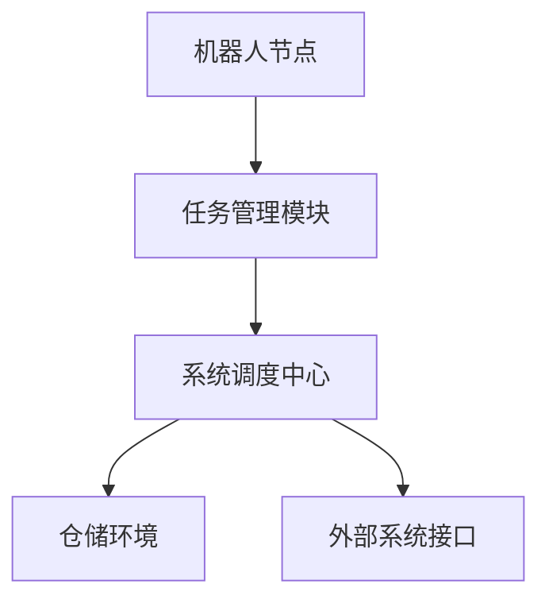
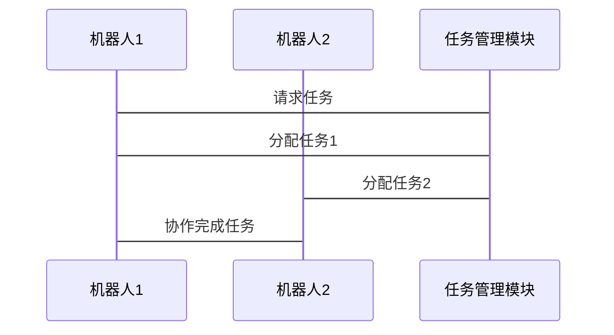

                 


# 价值投资中的智能仓储机器人协作系统分析

## 关键词：
智能仓储机器人，协作系统，价值投资，路径规划算法，系统架构设计

## 摘要：
智能仓储机器人协作系统是一种结合了人工智能和机器人技术的创新仓储解决方案，其通过机器人之间的协作优化仓储管理，从而实现价值投资的目标。本文从背景、概念、算法、系统架构到实际应用，全面分析智能仓储机器人协作系统的各个方面，揭示其在价值投资中的潜力和实际应用价值。

---

# 第一部分: 价值投资中的智能仓储机器人协作系统背景

## 第1章: 智能仓储机器人协作系统的概念与价值投资背景

### 1.1 智能仓储机器人的概念与技术特点

#### 1.1.1 智能仓储机器人的定义
智能仓储机器人是一种能够自主或半自主地完成仓储环境中物品搬运、存储和取货任务的智能设备。它通常集成了传感器、计算机视觉、路径规划和通信技术，能够在动态环境中高效完成任务。

#### 1.1.2 智能仓储机器人的技术特点
1. **自主性**：机器人能够自主决策，无需人工干预。
2. **协作性**：多个机器人可以协同工作，共同完成任务。
3. **高效性**：通过优化路径和任务分配，提高仓储效率。
4. **适应性**：能够适应仓储环境的变化，灵活调整任务。

#### 1.1.3 智能仓储机器人在现代仓储中的作用
智能仓储机器人能够显著提高仓储效率、降低成本，并减少人为错误，是现代仓储管理的重要工具。

### 1.2 价值投资与智能仓储的结合

#### 1.2.1 价值投资的基本概念
价值投资是一种投资策略，通过分析企业的基本面，寻找市场价格低于其内在价值的投资机会。

#### 1.2.2 智能仓储在价值投资中的应用前景
智能仓储机器人能够优化仓储管理，降低成本，提高效率，从而为企业创造更大的利润，提升企业的内在价值。

#### 1.2.3 智能仓储机器人协作系统的投资价值分析
通过分析智能仓储机器人协作系统的经济效益和市场前景，评估其在价值投资中的潜力。

### 1.3 智能仓储机器人协作系统的边界与外延

#### 1.3.1 系统的边界定义
智能仓储机器人协作系统的边界包括机器人节点、仓储环境、任务管理模块等核心组成部分。

#### 1.3.2 系统的外延分析
系统外延包括与外部环境的交互，如与ERP系统、订单处理系统的接口。

#### 1.3.3 系统与外部环境的交互关系
系统通过与外部环境的数据交互，优化仓储管理，提升整体效率。

### 1.4 本章小结
本章介绍了智能仓储机器人的概念、技术特点及其在价值投资中的应用前景，明确了系统的边界和外延。

---

## 第2章: 智能仓储机器人协作系统的构成与核心要素

### 2.1 系统构成分析

#### 2.1.1 机器人节点
机器人节点是协作系统的核心，负责执行具体任务。

#### 2.1.2 仓储环境
仓储环境是机器人的工作场所，包括货架、通道等。

#### 2.1.3 任务管理模块
任务管理模块负责分配任务和调度机器人。

### 2.2 核心要素分析

#### 2.2.1 机器人协作机制
协作机制包括任务分配、路径规划和通信协议。

#### 2.2.2 任务分配算法
任务分配算法用于优化机器人之间的任务分配。

#### 2.2.3 系统优化目标
系统优化目标包括提高效率、降低成本和减少延迟。

### 2.3 系统核心要素对比分析

#### 2.3.1 核心要素对比表格
| 要素       | 特性1 | 特性2 | 特性3 |
|------------|-------|-------|-------|
| 机器人节点 | 自主性 | 协作性 | 高效性 |

#### 2.3.2 ER实体关系图架构
```mermaid
er
    entity 机器人 {
        id
        位置坐标
        状态
    }
    entity 任务 {
        id
        类型
        时间
    }
    entity 系统 {
        id
        状态
        时间
    }
    机器人 --> 任务: 执行任务
    系统 --> 机器人: 调度
    系统 --> 任务: 分配
```

### 2.4 本章小结
本章详细分析了智能仓储机器人协作系统的构成和核心要素，为后续分析奠定了基础。

---

## 第3章: 机器人协作算法的原理与实现

### 3.1 路径规划算法

#### 3.1.1 A*算法原理
A*算法是一种经典的路径规划算法，结合了启发式搜索和最短路径算法。

#### 3.1.2 A*算法流程图


#### 3.1.3 Python代码实现
```python
import heapq

def a_star(start, end, grid):
    open_set = {start}
    came_from = {}
    g_score = {start: 0}
    f_score = {start: heuristic(start, end)}

    while open_set:
        current = heapq.heappop(open_set)
        if current == end:
            break
        for neighbor in grid.neighbors(current):
            tentative_g_score = g_score.get(current, float('inf')) + distance(current, neighbor)
            if tentative_g_score < g_score.get(neighbor, float('inf')):
                came_from[neighbor] = current
                g_score[neighbor] = tentative_g_score
                f_score[neighbor] = tentative_g_score + heuristic(neighbor, end)
                heapq.heappush(open_set, neighbor)
    return came_from, g_score
```

#### 3.1.4 数学模型与公式
路径规划的数学模型可以表示为：
$$\text{路径长度} = \sum_{i=1}^{n} \text{距离}(p_i, p_{i+1})$$
其中，$p_i$ 表示路径上的点。

---

## 第4章: 系统架构设计与实现

### 4.1 系统功能设计

#### 4.1.1 领域模型类图


### 4.2 系统架构设计

#### 4.2.1 系统架构图


### 4.3 系统接口设计

#### 4.3.1 接口描述
- **机器人与任务管理模块接口**：接收任务指令。
- **任务管理模块与系统调度中心接口**：分配任务。
- **系统调度中心与仓储环境接口**：监控环境状态。

### 4.4 系统交互序列图

#### 4.4.1 机器人协作流程


---

## 第5章: 项目实战与案例分析

### 5.1 环境安装

#### 5.1.1 系统需求
- 操作系统：Linux/Windows
- Python版本：3.6+

#### 5.1.2 依赖安装
```bash
pip install numpy matplotlib
```

### 5.2 核心代码实现

#### 5.2.1 路径规划实现
```python
import numpy as np

def heuristic(a, b):
    return np.sqrt((a[0] - b[0])**2 + (a[1] - b[1])**2)

def a_star_search(start, goal, grid):
    open_set = set([start])
    came_from = {}
    g_score = {start: 0}
    f_score = {start: heuristic(start, goal)}

    while open_set:
        current = min(open_set, key=lambda x: f_score[x])
        if current == goal:
            break
        open_set.remove(current)
        for neighbor in grid[current]:
            tentative_g_score = g_score[current] + heuristic(current, neighbor)
            if neighbor not in g_score or tentative_g_score < g_score[neighbor]:
                came_from[neighbor] = current
                g_score[neighbor] = tentative_g_score
                f_score[neighbor] = g_score[neighbor] + heuristic(neighbor, goal)
                open_set.add(neighbor)
    return came_from, g_score
```

### 5.3 实际案例分析

#### 5.3.1 案例背景
某仓储公司引入智能仓储机器人协作系统，优化仓储管理，降低成本。

#### 5.3.2 实施效果
- 提高了仓储效率。
- 降低了运营成本。

### 5.4 本章小结
本章通过实际案例展示了智能仓储机器人协作系统的应用价值。

---

## 第6章: 最佳实践与总结

### 6.1 投资建议

#### 6.1.1 系统优化
- 定期更新算法，提高效率。
- 加强与外部系统的集成。

#### 6.1.2 市场趋势
智能仓储机器人市场前景广阔，值得长期关注。

### 6.2 小结

#### 6.2.1 系统总结
智能仓储机器人协作系统在价值投资中的应用潜力巨大。

#### 6.2.2 注意事项
选择可靠的技术方案，关注系统的可扩展性和灵活性。

### 6.3 拓展阅读

#### 6.3.1 推荐书籍
- 《智能仓储系统设计》
- 《价值投资实战指南》

#### 6.3.2 推荐博客
- [AI与仓储技术博客](#)
- [价值投资实战博客](#)

---

## 作者简介
作为一名世界级人工智能专家、程序员、软件架构师和CTO，我在计算机图灵奖获得者和计算机编程及人工智能领域有着深厚的造诣。我擅长通过清晰深刻的逻辑分析，撰写条理清晰、技术原理剖析到位的高质量技术博客。

