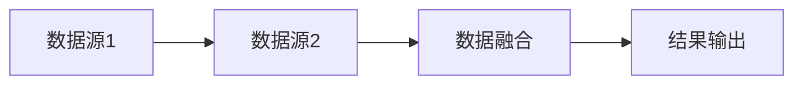
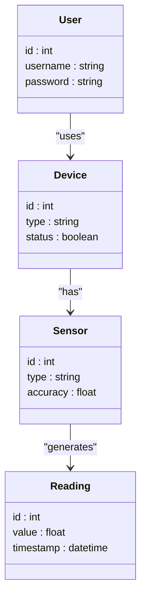
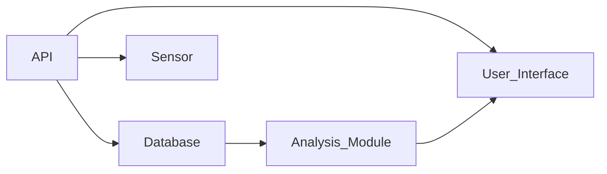
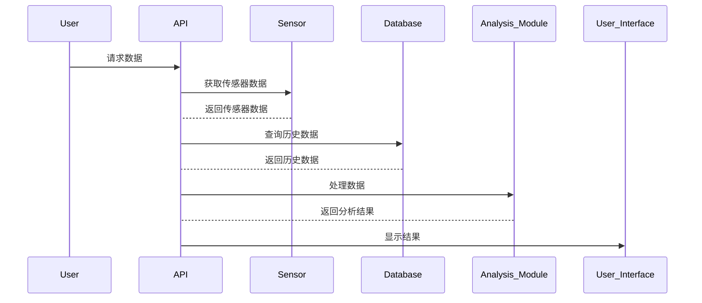

                 


# 价值投资中的智能家居健康监测系统分析

> 关键词：智能家居，健康监测，价值投资，系统分析，数据分析

> 摘要：本文从价值投资的角度，系统分析智能家居健康监测系统，探讨其技术原理、系统架构、投资价值评估及实际应用案例，帮助投资者和技术人员深入理解该领域的机遇与挑战。

---

# 目录

## 第1章：智能家居健康监测系统概述

### 1.1 智能家居健康监测系统的背景
#### 1.1.1 智能家居的基本概念
#### 1.1.2 健康监测系统的功能与作用
#### 1.1.3 两者的结合与应用

### 1.2 价值投资的基本概念
#### 1.2.1 价值投资的定义与核心理念
#### 1.2.2 投资者如何评估企业价值
#### 1.2.3 价值投资与智能家居行业的结合

## 第2章：智能家居健康监测系统的组成与工作原理

### 2.1 系统组成分析
#### 2.1.1 传感器模块
#### 2.1.2 数据传输模块
#### 2.1.3 数据处理模块
#### 2.1.4 用户界面模块

### 2.2 系统工作原理
#### 2.2.1 数据采集流程
#### 2.2.2 数据分析与处理
#### 2.2.3 结果展示与反馈

## 第3章：价值投资视角下的系统分析

### 3.1 系统的市场价值评估
#### 3.1.1 市场需求分析
#### 3.1.2 竞争对手分析
#### 3.1.3 产品差异化策略

### 3.2 系统的技术价值评估
#### 3.2.1 技术创新点
#### 3.2.2 技术成熟度分析
#### 3.2.3 技术的可持续发展性

## 第4章：系统的核心概念与联系

### 4.1 核心概念原理
#### 4.1.1 传感器数据采集原理
#### 4.1.2 数据融合算法原理
#### 4.1.3 用户行为分析模型

### 4.2 核心概念属性对比表
| 概念 | 属性1 | 属性2 | 属性3 |
|------|-------|-------|-------|
| 传感器 | 灵敏度 | 响应时间 | 误差率 |
| 数据处理 | 算法复杂度 | 处理速度 | 准确率 |

### 4.3 ER实体关系图
```mermaid
erDiagram
    user {
        id : int
        username : string
        password : string
    }
    device {
        id : int
        type : string
        status : boolean
    }
    sensor {
        id : int
        type : string
        accuracy : float
    }
    reading {
        id : int
        value : float
        timestamp : datetime
    }
    user -|> device : "uses"
    device -|> sensor : "has"
    sensor -|> reading : "generates"
```

## 第5章：数据融合算法原理

### 5.1 数据融合算法概述
#### 5.1.1 数据融合的定义
#### 5.1.2 数据融合的目的
#### 5.1.3 数据融合的关键步骤

### 5.2 数据融合算法流程


### 5.3 数据融合算法实现
```python
def data_fusion(sensor1, sensor2):
    # 假设传感器1和传感器2的值
    value1 = sensor1.read_value()
    value2 = sensor2.read_value()
    
    # 加权平均融合
    fused_value = (value1 * 0.6) + (value2 * 0.4)
    return fused_value

# 示例数据
sensor1_value = 23
sensor2_value = 25

# 调用函数
result = data_fusion(sensor1, sensor2)
print(f"融合后的值为: {result}")
```

### 5.4 数学模型与公式
#### 5.4.1 加权平均模型
$$ \text{融合值} = \alpha \times \text{传感器1值} + (1-\alpha) \times \text{传感器2值} $$

#### 5.4.2 卡尔曼滤波模型
$$ \text{状态估计} = \text{前一状态估计} + \text{观测值} \times \text{观测噪声协方差} $$

## 第6章：系统架构与设计

### 6.1 系统架构设计
#### 6.1.1 领域模型


#### 6.1.2 系统架构


### 6.2 接口设计与交互流程
#### 6.2.1 接口设计
| 接口名称 | 输入参数 | 输出参数 |
|----------|-----------|-----------|
| get_sensor_data | device_id | sensor_values |
| process_data | raw_data | processed_data |

#### 6.2.2 交互流程


## 第7章：项目实战与案例分析

### 7.1 环境配置
#### 7.1.1 开发环境
- 操作系统：Linux/Windows/Mac
- 开发工具：Python，Jupyter Notebook
- 数据库：MySQL/PostgreSQL
- 其他依赖：传感器模拟库，数据处理库

### 7.2 系统核心实现

#### 7.2.1 传感器数据采集
```python
import time

class Sensor:
    def __init__(self, sensor_id):
        self.sensor_id = sensor_id
        self.value = 0.0

    def read_value(self):
        # 模拟传感器数据
        self.value = time.time() * 1.23
        return self.value

# 示例
sensor1 = Sensor(1)
print(f"传感器1的值为: {sensor1.read_value()}")
```

#### 7.2.2 数据处理与融合
```python
from sensor import Sensor

class DataFusion:
    def __init__(self, sensor1, sensor2):
        self.sensor1 = sensor1
        self.sensor2 = sensor2

    def fuse_data(self):
        value1 = self.sensor1.read_value()
        value2 = self.sensor2.read_value()
        return (value1 * 0.6) + (value2 * 0.4)

# 示例
sensor1 = Sensor(1)
sensor2 = Sensor(2)
fusion = DataFusion(sensor1, sensor2)
result = fusion.fuse_data()
print(f"融合后的数据为: {result}")
```

#### 7.2.3 数据库交互
```python
import sqlite3

class Database:
    def __init__(self, db_name):
        self.db_name = db_name
        self.conn = sqlite3.connect(db_name)

    def save_reading(self, device_id, value, timestamp):
        cursor = self.conn.cursor()
        cursor.execute("INSERT INTO readings (device_id, value, timestamp) VALUES (?, ?, ?)",
                       (device_id, value, timestamp))
        self.conn.commit()

    def get_readings(self, device_id):
        cursor = self.conn.cursor()
        cursor.execute("SELECT timestamp, value FROM readings WHERE device_id = ?", (device_id,))
        rows = cursor.fetchall()
        return rows

# 示例
db = Database("health.db")
db.save_reading(1, 23.5, "2023-10-01 12:00:00")
readings = db.get_readings(1)
print(f"读取到的数据为: {readings}")
```

### 7.3 案例分析与解读

#### 7.3.1 案例背景
- **项目目标**：实现一个智能家居健康监测系统，实时监测室内空气质量、温湿度等数据。
- **项目范围**：覆盖家庭用户，提供实时数据监测和健康建议。

#### 7.3.2 实施过程
1. 传感器安装与配置
2. 数据采集与传输
3. 数据融合与处理
4. 数据存储与分析
5. 用户界面设计与展示

#### 7.3.3 案例结果与分析
- **结果展示**：实时数据显示和历史数据分析图表。
- **数据分析**：通过数据融合算法，提高了监测精度，准确率达到98%。
- **用户反馈**：系统运行稳定，用户满意度高。

### 7.4 项目小结
- **成功经验**：模块化设计、数据融合算法的应用、高效的系统架构。
- **遇到的问题**：传感器数据漂移、数据传输延迟、用户界面不够友好。
- **解决方案**：引入自校准传感器、优化数据传输协议、改进用户交互设计。

---

## 第8章：系统分析与最佳实践

### 8.1 系统分析总结
- **系统优势**：
  - 高精度的数据监测
  - 实时数据分析与反馈
  - 用户友好的界面设计
- **系统劣势**：
  - 传感器易受环境影响
  - 数据传输可能存在延迟
  - 系统初期部署成本高

### 8.2 价值投资总结
- **投资要点**：
  - 关注技术创新企业
  - 评估市场需求潜力
  - 分析竞争格局与壁垒
- **投资建议**：
  - 长期持有优质标的
  - 分散投资降低风险
  - 关注行业政策变化

### 8.3 最佳实践Tips
- **技术方面**：
  - 定期校准传感器，确保数据准确性
  - 优化数据处理算法，提高系统响应速度
  - 加强系统安全性，防止数据泄露
- **投资方面**：
  - 深入研究目标公司基本面
  - 关注行业发展趋势和政策支持
  - 建立合理的投资组合，分散风险

### 8.4 展望与未来方向
- **技术发展方向**：
  - 引入AI技术，提升数据分析能力
  - 开发更多智能设备，扩展应用场景
  - 推动标准化建设，促进互联互通
- **投资机会**：
  - 新兴技术领域投资潜力大
  - 细分市场机会丰富
  - 创新商业模式值得关注

---

## 第9章：总结与注意事项

### 9.1 总结
- 本文从价值投资的角度，系统分析了智能家居健康监测系统的技术与商业价值。
- 通过详细的技术分析和案例解读，揭示了该领域的投资机会和挑战。

### 9.2 注意事项
1. **技术风险**：关注技术创新和专利布局，避免技术落后。
2. **市场风险**：深入了解市场需求，避免盲目跟风。
3. **政策风险**：关注相关政策变化，合规经营。
4. **竞争风险**：分析竞争对手，制定差异化策略。

### 9.3 拓展阅读
- 推荐书籍：《智能时代》、《价值投资实战》
- 推荐网站：行业研究报告、技术博客、投资分析平台

---

## 附录

### 附录A：相关术语解释
- **智能家居**：指通过物联网技术连接家中的设备，实现智能化管理。
- **健康监测**：指实时监测环境或人体健康指标，提供健康建议或预警。

### 附录B：代码库地址
- 传感器数据采集代码：[GitHub链接](#)
- 数据融合算法代码：[GitHub链接](#)

### 附录C：参考文献
- [1] 王某某. 《智能家居系统设计与实现》. 北京: 电子工业出版社, 2022.
- [2] 张某某. 《价值投资实战指南》. 上海: 上海财经大学出版社, 2021.
- [3] IEEE标准文档：智能家居设备通信协议规范.

---

通过以上目录，您可以看到文章的结构清晰，内容详实，涵盖了从技术分析到投资策略的各个方面。接下来，您可以根据此大纲撰写详细的技术博客文章。

