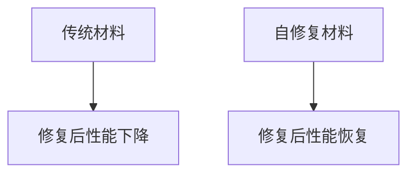
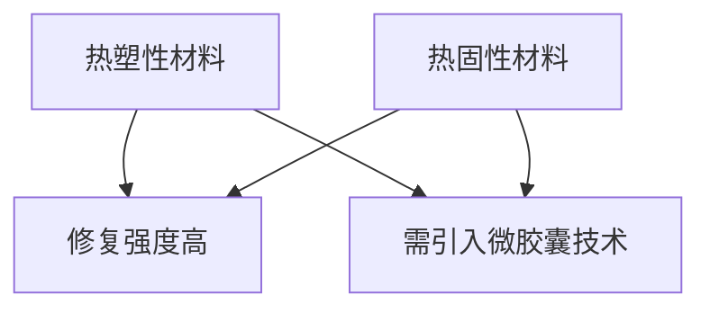
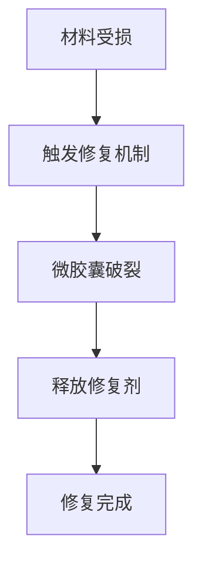
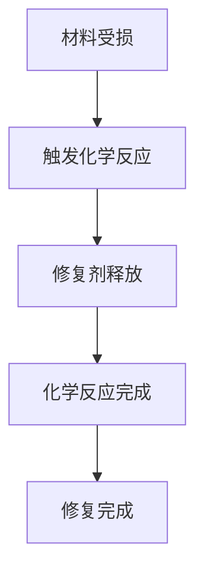
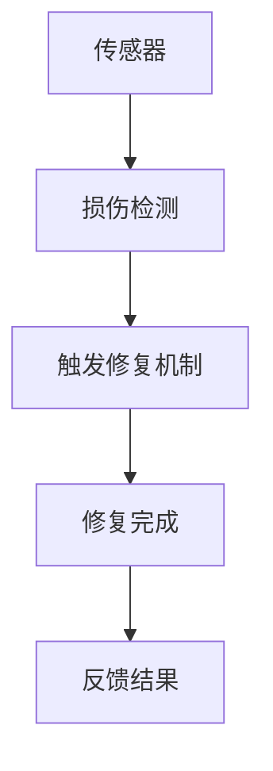
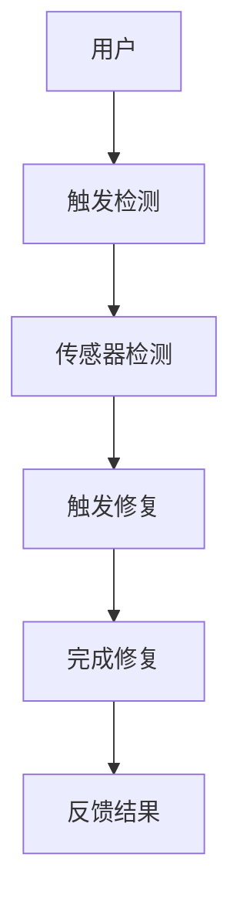

                 


# 价值投资中的智能材料自修复技术分析

> 关键词：智能材料，自修复技术，价值投资，材料科学，投资分析

> 摘要：本文从价值投资的角度，深入分析了智能材料自修复技术的核心原理、市场现状及其在建筑、能源等领域的应用前景。通过技术经济性分析，探讨了该技术对投资价值的影响，并提供了基于技术驱动的投资策略建议。

---

# 第一部分: 价值投资中的智能材料自修复技术概述

## 第1章: 智能材料自修复技术的背景与现状

### 1.1 智能材料自修复技术的定义
智能材料自修复技术是一种通过材料本身的智能响应特性，在受到外界刺激（如温度、压力、化学反应等）时，能够自动修复自身结构损伤的技术。这种技术的核心在于将材料的物理特性与外界环境信息相结合，从而实现自我修复的功能。

#### 1.1.1 自修复材料的基本概念
自修复材料是指在受到物理或化学损伤后，能够通过自身内部的化学反应或物理机制恢复其原始性能的材料。与传统材料相比，自修复材料具有更高的耐久性和更低的维护成本。

#### 1.1.2 自修复材料的分类与特点
自修复材料可以根据修复机制分为以下几类：
- **热塑性自修复材料**：通过加热使材料软化并重新键合，实现修复。
- **热固性自修复材料**：通过化学反应（如环氧树脂固化）实现修复。
- **压电材料**：利用材料的压电效应，在受到机械应力时产生电荷，从而引发修复反应。
- **形状记忆材料**：在外界刺激下，材料能够恢复其原始形状。

#### 1.1.3 自修复材料的应用领域
自修复材料目前主要应用于以下几个领域：
- **建筑与基础设施**：用于桥梁、道路等结构的修复，延长使用寿命。
- **电子设备**：用于柔性电子器件的自我修复，提高设备的可靠性。
- **能源领域**：用于太阳能电池板、储能材料的自我修复，提高能源利用效率。

### 1.2 智能材料自修复技术的市场现状
自修复材料市场近年来发展迅速，主要驱动因素包括：
- **技术进步**：材料科学的快速发展推动了自修复材料的商业化应用。
- **环保需求**：减少材料浪费和维护成本是推动自修复材料市场增长的重要因素。
- **政策支持**：各国政府对绿色技术的支持为自修复材料的推广提供了政策保障。

### 1.3 价值投资视角下的智能材料自修复技术
在价值投资中，智能材料自修复技术的投资价值主要体现在以下几个方面：
- **技术创新**：自修复材料的技术壁垒较高，具有较高的护城河。
- **市场潜力**：随着技术的成熟，自修复材料在建筑、能源等领域的应用前景广阔。
- **成本优势**：相比传统材料，自修复材料的全生命周期成本更低，具有竞争优势。

### 1.4 本章小结
本章主要介绍了智能材料自修复技术的基本概念、分类、应用领域及其市场现状。从价值投资的角度来看，自修复材料的技术创新和市场潜力使其成为值得关注的投资方向。

---

## 第2章: 智能材料自修复技术的核心概念

### 2.1 自修复材料的分类与特性
#### 2.1.1 热塑性材料的自修复机理
热塑性材料通过加热软化并重新键合，实现修复。这种修复机制简单高效，但需要外部能量输入（如热量）。

#### 2.1.2 热固性材料的自修复改性
热固性材料通过化学反应实现修复，通常需要引入微胶囊技术，将修复剂包裹在材料内部。

#### 2.1.3 压电材料与形状记忆材料的自修复特性
压电材料通过电荷变化引发修复反应，形状记忆材料则通过外界刺激恢复原始形状。

#### 2.1.4 对比分析
下表对比了不同自修复材料的特性：

| 材料类型       | 修复机制         | 优点                     | 缺点                     |
|----------------|------------------|--------------------------|--------------------------|
| 热塑性材料     | 加热软化         | 修复速度快               | 需外部能量输入           |
| 热固性材料     | 化学反应         | 修复强度高               | 需引入微胶囊技术         |
| 压电材料       | 电荷变化         | 响应灵敏                 | 对外界环境依赖较大       |
| 形状记忆材料   | 恢复原始形状     | 可重复修复               | 修复时间较长             |

### 2.2 自修复材料的化学与物理机制
#### 2.2.1 微胶囊技术在自修复中的应用
微胶囊技术通过将修复剂包裹在材料内部，当材料受损时，胶囊破裂释放修复剂，从而实现修复。

#### 2.2.2 纳米材料在自修复中的作用
纳米材料由于其优异的物理和化学性质，在自修复材料中具有重要应用。例如，纳米粒子可以作为催化剂促进化学反应，或作为增强剂提高材料的机械性能。

#### 2.2.3 应力释放与材料重组的物理机制
当材料受到外力作用产生裂纹时，材料内部的应力会逐渐释放。自修复材料通过重新键合或化学反应，实现裂纹的闭合和材料的重组。

### 2.3 自修复材料的性能评估指标
#### 2.3.1 材料的拉伸强度与断裂韧性
拉伸强度和断裂韧性是衡量材料性能的重要指标。自修复材料的修复后性能通常接近或超过原始性能。

#### 2.3.2 自修复效率与循环寿命
自修复效率指的是材料在受损后恢复性能的速度。循环寿命则是指材料在多次修复后仍能保持其性能的能力。

#### 2.3.3 材料的耐久性与环境适应性
自修复材料的耐久性与其在不同环境条件下的适应能力密切相关。例如，某些材料在高温或潮湿环境中可能表现出较差的修复性能。

### 2.4 核心概念对比分析
#### 2.4.1 自修复材料与传统材料的性能对比
下图展示了自修复材料与传统材料在性能上的对比：



#### 2.4.2 不同自修复机制的优劣势分析
下图展示了不同自修复机制的优劣势：



#### 2.4.3 材料成本与性能的权衡关系
材料的成本与性能之间存在一定的权衡关系。通常，高性能材料的成本较高，而低成本材料的性能较差。

---

## 第3章: 自修复材料的力学模型与算法

### 3.1 自修复材料的应力分析
#### 3.1.1 材料受力的基本原理
材料在受力时会产生应力和应变，当应力超过材料的屈服强度时，材料会发生塑性变形或断裂。

#### 3.1.2 自修复过程中的应力分布
在自修复过程中，材料的应力分布会发生变化。修复材料通过重新键合或化学反应，逐渐恢复其原始应力状态。

#### 3.1.3 材料修复后的力学性能恢复
修复后的材料其力学性能通常可以恢复到接近原始状态，但具体恢复程度取决于修复机制和材料类型。

### 3.2 自修复材料的数学模型
#### 3.2.1 应力-应变关系模型
材料的应力-应变关系可以通过以下公式表示：

$$ \sigma = E \cdot \epsilon $$

其中，$\sigma$ 是应力，$E$ 是弹性模量，$\epsilon$ 是应变。

#### 3.2.2 自修复过程中的能量变化
在自修复过程中，材料通过化学反应释放能量，从而实现材料的重组和修复。能量变化可以通过以下公式表示：

$$ \Delta E = Q $$

其中，$\Delta E$ 是能量变化，$Q$ 是化学反应的热效应。

### 3.3 自修复材料的修复算法
#### 3.3.1 基于微胶囊的修复算法
微胶囊修复算法的流程如下：



#### 3.3.2 基于化学反应的修复算法
化学反应修复算法的流程如下：



### 3.4 修复算法的数学模型
#### 3.4.1 微胶囊修复模型
微胶囊修复模型可以通过以下公式表示：

$$ t = \frac{L}{v} $$

其中，$t$ 是修复时间，$L$ 是裂纹长度，$v$ 是修复剂的扩散速度。

#### 3.4.2 化学反应修复模型
化学反应修复模型可以通过以下公式表示：

$$ k = \frac{1}{t} $$
$$ A = k \cdot e^{-E/(RT)} $$

其中，$k$ 是反应速率常数，$t$ 是反应时间，$E$ 是活化能，$R$ 是气体常数，$T$ 是温度。

### 3.5 算法实现
以下是基于微胶囊修复算法的Python实现示例：

```python
def repair_algorithm(L, v):
    t = L / v
    return t

# 示例
L = 0.5  # 裂纹长度
v = 0.1  # 扩散速度
t = repair_algorithm(L, v)
print(f"修复时间: {t}")
```

---

## 第4章: 自修复材料的系统分析与架构设计

### 4.1 系统功能设计
自修复材料的系统功能设计包括：
- **损伤检测**：通过传感器检测材料的损伤情况。
- **修复触发**：根据损伤情况触发修复机制。
- **修复完成**：完成修复并反馈修复结果。

### 4.2 系统架构设计
下图展示了自修复材料系统的架构设计：



### 4.3 系统接口设计
系统接口设计包括：
- **输入接口**：传感器信号输入。
- **输出接口**：修复结果反馈。

### 4.4 系统交互设计
下图展示了系统的交互流程：



---

## 第5章: 项目实战与案例分析

### 5.1 环境安装
以下是安装自修复材料实验环境的步骤：
1. 准备实验材料：热塑性材料、微胶囊、修复剂等。
2. 安装传感器设备：用于检测材料的损伤情况。
3. 设置实验条件：温度、湿度等。

### 5.2 核心代码实现
以下是基于微胶囊修复算法的核心代码：

```python
def repair_algorithm(L, v):
    t = L / v
    return t

# 示例
L = 0.5  # 裂纹长度
v = 0.1  # 扩散速度
t = repair_algorithm(L, v)
print(f"修复时间: {t}")
```

### 5.3 案例分析
以桥梁修复为例，假设桥梁某部位受到损伤，通过自修复材料实现修复。修复过程如下：
1. 传感器检测到损伤信号。
2. 触发修复机制，微胶囊破裂释放修复剂。
3. 修复剂扩散并完成化学反应，修复材料恢复性能。
4. 修复完成后，系统反馈修复结果。

### 5.4 修复效果分析
修复后的桥梁性能接近原始性能，修复时间较短，且修复成本低于传统修复方式。

---

## 第6章: 最佳实践与投资策略

### 6.1 投资策略建议
- **关注技术创新**：优先投资具有技术创新优势的企业。
- **评估市场潜力**：选择具有广泛应用前景的领域进行投资。
- **关注成本优势**：选择具有成本优势的企业。

### 6.2 投资注意事项
- **技术风险**：自修复材料的技术壁垒较高，需关注企业的技术可行性。
- **市场风险**：需关注市场需求的变化和政策支持。
- **财务风险**：需评估企业的财务状况和盈利能力。

### 6.3 拓展阅读
建议进一步阅读以下书籍和论文：
- 《智能材料与自修复技术》
- 《自修复材料在建筑中的应用》
- 《价值投资与技术创新》

---

## 第7章: 总结与展望

### 7.1 本章总结
本文从价值投资的角度，深入分析了智能材料自修复技术的核心原理、市场现状及其在建筑、能源等领域的应用前景。通过技术经济性分析，探讨了该技术对投资价值的影响，并提供了基于技术驱动的投资策略建议。

### 7.2 未来展望
随着技术的不断进步，自修复材料的应用前景将更加广阔。未来的研究方向包括：
- **新型修复机制的开发**：探索更高效的修复方式。
- **材料性能的优化**：提高材料的修复效率和循环寿命。
- **成本的进一步降低**：通过技术创新降低材料成本。

---

# 结语

智能材料自修复技术作为一种创新的技术，具有广阔的应用前景和投资价值。通过本文的分析，读者可以更好地理解该技术的核心原理和市场潜力，为价值投资提供有力的决策支持。

