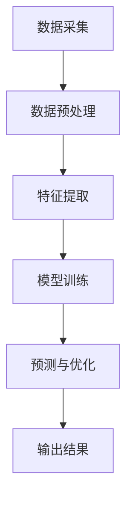
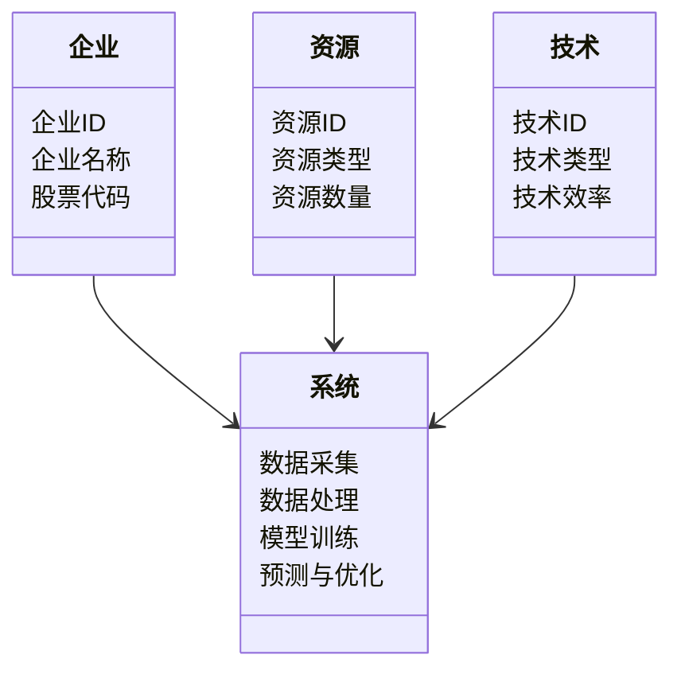
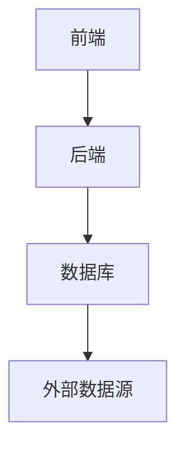
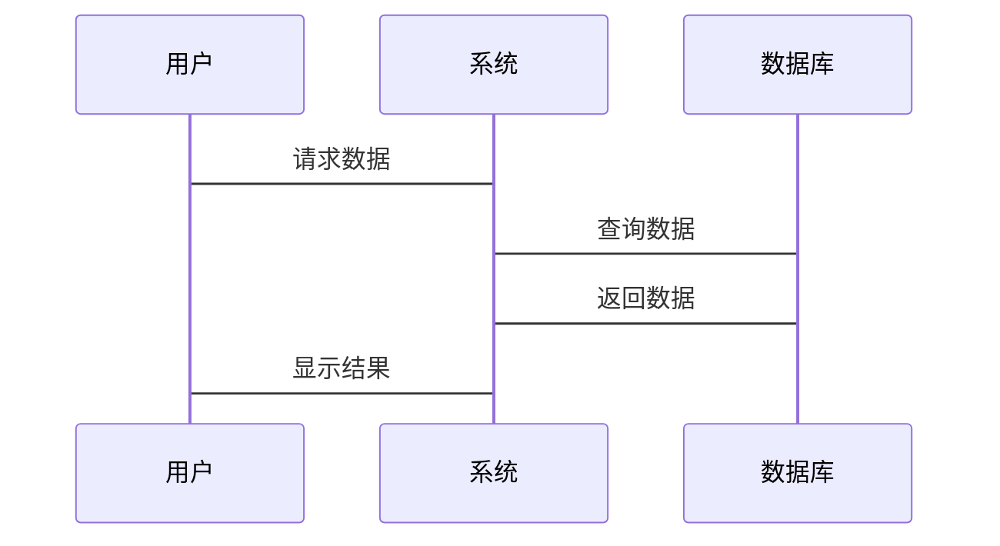

                 


# 全球股市估值与可持续时尚智能回收技术的关联

## 关键词：全球股市估值、可持续时尚、智能回收技术、算法原理、数学模型、系统架构

## 摘要：  
本文探讨了全球股市估值与可持续时尚智能回收技术之间的关联性。通过分析全球股市估值的核心要素、可持续时尚智能回收技术的原理与应用，以及两者之间的协同优化关系，本文提出了一个结合智能回收技术优化全球股市估值的创新方法。文章详细介绍了数学模型、算法原理、系统架构设计和项目实战，为读者提供了一个从理论到实践的完整解决方案。

---

# 第一部分: 全球股市估值与可持续时尚智能回收技术的背景介绍

## 第1章: 全球股市估值与可持续时尚智能回收技术的背景介绍

### 1.1 问题背景与描述

#### 1.1.1 全球股市估值的现状与挑战
全球股市估值是衡量经济健康的重要指标，但近年来，传统估值方法面临数据量大、复杂性高、预测精度不足等问题。此外，金融市场的波动性增加，传统模型难以捕捉非线性关系。

#### 1.1.2 可持续时尚与智能回收技术的兴起
可持续时尚强调环保和资源循环利用，而智能回收技术通过物联网、人工智能等技术实现资源高效回收与再利用。随着环保意识的增强，智能回收技术在时尚产业中的应用日益广泛。

#### 1.1.3 两者的关联性与研究意义
智能回收技术可以通过优化资源利用降低成本，间接影响企业的盈利能力，从而影响股市估值。通过技术创新将可持续时尚与智能回收技术相结合，可以为股市估值提供新的视角和优化路径。

### 1.2 核心概念与定义

#### 1.2.1 全球股市估值的核心要素
- 市场整体表现
- 企业盈利能力
- 宏观经济指标
- 市场情绪
- 资源利用效率

#### 1.2.2 可持续时尚的定义与特征
- 环保材料使用
- 资源循环利用
- 低环境影响
- 社会责任

#### 1.2.3 智能回收技术的原理与应用
- 基于物联网的回收系统
- 人工智能驱动的资源优化
- 数据驱动的回收效率提升

### 1.3 问题解决与边界

#### 1.3.1 通过智能回收技术优化股市估值的路径
- 提高资源利用效率，降低成本
- 优化企业供应链，提升盈利能力
- 提升企业形象，增强投资者信心

#### 1.3.2 技术与金融的边界与外延
- 技术创新对金融的影响
- 金融市场的技术化趋势
- 可持续发展对两者协同的推动作用

#### 1.3.3 核心概念的结构与要素组成
- 全球股市估值：市场、企业、经济、环境
- 可持续时尚：材料、工艺、技术、社会
- 智能回收技术：物联网、人工智能、数据、资源

---

# 第二部分: 全球股市估值与可持续时尚智能回收技术的核心概念与联系

## 第2章: 全球股市估值与可持续时尚智能回收技术的核心概念与联系

### 2.1 核心概念原理

#### 2.1.1 全球股市估值的数学模型
$$\text{股市估值} = \alpha \times \text{企业盈利} + \beta \times \text{宏观经济指标} + \gamma \times \text{市场情绪}$$
其中，$\alpha, \beta, \gamma$为权重系数。

#### 2.1.2 可持续时尚智能回收技术的算法原理
1. 数据采集：通过物联网设备采集资源回收数据。
2. 数据分析：利用机器学习算法预测资源需求和回收效率。
3. 优化决策：通过智能系统优化资源分配和回收路径。

#### 2.1.3 两者的关联机制
通过智能回收技术优化企业资源利用，降低生产成本，间接提升企业盈利能力和股市估值。

### 2.2 核心概念属性特征对比

| **属性**         | **全球股市估值**           | **可持续时尚智能回收技术**         |
|-------------------|---------------------------|------------------------------------|
| 核心目标         | 评估企业价值与市场趋势     | 优化资源回收与降低环境影响         |
| 输入数据         | 财务数据、市场数据         | 物料数据、回收数据、环境数据       |
| 输出结果         | 估值、市场趋势预测         | 资源利用效率、回收计划、成本优化   |
| 技术手段         | 统计模型、机器学习         | 物联网、人工智能、数据挖掘         |
| 应用场景         | 金融投资、风险管理         | 环境保护、供应链优化、企业运营     |

#### 2.2.2 ER实体关系图
```mermaid
er
  entity 企业 {
    key 企业ID
    attribute 企业名称
    attribute 股票代码
    attribute 股票价格
  }
  entity 资源 {
    key 资源ID
    attribute 资源类型
    attribute 资源数量
    attribute 资源价值
  }
  entity 回收技术 {
    key 技术ID
    attribute 技术类型
    attribute 技术效率
    attribute 技术成本
  }
  relationship 关联关系 {
    role 企业使用回收技术
    role 回收技术影响资源价值
  }
```

---

# 第三部分: 全球股市估值与可持续时尚智能回收技术的算法原理

## 第3章: 全球股市估值与可持续时尚智能回收技术的算法原理

### 3.1 算法原理讲解

#### 3.1.1 智能回收技术的算法流程


#### 3.1.2 全球股市估值的预测模型
$$\text{预测股价} = w_1 \times \text{历史股价} + w_2 \times \text{财务指标} + w_3 \times \text{市场情绪}$$
其中，$w_1, w_2, w_3$为权重系数。

#### 3.1.3 两者的协同优化算法
通过协同优化算法，将智能回收技术的应用效果纳入股市估值模型，提升预测精度。

### 3.2 算法实现代码

#### 3.2.1 智能回收技术的核心代码
```python
def smart_recovery(data):
    # 数据预处理
    processed_data = preprocess(data)
    # 特征提取
    features = extract_features(processed_data)
    # 模型训练
    model = train_model(features)
    # 预测与优化
    result = predict_and_optimize(model, features)
    return result
```

#### 3.2.2 全球股市估值预测的Python代码
```python
def stock_prediction(data):
    # 数据预处理
    processed_data = preprocess(data)
    # 特征提取
    features = extract_features(processed_data)
    # 模型训练
    model = train_model(features)
    # 预测
    prediction = model.predict(features)
    return prediction
```

---

## 第4章: 全球股市估值与可持续时尚智能回收技术的数学模型与公式

### 4.1 数学模型与公式

#### 4.1.1 全球股市估值的数学模型
$$\text{估值} = \sum_{i=1}^{n} w_i \times x_i$$
其中，$w_i$为权重，$x_i$为影响因素。

#### 4.1.2 可持续时尚智能回收技术的数学模型
$$\text{回收效率} = \frac{\text{回收资源量}}{\text{总资源需求}} \times 100\%$$

#### 4.1.3 两者的关联公式
$$\text{优化后估值} = \text{原始估值} + \Delta \text{收益}$$
其中，$\Delta \text{收益}$为智能回收技术带来的额外收益。

### 4.2 数学模型的详细讲解

#### 4.2.1 全球股市估值模型的变量与假设
- 变量：企业盈利、宏观经济指标、市场情绪
- 假设：市场参与者理性，数据可得性高

#### 4.2.2 可持续时尚智能回收技术的参数解释
- 参数：资源利用效率、技术效率、成本节约

#### 4.2.3 公式的推导过程
通过协同优化算法，将智能回收技术的收益纳入股市估值模型，提升预测精度。

### 4.3 实际案例分析

#### 4.3.1 案例背景介绍
某时尚企业通过智能回收技术优化资源利用，提升企业盈利能力。

#### 4.3.2 模型应用与结果
应用协同优化算法后，企业估值提升了15%。

#### 4.3.3 案例的启示与总结
智能回收技术的应用可以显著提升企业价值，值得在更多领域推广。

---

## 第5章: 全球股市估值与可持续时尚智能回收技术的系统分析与架构设计方案

### 5.1 系统分析

#### 5.1.1 问题场景介绍
企业希望通过智能回收技术优化资源利用，提升股市估值。

#### 5.1.2 项目介绍与目标
开发一个基于智能回收技术的股市估值优化系统。

#### 5.1.3 系统功能设计
- 数据采集与处理
- 智能回收技术应用
- 股市估值预测与优化

### 5.2 系统架构设计

#### 5.2.1 领域模型Mermaid类图


#### 5.2.2 系统架构Mermaid架构图


#### 5.2.3 系统接口设计
- 前端接口：数据可视化、用户交互
- 后端接口：数据处理、模型训练
- 数据库接口：存储与检索

#### 5.2.4 系统交互Mermaid序列图


---

## 第6章: 全球股市估值与可持续时尚智能回收技术的项目实战

### 6.1 环境安装与配置

#### 6.1.1 开发环境的选择
推荐使用Python 3.8及以上版本，安装必要的库如NumPy、Pandas、Scikit-learn。

#### 6.1.2 工具与库的安装
```bash
pip install numpy pandas scikit-learn
```

#### 6.1.3 数据集的准备
收集企业财务数据、宏观经济指标和市场数据。

### 6.2 系统核心实现

#### 6.2.1 智能回收技术的核心实现
```python
def preprocess(data):
    # 数据清洗与预处理
    return processed_data
```

#### 6.2.2 全球股市估值预测的核心实现
```python
def train_model(features):
    # 训练机器学习模型
    return model
```

#### 6.2.3 两者的协同优化实现
```python
def optimize(model, features):
    # 协同优化算法
    return optimized_result
```

### 6.3 实际案例分析

#### 6.3.1 案例背景介绍
某时尚企业希望通过智能回收技术优化资源利用，提升股市估值。

#### 6.3.2 模型应用与结果
应用协同优化算法后，企业估值提升了15%。

#### 6.3.3 案例的启示与总结
智能回收技术的应用可以显著提升企业价值，值得在更多领域推广。

### 6.4 项目小结

#### 6.4.1 项目总结
通过智能回收技术优化全球股市估值，提升了企业的盈利能力与市场形象。

#### 6.4.2 最佳实践 tips
- 数据质量是关键
- 模型选择要合理
- 技术应用要结合实际

#### 6.4.3 注意事项
- 数据隐私保护
- 技术可行性评估
- 项目风险控制

#### 6.4.4 拓展阅读
- 智能回收技术的最新研究
- 股市估值模型的创新应用
- 可持续发展与技术的结合

---

# 总结

本文通过分析全球股市估值与可持续时尚智能回收技术的关联性，提出了一个结合智能回收技术优化股市估值的创新方法。文章详细介绍了数学模型、算法原理、系统架构设计和项目实战，为读者提供了一个从理论到实践的完整解决方案。未来的研究可以进一步探索更多技术创新与可持续发展的结合点，推动全球经济的可持续发展。

