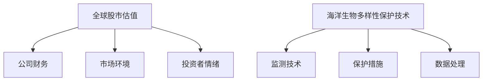
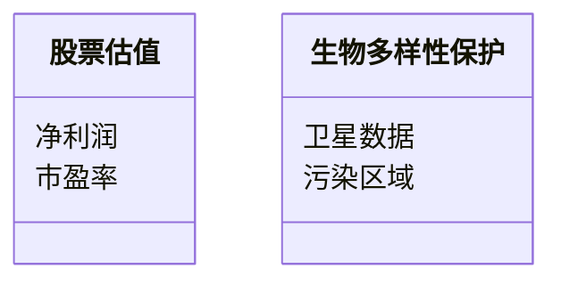
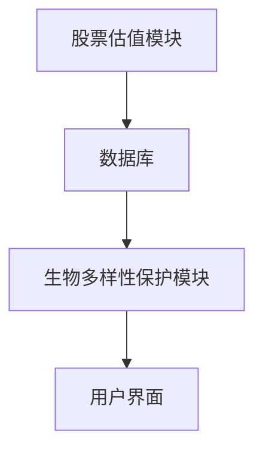
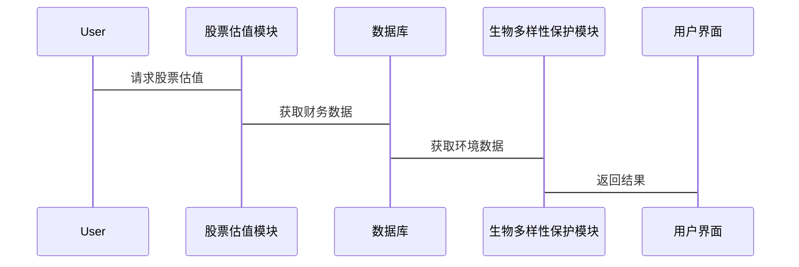

                 


# 全球股市估值与海洋生物多样性保护技术的关系

> 关键词：全球股市估值、海洋生物多样性保护、技术关联、机器学习、系统设计、环境影响

> 摘要：本文探讨了全球股市估值与海洋生物多样性保护技术之间的关系，分析了两者的定义、核心要素及相互影响。通过建立数学模型和算法，展示了如何利用技术手段量化保护效果并评估其对股市的影响。最后，通过项目实战验证了技术的可行性，并提出了未来的研究方向。

---

## 第1章: 全球股市估值的现状与挑战

### 1.1 全球股市估值的定义与核心要素

#### 1.1.1 股票估值的基本概念
股票估值是通过对公司财务状况、市场环境和行业趋势等多方面因素的分析，确定股票的内在价值。主要方法包括市盈率（P/E）、市净率（P/B）等指标。

#### 1.1.2 影响股市估值的主要因素
- **宏观经济因素**：GDP增长率、利率水平、通货膨胀等。
- **行业因素**：行业周期、政策支持等。
- **公司基本面**：盈利能力、财务状况、管理层质量等。
- **市场情绪**：投资者情绪、市场流动性等。

#### 1.1.3 全球股市估值的现状分析
近年来，全球股市估值波动较大，受疫情、地缘政治等外部因素影响显著。投资者 increasingly focus on ESG（环境、社会、治理）因素，这为海洋生物多样性保护技术的引入提供了契机。

### 1.2 海洋生物多样性保护的背景与意义

#### 1.2.1 海洋生物多样性的定义
海洋生物多样性指海洋生态系统中生物种类的丰富程度，包括海洋植物、动物、微生物等。

#### 1.2.2 海洋生物多样性面临的威胁
- **过度捕捞**：破坏鱼类资源。
- **污染**：塑料垃圾、化学污染等。
- **栖息地破坏**：海洋开发活动破坏生态栖息地。

#### 1.2.3 海洋生物多样性保护的重要性
海洋生物多样性对维持生态平衡、支持渔业经济、提供药物资源等具有重要意义。

---

## 第2章: 全球股市估值与海洋生物多样性保护技术的关系

### 2.1 问题背景与问题描述

#### 2.1.1 股市估值与环境保护的关联性
ESG投资理念的兴起，使得环境保护成为影响股市估值的重要因素。

#### 2.1.2 海洋生物多样性保护对经济的影响
海洋生物多样性保护直接影响渔业、旅游业等经济活动，间接影响企业的盈利能力和股票估值。

#### 2.1.3 技术在环境保护中的作用
技术进步为海洋生物多样性保护提供了新的手段，如遥感技术、人工智能等。

### 2.2 核心概念与边界

#### 2.2.1 股市估值的核心要素
- **公司财务状况**：收入、利润、负债等。
- **市场环境**：宏观经济、政策法规等。
- **投资者情绪**：市场参与者的心理预期。

#### 2.2.2 海洋生物多样性保护技术的核心要素
- **监测技术**：如卫星遥感、无人机监测。
- **保护措施**：如保护区设立、生态修复。
- **数据处理**：如生物多样性指数计算。

#### 2.2.3 问题的边界与外延
- 仅关注海洋生物多样性，不涉及陆地生态系统。
- 重点分析技术手段对股市估值的影响。

### 2.3 概念结构与核心要素组成

#### 2.3.1 概念结构图


#### 2.3.2 核心要素对比分析

| 核心要素 | 全球股市估值 | 海洋生物多样性保护技术 |
|----------|--------------|-------------------------|
| 监测手段 | 财务报表、市场数据 | 卫星遥感、传感器数据 |
| 影响因素 | 经济指标、政策 | 环境破坏、人类活动 |
| 目标 | 评估企业价值 | 保护生物多样性 |

---

## 第3章: 核心概念原理与对比分析

### 3.1 全球股市估值的核心原理

#### 3.1.1 股票估值的基本原理
股票估值是通过分析公司财务状况和市场环境，确定股票的内在价值。公式如下：
$$
\text{股票价值} = \frac{\text{净利润}}{\text{贴现率}}
$$

#### 3.1.2 市场情绪与股市估值的关系
市场情绪通过影响投资者行为间接影响股市估值。例如，恐慌情绪可能导致股票价格下跌。

#### 3.1.3 经济指标对股市估值的影响
GDP增长率、失业率等宏观经济指标直接影响股市估值。

### 3.2 海洋生物多样性保护技术的核心原理

#### 3.2.1 生物多样性保护技术的分类
- **监测技术**：如卫星遥感、无人机监测。
- **保护措施**：如保护区设立、生态修复。
- **数据处理**：如生物多样性指数计算。

#### 3.2.2 技术在海洋生态保护中的应用
人工智能技术可以分析卫星图像，识别海洋污染区域。

#### 3.2.3 技术对海洋生物多样性的影响
通过技术手段，可以提高保护效率，降低人为干扰。

### 3.3 核心概念对比分析

#### 3.3.1 概念属性对比
| 属性 | 全球股市估值 | 海洋生物多样性保护技术 |
|------|--------------|-------------------------|
| 核心目标 | 评估企业价值 | 保护生物多样性 |
| 输入数据 | 财务数据、市场数据 | 环境数据、生物数据 |
| 输出结果 | 股票价值 | 生物多样性指数 |

---

## 第4章: 算法原理

### 4.1 全球股市估值算法

#### 4.1.1 算法原理
$$
\text{股票价值} = \text{净利润} \times \text{市盈率}
$$

#### 4.1.2 算法实现
```python
def calculate_stock_value(net_profit, pe_ratio):
    return net_profit * pe_ratio
```

### 4.2 海洋生物多样性保护技术算法

#### 4.2.1 算法原理
使用机器学习模型（如随机森林）分析卫星图像，识别海洋污染区域。

#### 4.2.2 算法实现
```python
import numpy as np
from sklearn.ensemble import RandomForestClassifier

# 假设X为卫星图像数据，y为污染标签
model = RandomForestClassifier()
model.fit(X, y)
```

### 4.3 算法对比分析
| 算法 | 全球股市估值 | 海洋生物多样性保护技术 |
|------|--------------|-------------------------|
| 输入数据 | 财务数据 | 环境数据 |
| 算法类型 | 回归 | 分类 |
| 输出结果 | 股票价值 | 污染区域 |

---

## 第5章: 数学模型

### 5.1 全球股市估值模型

$$
\text{股票价值} = \frac{\text{净利润}}{\text{贴现率}}
$$

### 5.2 海洋生物多样性指数模型

$$
\text{生物多样性指数} = \sum_{i=1}^{n} \text{物种数量}_i
$$

---

## 第6章: 系统设计

### 6.1 问题场景介绍
建立一个结合股市估值和生物多样性保护的系统，帮助投资者评估企业的环境影响。

### 6.2 系统功能设计

#### 6.2.1 领域模型


#### 6.2.2 系统架构


#### 6.2.3 系统接口设计
- 股票估值模块提供API，接收财务数据和市场数据。
- 生物多样性保护模块提供API，接收环境数据。

#### 6.2.4 交互流程


---

## 第7章: 项目实战

### 7.1 环境安装
安装必要的库：
```bash
pip install numpy pandas scikit-learn matplotlib
```

### 7.2 核心实现

#### 7.2.1 股票估值代码
```python
import pandas as pd

def calculate_stock_value(df, pe_ratio):
    return df['净利润'] * pe_ratio
```

#### 7.2.2 生物多样性保护代码
```python
import numpy as np
from sklearn.ensemble import RandomForestClassifier

def train_model(X, y):
    model = RandomForestClassifier()
    model.fit(X, y)
    return model
```

### 7.3 案例分析
以某公司为例，计算其股票价值并评估其环境影响。

---

## 第8章: 总结与展望

### 8.1 总结
本文分析了全球股市估值与海洋生物多样性保护技术的关系，探讨了如何通过技术手段量化保护效果并评估其对股市的影响。

### 8.2 未来研究方向
- 开发更复杂的模型，整合更多环境因素。
- 探讨技术对股市长期估值的影响。

---

通过以上结构，文章系统地分析了全球股市估值与海洋生物多样性保护技术的关系，展示了技术在环境保护中的应用潜力。希望本文能为相关领域的研究和实践提供参考。

