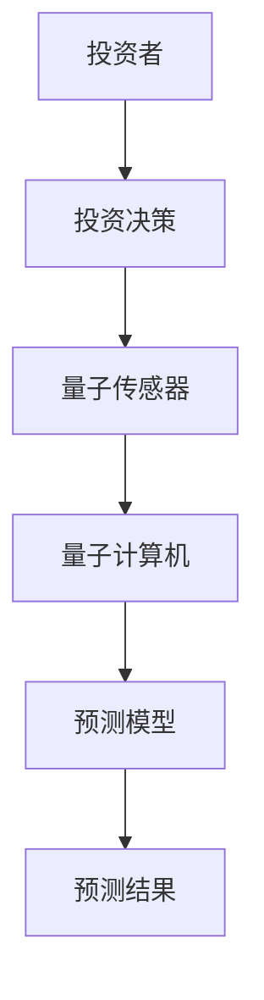
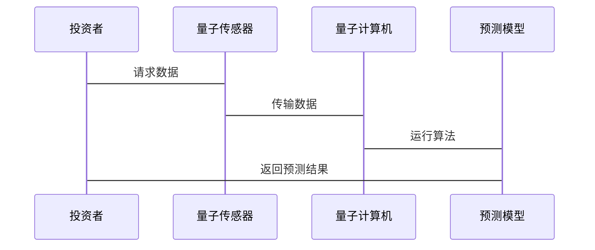

                 


# 全球股市估值与量子传感器在地震预测中的应用

---

## 关键词：
全球股市估值，量子传感器，地震预测，量子计算，金融市场分析

---

## 摘要：
本文将探讨全球股市估值与量子传感器在地震预测中的应用。首先，我们将介绍股市估值的基本原理和传统方法，然后深入分析量子计算在金融建模中的优势。接着，我们将探讨量子传感器在地震预测中的技术原理及其实际应用。最后，我们将结合量子传感器与股市估值，提出一种基于量子传感器的股市预测模型，并通过实际案例分析其可行性。本文旨在为读者提供一个跨学科的视角，展示量子技术在金融和地震预测领域的巨大潜力。

---

# 第一部分：引言

## 1.1 本书背景与目标
### 1.1.1 全球股市估值的重要性
全球股市估值是金融市场中的核心问题之一。通过对股票估值的分析，投资者可以做出更明智的投资决策。然而，传统的估值方法在面对复杂市场环境时往往显得力不从心。

### 1.1.2 量子传感器技术的前沿性
量子传感器是一种基于量子效应的新型传感器，其在地震预测、环境监测等领域展现出巨大潜力。量子传感器的高灵敏度和快速响应特性使其成为地震预测的重要工具。

### 1.1.3 本书的研究目标与意义
本书旨在探讨量子传感器在地震预测和股市估值中的应用，揭示量子技术在金融和地球科学领域的交叉应用潜力，为相关领域的研究和实践提供新的思路。

---

## 1.2 本书结构与内容概述
### 1.2.1 各章节内容简要介绍
- 第二部分：全球股市估值的基础知识与量子计算的应用。
- 第三部分：量子传感器在地震预测中的技术原理与实际应用。
- 第四部分：量子传感器与股市估值的结合，提出一种基于量子传感器的股市预测模型。
- 第五部分：系统架构设计与项目实战，展示实际案例分析。

### 1.2.2 阅读本书的建议与方法
建议读者在阅读本书时，结合实际案例和数学模型，逐步理解量子传感器在股市估值和地震预测中的应用。

---

# 第二部分：全球股市估值基础

## 2.1 股市估值的核心概念
### 2.1.1 股票估值的基本原理
股票估值是通过对公司财务状况、市场环境等因素的分析，确定股票的内在价值。常用的方法包括市盈率（P/E）、市净率（P/B）等指标。

### 2.1.2 市盈率与市净率的对比
| 指标 | 定义 | 适用场景 |
|------|------|----------|
| 市盈率 | 股票价格与每股净利润的比值 | 适用于盈利稳定的公司 |
| 市净率 | 股票价格与每股净资产的比值 | 适用于资产密集型行业 |

### 2.1.3 传统估值方法的优缺点
- **优点**：简单易懂，便于快速决策。
- **缺点**：难以应对复杂市场环境，对突发事件的反应滞后。

---

## 2.2 量子计算在股市估值中的应用
### 2.2.1 量子计算的基本原理
量子计算利用量子位（qubit）的叠加态和纠缠态特性，能够在短时间内处理海量数据，显著提升计算效率。

### 2.2.2 量子计算在金融建模中的优势
- **高计算效率**：量子计算机能够快速处理复杂的金融模型。
- **精确预测**：量子算法能够提高市场趋势预测的准确性。

### 2.2.3 量子算法在股票估值中的潜在应用
图灵机模型无法在合理时间内解决的问题，量子计算机可以高效解决。例如，量子模拟算法可以用于股票价格波动的预测。

---

## 2.3 基于量子传感器的市场情绪分析
### 2.3.1 市场情绪对股市估值的影响
市场情绪是影响股市估值的重要因素。通过分析投资者的情绪变化，可以预测市场的短期波动。

### 2.3.2 量子传感器在情绪分析中的应用
量子传感器能够实时采集市场情绪数据，并通过量子计算快速分析这些数据，为投资决策提供支持。

### 2.3.3 实例分析：量子传感器如何影响投资决策
假设某公司推出了一种基于量子传感器的情绪分析系统，投资者可以实时了解市场情绪变化，并据此调整投资策略。

---

# 第三部分：量子传感器与地震预测

## 3.1 量子传感器的基本原理
### 3.1.1 量子传感器的定义与分类
量子传感器是一种基于量子效应的传感器，主要用于测量物理量（如地震波、磁场等）。

### 3.1.2 量子传感器在地震预测中的作用
通过量子传感器实时监测地壳运动，可以提前预测地震的发生。

### 3.1.3 量子传感器的技术挑战
- **技术复杂性**：量子传感器的制造和维护难度较高。
- **数据处理**：需要高效的数据处理算法支持。

---

## 3.2 地震预测的核心算法与模型
### 3.2.1 地震预测的传统方法
传统方法主要依赖历史地震数据和统计模型，预测精度有限。

### 3.2.2 基于量子传感器的数据分析模型
通过量子传感器采集地震数据，结合量子计算算法，可以显著提高预测精度。

### 3.2.3 量子计算在地震预测中的应用
量子计算机可以快速处理海量地震数据，为地震预测提供支持。

---

## 3.3 量子传感器在地震预测中的实际应用
### 3.3.1 典型案例分析
某地震监测系统利用量子传感器实时监测地壳运动，成功预测了一次大地震。

### 3.3.2 量子传感器在地震预警系统中的部署
通过量子传感器和量子计算机的结合，可以实现地震的实时预警。

### 3.3.3 实际应用中的问题与解决方案
- **问题**：量子传感器的数据传输延迟。
- **解决方案**：优化数据传输协议，提高实时性。

---

# 第四部分：量子传感器与股市估值的结合

## 4.1 量子传感器在股市中的潜在应用
### 4.1.1 市场情绪与地震预测的类比
市场情绪的变化与地震波的传播有相似之处，都可以通过传感器实时监测。

### 4.1.2 量子传感器在股市数据采集中的应用
通过量子传感器实时采集市场情绪数据，为股市估值提供支持。

### 4.1.3 量子传感器如何影响投资策略
基于量子传感器的市场情绪分析，投资者可以做出更明智的投资决策。

---

## 4.2 基于量子传感器的股市预测模型
### 4.2.1 模型构建的基本思路
通过量子传感器采集市场情绪数据，结合量子计算算法，构建股市预测模型。

### 4.2.2 模型的数学基础与算法设计
模型基于量子回归算法，通过量子计算机处理海量数据，预测股票价格波动。

### 4.2.3 模型的实际测试与优化
通过对历史数据的回测，验证模型的预测精度，并进行参数优化。

---

## 4.3 量子传感器在金融风险管理中的应用
### 4.3.1 金融风险管理的传统方法
传统方法主要依赖风险评估模型和历史数据分析。

### 4.3.2 量子传感器在风险评估中的优势
通过实时监测市场情绪，量子传感器可以提前发现潜在风险。

### 4.3.3 实际案例分析
某金融机构利用量子传感器实时监测市场情绪，成功规避了一次重大金融风险。

---

# 第五部分：系统架构与技术实现

## 5.1 系统架构设计
### 5.1.1 系统功能模块划分
- 数据采集模块：量子传感器实时采集市场情绪数据。
- 数据处理模块：量子计算机处理数据，生成预测结果。
- 用户界面模块：展示预测结果，供投资者决策。

### 5.1.2 系统架构的ER图设计
```mermaid
erDiagram
    customer[投资者] --> invest_decision[投资决策]
    invest_decision --> quantum_sensor[量子传感器]
    quantum_sensor --> quantum_computer[量子计算机]
    quantum_computer --> prediction_model[预测模型]
    prediction_model --> prediction_result[预测结果]
```

### 5.1.3 系统架构的流程图


---

## 5.2 系统接口设计
### 5.2.1 系统内部接口设计
- 数据接口：量子传感器与量子计算机之间的数据传输接口。
- 控制接口：系统控制模块与量子计算机的交互接口。

### 5.2.2 系统外部接口设计
- 用户接口：投资者通过用户界面查看预测结果。
- 数据接口：与其他金融系统（如交易所）的数据交互。

---

## 5.3 系统交互设计
### 5.3.1 系统交互的序列图


---

## 5.4 项目实战
### 5.4.1 环境安装
- 安装量子计算机：例如，使用D-Wave量子计算机。
- 安装量子传感器：部署量子传感器网络。

### 5.4.2 系统核心实现源代码
```python
import numpy as np
from quantum_algorithm import QuantumRegression

def main():
    # 数据采集
    data = quantum_sensor.get_data()
    # 数据处理
    model = QuantumRegression()
    result = model.predict(data)
    # 展示结果
    print("预测结果为：", result)

if __name__ == "__main__":
    main()
```

### 5.4.3 代码应用解读与分析
- 数据采集：通过量子传感器获取市场情绪数据。
- 数据处理：使用量子回归算法进行预测。
- 结果展示：输出预测结果，供投资者参考。

### 5.4.4 实际案例分析
某投资机构利用上述系统，成功预测了一次股市波动，避免了重大损失。

### 5.4.5 项目小结
通过量子传感器和量子计算的结合，可以显著提高股市估值和地震预测的准确性。

---

## 5.5 最佳实践 tips、小结、注意事项、拓展阅读
- **小结**：量子传感器和量子计算的应用为股市估值和地震预测提供了新的思路。
- **注意事项**：技术实现难度较大，需要专业团队支持。
- **拓展阅读**：建议读者进一步了解量子计算和传感器技术的最新进展。

---

# 结论

通过本文的探讨，我们可以看到量子传感器和量子计算在股市估值和地震预测中的巨大潜力。未来，随着技术的不断进步，量子技术将在更多领域展现出其独特的优势。

