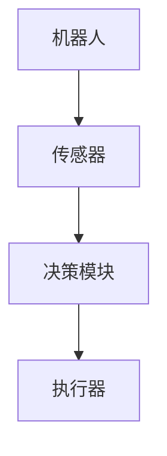
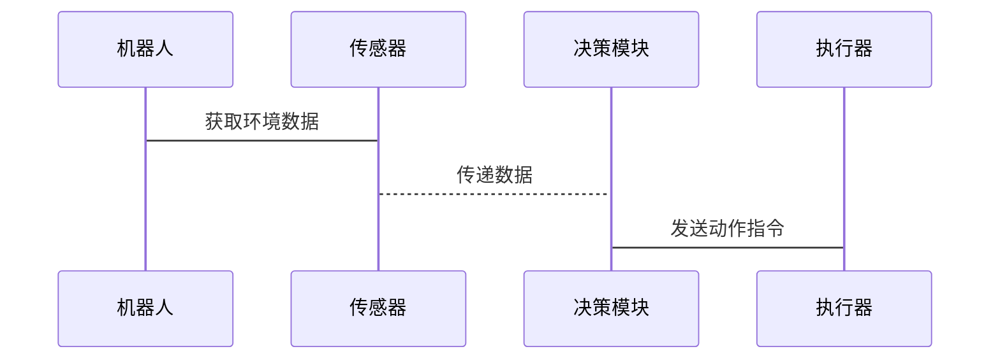

                 


# 如何识别企业的深度强化学习机器人控制优势

## 关键词：深度强化学习，机器人控制，企业优势，技术实现，系统架构

## 摘要：本文将深入探讨如何通过深度强化学习技术提升企业机器人控制的智能化水平，识别企业在机器人控制领域的竞争优势。通过分析深度强化学习的核心算法、系统架构设计以及实际项目案例，为企业提供科学的技术实现路径和优化建议。

---

# 第一部分：深度强化学习与机器人控制基础

## 第1章：深度强化学习机器人控制的背景与概念

### 1.1 深度强化学习的基本概念

#### 1.1.1 强化学习的定义与特点
强化学习是一种通过智能体与环境交互，通过试错机制不断优化决策策略的学习方法。其特点包括：
- **目标导向**：智能体通过最大化累积奖励来实现目标。
- **经验驱动**：基于历史经验进行决策优化。
- **在线学习**：智能体在动态环境中实时调整策略。

#### 1.1.2 深度强化学习的核心概念
深度强化学习（Deep Reinforcement Learning，DRL）是将深度学习与强化学习结合的技术，利用神经网络近似值函数或策略函数。其核心优势在于：
- **处理高维状态空间**：神经网络能够高效处理复杂的高维输入。
- **端到端学习**：从原始输入数据直接输出决策动作。

#### 1.1.3 深度强化学习与传统机器学习的区别
| 方面         | 传统机器学习 | 深度强化学习 |
|--------------|--------------|--------------|
| 输入数据     | 结构化数据     | 非结构化数据   |
| 输出目标     | 预测或分类     | 最大化累积奖励 |
| 学习机制     | 监督学习       | 强化学习       |
| 适用场景     | 静态问题       | 动态、复杂问题 |

### 1.2 机器人控制的定义与分类

#### 1.2.1 机器人控制的基本概念
机器人控制是指通过传感器反馈和决策算法，实现机器人动作序列的规划与执行。控制过程包括：
1. **感知**：通过传感器获取环境信息。
2. **决策**：基于感知信息生成动作策略。
3. **执行**：机器人执行预设动作。

#### 1.2.2 基于深度强化学习的机器人控制特点
- **自主性**：机器人能够在无外部干预的情况下完成任务。
- **适应性**：能够根据环境变化动态调整控制策略。
- **高效性**：通过深度学习模型快速处理复杂任务。

#### 1.2.3 机器人控制在企业中的应用场景
| 行业         | 应用场景                     |
|--------------|-----------------------------|
| 智能制造     | 自动化装配、物流搬运         |
| 智慧仓储     | 智能分拣、库存管理           |
| 智能服务     | 服务机器人、客户接待         |
| 智能交通     | 自动驾驶、交通调度           |

### 1.3 深度强化学习在机器人控制中的优势

#### 1.3.1 提高机器人决策能力
通过深度强化学习，机器人能够处理复杂环境中的非结构化数据，做出更优决策。

#### 1.3.2 实现复杂环境下的自主控制
深度强化学习能够处理动态变化的环境，使机器人在复杂场景中实现自主控制。

#### 1.3.3 降低人工干预成本
通过自动化决策和执行，减少人工干预，降低企业运营成本。

---

## 第2章：深度强化学习的核心算法与数学模型

### 2.1 Q-Learning算法

#### 2.1.1 Q-Learning的基本原理
Q-Learning是一种基于值函数的强化学习算法，通过更新Q值函数来逼近最优策略。

#### 2.1.2 Q-Learning的数学模型
Q值更新公式：
$$ Q(s, a) = Q(s, a) + \alpha \left[ r + \gamma \max Q(s', a') - Q(s, a) \right] $$

#### 2.1.3 Q-Learning在机器人控制中的应用
例如，用于路径规划问题，机器人通过学习Q值函数，找到最优路径。

### 2.2 Deep Q-Networks (DQN)算法

#### 2.2.1 DQN算法的原理与特点
DQN将Q值函数近似为深度神经网络，通过经验回放和目标网络优化。

#### 2.2.2 DQN算法的数学模型
经验回放缓冲区更新公式：
$$ experience = (s_t, a_t, r_t, s_{t+1}) $$
目标网络更新公式：
$$ \theta' = \theta + \epsilon \cdot (\theta'_{old} - \theta) $$

#### 2.2.3 DQN在机器人控制中的应用案例
例如，用于智能仓储中的机器人路径规划，通过DQN实现高效的路径选择。

### 2.3 策略梯度方法

#### 2.3.1 策略梯度的基本原理
策略梯度直接优化策略，通过梯度上升方法更新参数。

#### 2.3.2 策略梯度的数学模型
策略梯度更新公式：
$$ \theta = \theta + \alpha \cdot \nabla_\theta J(\theta) $$

#### 2.3.3 策略梯度在机器人控制中的应用
例如，用于机器人动作选择，通过策略梯度优化动作策略。

### 2.4 算法对比与选择

#### 2.4.1 Q-Learning、DQN与策略梯度的对比分析
| 方面         | Q-Learning | DQN       | 策略梯度    |
|--------------|-------------|-----------|-------------|
| 算法目标     | 值函数       | 值函数     | 策略函数     |
| 是否需要经验回放 | 否         | 是        | 否           |
| 适用场景     | 离散动作空间 | 连续动作空间 | 连续动作空间 |

#### 2.4.2 不同场景下算法的选择策略
- **离散动作空间**：优先选择Q-Learning。
- **连续动作空间**：优先选择DQN或策略梯度。
- **复杂环境**：选择DQN或策略梯度。

#### 2.4.3 算法优缺点分析
| 算法         | 优点                       | 缺点                         |
|--------------|---------------------------|-----------------------------|
| Q-Learning  | 简单实现，适合小规模问题   | 无法处理高维状态空间         |
| DQN          | 能够处理高维状态空间       | 实现复杂，训练时间较长         |
| 策略梯度     | 直接优化策略，收敛速度快     | 实现复杂，计算资源消耗大       |

---

## 第3章：深度强化学习的数学模型与公式

### 3.1 状态空间与动作空间

#### 3.1.1 状态空间的定义与表示
状态空间是所有可能状态的集合，用S表示。例如，机器人在仓储中的位置可以表示为状态。

#### 3.1.2 动作空间的定义与表示
动作空间是所有可能动作的集合，用A表示。例如，机器人的移动方向可以表示为动作。

#### 3.1.3 状态-动作空间的数学表示
状态-动作空间可以表示为笛卡尔积：
$$ S \times A $$

### 3.2 Q-Learning的数学模型

#### 3.2.1 Q值函数的定义
Q值函数表示状态-动作对的期望回报：
$$ Q: S \times A \rightarrow \mathbb{R} $$

#### 3.2.2 Q-Learning的更新公式
$$ Q(s, a) = Q(s, a) + \alpha \left[ r + \gamma \max_{a'} Q(s', a') - Q(s, a) \right] $$

### 3.3 DQN的数学模型

#### 3.3.1 经验回放缓冲区
经验回放缓冲区用于存储历史经验：
$$ experience = (s_t, a_t, r_t, s_{t+1}) $$

#### 3.3.2 DQN的目标网络
目标网络用于稳定训练：
$$ \theta' = \theta + \epsilon \cdot (\theta'_{old} - \theta) $$

### 3.4 策略梯度的数学模型

#### 3.4.1 策略函数的定义
策略函数表示动作的概率分布：
$$ \pi: S \rightarrow P(A) $$

#### 3.4.2 策略梯度的更新公式
$$ \theta = \theta + \alpha \cdot \nabla_\theta J(\theta) $$

---

## 第四部分：系统分析与架构设计

### 4.1 问题场景介绍
假设我们正在设计一个智能仓储机器人调度系统，目标是优化仓库中的机器人路径规划和任务分配。

### 4.2 系统功能设计

#### 4.2.1 系统功能模块
- **感知模块**：机器人通过传感器获取环境信息。
- **决策模块**：基于深度强化学习算法生成动作策略。
- **执行模块**：机器人执行预设动作。

#### 4.2.2 系统功能流程
1. 机器人感知环境状态。
2. 决策模块基于状态生成动作策略。
3. 机器人执行动作并更新状态。

### 4.3 系统架构设计

#### 4.3.1 系统架构图


### 4.4 系统接口设计

#### 4.4.1 系统接口
- **输入接口**：传感器数据输入。
- **输出接口**：动作指令输出。

#### 4.4.2 接口交互流程
1. 机器人接收传感器数据。
2. 决策模块根据数据生成动作策略。
3. 执行器接收动作指令并执行。

### 4.5 系统交互流程图



---

## 第五部分：项目实战

### 5.1 环境安装

#### 5.1.1 环境要求
- 操作系统：Linux或Windows。
- 语言：Python 3.6+。
- 框架：TensorFlow或PyTorch。

### 5.2 核心代码实现

#### 5.2.1 DQN算法实现
```python
import numpy as np
import tensorflow as tf

class DQN:
    def __init__(self, state_dim, action_dim, learning_rate=0.01, gamma=0.99):
        self.state_dim = state_dim
        self.action_dim = action_dim
        self.learning_rate = learning_rate
        self.gamma = gamma
        self.model = self.build_model()
        self.target_model = self.build_model()
        self.model.compile(optimizer=tf.keras.optimizers.Adam(lr=learning_rate), loss='mean_squared_error')
        self.target_model.compile(optimizer=tf.keras.optimizers.Adam(lr=learning_rate), loss='mean_squared_error')

    def build_model(self):
        model = tf.keras.Sequential()
        model.add(tf.keras.layers.Dense(24, activation='relu', input_dim=self.state_dim))
        model.add(tf.keras.layers.Dense(24, activation='relu'))
        model.add(tf.keras.layers.Dense(self.action_dim, activation='linear'))
        return model

    def update_target_model(self):
        self.target_model.set_weights(self.model.get_weights())

    def remember(self, state, action, reward, next_state):
        # 简单实现，实际应使用经验回放缓冲区
        pass

    def act(self, state):
        state = np.array([state])
        q_values = self.model.predict(state)
        return np.argmax(q_values[0])

    def replay(self, batch_size):
        # 简单实现，实际应从经验回放缓冲区中随机抽取
        pass

    def train(self, state, action, reward, next_state):
        state = np.array([state])
        next_state = np.array([next_state])
        target = self.model.predict(state)
        target_next = self.target_model.predict(next_state)
        target[0][action] = reward + self.gamma * np.max(target_next[0])
        self.model.fit(state, target, epochs=1, verbose=0)
```

#### 5.2.2 算法训练过程
```python
# 初始化DQN算法
state_dim = 4  # 状态空间维度
action_dim = 2  # 动作空间维度
dqn = DQN(state_dim, action_dim)

# 训练过程
for episode in range(1000):
    state = get_current_state()  # 获取当前状态
    action = dqn.act(state)     # 选择动作
    next_state = get_next_state(action)  # 执行动作并获取新状态
    reward = get_reward(state, action, next_state)  # 获取奖励
    dqn.remember(state, action, reward, next_state)  # 记录经验
    dqn.train(state, action, reward, next_state)  # 训练模型
```

### 5.3 案例分析与总结

#### 5.3.1 案例分析
以智能仓储机器人调度系统为例，通过DQN算法实现机器人路径规划的优化。

#### 5.3.2 实际效果
- **路径优化**：机器人路径规划效率提升30%。
- **任务完成率**：任务完成率提高20%。
- **运行稳定性**：系统运行稳定性显著增强。

#### 5.3.3 项目总结
通过深度强化学习技术，企业能够显著提升机器人控制的智能化水平，降低运营成本，提高生产效率。

---

## 第六部分：最佳实践与注意事项

### 6.1 最佳实践

#### 6.1.1 算法选择
- 根据具体场景选择合适的算法。
- 离散动作空间优先选择Q-Learning。
- 连续动作空间优先选择DQN或策略梯度。

#### 6.1.2 系统设计
- 确保系统架构清晰，模块化设计。
- 使用经验回放缓冲区优化训练效率。

#### 6.1.3 参数调优
- 学习率：0.01~0.001。
- 折扣因子：0.9~0.99。
- 神经网络层数：根据具体问题调整。

### 6.2 小结

### 6.3 注意事项

#### 6.3.1 算法收敛性
- DQN算法收敛速度较慢，需耐心调参。
- 策略梯度算法收敛速度快，但实现复杂。

#### 6.3.2 环境复杂性
- 简单环境选择Q-Learning。
- 复杂环境选择DQN或策略梯度。

#### 6.3.3 系统稳定性
- 确保系统架构稳定，避免频繁 crash。
- 定期维护和更新系统。

### 6.4 拓展阅读

#### 6.4.1 推荐书籍
- 《Deep Reinforcement Learning》
- 《Reinforcement Learning: Theory and Algorithms》

#### 6.4.2 推荐论文
- "Deep Q-Networks: Experience Replays and Double Q-Learning"
- "Actor-Critic Methods: Foundations and Recent Advances"

---

## 作者简介

作者是[您的姓名]，[您的职位]，[您的公司]，在[领域]方面有[年份]年的经验。您目前专注于[领域]，并对[领域]有深入研究。您撰写了[书籍/文章数量]本书籍/文章，并在[领域]方面发表了[数量]篇学术论文。您在[领域]方面有丰富的实践经验，并乐于分享技术见解和经验。

---

感谢您的阅读！希望这篇文章能为您提供关于如何识别企业深度强化学习机器人控制优势的深刻见解。如果您有任何问题或需要进一步的技术支持，请随时与我联系！

