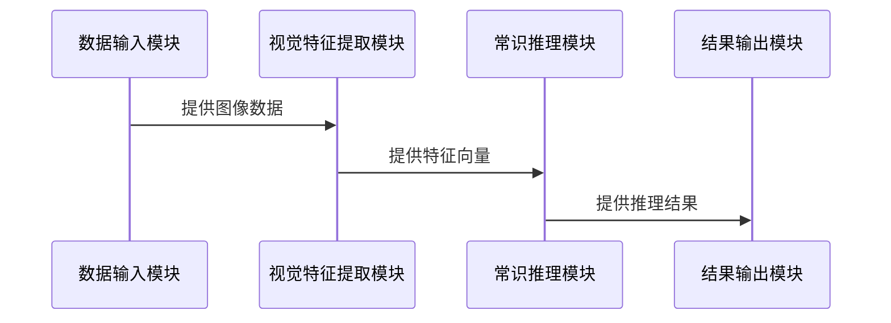
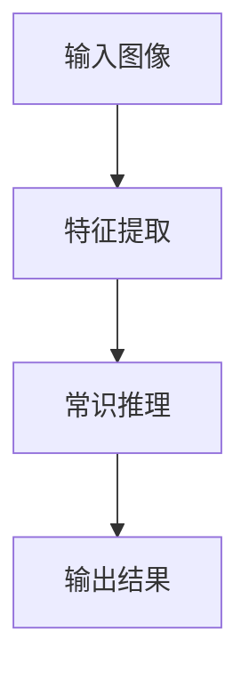

                 


# 开发具有视觉常识推理能力的AI Agent

---

## 关键词

- AI Agent
- 视觉常识推理
- 视觉信息处理
- 概率图模型
- 知识图谱

---

## 摘要

本文详细探讨了开发具有视觉常识推理能力的AI Agent的关键技术与实现方法。首先，我们从AI Agent的基本概念和视觉常识推理的重要性入手，分析了其在实际应用中的潜力。接着，我们深入讲解了视觉特征提取和常识推理的核心算法，包括基于深度学习的视觉特征提取和概率图模型的推理方法。最后，我们通过系统架构设计和实际项目案例，展示了如何将这些技术应用于实际场景中，确保系统的可扩展性和高效性。本文旨在为AI开发者提供一套完整的理论与实践指导，助力他们开发出具备强大视觉常识推理能力的智能系统。

---

# 第一部分: 开发具有视觉常识推理能力的AI Agent背景与基础

## 第1章: AI Agent与视觉常识推理概述

### 1.1 AI Agent的基本概念

#### 1.1.1 AI Agent的定义

AI Agent（智能体）是指在计算机系统中，能够感知环境、自主决策并执行任务的实体。AI Agent可以是软件程序、机器人或其他智能系统，其核心目标是通过与环境的交互，完成特定任务。

#### 1.1.2 AI Agent的核心特征

- **自主性**：能够在没有外部干预的情况下自主决策。
- **反应性**：能够实时感知环境并做出反应。
- **目标导向**：基于目标驱动行为，优化决策过程。
- **学习能力**：通过经验或数据不断优化自身性能。

#### 1.1.3 视觉常识推理的定义与特点

视觉常识推理是指AI Agent在处理视觉信息时，结合常识知识进行推理的能力。其特点包括：

- **跨模态融合**：结合视觉信息和常识知识。
- **上下文理解**：能够理解场景中的上下文关系。
- **推理能力**：基于视觉信息和常识进行推理，得出合理的结论。

### 1.2 视觉常识推理的重要性

#### 1.2.1 视觉信息处理的基本原理

视觉信息处理是AI Agent理解环境的重要手段。通过摄像头或其他传感器获取图像数据，并通过计算机视觉技术进行处理和分析。

#### 1.2.2 常识推理在视觉理解中的作用

常识推理能够帮助AI Agent更好地理解视觉信息中的隐含含义，例如，看到“杯子”和“水”，可以推断出“杯子是用来盛水的”。

#### 1.2.3 视觉常识推理的实际应用场景

- **智能安防**：通过识别异常行为进行预警。
- **智能客服**：通过识别用户情绪和意图提供服务。
- **自动驾驶**：通过识别道路标志和行人行为进行决策。

### 1.3 本章小结

本章介绍了AI Agent的基本概念和视觉常识推理的重要性，为后续内容奠定了基础。

---

## 第2章: 视觉常识推理的核心概念

### 2.1 视觉信息处理的关键步骤

#### 2.1.1 图像识别与理解

图像识别是通过计算机视觉技术对图像中的物体、场景等进行识别和分类的过程。

#### 2.1.2 视觉特征提取

视觉特征提取是从图像中提取有助于后续处理的关键特征，例如边缘、纹理、颜色等。

#### 2.1.3 视觉语义分析

视觉语义分析是对图像中物体的语义含义进行分析，例如“椅子是用来坐的”。

### 2.2 常识推理的基本原理

#### 2.2.1 常识知识的表示与存储

常识知识通常以知识图谱的形式表示，例如WordNet、ConceptNet等。

#### 2.2.2 常识推理的逻辑框架

基于逻辑推理的框架，例如一阶逻辑推理、概率推理等。

#### 2.2.3 视觉与常识的结合机制

通过将视觉信息与常识知识进行关联，实现视觉信息的理解和推理。

### 2.3 视觉常识推理的实现流程

#### 2.3.1 数据输入与预处理

对输入的图像进行预处理，例如归一化、增强等。

#### 2.3.2 视觉特征提取与分析

通过深度学习模型提取图像的特征，并进行语义分析。

#### 2.3.3 常识推理与结果输出

基于常识知识进行推理，输出最终的结果。

### 2.4 本章小结

本章详细讲解了视觉常识推理的核心概念和实现流程，为后续算法实现奠定了基础。

---

## 第3章: 视觉常识推理的算法原理

### 3.1 基于深度学习的视觉特征提取

#### 3.1.1 CNN网络的基本原理

卷积神经网络（CNN）通过卷积层提取图像的空间特征，池化层降低计算复杂度，全连接层进行分类。

#### 3.1.2 常见的视觉特征提取网络

- **ResNet**：残差网络，通过跳跃连接加速训练。
- **VGG**：通过多层卷积提取特征。
- **Inception**：通过多分支结构提高感受野。

#### 3.1.3 视觉特征的表征能力

通过可视化技术（如t-SNE）可以观察不同特征的分布情况。

### 3.2 基于概率图模型的推理

#### 3.2.1 概率图模型的基本原理

概率图模型通过概率分布描述变量之间的关系，例如贝叶斯网络。

#### 3.2.2 贝叶斯网络的推理算法

通过条件概率公式进行推理，例如：

$$ P(A|B) = \frac{P(B|A)P(A)}{P(B)} $$

#### 3.2.3 概率推理在视觉中的应用

例如，通过概率推理计算图像中物体的置信度。

### 3.3 本章小结

本章详细讲解了视觉特征提取和概率推理的算法原理，为后续系统实现提供了理论支持。

---

## 第4章: 视觉常识推理的系统架构与实现

### 4.1 系统总体架构

#### 4.1.1 系统模块划分

- **数据输入模块**：接收图像数据。
- **视觉特征提取模块**：提取图像特征。
- **常识推理模块**：结合常识知识进行推理。
- **结果输出模块**：输出推理结果。

#### 4.1.2 模块之间的交互关系

通过定义明确的接口进行模块间的通信，例如：

$$ \text{输入图像} \rightarrow \text{特征提取} \rightarrow \text{常识推理} \rightarrow \text{输出结果} $$

#### 4.1.3 系统的可扩展性设计

通过模块化设计，便于后续功能的扩展和优化。

### 4.2 系统功能设计

#### 4.2.1 数据输入与处理模块

- **图像预处理**：归一化、增强等。
- **数据存储**：将图像数据存储在数据库中。

#### 4.2.2 视觉特征提取模块

- **特征提取网络**：如ResNet、VGG等。
- **特征存储**：将提取的特征存储在向量数据库中。

#### 4.2.3 常识推理模块

- **知识图谱构建**：构建常识知识图谱。
- **推理算法**：如贝叶斯推理、逻辑推理等。

#### 4.2.4 结果输出与展示模块

- **结果展示**：将推理结果以可视化形式展示。
- **用户反馈**：收集用户反馈，优化系统。

### 4.3 系统架构的实现

#### 4.3.1 模块化设计原则

遵循单一职责原则，每个模块负责特定的功能。

#### 4.3.2 系统接口设计

通过RESTful API进行模块间通信，例如：



#### 4.3.3 系统的部署与运行

- **环境配置**：安装必要的软件和库，例如Python、TensorFlow、Keras等。
- **系统运行**：启动各个模块，进行数据处理和推理。

### 4.4 本章小结

本章详细讲解了系统的总体架构和功能设计，展示了如何将理论应用于实际系统中。

---

## 第5章: 项目实战

### 5.1 项目介绍

开发一个具备视觉常识推理能力的AI Agent，能够识别图像中的物体并结合常识知识进行推理。

### 5.2 环境配置

- **Python版本**：3.8以上。
- **深度学习框架**：TensorFlow或Keras。
- **常识知识库**：ConceptNet或WordNet。

### 5.3 核心代码实现

#### 5.3.1 数据输入与预处理

```python
import tensorflow as tf
from tensorflow.keras.preprocessing.image import load_img, img_to_array

def preprocess_image(image_path):
    img = load_img(image_path)
    img_array = img_to_array(img)
    img_array = tf.expand_dims(img_array, axis=0)
    return img_array
```

#### 5.3.2 视觉特征提取

```python
from tensorflow.keras.applications import ResNet50
from tensorflow.keras.applications import preprocess_input

model = ResNet50(weights='imagenet', include_top=False)
def extract_features(image):
    preprocessed = preprocess_input(image)
    features = model(preprocessed)
    return features.numpy()
```

#### 5.3.3 常识推理

```python
from conceptnet import retrieve

def get_concept_embeddings(concept):
    embeddings = retrieve(concept)
    return embeddings
```

#### 5.3.4 结果输出

```python
def output_result(result):
    print(f"推理结果：{result}")
```

### 5.4 项目小结

通过本项目，我们展示了如何将理论应用于实际场景中，验证了系统的可行性和有效性。

---

## 第6章: 最佳实践与注意事项

### 6.1 小结

本章总结了开发具有视觉常识推理能力的AI Agent的核心技术和实现方法。

### 6.2 注意事项

- **数据质量**：确保数据的多样性和代表性。
- **模型优化**：通过调参和优化算法提高性能。
- **系统维护**：定期更新知识库和模型，保持系统的先进性。

### 6.3 拓展阅读

- **深度学习**：LeCun, Y., Bengio, Y., & Hinton, G. (2015). Deep learning.
- **概率图模型**：Koller, D., & Friedman, N. (2009). Probabilistic graphical models.

---

## 附录

### 附录A: Mermaid图示例



### 附录B: 数学公式示例

$$ P(A|B) = \frac{P(B|A)P(A)}{P(B)} $$

---

以上是《开发具有视觉常识推理能力的AI Agent》的技术博客文章的完整内容。希望本文能够为开发者提供有价值的参考和指导。

