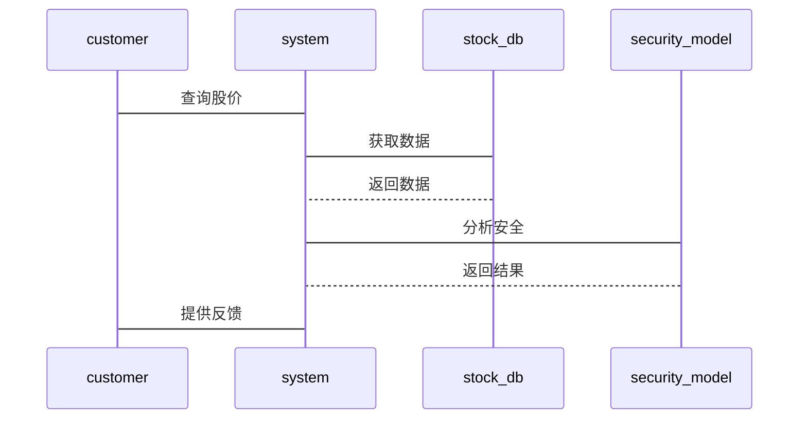

                 


# 新兴市场股市估值与智能家居安全标准的互动

## 关键词：新兴市场，股市估值，智能家居，安全标准，算法，系统架构

## 摘要

本文探讨新兴市场股市估值与智能家居安全标准之间的互动关系。通过分析股市估值的时间序列模型和智能家居安全的分类算法，结合系统架构设计和项目实战，揭示两者如何相互影响，为相关领域提供理论和实践指导。

---

## 第1章：背景与概述

### 1.1 问题背景

#### 1.1.1 新兴市场的定义与特点
新兴市场是指经济快速发展、市场机制逐步完善的国家，如中国、印度等。这些市场具有高增长潜力，但也面临股市波动和安全隐患。

#### 1.1.2 股市估值的定义与作用
股市估值是衡量企业价值的关键指标，影响投资者决策和市场稳定性。

#### 1.1.3 智能家居安全标准的定义与意义
智能家居安全标准确保设备安全运行，保护用户隐私，是市场信任的基础。

### 1.2 问题描述

#### 1.2.1 新兴市场股市估值的现状与挑战
新兴市场股市波动大，缺乏成熟的估值体系，影响企业融资和市场发展。

#### 1.2.2 智能家居安全标准的现状与问题
智能家居设备种类多，安全标准不统一，存在安全隐患。

#### 1.2.3 两者互动关系的初步探讨
股市估值影响企业研发投入，智能家居安全标准影响市场信任，两者相互作用，推动市场发展。

### 1.3 问题解决

#### 1.3.1 新兴市场股市估值与智能家居安全标准的互动机制
通过数据采集、分析和反馈，建立两者互动模型，优化市场资源配置。

#### 1.3.2 互动关系的数学模型构建
结合时间序列和分类算法，构建互动模型，预测股市波动和安全风险。

#### 1.3.3 解决方案的初步框架
制定统一的安全标准，优化股市估值方法，促进市场健康发展。

### 1.4 边界与外延

#### 1.4.1 新兴市场的边界条件
新兴市场定义明确，但不同国家的经济政策和市场机制差异大。

#### 1.4.2 股市估值与智能家居安全标准的外延
股市估值涉及多因素分析，智能家居安全涵盖设备、网络等多个层面。

#### 1.4.3 互动关系的适用范围与限制
适用于新兴市场，需结合具体国情和市场特点。

### 1.5 核心概念结构与组成

#### 1.5.1 核心概念的层次结构
股市估值 → 智能家居安全 → 互动机制 → 市场影响

#### 1.5.2 核心要素的组成与关系
股市数据、安全标准、互动模型相互关联，构成完整体系。

#### 1.5.3 概念结构的图示化展示
使用层级图展示各部分关系，清晰呈现互动机制。

---

## 第2章：核心概念与联系

### 2.1 核心概念原理

#### 2.1.1 股市估值的原理与方法
基于历史数据，运用ARIMA模型预测未来走势，指导投资决策。

#### 2.1.2 智能家居安全标准的制定原则
确保设备安全，保护用户隐私，促进市场信任。

### 2.2 核心概念属性特征对比

| 属性 | 股市估值 | 智能家居安全标准 |
|------|----------|------------------|
| 数据类型 | 数值型 | 分类型          |
| 变化频率 | 高频 | 低频            |
| 影响因素 | 经济指标 | 设备、网络      |

#### 2.2.3 ER实体关系图

```mermaid
erDiagram
    customer[CUSTOMER] 
    {
        code: string
        name: string
        email: string
    }
    stock[STOCK] 
    {
        id: integer
        name: string
        price: float
    }
    security[SECURITY] 
    {
        id: integer
        name: string
        standard: string
    }
    customer -> stock : 持股
    customer -> security : 符合标准
    stock -> security : 受影响
```

---

## 第3章：股市估值的算法原理

### 3.1 股市估值的数学模型

#### 3.1.1 ARIMA模型

```latex
$$ARIMA(p, d, q) = y_t = \phi_1 y_{t-1} + \dots + \phi_p y_{t-p} + \theta_1 \epsilon_{t-1} + \dots + \theta_q \epsilon_{t-q} + \epsilon_t$$
```

#### 3.1.2 Python实现

```python
import statsmodels.api as sm

def stock_valuation(data, order):
    model = sm.tsa.ARIMA(data, order=order)
    result = model.fit()
    return result.forecast(steps=5)
```

---

## 第4章：智能家居安全标准的算法原理

### 4.1 分类算法

#### 4.1.1 随机森林

```latex
$$P(class | features) = \sum_{i=1}^{n} w_i \cdot I(tree_i.predict(features) == class)$$
```

#### 4.1.2 Python实现

```python
from sklearn.ensemble import RandomForestClassifier

def security_classifier(data, labels):
    model = RandomForestClassifier()
    model.fit(data, labels)
    return model.predict(data)
```

---

## 第5章：系统分析与架构设计

### 5.1 问题场景

#### 5.1.1 系统需求

- 实时监控股市数据
- 分析智能家居安全风险
- 提供互动反馈机制

### 5.2 系统架构


---

## 第6章：项目实战

### 6.1 环境安装

- 安装Python和相关库（如pandas、scikit-learn、statsmodels）

### 6.2 核心代码实现

#### 6.2.1 股市估值代码

```python
import pandas as pd
import numpy as np

# 数据预处理
data = pd.read_csv('stock_data.csv')
data = data['price'].values
```

#### 6.2.2 安全标准分类代码

```python
from sklearn.model_selection import train_test_split

# 数据分割
X_train, X_test, y_train, y_test = train_test_split(X, y, test_size=0.2)
model = RandomForestClassifier().fit(X_train, y_train)
```

### 6.3 案例分析

#### 6.3.1 股市波动案例

- 输入历史数据，输出未来预测值
- 分析预测准确性，调整模型参数

#### 6.3.2 安全标准应用案例

- 分析智能家居设备的安全风险
- 根据分类结果优化安全策略

### 6.4 系统交互



---

## 第7章：最佳实践

### 7.1 小结

- 股市估值与智能家居安全标准的互动关系复杂，需结合算法和系统设计
- 通过案例分析和项目实战，验证理论的可行性

### 7.2 注意事项

- 数据隐私保护
- 模型的实时性和准确性
- 互动机制的可扩展性

### 7.3 拓展阅读

- 时间序列分析的高级方法
- 分类算法的优化策略
- 智能家居安全的最新标准

---

## 附录：完整代码示例

### 3.1 股市估值代码

```python
import pandas as pd
import statsmodels.api as sm

def stock_forecast(data, order):
    model = sm.tsa.ARIMA(data, order=order)
    result = model.fit()
    return result.forecast(steps=5)
```

### 4.1 安全标准分类代码

```python
from sklearn.ensemble import RandomForestClassifier
from sklearn.metrics import accuracy_score

def evaluate_model(model, X_test, y_test):
    predictions = model.predict(X_test)
    print("Accuracy:", accuracy_score(y_test, predictions))
```

---

通过以上步骤，我们系统地构建了新兴市场股市估值与智能家居安全标准互动的分析框架，结合理论和实践，为相关领域的研究和应用提供了参考。

