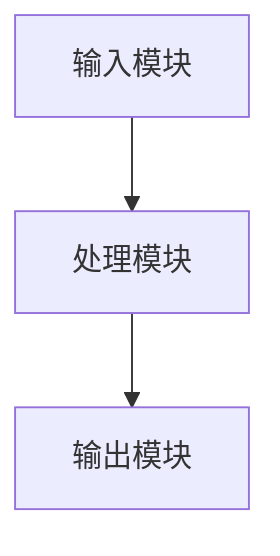
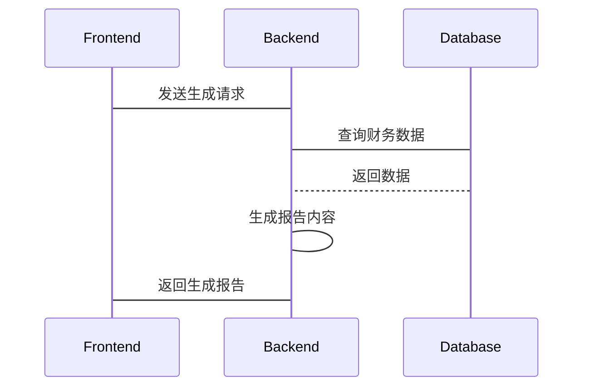

                 


# 构建企业级自然语言生成报告系统：多语言财务报告自动化

## 关键词：自然语言生成, 多语言处理, 企业级系统, 财务报告自动化, 深度学习模型

## 摘要：  
随着企业全球化进程的加速，多语言财务报告的生成需求日益增长。本文将探讨如何利用自然语言生成技术构建一个企业级的多语言财务报告自动化系统。通过分析自然语言生成的核心原理、多语言处理的技术挑战，以及企业级系统的架构设计，本文将提供一套完整的解决方案，并通过实际案例展示如何实现高效的多语言财务报告生成。

---

# 第一部分: 自然语言生成与企业级应用背景

## 第1章: 自然语言生成与企业级应用概述

### 1.1 自然语言生成技术的背景
#### 1.1.1 自然语言生成技术的发展历程  
自然语言生成（Natural Language Generation, NLG）技术起源于20世纪50年代，经历了从基于规则的生成到统计模型，再到深度学习的演变。近年来，随着Transformer模型的突破，NLG技术在准确性和流畅性上取得了显著进步。

#### 1.1.2 企业级应用中的自然语言生成需求  
企业级系统中，自然语言生成技术被广泛应用于报告生成、客服对话、文档自动编写等领域。特别是在财务领域，生成多语言的财务报告可以显著提高效率，降低成本。

#### 1.1.3 自然语言生成技术的核心价值  
- **提高效率**：自动化生成报告，减少人工干预。  
- **降低成本**：降低人工编写报告的时间和人力成本。  
- **增强可扩展性**：支持多种语言和格式，满足全球化需求。  

### 1.2 企业级自然语言生成系统的定义与特点
#### 1.2.1 企业级系统的定义  
企业级系统是指为整个企业提供统一服务的系统，具有高可用性、可扩展性和安全性。  

#### 1.2.2 自然语言生成系统的功能特点  
- **多语言支持**：支持多种语言的生成。  
- **可定制性**：根据企业需求定制报告模板和内容。  
- **高准确性**：生成内容符合行业规范和企业标准。  

#### 1.2.3 企业级自然语言生成系统的边界与外延  
- **边界**：系统专注于生成报告内容，不包括报告存储和分发。  
- **外延**：可与企业现有的财务系统、ERP系统无缝集成。  

### 1.3 多语言财务报告生成的背景与需求
#### 1.3.1 财务报告生成的痛点与挑战  
- **人工成本高**：需要大量人力资源编写多语言报告。  
- **效率低**：传统方法难以满足快速变化的业务需求。  
- **一致性难保证**：人工编写容易出现格式和内容不一致的问题。  

#### 1.3.2 多语言需求的场景分析  
- **跨国企业**：需要生成多种语言的财务报告以满足不同地区的监管要求。  
- **国际化业务**：与全球合作伙伴进行业务往来时，提供多语言报告是必要的。  

#### 1.3.3 自然语言生成在财务报告中的应用前景  
- **提升效率**：通过自动化生成报告，显著降低人工成本。  
- **增强一致性**：确保所有语言版本的报告内容一致。  
- **快速响应**：适应业务变化，快速生成符合需求的报告。  

### 1.4 本章小结  
本章介绍了自然语言生成技术的发展背景、核心价值，以及企业级自然语言生成系统的定义和特点。同时，分析了多语言财务报告生成的背景和需求，为后续的技术实现奠定了基础。

---

## 第2章: 自然语言生成技术的核心原理  

### 2.1 自然语言生成的原理与方法  
#### 2.1.1 基于规则的生成方法  
- **规则驱动**：通过预定义的语法规则生成文本。  
- **优点**：简单易懂，适合特定场景。  
- **缺点**：灵活性差，难以应对复杂场景。  

#### 2.1.2 统计模型的生成方法  
- **基于概率模型**：通过统计语言模型生成最可能的文本。  
- **优点**：能够处理复杂场景，生成多样化的文本。  
- **缺点**：依赖大量数据，计算复杂度高。  

#### 2.1.3 深度学习模型的生成原理  
- **基于Transformer的模型**：通过自注意力机制捕捉上下文信息，生成流畅的文本。  
- **数学公式**：  
  $$\text{Attention}(Q,K,V) = \text{softmax}\left(\frac{QK^T}{\sqrt{d_k}}\right)V$$  
  其中，$Q$、$K$、$V$分别为查询、键、值向量，$d_k$为键的维度。  

---

### 2.2 多语言自然语言生成技术  
#### 2.2.1 多语言模型的构建原理  
- **跨语言迁移学习**：利用多语言数据训练模型，使其能够在不同语言之间迁移知识。  
- **数学公式**：  
  $$\mathcal{L} = -\sum_{i=1}^{n} \log p(x_i)$$  
  其中，$\mathcal{L}$为损失函数，$x_i$为输入序列。  

#### 2.2.2 跨语言迁移学习的核心思想  
- **共享参数**：不同语言的模型参数共享，降低训练数据需求。  
- **适应层**：针对每种语言添加适应层，提升生成效果。  

#### 2.2.3 多语言模型的训练与优化  
- **预训练**：使用大规模多语言数据进行预训练。  
- **微调**：针对特定任务进行微调，提升生成效果。  

---

### 2.3 自然语言生成与企业级应用的结合  
#### 2.3.1 企业级系统中的语言生成需求  
- **一致性**：生成内容需符合企业标准和行业规范。  
- **高效性**：系统需支持高并发请求，满足企业级应用需求。  

#### 2.3.2 自然语言生成技术在财务报告中的应用  
- **报告模板生成**：根据模板自动生成报告内容。  
- **多语言支持**：支持多种语言的财务报告生成。  

#### 2.3.3 生成结果的可解释性与可信度  
- **可解释性**：生成内容需可追溯，便于审计和验证。  
- **可信度**：生成内容需符合财务规则和行业标准。  

---

### 2.4 本章小结  
本章详细介绍了自然语言生成技术的核心原理，包括基于规则、统计和深度学习的生成方法，以及多语言自然语言生成技术的构建原理和优化策略。同时，探讨了自然语言生成技术在企业级应用中的结合方式及其挑战。

---

## 第3章: 自然语言生成的算法原理  

### 3.1 Transformer模型的原理  
#### 3.1.1 Transformer模型的结构  
- **编码器**：将输入序列映射到一个固定长度的向量。  
- **解码器**：根据编码器输出生成目标序列。  

#### 3.1.2 自注意力机制的数学公式  
$$\text{Attention}(Q,K,V) = \text{softmax}\left(\frac{QK^T}{\sqrt{d_k}}\right)V$$  

#### 3.1.3 解码器的生成过程  
- **位置编码**：通过位置编码引入序列信息。  
- **自注意力**：计算序列内部的注意力权重。  
- **前馈网络**：生成最终的输出序列。  

---

### 3.2 多语言模型的训练与生成  
#### 3.2.1 跨语言迁移学习的流程  
- **预训练**：使用多语言数据训练基础模型。  
- **微调**：针对特定任务进行微调。  

#### 3.2.2 多语言模型的损失函数  
$$\mathcal{L} = -\sum_{i=1}^{n} \log p(x_i)$$  

#### 3.2.3 跨语言注意力机制的优化  
- **共享参数**：不同语言的注意力权重共享。  
- **语言嵌入**：为每种语言添加语言嵌入向量。  

---

### 3.3 自然语言生成的评估指标  
#### 3.3.1 基于生成结果的指标  
- **BLEU**：基于编辑距离的评估指标。  
- **ROUGE**：基于召回率的评估指标。  

#### 3.3.2 基于模型内部的指标  
- **困惑度**：模型对测试数据的预测能力。  
- **交叉熵损失**：模型的预测与真实值之间的差异。  

---

### 3.4 本章小结  
本章深入探讨了自然语言生成技术的算法原理，重点介绍了Transformer模型和多语言模型的训练与生成过程。同时，讨论了生成结果的评估指标，为后续的系统设计和实现提供了理论基础。

---

## 第4章: 企业级系统架构与设计  

### 4.1 系统功能设计  
#### 4.1.1 系统功能模块  
- **输入模块**：接收财务数据和生成请求。  
- **处理模块**：解析数据并生成报告内容。  
- **输出模块**：输出生成的报告。  

#### 4.1.2 系统功能流程图  


---

### 4.2 系统架构设计  
#### 4.2.1 系统架构图  


#### 4.2.2 系统交互流程图  


---

### 4.3 系统接口设计  
#### 4.3.1 API接口定义  
- **输入接口**：`POST /generate_report`，接收JSON格式的请求参数。  
- **输出接口**：`GET /download_report`，返回生成的报告文件。  

#### 4.3.2 接口协议  
- **HTTP协议**：使用RESTful API进行通信。  
- **数据格式**：请求和响应均使用JSON格式。  

---

### 4.4 本章小结  
本章详细描述了企业级自然语言生成报告系统的架构设计，包括功能模块、系统架构图和接口设计，为后续的系统实现奠定了基础。

---

## 第5章: 项目实战与实现  

### 5.1 环境安装  
#### 5.1.1 安装Python  
```bash
# 安装Python
sudo apt-get install python3
```

#### 5.1.2 安装深度学习框架  
```bash
# 安装TensorFlow
pip install tensorflow
```

#### 5.1.3 安装NLP库  
```bash
# 安装SentencePiece
pip install sentencepiece
```

---

### 5.2 系统核心实现  
#### 5.2.1 数据预处理代码  
```python
def preprocess_data(data):
    # 数据清洗和格式化
    processed_data = []
    for entry in data:
        processed_entry = {
            'content': entry['content'],
            'language': entry['language']
        }
        processed_data.append(processed_entry)
    return processed_data
```

#### 5.2.2 模型训练代码  
```python
def train_model(train_data):
    # 定义模型结构
    model = TransformerModel()
    # 编译模型
    model.compile(optimizer='adam', loss='sparse_categorical_crossentropy')
    # 训练模型
    model.fit(train_data, epochs=10, batch_size=32)
    return model
```

---

### 5.3 生成报告的实现  
#### 5.3.1 生成报告代码  
```python
def generate_report(model, template):
    # 加载模板
    template_data = load_template(template)
    # 生成报告内容
    generated_content = model.generate(template_data)
    return generated_content
```

#### 5.3.2 多语言支持的实现  
```python
def generate_multi_language_report(model, template, languages):
    # 为每种语言生成报告
    reports = {}
    for lang in languages:
        reports[lang] = model.generate(template_data, lang)
    return reports
```

---

### 5.4 项目小结  
本章通过实际案例展示了如何构建一个多语言自然语言生成报告系统，包括环境安装、数据预处理、模型训练和生成报告的实现。通过这些步骤，读者可以掌握从理论到实践的完整流程。

---

## 第6章: 最佳实践与拓展  

### 6.1 最佳实践  
#### 6.1.1 数据质量的重要性  
- **数据清洗**：确保输入数据的准确性和完整性。  
- **数据标注**：为多语言数据添加适当的标注信息。  

#### 6.1.2 模型优化技巧  
- **超参数调优**：通过调整学习率、批量大小等参数优化模型性能。  
- **模型融合**：结合多种模型提升生成效果。  

---

### 6.2 小结  
本章总结了构建企业级自然语言生成报告系统的最佳实践，包括数据处理和模型优化的技巧，为读者提供了宝贵的参考。

---

## 第7章: 注意事项与未来展望  

### 7.1 注意事项  
#### 7.1.1 数据安全问题  
- **数据加密**：确保财务数据的安全性。  
- **访问控制**：限制非授权访问。  

#### 7.1.2 模型的可解释性  
- **生成内容的追溯**：确保生成内容可追溯。  
- **模型的透明性**：提升模型的可解释性。  

---

### 7.2 未来展望  
#### 7.2.1 技术趋势  
- **多模态生成**：结合图像、音频等多模态信息生成更丰富的报告内容。  
- **实时生成**：提升生成速度，支持实时报告生成。  

#### 7.2.2 应用场景拓展  
- **智能客服**：生成个性化回复，提升用户体验。  
- **智能写作助手**：辅助专业人员快速生成高质量内容。  

---

### 7.3 本章小结  
本章总结了构建企业级自然语言生成报告系统时需要注意的问题，并展望了未来的技术发展趋势和应用场景。

---

## 第8章: 拓展阅读与参考文献  

### 8.1 拓展阅读  
- **《Effective Modern Python》**：深入理解Python编程的高级技巧。  
- **《Deep Learning for Natural Language Processing》**：系统学习深度学习在自然语言处理中的应用。  

### 8.2 参考文献  
- **[1]** Vaswani, A., et al. "Attention Is All You Need."  
- **[2]** Devlin, J., et al. "BERT: Pre-training of Deep Bidirectional Transformers for Language Understanding."  
- **[3]** Transformer模型在自然语言生成中的应用研究。  

---

## 第9章: 总结与致谢  

### 9.1 总结  
本文详细探讨了构建企业级自然语言生成报告系统的技术细节，包括自然语言生成的核心原理、多语言处理的技术挑战，以及系统架构设计和实现方案。通过实际案例分析，展示了如何将理论应用于实践，为读者提供了宝贵的经验和启示。

### 9.2 致谢  
感谢读者的支持和关注，感谢同行的建议和指导，感谢家人和朋友的理解与鼓励。

---

通过以上结构，我们可以系统地构建一个企业级的多语言自然语言生成报告系统，实现高效、准确的财务报告生成，满足企业在全球化背景下的多样化需求。

