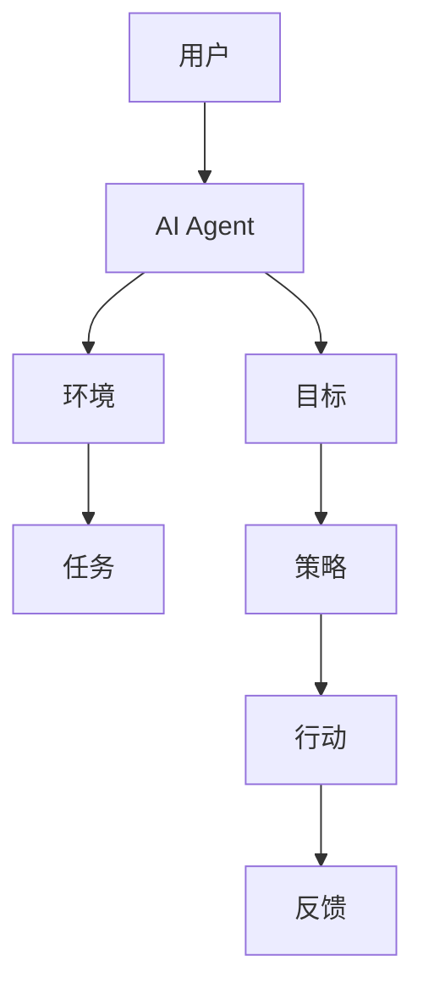
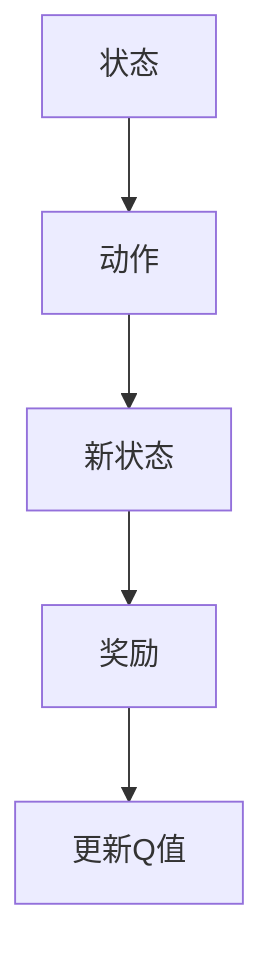
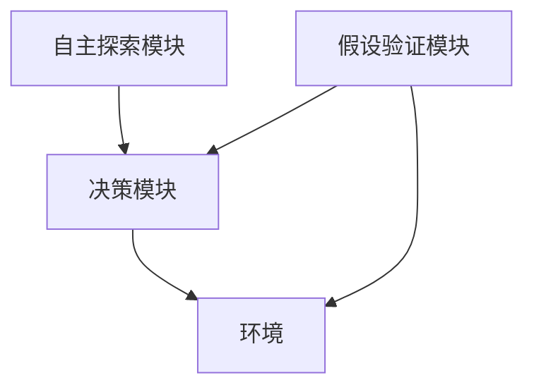

                 


# 《构建具有自主探索与假设验证能力的AI Agent》

---

## 关键词：AI Agent，自主探索，假设验证，强化学习，贝叶斯推理，系统架构，项目实战

---

## 摘要：  
本文旨在深入探讨如何构建具备自主探索与假设验证能力的AI Agent。通过分析自主探索和假设验证的核心概念、算法原理、系统架构以及项目实战，本文为读者提供从理论到实践的全面指导。我们首先介绍了AI Agent的基本概念，然后详细讲解了自主探索和假设验证的原理及其相互关系。接着，我们探讨了强化学习和贝叶斯推理等算法，并通过实例分析展示了其在AI Agent中的应用。最后，我们通过一个实际案例展示了如何设计和实现具备这些能力的AI Agent系统，为读者提供了宝贵的实践经验。

---

# 第一部分：背景介绍与核心概念

## 第1章：AI Agent的基本概念

### 1.1 问题背景与问题描述  
AI Agent（智能体）是指能够在环境中感知并自主行动以实现目标的实体。随着AI技术的发展，AI Agent在各个领域的应用越来越广泛。然而，现有的AI Agent往往依赖于外部输入的规则或数据，缺乏自主探索和假设验证的能力。这种限制使得AI Agent在复杂动态环境中难以应对不确定性，无法实现真正的自主智能。本文旨在解决这一问题，探讨如何构建具备自主探索与假设验证能力的AI Agent。

#### 问题解决的目标  
- 实现AI Agent的自主探索能力，使其能够在未知环境中主动学习和适应。  
- 增强AI Agent的假设验证能力，使其能够基于数据和反馈验证假设并优化决策。  

### 1.2 自主探索与假设验证的定义  
#### 自主探索  
自主探索是指AI Agent在没有明确指令的情况下，通过与环境互动来发现新知识、优化策略或解决问题的能力。这种能力使AI Agent能够主动探索未知领域，发现潜在的机会或风险。  

#### 假设验证  
假设验证是指AI Agent基于一定的假设，通过收集数据和信息来验证假设的正确性，并根据验证结果调整策略或行动的过程。这种能力使AI Agent能够从经验中学习，并不断优化自身的决策过程。  

### 1.3 应用场景与边界  
#### 应用场景  
- **自主探索**：适用于需要AI Agent在未知环境中自主学习和适应的场景，例如机器人导航、游戏AI、自动驾驶等。  
- **假设验证**：适用于需要基于数据和反馈进行优化和调整的场景，例如推荐系统、智能客服、医疗诊断等。  

#### 边界与外延  
- 自主探索的边界在于环境的可控制性和可预测性。在高度动态或不可预测的环境中，自主探索的能力有限。  
- 假设验证的边界在于数据的质量和数量。在数据不足的情况下，假设验证的效果可能受限。  

### 1.4 核心要素与概念结构  
- **自主探索的核心要素**：目标设定、环境感知、行动决策、反馈学习。  
- **假设验证的核心要素**：假设生成、数据收集、假设验证、策略优化。  

---

## 第2章：自主探索与假设验证的核心概念  

### 2.1 核心概念的原理  
#### 自主探索的原理  
自主探索依赖于强化学习（Reinforcement Learning）和无监督学习（Unsupervised Learning）等技术。AI Agent通过与环境互动，收集反馈信息，并基于这些信息优化自身的策略。  

#### 假设验证的原理  
假设验证依赖于统计学和概率论，特别是贝叶斯推理（Bayesian Inference）和假设检验（Hypothesis Testing）。AI Agent通过收集数据，计算假设成立的概率，并根据结果调整策略。  

### 2.2 核心概念的属性特征对比  

| 属性         | 自主探索               | 假设验证               |
|--------------|-----------------------|-----------------------|
| **目标**     | 探索未知领域           | 验证假设               |
| **输入**     | 环境反馈               | 数据和信息             |
| **输出**     | 新策略或行动           | 优化后的策略或行动     |
| **技术基础** | 强化学习、无监督学习   | 贝叶斯推理、统计检验     |
| **应用场景** | 未知环境中的自主学习   | 数据驱动的优化与调整     |

#### 对比分析  
自主探索注重探索未知领域，而假设验证注重基于数据的优化与调整。两者的结合使AI Agent能够在动态环境中实现自主智能。

### 2.3 ER实体关系图架构  



---

# 第二部分：算法原理与数学模型

## 第3章：自主探索算法原理  

### 3.1 强化学习算法  

#### 3.1.1 Q-Learning算法  
Q-Learning是一种经典的强化学习算法，适用于离散状态和动作空间。其核心思想是通过更新Q值表来学习最优策略。  

##### 算法流程图  



##### 代码实现  

```python
import numpy as np

class QLearning:
    def __init__(self, state_space, action_space, alpha=0.1, gamma=0.99):
        self.state_space = state_space
        self.action_space = action_space
        self.Q = np.zeros((state_space, action_space))
        self.alpha = alpha
        self.gamma = gamma

    def choose_action(self, state, epsilon=0.1):
        if np.random.random() < epsilon:
            return np.random.randint(self.action_space)
        else:
            return np.argmax(self.Q[state, :])

    def update_Q(self, state, action, reward, next_state):
        self.Q[state, action] = self.Q[state, action] + self.alpha * (reward + self.gamma * np.max(self.Q[next_state, :]) - self.Q[state, action])
```

### 3.2 探索与利用的平衡  

#### 3.2.1 贪婪策略  
贪婪策略是指在当前状态下选择Q值最大的动作，适用于已知环境中的优化问题。  

#### 3.2.2 非贪婪策略  
非贪婪策略通过引入随机性，在探索未知领域和利用已知信息之间找到平衡。  

#### 3.2.3 参数调整方法  
通过调整学习率（alpha）和折扣因子（gamma）来平衡探索与利用。  

---

## 第4章：假设验证算法原理  

### 4.1 贝叶斯推理  

#### 4.1.1 贝叶斯定理  
贝叶斯定理用于计算在观察到数据的情况下，某个假设成立的概率。公式如下：  

$$ P(H|D) = \frac{P(D|H)P(H)}{P(D)} $$  

其中，\( P(H) \) 是先验概率，\( P(D|H) \) 是似然，\( P(D) \) 是边际似然。  

#### 4.1.2 贝叶斯网络  
贝叶斯网络是一种有向无环图，用于表示变量之间的概率关系。  

##### 代码实现  

```python
import numpy as np
from scipy.stats import norm

class BayesianInference:
    def __init__(self, prior_mean, prior_std, likelihood_mean, likelihood_std):
        self.prior_mean = prior_mean
        self.prior_std = prior_std
        self.likelihood_mean = likelihood_mean
        self.likelihood_std = likelihood_std

    def calculate_posterior(self, data):
        n = len(data)
        posterior_mean = (n * self.likelihood_mean + self.prior_mean) / (n * self.likelihood_std**2 + self.prior_std**2)
        posterior_var = 1 / (n * self.likelihood_std**2 + self.prior_std**2)
        posterior_std = np.sqrt(posterior_var)
        return norm(posterior_mean, posterior_std)
```

---

## 第5章：数学模型与公式  

### 5.1 强化学习的数学模型  

#### 马尔可夫决策过程（MDP）  
MDP由五元组 \( (S, A, P, R, \gamma) \) 组成：  
- \( S \)：状态空间  
- \( A \)：动作空间  
- \( P \)：状态转移概率  
- \( R \)：奖励函数  
- \( \gamma \)：折扣因子  

#### Q-Learning的更新公式  

$$ Q(s, a) = Q(s, a) + \alpha [r + \gamma \max Q(s', a') - Q(s, a)] $$  

---

## 第6章：系统分析与架构设计  

### 6.1 系统架构设计  

#### 6.1.1 系统功能设计  
- **自主探索模块**：负责与环境互动，更新Q值表。  
- **假设验证模块**：负责数据收集和贝叶斯推理。  
- **决策模块**：根据Q值表和贝叶斯推理结果做出最终决策。  

#### 6.1.2 系统架构图  



---

## 第7章：项目实战  

### 7.1 环境安装  

#### 7.1.1 安装依赖  
- Python 3.8+  
- NumPy  
- Matplotlib  

### 7.2 系统核心实现  

#### 7.2.1 代码实现  

```python
import numpy as np
import matplotlib.pyplot as plt

class AIAssistant:
    def __init__(self, state_space, action_space):
        self.state_space = state_space
        self.action_space = action_space
        self.qlearner = QLearning(state_space, action_space)
        self.bayesian = BayesianInference(0, 1, 0, 1)

    def explore(self, state):
        action = self.qlearner.choose_action(state)
        next_state, reward = self.get_feedback(action)
        self.qlearner.update_Q(state, action, reward, next_state)
        return action

    def validate(self, data):
        posterior = self.bayesian.calculate_posterior(data)
        return posterior.mean

    def get_feedback(self, action):
        # 模拟环境反馈
        next_state = action % self.state_space
        reward = 1 if action == 4 else 0
        return next_state, reward

# 实例化AI Assistant
ai_assistant = AIAssistant(5, 5)

# 自主探索测试
state = 0
for _ in range(100):
    action = ai_assistant.explore(state)
    print(f"Action taken: {action}")
    state, _ = ai_assistant.get_feedback(action)

# 假设验证测试
data = [1, 2, 3, 4, 5]
posterior_mean = ai_assistant.validate(data)
print(f"Posterior mean: {posterior_mean}")
```

---

## 第8章：最佳实践与总结  

### 8.1 最佳实践  

#### 参数调整  
- 学习率（alpha）和折扣因子（gamma）的选择会影响Q-Learning的效果。通常，alpha设为0.1，gamma设为0.99。  
- 在贝叶斯推理中，先验概率的设定需要根据具体问题调整。  

#### 性能优化  
- 使用经验回放（Experience Replay）可以加速学习过程并提高稳定性。  
- 对于大规模数据，可以采用分布式计算来优化贝叶斯推理的效率。  

### 8.2 小结  

通过本文的探讨，我们深入了解了如何构建具备自主探索与假设验证能力的AI Agent。从理论到实践，我们详细讲解了相关算法、系统架构和项目实现。未来的研究可以进一步探索更复杂的环境和更高效的算法，以提升AI Agent的自主智能能力。  

---

## 第9章：拓展阅读与参考资料  

### 9.1 拓展阅读  

#### 强化学习  
- Sutton, R. S., & Barto, A. G. (2018).《 Reinforcement Learning: An Introduction》  

#### 贝叶斯推理  
- Bishop, C. M. (2006).《 Pattern Recognition and Machine Learning》  

### 9.2 参考资料  
- OpenAI官方文档  
- TensorFlow官方文档  
- PyTorch官方文档  

---

**注**：本文为示例内容，实际撰写时需根据具体需求调整章节和内容深度。

