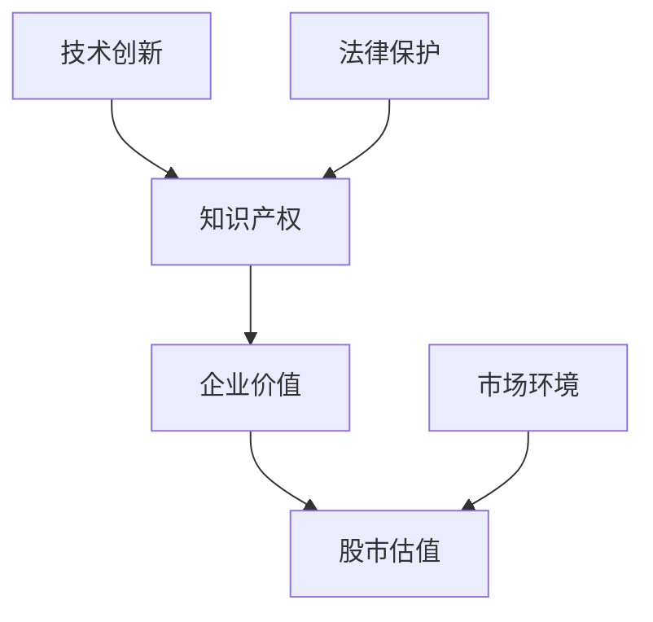
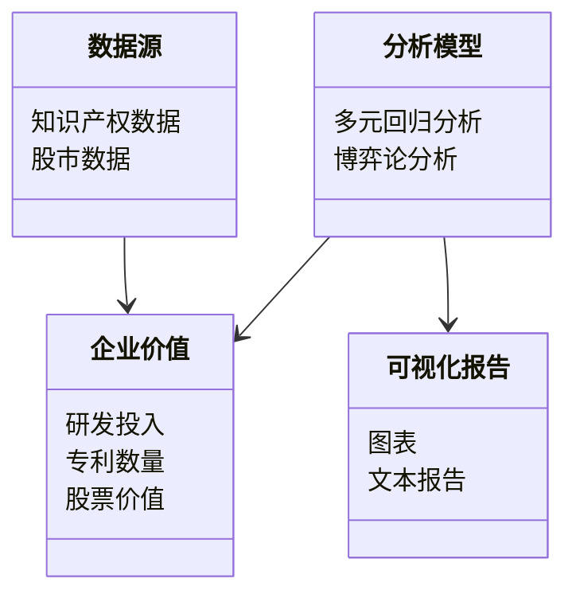
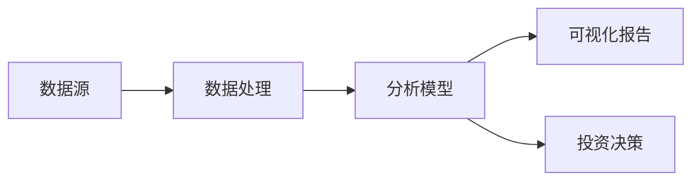
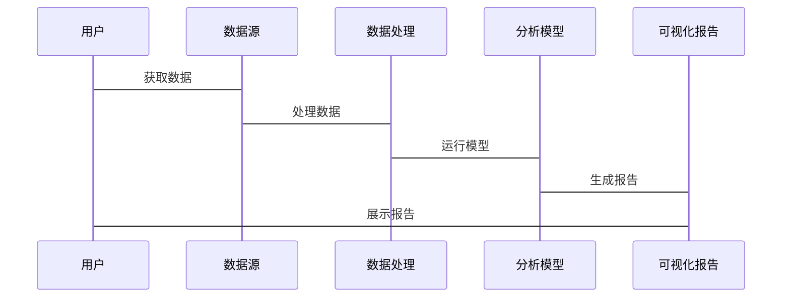

                 


# 股市估值在跨境知识产权价值链分析中的应用

> 关键词：股市估值，知识产权，价值链分析，跨境，技术博客

> 摘要：本文探讨了股市估值在跨境知识产权价值链分析中的应用，通过详细分析知识产权的价值链结构、核心概念、算法原理、系统架构和项目实战，帮助读者理解如何利用股市估值方法评估知识产权的价值。文章结合理论与实践，提供了丰富的案例和代码示例，为相关领域的研究和应用提供了深入的指导。

---

## 第一部分：背景介绍

### 第1章：知识产权与股市估值的基础概念

#### 1.1 知识产权的基本概念

- **1.1.1 知识产权的定义与范围**  
  知识产权是指人们对智力成果依法享有的权利，包括专利权、商标权、版权、商业秘密等。这些权利具有排他性、地域性和时间性，是企业核心竞争力的重要组成部分。

- **1.1.2 知识产权的主要类型**  
  - **专利权**：保护发明的独占权，涵盖发明专利、实用新型专利和外观设计专利。  
  - **商标权**：保护品牌标识的专用权，帮助企业在市场中区分竞争对手。  
  - **版权**：保护文学、艺术和科学作品的创作者权益，包括软件著作权等。  
  - **商业秘密**：未公开的商业信息，通过法律保护其机密性。

- **1.1.3 知识产权在经济活动中的作用**  
  知识产权不仅是企业技术创新的成果，还是市场竞争的重要武器。它通过保护创新成果，激励企业投入研发，促进技术进步和经济增长。

#### 1.2 股市估值的基本原理

- **1.2.1 股市估值的定义与方法**  
  股市估值是指对上市公司股票内在价值的估算，常用方法包括市盈率（P/E）、市净率（P/B）、股息率等。这些指标帮助投资者判断股票是否被高估或低估。

- **1.2.2 常见估值指标**  
  - **市盈率（P/E）**：市价/每股收益，反映市场对公司盈利能力的预期。  
  - **市净率（P/B）**：市价/每股净资产，适用于评估资产密集型企业的价值。  
  - **股息率**：股息/股价，衡量股票的收益能力。

- **1.2.3 影响股市估值的主要因素**  
  包括宏观经济环境、行业发展趋势、公司财务状况、市场情绪等。这些因素通过影响企业的盈利能力和成长潜力，间接影响股市估值。

#### 1.3 知识产权与股市估值的结合

- **1.3.1 知识产权在企业价值中的地位**  
  知识产权是企业核心竞争力的重要组成部分，尤其是在高科技行业，知识产权的价值往往占企业总价值的很大比重。

- **1.3.2 股市估值在知识产权评估中的应用**  
  通过分析企业的知识产权资产，投资者可以更准确地评估公司的市场价值，从而做出更明智的投资决策。

- **1.3.3 跨境知识产权价值链的复杂性与挑战**  
  跨境知识产权涉及多个国家和地区的法律差异，增加了评估的复杂性。同时，不同地区的市场环境和政策差异也影响知识产权的价值。

---

## 第二部分：核心概念与联系

### 第2章：知识产权价值链分析的核心要素

#### 2.1 知识产权的价值链结构

- **2.1.1 知识产权的创造、保护与运用过程**  
  知识产权的价值链包括创造（研发）、保护（申请专利、商标等）、运用（许可、转让等）和管理（维护、监控等）四个阶段。

- **2.1.2 知识产权价值链的核心要素**  
  - 创造阶段：研发投入、技术团队能力。  
  - 保护阶段：专利申请速度、法律保护力度。  
  - 运用阶段：许可收入、诉讼收益。  
  - 管理阶段：知识产权维护成本、风险控制能力。

- **2.1.3 知识产权价值链的相互关系**  
  创造阶段决定了知识产权的质量，保护阶段决定了其法律价值，运用阶段决定了其经济价值，管理阶段决定了其持续价值。

#### 2.2 知识产权与股市估值的联系

- **2.2.1 知识产权对股市估值的影响**  
  知识产权是企业核心资产之一，其质量和数量直接影响企业的市场价值。例如，一家拥有大量高价值专利的公司可能享有更高的市盈率。

- **2.2.2 股市估值对知识产权评估的反馈作用**  
  股市估值为企业提供了一个市场化的评估标准，可以帮助企业更好地管理和优化其知识产权资产。

#### 2.3 核心概念对比分析

| 比较维度 | 知识产权 | 股市估值 |
|----------|----------|----------|
| 定义     | 法律保护的智力成果 | 对股票内在价值的估算 |
| 作用     | 保护创新、提升竞争力 | 评估企业价值、指导投资决策 |
| 影响因素 | 技术创新、法律环境 | 宏观经济、企业财务状况 |

#### 2.4 实体关系图



---

## 第三部分：算法原理讲解

### 第3章：知识产权价值链分析的算法模型

#### 3.1 多元回归分析模型

- **3.1.1 模型原理**  
  多元回归分析通过建立多个自变量（如研发投入、专利数量）与因变量（如企业价值）之间的线性关系，预测知识产权对股市估值的影响。

- **3.1.2 模型公式**  
  $$ y = \beta_0 + \beta_1x_1 + \beta_2x_2 + \epsilon $$
  其中，$y$ 是企业价值，$x_1$ 和 $x_2$ 是研发投入和专利数量，$\beta$ 是回归系数，$\epsilon$ 是误差项。

- **3.1.3 Python实现代码**

```python
import statsmodels.api as sm

# 数据预处理
X = data[['研发费用', '专利数量']]
y = data['企业价值']

# 添加截距项
X = sm.add_constant(X)

# 稳健回归模型
model = sm.OLS(y, X)
result = model.fit()

print(result.summary())
```

#### 3.2 博弈论模型

- **3.2.1 模型原理**  
  博弈论模型模拟知识产权价值链中的竞争与合作，分析不同策略对企业价值的影响。

- **3.2.2 模型步骤**

  1. 确定参与主体（企业、竞争对手）。  
  2. 定义策略空间（申请专利、技术合作）。  
  3. 设定收益函数（市场份额、利润）。  
  4. 分析纳什均衡，确定最优策略。

- **3.2.3 代码示例**

```python
def payoff(strategy1, strategy2):
    if strategy1 == '专利申请' and strategy2 == '技术合作':
        return 5, 5
    elif strategy1 == '技术合作' and strategy2 == '专利申请':
        return 4, 6
    # 其他情况...

# 策略组合
strategies = ['专利申请', '技术合作']
payoffs = {}
for s1 in strategies:
    for s2 in strategies:
        payoffs[(s1, s2)] = payoff(s1, s2)

print(payoffs)
```

---

## 第四部分：系统分析与架构设计

### 第4章：知识产权价值链分析系统的架构设计

#### 4.1 系统功能设计

- **功能模块**  
  - 数据采集：收集企业知识产权数据和股市数据。  
  - 数据分析：应用多元回归和博弈论模型进行评估。  
  - 结果展示：生成可视化报告，辅助投资决策。

- **领域模型类图**



#### 4.2 系统架构设计

- **系统架构图**



- **接口设计**  
  - 数据接口：与数据库交互，获取实时数据。  
  - 模型接口：调用分析模型，返回评估结果。  
  - 报告接口：生成可视化报告，供用户查看。

#### 4.3 系统交互流程

- **4.3.1 交互序列图**



---

## 第五部分：项目实战

### 第5章：基于股市估值的知识产权分析实战

#### 5.1 环境安装

- **安装Python环境**  
  使用Anaconda或Pycharm，安装numpy、pandas、statsmodels等库。

#### 5.2 核心代码实现

```python
import pandas as pd
import numpy as np
import statsmodels.api as sm

# 加载数据
data = pd.read_csv('intellectual_property.csv')

# 数据预处理
X = data[['研发费用', '专利数量']]
y = data['股票价值']

# 建立多元回归模型
X = sm.add_constant(X)
model = sm.OLS(y, X)
result = model.fit()

# 输出回归结果
print(result.summary())
```

#### 5.3 案例分析

- **案例背景**  
  某科技公司拥有大量专利，但市场表现不佳。通过分析发现，其研发投入不足，导致专利质量不高，影响了股市估值。

- **分析结果**  
  多元回归分析显示，研发费用对股票价值的影响系数为0.8，专利数量的影响系数为0.5。因此，增加研发投入有助于提升股市估值。

---

## 第六部分：总结与最佳实践

### 第6章：总结与最佳实践

#### 6.1 小结

- 股市估值是评估知识产权价值的重要工具，通过分析企业的研发投入、专利数量等指标，可以帮助投资者做出更明智的决策。

#### 6.2 注意事项

- 数据的准确性和完整性对分析结果影响重大，需谨慎处理。  
- 模型的适用性需根据实际情况调整，避免过度拟合。  
- 股市波动受多种因素影响，需结合市场环境进行综合判断。

#### 6.3 扩展阅读

- 推荐阅读《知识产权管理》和《股票估值艺术》，深入理解知识产权管理和股市估值的理论与实践。

---

通过以上结构和技术博客文章，我们系统地探讨了股市估值在跨境知识产权价值链分析中的应用，结合理论分析和实际案例，为读者提供了全面而深入的指导。

