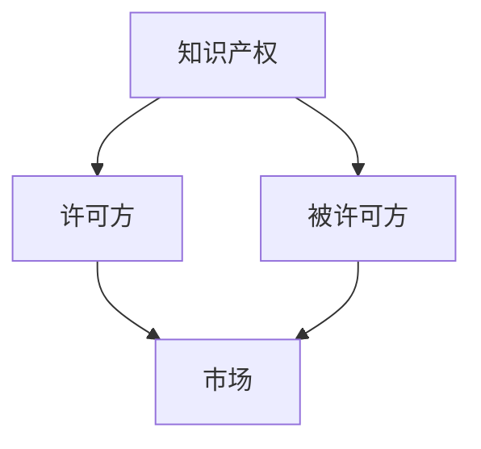
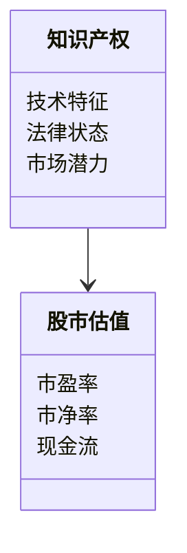
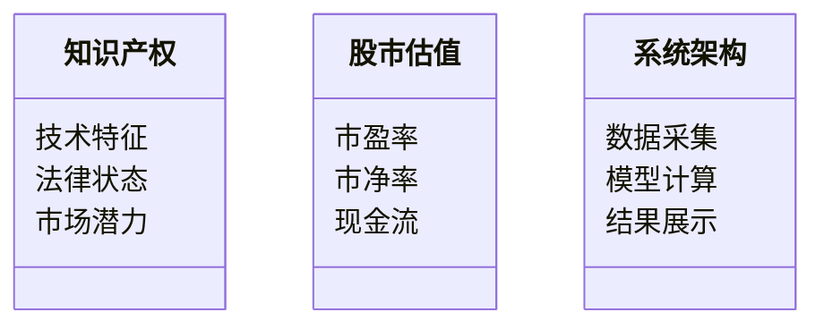
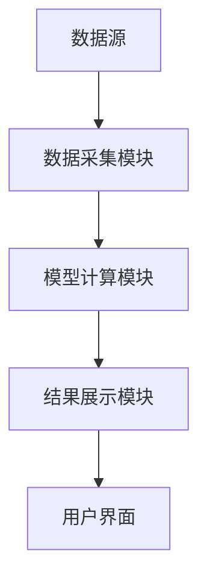
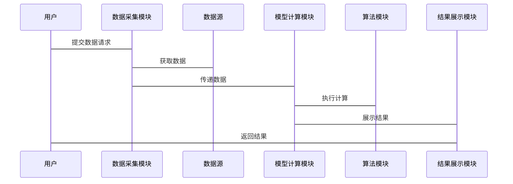

                 


```markdown
# 股市估值在跨境知识产权许可定价中的应用

## 关键词：股市估值、知识产权许可、定价模型、跨境应用、金融科技

## 摘要：本文探讨了股市估值方法在跨境知识产权许可定价中的应用，分析了知识产权评估的核心要素和股市估值的关键原理，结合实际案例，详细讲解了如何将股市估值算法应用于知识产权定价，构建了系统的解决方案，并提供了最佳实践和未来研究方向。

---

# 第1章: 股市估值与知识产权许可定价的背景介绍

## 1.1 股市估值的核心概念
### 1.1.1 股市估值的基本原理
股市估值是通过对公司财务数据和市场表现的分析，评估其内在价值和市场价值的过程。常用的方法包括市盈率（P/E）、市净率（P/B）和现金流折现法（DCF）等。

### 1.1.2 股票价格与公司价值的关系
股票价格反映了市场的对公司价值的预期。公司价值包括资产价值、盈利能力、成长潜力等因素，而股票价格则是这些因素的市场体现。

### 1.1.3 股市估值的常见方法
1. **相对估值法**：通过比较同类公司的估值指标来确定目标公司的价值。
2. **绝对估值法**：基于公司自身的财务数据，如现金流、净利润等，计算其内在价值。
3. **指数估值法**：通过市场指数的表现来评估个股的估值水平。

## 1.2 知识产权许可定价的基本原理
### 1.2.1 知识产权的定义与特点
知识产权是指依法保护的创造性成果，包括专利、商标、版权等。其特点包括无形性、专有性、地域性和时间性。

### 1.2.2 知识产权许可定价的必要性
在跨境交易中，知识产权的许可使用需要确定合理的定价，以平衡许可方和被许可方的利益，同时确保符合相关法律法规。

### 1.2.3 知识产权许可定价的常见方法
1. **成本加成法**：基于开发和维护知识产权的成本，加上合理利润。
2. **市场法**：参考同类知识产权的市场价格。
3. **收益法**：基于知识产权带来的预期收益进行定价。

## 1.3 股市估值与知识产权许可定价的关联性
### 1.3.1 两者的核心联系
股市估值的核心在于通过市场数据和财务指标评估公司价值，而知识产权定价则关注如何将无形资产的市场价值转化为可量化的指标。

### 1.3.2 股市估值方法在知识产权定价中的应用潜力
股市估值中的相对估值和绝对估值方法可以借鉴到知识产权定价中，尤其是通过市场法和收益法来评估知识产权的市场价值。

### 1.3.3 知识产权许可定价的边界与外延
知识产权定价不仅涉及经济因素，还受到法律、税收和市场环境的影响。因此，定价模型需要综合考虑多方面因素。

## 1.4 本章小结
本章介绍了股市估值和知识产权许可定价的基本概念及其关联性，为后续章节的深入分析奠定了基础。

---

# 第2章: 知识产权与股市估值的核心概念与联系

## 2.1 知识产权的核心要素
### 2.1.1 知识产权的类型
包括专利权、商标权、版权、软件著作权等。

### 2.1.2 知识产权的评估维度
包括技术先进性、市场应用潜力、法律保护力度等。

### 2.1.3 知识产权的法律保护
知识产权的法律保护是其价值的重要组成部分，不同国家的法律环境可能影响其市场估值。

## 2.2 股市估值的核心原理
### 2.2.1 股票价格的决定因素
包括公司盈利能力、成长性、行业地位、市场情绪等。

### 2.2.2 市盈率与市净率的计算方法
- **市盈率（P/E）** = 股价 / 每股净利润
- **市净率（P/B）** = 股价 / 每股净资产

### 2.2.3 股市估值的数学模型
例如，现金流折现模型（DCF）用于估算公司的内在价值。

## 2.3 知识产权与股市估值的对比分析
### 2.3.1 核心概念对比
| 对比维度 | 知识产权 | 股市估值 |
|----------|----------|----------|
| 评估对象 | 无形资产 | 公司整体价值 |
| 评估方法 | 成本法、市场法、收益法 | 相对估值、绝对估值 |
| 时间跨度 | 中长期 | 短期至中长期 |

### 2.3.2 评估方法对比
- 知识产权评估更注重技术或品牌的市场潜力，而股市估值更关注公司的财务表现和市场地位。

### 2.3.3 应用场景对比
知识产权评估主要用于交易定价，而股市估值用于市场定价。

## 2.4 实体关系图与领域模型
### 2.4.1 Mermaid 实体关系图


### 2.4.2 Mermaid 领域模型类图


## 2.5 本章小结
本章通过对比分析和模型构建，揭示了知识产权与股市估值的核心联系，为后续应用奠定了基础。

---

# 第3章: 股市估值算法在知识产权定价中的应用

## 3.1 股市估值的核心算法
### 3.1.1 市盈率法
基于目标公司的市盈率和可比公司的平均市盈率，估算其股票价值。

### 3.1.2 市净率法
基于目标公司的市净率和可比公司的平均市净率，估算其股票价值。

### 3.1.3 现金流折现法
通过预测公司的未来现金流，使用适当的折现率计算其现值。

## 3.2 知识产权定价的算法原理
### 3.2.1 基于收益的定价模型
公式：$P = r \times EBIT$
其中，$P$为许可费，$r$为分成率，$EBIT$为被许可方的收益。

### 3.2.2 基于市场的定价模型
公式：$P = k \times P_{\text{可比}}$
其中，$k$为调整系数，$P_{\text{可比}}$为可比知识产权的许可费。

### 3.2.3 基于成本的定价模型
公式：$P = C + \alpha \times (C \times \beta)$
其中，$C$为开发成本，$\alpha$和$\beta$为调整系数。

## 3.3 股市估值算法与知识产权定价的结合
### 3.3.1 算法选择与优化
选择合适的股市估值算法，结合知识产权的特性进行调整，例如在收益法中加入市场因素。

### 3.3.2 算法实现
```python
def stock_valuation(stock_data):
    pe = stock_data['price'] / stock_data['eps']
    pb = stock_data['price'] / stock_data['bvps']
    return {'pe': pe, 'pb': pb}

# 示例
stock_data = {
    'price': 100,
    'eps': 10,
    'bvps': 20
}
result = stock_valuation(stock_data)
print(result)
```

### 3.3.3 算法的数学模型
例如，现金流折现模型：
$$
\text{企业价值} = \sum_{t=1}^{n} \frac{\text{现金流}_t}{(1 + r)^t}
$$

## 3.4 本章小结
本章详细讲解了股市估值算法在知识产权定价中的应用，通过算法优化和案例分析，展示了其实际价值。

---

# 第4章: 系统分析与架构设计方案

## 4.1 问题场景介绍
在跨境知识产权许可中，定价需要考虑汇率、法律差异和市场环境等因素。

## 4.2 系统功能设计
### 4.2.1 领域模型类图


### 4.2.2 系统架构设计


## 4.3 系统接口设计
接口设计包括数据输入、模型调用和结果输出。

## 4.4 系统交互序列图


## 4.5 本章小结
本章通过系统架构设计，展示了如何将股市估值算法应用于知识产权定价的系统中，确保各模块的高效协作。

---

# 第5章: 项目实战与案例分析

## 5.1 环境安装
需要安装Python、相关库（如Pandas、NumPy）和Mermaid工具。

## 5.2 核心代码实现
```python
import pandas as pd

def calculate_price(stock_data):
    pe = stock_data['price'] / stock_data['eps']
    pb = stock_data['price'] / stock_data['bvps']
    return pe, pb

data = pd.DataFrame({
    'price': [100],
    'eps': [10],
    'bvps': [20]
})

pe, pb = calculate_price(data)
print(f"市盈率：{pe[0]}, 市净率：{pb[0]}")
```

## 5.3 案例分析
以某技术专利为例，通过市盈率和市净率法估算其许可价格，并分析结果的合理性。

## 5.4 本章小结
通过实际案例分析，验证了股市估值算法在知识产权定价中的有效性。

---

# 第6章: 最佳实践与总结

## 6.1 最佳实践
### 6.1.1 数据质量的重要性
确保数据的准确性和完整性。

### 6.1.2 模型适用性
根据具体情况选择合适的估值模型。

### 6.1.3 法律与税务因素
考虑不同国家的法律和税务政策对定价的影响。

## 6.2 本章小结
总结了全文的主要内容，强调了股市估值在知识产权定价中的重要性，并提出了未来的研究方向。

---

# 结论与展望

未来的研究可以探索动态定价模型和区块链技术在知识产权定价中的应用，进一步提升定价的准确性和效率。

---

# 参考文献

（此处列出相关的书籍、论文和资源）

---

通过以上结构，本文系统地探讨了股市估值在跨境知识产权许可定价中的应用，为相关领域的研究和实践提供了有价值的参考。
```

