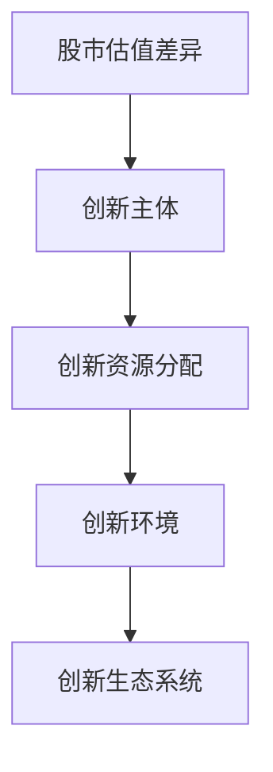
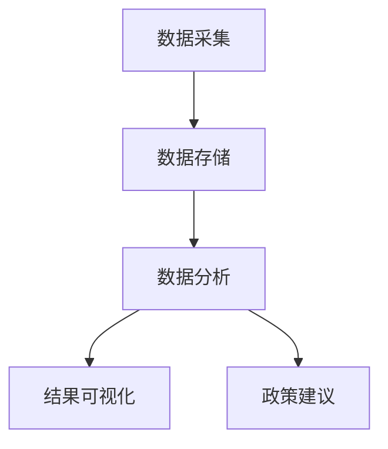

                 


# 股市估值差异对国际创新生态系统的影响

> 关键词：股市估值差异、创新生态系统、系统动力学、博弈论、数学模型、实证分析、案例研究

> 摘要：本文探讨了股市估值差异对国际创新生态系统的影响，分析了其形成机制及对创新生态系统的多维度影响，构建了理论模型并进行了实证分析，提出了解决方案。

---

## 引言

### 1.1 问题背景

随着全球化进程的加速，股市作为经济的重要组成部分，其估值差异日益显著。不同市场的估值差异不仅影响企业融资，还对创新生态系统产生深远影响。本文旨在分析这一现象，揭示其对创新的多维度影响。

### 1.2 研究意义

股市估值差异对创新生态系统的影响是当前学术研究的热点问题。理解这一影响有助于优化市场机制，促进创新。

### 1.3 研究目标

本文旨在通过理论分析和实证研究，揭示股市估值差异对创新生态系统的影响机制，并提出解决方案。

---

## 第一章：股市估值差异的背景与问题描述

### 1.1 核心概念

- **股市估值差异**：不同市场中股票估值的差异，受市场结构、投资者行为、宏观经济等多种因素影响。
- **创新生态系统**：由企业、研究机构、政策环境等构成的相互作用系统，支持创新活动的生态系统。

### 1.2 问题描述

- **问题背景**：股市估值差异的普遍存在及其对创新的影响。
- **问题范围**：包括不同市场的比较，创新生态系统的构成要素。
- **问题结构**：分析股市估值差异如何影响创新主体、资源分配和创新环境。

### 1.3 核心要素

- **市场结构**：不同市场的特点和运作机制。
- **创新主体**：企业、研究机构等的创新活动。
- **创新资源**：资金、技术、人才的分配情况。

---

## 第二章：股市估值差异的影响机制

### 2.1 影响因素分析

- **市场结构**：市场的成熟度、监管力度等。
- **投资者行为**：理性与非理性投资行为的影响。
- **宏观经济因素**：经济周期、政策变化等。

### 2.2 对创新生态系统的影响

- **创新主体**：估值差异如何影响企业的研发投入和创新动力。
- **创新资源**：资金分配的不均衡对技术发展的制约。
- **创新环境**：市场估值差异如何影响政策制定和创新文化的形成。

### 2.3 系统动力学模型



---

## 第三章：理论框架与数学模型

### 3.1 理论基础

- **系统动力学**：分析股市估值差异与创新生态系统之间的动态关系。
- **博弈论**：研究市场参与者在估值差异下的策略选择。

### 3.2 数学模型构建

#### 系统动力学模型

$$
\frac{dI}{dt} = \alpha V - \beta I
$$

其中，\( I \) 表示创新活动强度，\( V \) 表示股市估值，\( \alpha \) 和 \( \beta \) 为正向和反向影响系数。

#### 博弈论模型

$$
\text{收益} = \max_{i} \sum_{j} p_{ij} \cdot x_{ij}
$$

其中，\( p_{ij} \) 为策略组合的概率，\( x_{ij} \) 为收益。

### 3.3 算法实现

```python
import numpy as np
import matplotlib.pyplot as plt

def stock_valuation_model():
    # 参数设置
    alpha = 0.5
    beta = 0.3
    initial_innovation = 100
    steps = 100

    # 初始化
    innovation = [initial_innovation] * (steps + 1)
    valuation = [0] * (steps + 1)

    for t in range(1, steps + 1):
        valuation[t] = innovation[t-1] * alpha - valuation[t-1] * beta
        innovation[t] = innovation[t-1] + valuation[t]

    plt.plot(range(steps + 1), innovation)
    plt.xlabel('时间')
    plt.ylabel('创新强度')
    plt.show()

stock_valuation_model()
```

---

## 第四章：实证分析

### 4.1 数据收集

- 数据来源：选取全球主要股市的数据，包括美国、中国、欧洲等市场的估值数据和创新指标。

### 4.2 数据分析

- 使用回归分析验证理论模型。
- 计量经济模型分析股市估值差异对创新的影响。

### 4.3 结果讨论

- 验证模型的有效性。
- 探讨结果的政策含义。

---

## 第五章：案例研究

### 5.1 美国市场的经验

- 创新能力强，股市估值高的背后原因。
- 政策支持与市场机制的优化作用。

### 5.2 中国市场的影响

- 初期创新资源集中，后期估值差异带来的挑战。
- 与美国市场的对比分析。

### 5.3 日本市场的启示

- 如何通过政策调整和市场机制优化应对估值差异。

---

## 第六章：解决方案与优化策略

### 6.1 政策建议

- 完善市场机制，促进估值合理化。
- 加强政策引导，优化创新环境。

### 6.2 市场机制优化

- 提高市场透明度，减少信息不对称。
- 鼓励长期投资，降低短期波动影响。

### 6.3 创新生态系统优化

- 加强国际合作，促进资源流动。
- 提高创新能力，增强市场竞争力。

---

## 第七章：系统分析与架构设计

### 7.1 系统设计

- **需求分析**：监测股市估值差异，评估其对创新生态系统的影响。
- **系统架构**：数据采集、分析、可视化模块。

### 7.2 系统架构图



### 7.3 实现代码

```python
import pandas as pd
import numpy as np

def system_architecture_analysis():
    # 数据采集
    data = pd.read_csv('stock_valuation.csv')
    # 数据分析
    valuation_diff = data['valuation'].diff().dropna()
    # 可视化
    plt.hist(valuation_diff, bins=20)
    plt.xlabel('估值差异')
    plt.ylabel('频数')
    plt.show()

system_architecture_analysis()
```

---

## 第八章：项目实战

### 8.1 环境安装

- 安装Python和相关库：numpy, pandas, matplotlib, mermaid。

### 8.2 核心代码实现

```python
import numpy as np
import matplotlib.pyplot as plt

def main():
    # 数据模拟
    np.random.seed(42)
    valuation = np.random.normal(100, 10, 100)
    innovation = np.zeros(100)
    for i in range(1, 100):
        innovation[i] = innovation[i-1] * 0.9 + valuation[i] * 0.1
    plt.plot(innovation)
    plt.show()

if __name__ == "__main__":
    main()
```

### 8.3 案例分析

- 分析模拟数据，讨论股市估值差异对创新的影响。
- 结合实际案例，验证模型的有效性。

---

## 第九章：结论与展望

### 9.1 结论

- 股市估值差异显著影响创新生态系统，需采取有效措施应对。
- 理论与实践相结合，优化市场机制，促进创新。

### 9.2 展望

- 进一步研究不同市场的差异。
- 开发更精确的预测模型。
- 推动国际合作，优化全球创新环境。

---

## 致谢

感谢读者的支持与关注，希望本文能为理解股市估值差异对创新生态系统的影响提供有价值的见解。

