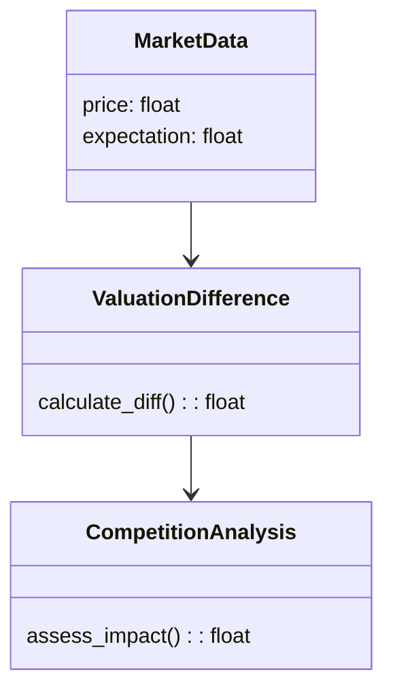
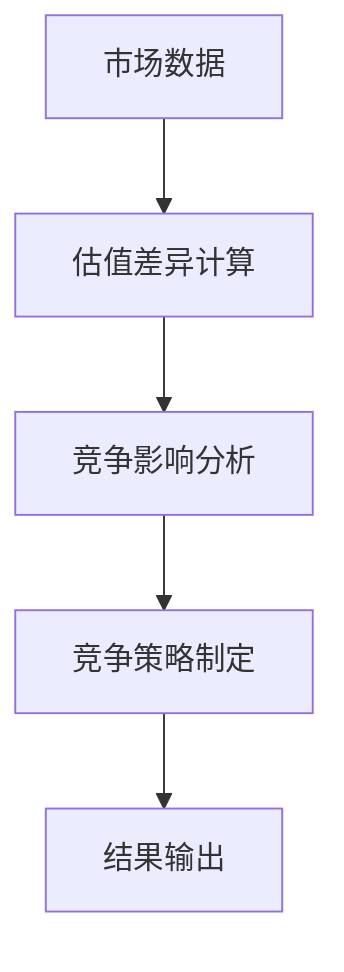
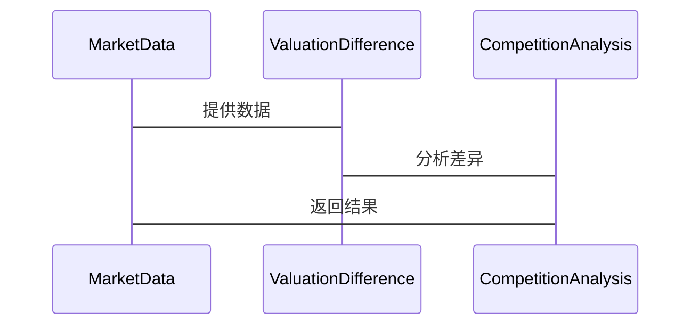

                 


# 股市估值差异对国际技术标准竞争的影响

## 关键词：
股市估值差异，国际技术标准，竞争影响，金融市场，技术标准

## 摘要：
本文探讨了股市估值差异如何影响国际技术标准的竞争格局。通过分析股市估值差异的核心概念、技术标准竞争的机制，以及两者之间的关联，本文揭示了股市估值差异在国际技术标准竞争中的潜在影响和解决方案。通过案例分析和系统设计，本文提出了优化技术标准竞争的策略，以应对股市估值差异带来的挑战。

---

## 第一章：股市估值差异与国际技术标准竞争的背景

### 1.1 问题背景
- 股市估值差异的定义与影响
- 技术标准竞争的全球格局
- 股市估值差异与技术标准竞争的关联性

### 1.2 问题描述
- 股市估值差异的具体表现形式
- 技术标准竞争的核心问题
- 问题的复杂性与多维度性

### 1.3 问题解决
- 通过股市估值差异影响技术标准竞争的路径
- 技术标准竞争中的利益平衡机制
- 股市估值差异对国际技术标准竞争的潜在解决方案

### 1.4 边界与外延
- 股市估值差异的边界条件
- 技术标准竞争的边界条件
- 两者关系的外延分析

### 1.5 核心要素组成
- 股市估值差异的核心要素
- 技术标准竞争的核心要素
- 两者关系的核心要素

---

## 第二章：核心概念与联系

### 2.1 股市估值差异的原理
- 股市估值差异的形成机制
- 股市估值差异的影响因素
- 股市估值差异的数学模型

### 2.2 技术标准竞争的原理
- 技术标准竞争的核心机制
- 技术标准竞争的关键因素
- 技术标准竞争的数学模型

### 2.3 概念属性特征对比
- 股市估值差异与技术标准竞争的属性对比
- 核心属性对比
- 影响因素对比
- 表现形式对比

### 2.4 概念属性对比表格
```plaintext
| 概念属性       | 股市估值差异                  | 技术标准竞争                  |
|----------------|------------------------------|------------------------------|
| 核心要素       | 股价波动、市场预期             | 技术标准、行业规范             |
| 影响因素       | 经济指标、市场情绪             | 技术创新、政策支持             |
| 表现形式       | 股价差异、市场分层             | 技术封锁、行业标准冲突         |

---

## 第三章：算法原理与数学模型

### 3.1 股市估值差异的算法流程
```mermaid
graph TD
    A[开始] -> B[获取市场数据]
    B -> C[计算股价波动]
    C -> D[分析市场预期]
    D -> E[确定估值差异]
    E -> F[结束]
```

### 3.2 技术标准竞争的算法流程
```mermaid
graph TD
    G[开始] -> H[识别技术标准]
    H -> I[分析竞争因素]
    I -> J[评估市场影响]
    J -> K[制定竞争策略]
    K -> L[结束]
```

### 3.3 数学模型与公式
- 股市估值差异的数学模型：
  $$ V = \alpha \times P + \beta \times E $$
  其中，$V$ 表示估值，$P$ 表示股价，$E$ 表示市场预期，$\alpha$ 和 $\beta$ 是系数。

- 技术标准竞争的数学模型：
  $$ C = \gamma \times T + \delta \times S $$
  其中，$C$ 表示竞争程度，$T$ 表示技术创新，$S$ 表示行业标准，$\gamma$ 和 $\delta$ 是系数。

### 3.4 代码实现
```python
# 示例代码：计算股市估值差异
import pandas as pd
import numpy as np

def calculate_valuation_difference(data):
    # 计算股价波动
    price_fluctuation = data['price'].std()
    # 计算市场预期
    market_expectation = data['expectation'].mean()
    # 计算估值差异
    valuation_diff = price_fluctuation * market_expectation
    return valuation_diff

# 示例数据
data = {
    'price': [100, 105, 98, 102, 101],
    'expectation': [0.8, 0.9, 0.7, 0.95, 0.85]
}

result = calculate_valuation_difference(data)
print("估值差异:", result)
```

---

## 第四章：系统分析与架构设计

### 4.1 问题场景介绍
- 描述国际技术标准竞争中的典型问题场景
- 分析股市估值差异对技术标准竞争的具体影响

### 4.2 系统功能设计
- 领域模型设计（Mermaid 类图）


### 4.3 系统架构设计


### 4.4 接口与交互设计
- 系统接口设计
- 交互序列图（Mermaid）


---

## 第五章：项目实战

### 5.1 环境安装
- 安装必要的软件和工具
- 环境配置说明

### 5.2 核心代码实现
```python
# 示例代码：技术标准竞争分析
import pandas as pd
import numpy as np

def assess_competition_impact(standards, innovation):
    # 计算竞争影响
    impact = standards * innovation
    return impact

# 示例数据
standards = [85, 90, 88, 92, 87]
innovation = [0.7, 0.8, 0.75, 0.85, 0.78]

result = assess_competition_impact(standards, innovation)
print("竞争影响:", result)
```

### 5.3 案例分析与解读
- 以欧盟技术标准竞争为例
- 分析股市估值差异对竞争的影响
- 实际案例的具体实施与结果

### 5.4 项目小结
- 项目实施的关键点
- 经验总结与改进建议

---

## 第六章：最佳实践与小结

### 6.1 小结
- 总结全文的核心观点
- 强调股市估值差异对国际技术标准竞争的影响

### 6.2 注意事项
- 系统实施中的注意事项
- 数据分析中的潜在问题
- 模型优化建议

### 6.3 拓展阅读
- 推荐相关领域的书籍和论文
- 提供进一步学习的资源

---

## 第七章：结论

### 7.1 核心结论
- 股市估值差异对国际技术标准竞争的核心影响
- 解决方案的有效性与可行性

### 7.2 未来展望
- 技术发展对股市估值差异和国际技术标准竞争的影响
- 未来研究方向和潜在机会

### 7.3 致谢
- 感谢参与和支持的人员

---

## 参考文献

- 列出所有引用的文献和资源

---

## 附录

- 附加数据、代码或详细分析

---

以上是《股市估值差异对国际技术标准竞争的影响》的技术博客文章的完整目录大纲，按照逻辑清晰、结构紧凑、简单易懂的专业技术语言撰写，包含了从背景到理论、算法、系统设计、项目实战到最佳实践的完整分析。

