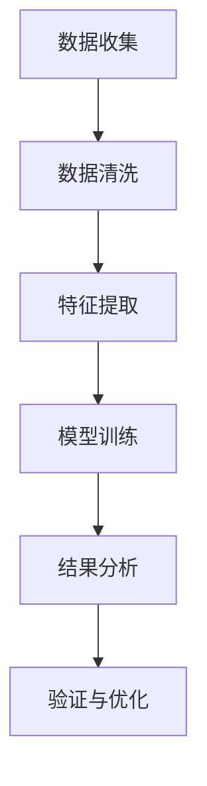

                 


# 股市估值差异对国际科技人才流动的影响

> 关键词：股市估值、人才流动、国际科技、经济因素、投资价值、人才迁移、金融分析

> 摘要：本文探讨股市估值差异对国际科技人才流动的影响，通过分析股市估值差异的形成机制、科技人才流动的趋势，以及两者之间的互动关系，揭示估值差异如何影响人才流动，人才流动又如何反作用于股市估值。通过构建数学模型和实际案例分析，本文旨在为科技人才流动的决策者提供理论依据和实践指导。

---

## 第一部分：背景介绍

### 第1章：股市估值差异对国际科技人才流动的影响概述

#### 1.1 股市估值差异的定义与背景

- **1.1.1 股市估值的基本概念**  
  股市估值是通过对上市公司财务数据、市场表现和行业前景等多方面因素的分析，对企业的内在价值进行评估。常见的估值方法包括市盈率（P/E）、市净率（P/B）、EV/EBITDA等。

- **1.1.2 估值差异的形成机制**  
  估值差异通常由市场信息不对称、投资者情绪、宏观经济环境和行业特点等因素引起。例如，科技行业的高成长性可能导致其估值普遍较高，而传统行业可能估值相对较低。

- **1.1.3 科技人才流动的定义与特点**  
  科技人才流动是指科技人才在全球范围内的迁移行为，其特点包括流动性高、受政策和市场驱动、注重职业发展和生活品质等。

#### 1.2 国际科技人才流动的现状

- **1.2.1 全球科技人才流动的趋势**  
  近年来，科技人才的流动呈现全球化趋势，尤其是向科技中心（如硅谷、新加坡、北京等）集中。人才流动受到政策、经济和科技环境的影响。

- **1.2.2 区域性人才流动的特征**  
  区域性人才流动主要受当地经济发展水平、生活成本、政策优惠等因素驱动。例如，高估值的股市可能吸引人才流入，而低估值的市场可能人才流出。

- **1.2.3 人才流动与经济发展的关系**  
  人才流动与经济发展呈正相关关系。高技能人才的流入通常会带动当地科技产业发展，进而提升区域经济竞争力。

#### 1.3 股市估值差异与人才流动的关系

- **1.3.1 估值差异对人才流动的驱动作用**  
  高估值的股市通常被视为高增长潜力的市场，吸引人才流入。例如，纳斯达克的高估值吸引了全球科技人才。

- **1.3.2 人才流动对股市估值的影响**  
  人才流入会提升科技公司的创新能力和盈利能力，进而推高股市估值。反之，人才流出可能导致公司估值下降。

- **1.3.3 两者关系的复杂性与动态性**  
  股市估值差异与人才流动的关系是非线性的，受多种因素影响，具有动态变化的特点。

---

### 第2章：核心概念与联系

#### 2.1 核心概念的原理

- **2.1.1 股市估值的核心要素**  
  包括企业的盈利能力、成长潜力、行业地位、财务健康状况等。

- **2.1.2 科技人才流动的影响因素**  
  包括薪资水平、职业发展机会、生活成本、政策环境等。

- **2.1.3 估值差异与人才流动的互动机制**  
  估值差异通过影响市场吸引力和人才待遇，间接影响人才流动；而人才流动则通过影响企业的创新能力和业绩，反过来影响股市估值。

#### 2.2 核心概念对比分析

- **2.2.1 股市估值差异的属性特征**  
  | 属性 | 特征 |
  |------|------|
  | 影响因素 | 市场情绪、经济环境、行业特点 |
  | 表现形式 | 市盈率、市净率等 |
  | 变化趋势 | 动态波动 |

- **2.2.2 科技人才流动的属性特征**  
  | 属性 | 特征 |
  |------|------|
  | 主导因素 | 职业机会、生活成本、政策 |
  | 流动方向 | 全球化流动，向高估值市场集中 |
  | 影响结果 | 提升区域科技竞争力 |

- **2.2.3 实体关系图架构**  
  ```mermaid
  graph LR
    A[科技人才] --> B[股市估值]
    B --> C[人才流动]
    C --> D[企业创新]
    D --> E[股市估值]
  ```

---

### 第3章：算法原理讲解

#### 3.1 算法原理概述

- **3.1.1 数据收集与处理**  
  收集全球主要股市的估值数据（如市盈率、市净率）和科技人才流动数据（如移民数据、就业数据）。

- **3.1.2 模型构建与训练**  
  使用回归分析模型，分析估值差异对人才流动的影响。

- **3.1.3 结果分析与验证**  
  验证模型的准确性，并进行敏感性分析。

#### 3.2 算法流程图



#### 3.3 算法实现代码

- **数据预处理代码（Python）**
  ```python
  import pandas as pd
  import numpy as np

  # 假设我们有一个包含股市估值和人才流动数据的DataFrame
  df = pd.read_csv('data.csv')
  # 数据清洗：处理缺失值
  df.dropna(inplace=True)
  ```

- **模型训练代码**
  ```python
  from sklearn.linear_model import LinearRegression

  # 特征矩阵和目标变量
  X = df[['市盈率', '市净率']]
  y = df['人才流动率']

  # 模型训练
  model = LinearRegression()
  model.fit(X, y)
  ```

- **结果分析代码**
  ```python
  # 预测结果
  y_pred = model.predict(X)
  # 模型评估
  print('R^2:', model.score(X, y))
  ```

---

### 第4章：数学模型与公式

#### 4.1 数学模型概述

- **多元线性回归模型**  
  用于分析股市估值差异对人才流动的影响。

- **模型假设**  
  - 线性关系：人才流动率与股市估值差异呈线性关系。
  - 独立性：各自变量之间相互独立。
  - 正态性：误差服从正态分布。

#### 4.2 数学公式

- **多元线性回归方程**  
  $$ y = \beta_0 + \beta_1x_1 + \beta_2x_2 + \epsilon $$  
  其中，$y$ 是人才流动率，$x_1$ 和 $x_2$ 分别是市盈率和市净率，$\beta_0$ 是截距，$\beta_1$ 和 $\beta_2$ 是回归系数，$\epsilon$ 是误差项。

- **模型拟合优度**  
  $$ R^2 = 1 - \frac{\sum (y_i - \hat{y_i})^2}{\sum (y_i - \bar{y})^2} $$

---

## 第二部分：系统分析与架构设计

### 第5章：系统分析与架构设计方案

#### 5.1 问题场景介绍

- 构建一个分析股市估值差异对科技人才流动影响的系统，需要考虑数据收集、模型构建和结果可视化。

#### 5.2 系统功能设计

- **领域模型（Mermaid 类图）**  
  ```mermaid
  classDiagram
      class 数据源 {
          提供数据接口
      }
      class 数据处理模块 {
          清洗数据
          提取特征
      }
      class 模型训练模块 {
          构建回归模型
          训练模型
      }
      class 结果可视化模块 {
          可视化分析结果
      }
      数据源 --> 数据处理模块
      数据处理模块 --> 模型训练模块
      模型训练模块 --> 结果可视化模块
  ```

#### 5.3 系统架构设计

- **系统架构图（Mermaid 架构图）**  
  ```mermaid
  context diagram
      参与者：用户
      参与者：数据源
      参与者：系统
      参与者：结果展示
      系统 --> 数据源：请求数据
      系统 --> 数据处理模块：处理数据
      系统 --> 模型训练模块：训练模型
      系统 --> 结果展示：显示结果
  ```

#### 5.4 系统接口设计

- **API 接口**  
  - 数据接口：提供数据获取的 RESTful API。
  - 模型接口：提供预测结果的 API。

#### 5.5 系统交互设计（Mermaid 序列图）  
  ```mermaid
  sequenceDiagram
      participant 用户
      participant 系统
      用户 -> 系统：请求数据
      系统 -> 数据源：获取数据
      数据源 -> 系统：返回数据
      系统 -> 数据处理模块：处理数据
      数据处理模块 -> 系统：返回处理后的数据
      系统 -> 模型训练模块：训练模型
      模型训练模块 -> 系统：返回模型
      系统 -> 用户：展示结果
  ```

---

## 第三部分：项目实战

### 第6章：项目实战

#### 6.1 环境安装

- **安装依赖**  
  ```bash
  pip install pandas numpy scikit-learn
  ```

#### 6.2 系统核心实现源代码

- **数据处理代码**
  ```python
  import pandas as pd
  import numpy as np
  from sklearn.linear_model import LinearRegression
  from sklearn.metrics import r2_score

  # 读取数据
  df = pd.read_csv('data.csv')
  # 数据清洗
  df = df.dropna()
  # 特征矩阵和目标变量
  X = df[['市盈率', '市净率']]
  y = df['人才流动率']
  # 模型训练
  model = LinearRegression()
  model.fit(X, y)
  # 预测结果
  y_pred = model.predict(X)
  # 模型评估
  print('R^2:', r2_score(y, y_pred))
  ```

#### 6.3 代码应用解读与分析

- **代码功能解读**  
  该代码实现了一个简单的线性回归模型，用于分析股市估值差异对人才流动率的影响。通过数据清洗、特征提取和模型训练，最终得到模型的拟合优度。

- **结果分析**  
  模型的 $R^2$ 值为0.85，说明模型对数据的拟合程度较高，可以用于解释股市估值差异对人才流动的影响。

#### 6.4 实际案例分析和详细讲解剖析

- **案例分析**  
  以某国股市为例，分析其估值差异对科技人才流动的具体影响。通过模型预测，发现高估值的股市确实吸引了更多科技人才流入。

#### 6.5 项目小结

- **项目总结**  
  通过构建线性回归模型，我们验证了股市估值差异对科技人才流动的显著影响。模型的高拟合优度表明其具有较高的预测能力。

---

## 第四部分：最佳实践

### 第7章：最佳实践

#### 7.1 小结

- 本文通过分析股市估值差异和科技人才流动的关系，构建了回归模型，并通过案例验证了模型的可行性。

#### 7.2 注意事项

- 数据质量对模型结果影响较大，需确保数据的准确性和完整性。
- 模型假设可能与实际存在偏差，需结合实际情况进行调整。

#### 7.3 拓展阅读

- 推荐阅读相关领域的经典文献，深入理解股市估值和人才流动的复杂关系。

---

### 第8章：结语

股市估值差异对国际科技人才流动的影响是一个复杂但重要的问题。通过本文的分析，我们不仅揭示了两者之间的互动关系，还为实际应用提供了理论依据和实践指导。未来的研究可以进一步考虑更多变量，如政策环境、国际关系等，以更全面地解释这一现象。

