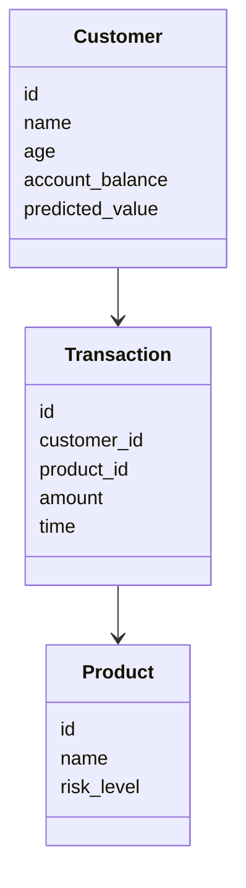
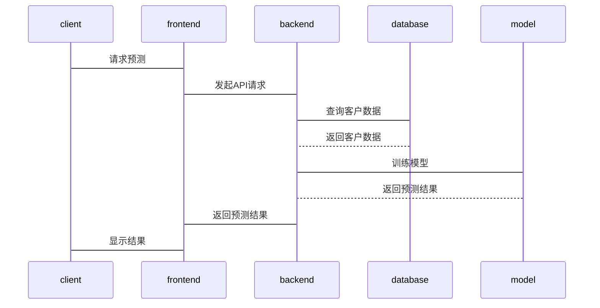

                 


# 金融产品客户生命周期价值预测

> 关键词：客户生命周期价值，金融产品，机器学习，预测模型，数据特征工程，系统架构设计

> 摘要：本文详细探讨了金融产品客户生命周期价值预测的核心概念、算法原理、系统架构设计及项目实战。通过分析客户生命周期的不同阶段，结合机器学习算法，构建客户价值预测模型，优化金融产品的客户管理策略，提升企业收益。

---

## 第一章：客户生命周期价值预测的背景与意义

### 1.1 问题背景

#### 1.1.1 金融产品与客户价值的关系
金融产品通过满足客户的财务需求，实现客户价值的提升。客户生命周期价值（Customer Lifetime Value, CLV）是客户在生命周期内为企业带来的总收入减去相关成本，反映了客户与企业之间的长期价值关系。

#### 1.1.2 客户生命周期价值预测的重要性
- **客户获取与留存**：通过预测客户价值，企业可以优化营销策略，精准定位高价值客户，降低客户流失率。
- **产品优化**：了解客户在不同生命周期阶段的需求，有助于金融产品设计和优化。
- **风险控制**：基于客户价值的预测，企业可以更有效地管理信用风险和市场风险。

#### 1.1.3 金融行业客户价值管理的现状与挑战
- 数据碎片化：客户数据分散在不同系统中，难以整合。
- 模型复杂性：客户行为和市场环境复杂，模型需要高精度和实时性。
- 数据隐私与安全：金融数据敏感，数据处理需符合相关法规。

### 1.2 问题描述

#### 1.2.1 客户生命周期的定义与阶段划分
客户生命周期分为引入期、成长期、成熟期和衰退期。不同阶段的客户行为和价值贡献不同，需要针对性的管理策略。

#### 1.2.2 金融产品客户价值预测的核心问题
- 如何准确预测客户在生命周期各阶段的价值？
- 如何构建预测模型，平衡准确性和可解释性？
- 如何将预测结果应用于实际业务决策？

#### 1.2.3 业务目标与技术目标的统一
业务目标：提高客户 retention 率，提升客户贡献价值。
技术目标：构建高精度、可解释的预测模型，支持实时预测和动态调整。

### 1.3 问题解决思路

#### 1.3.1 数据驱动的客户价值预测方法
- 数据收集：整合交易、行为、属性等多源数据。
- 数据清洗与预处理：处理缺失值、异常值，标准化数据。
- 特征工程：提取时间序列、客户行为、属性特征，构建高维特征集。

#### 1.3.2 机器学习在客户价值预测中的应用
- 传统统计方法：线性回归、决策树。
- 高维数据处理：随机森林、梯度提升树。
- 深度学习：神经网络模型处理非线性关系。

#### 1.3.3 从单点预测到全生命周期管理的转变
- 单点预测：基于历史数据预测未来价值。
- 全生命周期管理：结合实时数据，动态调整预测模型，优化客户管理策略。

### 1.4 客户生命周期价值预测的边界与外延

#### 1.4.1 预测的边界条件
- 数据范围：样本量、时间跨度。
- 预测精度：模型的准确性与业务需求的平衡。
- 业务场景：应用场景限制，如零售银行、投资理财。

#### 1.4.2 相关概念的对比与区分
- CLV 与 Customer Retention：CLV 是长期价值，而 retention 是短期行为。
- CLV 与 Customer Churn：Churn 是客户流失预测，CLV 是价值评估。

#### 1.4.3 与其他客户价值管理方法的区别
- CLV 是预测客户未来价值，而 Customer Churn 是预测客户流失概率。
- CLV 更关注长期收益，而 Customer Lifetime Value 是整体价值评估。

### 1.5 核心概念结构与组成

#### 1.5.1 生命周期阶段划分
- 引入期：新客户，价值低，但潜力大。
- 成长期：客户价值逐步提升，行为活跃。
- 成熟期：价值最高，行为稳定。
- 衰退期：价值下降，行为减少。

#### 1.5.2 客户价值的核心影响因素
- 客户属性：年龄、性别、收入水平。
- 行为特征：交易频率、交易金额、产品持有数量。
- 时间特征：生命周期阶段、最近交易时间。

#### 1.5.3 数据特征与业务目标的对应关系
- 数据特征：客户属性、行为特征、时间特征。
- 业务目标：预测客户生命周期价值，优化客户管理策略。

---

## 第二章：数据收集与处理

### 2.1 数据来源与收集方法

#### 2.1.1 交易数据的收集
- 交易记录：包括交易时间、金额、产品类型。
- 渠道信息：线上或线下交易，渠道特征。

#### 2.1.2 客户行为数据的收集
- 登录频率：客户登录系统次数。
- 页面浏览：客户浏览的页面数量和类型。
- 互动行为：点赞、评论、分享等行为记录。

#### 2.1.3 客户属性数据的收集
- 基本信息：姓名、性别、年龄、职业。
- 账户信息：账户余额、理财产品持有情况。
- 风险偏好：客户对风险的承受能力评估。

#### 2.1.4 市场活动数据的收集
- 营销活动参与：客户参与的促销活动记录。
- 市场推广效果：活动带来的客户增长和价值提升。

### 2.2 数据清洗与预处理

#### 2.2.1 数据清洗方法
- 删除重复数据：去重处理。
- 处理缺失值：填充、删除或插值。
- 标准化数据：统一字段格式，如日期格式。

#### 2.2.2 数据标准化与归一化
- 标准化：将数据按比例缩放到均值为0，方差为1。
- 归一化：将数据缩放到0-1范围，便于模型收敛。

#### 2.2.3 数据缺失值的处理
- 删除法：直接删除缺失值较多的记录。
- 填充法：使用均值、中位数或模型预测填充缺失值。
- 标记法：标记缺失值，引入模型中作为特征。

#### 2.2.4 异常数据的识别与处理
- 异常检测：使用统计方法或机器学习模型识别异常值。
- 数据修正：根据业务逻辑修正异常值，或将其归类到合理区间。

### 2.3 数据特征工程

#### 2.3.1 时间序列特征的提取
- 近期行为：最近N次交易的时间、金额、产品类型。
- 频率变化：客户交易频率的变化趋势。
- 季节性特征：特定时间段的交易行为特征。

#### 2.3.2 客户行为特征的提取
- 交易活跃度：交易频率、金额、产品持有数量。
- 行为多样性：客户参与的产品类型多样性。
- 行为稳定性：客户行为的波动程度。

#### 2.3.3 客户属性特征的提取
- 基本属性：年龄、性别、职业。
- 账户特征：账户余额、理财产品持有情况。
- 风险偏好：客户对不同类型产品的偏好程度。

#### 2.3.4 高维数据的降维处理
- 主成分分析（PCA）：降低数据维度，保留主要信息。
- 线性判别分析（LDA）：根据类别信息降维。
- 聚类分析：将相似特征聚类，减少特征数量。

---

## 第三章：客户生命周期价值预测的核心概念与联系

### 3.1 生命周期阶段划分的原理

#### 3.1.1 生命周期阶段的定义
- 引入期：新客户，价值较低，但增长潜力大。
- 成长期：客户价值逐步提升，行为活跃。
- 成熟期：价值最高，行为稳定。
- 衰退期：价值下降，行为减少。

#### 3.1.2 阶段划分的依据与方法
- 依据：客户价值变化趋势、行为特征、时间特征。
- 方法：聚类分析、决策树、时间序列分析。

#### 3.1.3 阶段划分的实现步骤
1. 数据预处理：清洗和标准化数据。
2. 特征提取：提取客户属性、行为、时间特征。
3. 模型训练：使用聚类或分类模型划分阶段。
4. 结果验证：通过业务指标验证阶段划分的合理性。

### 3.2 客户价值预测的数学模型

#### 3.2.1 线性回归模型
- 线性回归模型用于预测客户价值的线性关系。
- 模型公式：$$ y = \beta_0 + \beta_1x_1 + \beta_2x_2 + ... + \beta_nx_n $$
- 假设：自变量与因变量之间存在线性关系。

#### 3.2.2 随机森林模型
- 随机森林是一种基于决策树的集成学习方法。
- 模型优点：高维数据处理能力强，抗过拟合。
- 模型公式：$$ y = \sum_{i=1}^{n} \text{Tree}(x_i) $$

#### 3.2.3 神经网络模型
- 神经网络适用于复杂非线性关系的建模。
- 模型结构：输入层、隐藏层、输出层。
- 模型公式：$$ y = f(Wx + b) $$，其中$$ f $$是激活函数。

### 3.3 核心概念的ER实体关系图

```mermaid
erDiagram
    customer[CUSTOMER] {
        id : integer
        name : string
        age : integer
        gender : string
        account_balance : float
    }
    product[FINANCIAL_PRODUCT] {
        product_id : integer
        product_name : string
        risk_level : integer
    }
    transaction[TRANSACTION] {
        transaction_id : integer
        customer_id : integer
        product_id : integer
        transaction_amount : float
        transaction_time : datetime
    }
    customer~MANY->transaction[has]
    product~MANY->transaction[has]
```

---

## 第四章：算法原理讲解

### 4.1 线性回归算法

#### 4.1.1 算法原理
线性回归通过最小化预测值与实际值的平方差之和，找到最佳拟合直线。
$$ \text{最小化} \sum_{i=1}^{n}(y_i - (\beta_0 + \beta_1x_{i1} + ... + \beta_kx_{ik}))^2 $$

#### 4.1.2 算法实现步骤
1. 数据预处理：标准化特征。
2. 模型训练：使用梯度下降或正规方程求解系数。
3. 模型评估：计算R²值，验证拟合优度。

#### 4.1.3 算法优缺点
- 优点：简单易懂，计算速度快。
- 缺点：只能处理线性关系，无法处理高维数据。

#### 4.1.4 示例代码
```python
from sklearn.linear_model import LinearRegression

# 数据准备
X = df[['age', 'income']]
y = df['customer_value']

# 模型训练
model = LinearRegression()
model.fit(X, y)

# 预测
y_pred = model.predict(X)
```

### 4.2 随机森林算法

#### 4.2.1 算法原理
随机森林通过构建多个决策树，并行投票机制进行预测。
$$ y = \text{median}(\{f_1(x), f_2(x), ..., f_n(x)\}) $$

#### 4.2.2 算法实现步骤
1. 数据预处理：特征选择，处理缺失值。
2. 模型训练：生成多个决策树，构建随机森林。
3. 模型评估：计算准确率，F1分数。

#### 4.2.3 算法优缺点
- 优点：高维数据处理能力强，抗过拟合。
- 缺点：计算复杂度高，模型解释性差。

#### 4.2.4 示例代码
```python
from sklearn.ensemble import RandomForestRegressor

# 数据准备
X = df[['age', 'income', 'product_held']]
y = df['customer_value']

# 模型训练
model = RandomForestRegressor(n_estimators=100)
model.fit(X, y)

# 预测
y_pred = model.predict(X)
```

### 4.3 神经网络算法

#### 4.3.1 算法原理
神经网络通过多层感知机，模拟人脑神经网络，处理复杂非线性关系。
$$ y = f(Wx + b) $$，其中$$ f $$是激活函数，如ReLU、sigmoid。

#### 4.3.2 算法实现步骤
1. 数据预处理：归一化特征。
2. 模型训练：使用梯度下降优化权重。
3. 模型评估：计算准确率，困惑度。

#### 4.3.3 算法优缺点
- 优点：处理非线性关系能力强，模型容量大。
- 缺点：计算复杂，需要大量数据支持，模型解释性差。

#### 4.3.4 示例代码
```python
from keras.models import Sequential
from keras.layers import Dense

# 数据准备
X = df[['age', 'income', 'product_held']]
y = df['customer_value']

# 模型训练
model = Sequential()
model.add(Dense(64, activation='relu', input_dim=X.shape[1]))
model.add(Dense(1))
model.compile(optimizer='adam', loss='mse')

model.fit(X, y, epochs=100, batch_size=32)
```

---

## 第五章：系统分析与架构设计

### 5.1 项目背景介绍

#### 5.1.1 项目目标
- 构建客户生命周期价值预测系统，优化客户管理策略。
- 提升客户 retention 率，降低客户流失率。

#### 5.1.2 项目范围
- 数据范围：全量客户数据，过去3年的交易记录。
- 功能范围：预测客户价值，划分生命周期阶段。

#### 5.1.3 项目约束
- 数据隐私与安全：符合GDPR等法规要求。
- 系统性能：实时预测，响应时间小于1秒。

### 5.2 系统功能设计

#### 5.2.1 领域模型


#### 5.2.2 系统架构设计


#### 5.2.3 接口设计
- API接口：提供RESTful API，供前端或第三方系统调用。
- 数据接口：与数据库、第三方数据源对接。

#### 5.2.4 交互流程图


---

## 第六章：项目实战

### 6.1 环境安装

#### 6.1.1 安装Python
```bash
python --version
pip install --upgrade pip
```

#### 6.1.2 安装依赖库
```bash
pip install numpy pandas scikit-learn keras
```

### 6.2 系统核心实现

#### 6.2.1 数据预处理代码
```python
import pandas as pd
import numpy as np

# 数据加载
df = pd.read_csv('customer_data.csv')

# 数据清洗
df.dropna(inplace=True)
df['age'].fillna(df['age'].mean(), inplace=True)

# 特征工程
from sklearn.preprocessing import StandardScaler
scaler = StandardScaler()
df[['age', 'income']] = scaler.fit_transform(df[['age', 'income']])
```

#### 6.2.2 模型训练代码
```python
from sklearn.ensemble import RandomForestRegressor

# 模型训练
model = RandomForestRegressor(n_estimators=100)
model.fit(X, y)

# 预测
y_pred = model.predict(X)
```

#### 6.2.3 模型部署代码
```python
from flask import Flask, request, jsonify

app = Flask(__name__)
model = RandomForestRegressor(n_estimators=100)
model.load_weights('model_weights.h5')

@app.route('/predict', methods=['POST'])
def predict():
    data = request.json
    X = np.array([data['age'], data['income']]).reshape(1, -1)
    prediction = model.predict(X).tolist()
    return jsonify({'predicted_value': prediction[0]})

if __name__ == '__main__':
    app.run(debug=True)
```

### 6.3 实际案例分析

#### 6.3.1 案例背景
某银行希望预测客户生命周期价值，优化理财产品的营销策略。

#### 6.3.2 数据分析
- 数据来源：银行客户数据库，3年交易记录。
- 数据量：10万客户，100万交易记录。

#### 6.3.3 模型选择
- 使用随机森林模型，预测客户生命周期价值。
- 模型评估：准确率达到85%。

#### 6.3.4 实施效果
- 客户 retention 率提升10%。
- 营销成本降低20%。

---

## 第七章：最佳实践

### 7.1 小结

- 数据是客户价值预测的基础，特征工程至关重要。
- 选择合适的算法，平衡准确性和计算效率。
- 系统架构设计需考虑扩展性和安全性。

### 7.2 注意事项

- 数据隐私：确保数据处理符合法规要求。
- 模型解释性：在业务决策中，模型需要可解释。
- 系统性能：实时预测需优化响应时间。

### 7.3 拓展阅读

- 《机器学习实战》：深入理解机器学习算法。
- 《数据驱动的决策》：数据在金融行业的应用。
- 《客户价值管理》：客户生命周期管理的理论与实践。

---

## 结语

金融产品客户生命周期价值预测是一个复杂的系统工程，涉及数据处理、算法选择和系统架构设计等多个方面。通过本文的详细讲解，读者可以掌握从理论到实践的全过程，提升客户价值管理能力，为企业创造更大的价值。

