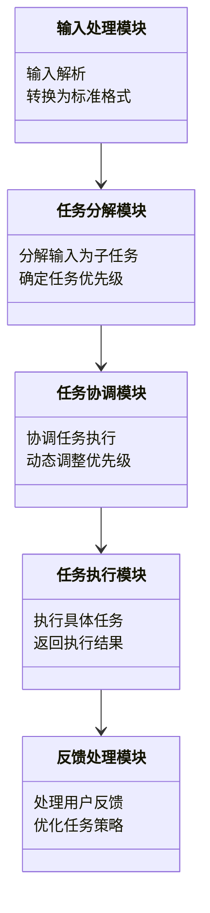
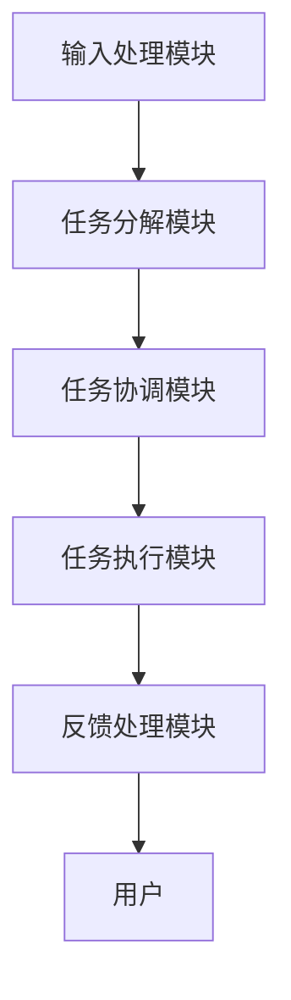
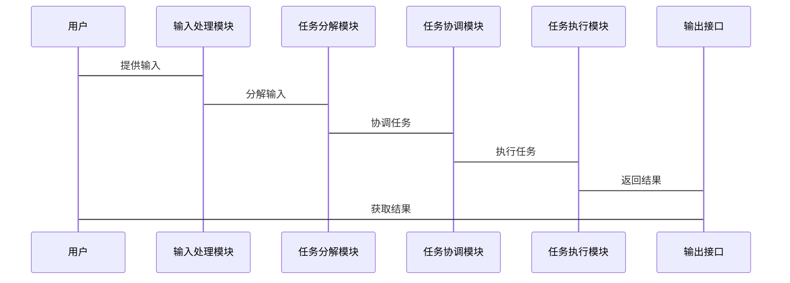

                 


# AI Agent的多任务学习：构建通用智能助手

> 关键词：AI Agent，多任务学习，通用智能助手，机器学习，深度学习

> 摘要：本文详细探讨了AI Agent通过多任务学习构建通用智能助手的技术原理与实现方法。首先介绍了AI Agent和多任务学习的基本概念，然后分析了多任务学习在AI Agent中的应用及其优势，接着从算法原理、系统架构设计、项目实战等方面详细讲解了通用智能助手的构建过程。通过具体案例分析，展示了多任务学习在实际应用中的效果，并总结了相关开发经验和最佳实践。

---

## 第一部分: AI Agent的多任务学习背景与基础

### 第1章: AI Agent与多任务学习概述

#### 1.1 AI Agent的基本概念

##### 1.1.1 AI Agent的定义
AI Agent（人工智能代理）是指能够感知环境、自主决策并执行任务的智能实体。它可以是一个软件程序或物理设备，具备以下核心特征：

- **自主性**：能够在没有外部干预的情况下自主运行。
- **反应性**：能够根据环境变化实时调整行为。
- **目标导向**：具备明确的目标，并采取行动以实现这些目标。
- **学习能力**：通过经验或数据不断优化自身的性能。

AI Agent的应用场景广泛，例如智能音箱（如Siri、Alexa）、自动驾驶汽车、智能客服系统等。

##### 1.1.2 AI Agent的核心特征
以下是AI Agent的核心特征对比：

| 特征维度 | 描述 |
|----------|------|
| 自主性    | 能够独立决策和执行任务 |
| 反应性    | 根据环境反馈实时调整行为 |
| 目标导向  | 行为驱动特定目标的实现 |
| 学习能力  | 能够通过数据或经验优化自身 |

##### 1.1.3 AI Agent的分类与应用场景
AI Agent可以根据智能水平分为以下几类：

- **反应式AI Agent**：基于当前环境输入做出反应，不具备长期记忆或复杂推理能力。
- **认知式AI Agent**：具备高级推理能力，能够处理复杂任务，如规划和决策。

应用场景包括：

- **智能家居**：如智能音箱、智能灯泡等。
- **智能助手**：如Siri、Google Assistant等。
- **自动驾驶**：如特斯拉的Autopilot系统。
- **智能客服**：如自动回复客户咨询的聊天机器人。

#### 1.2 多任务学习的背景与意义

##### 1.2.1 多任务学习的定义
多任务学习（Multi-Task Learning, MTL）是指在一个统一的模型中同时学习多个相关任务，使得模型能够通过共享任务间的共同特征来提升性能。与单任务学习相比，MTL的优势在于：

- **数据效率**：通过共享特征，减少每个任务所需的数据量。
- **模型泛化能力**：模型在多个任务上共享参数，能够更好地泛化到新任务。
- **任务关联性**：任务之间存在某种关联，可以被同时学习和优化。

##### 1.2.2 多任务学习的优势
多任务学习在AI Agent中的优势如下：

- **提升性能**：通过共享参数，模型能够在多个任务上同时优化，提升整体性能。
- **减少数据需求**：在数据量有限的情况下，多任务学习能够有效利用共享特征。
- **增强泛化能力**：模型在多个任务上进行训练，能够更好地适应新任务。

##### 1.2.3 多任务学习在AI Agent中的应用
多任务学习可以应用于AI Agent的多个方面，例如：

- **多模态处理**：同时处理文本、语音、图像等多种模态信息。
- **任务协调**：在需要协调多个任务的情况下，如同时进行语音识别和意图理解。
- **复杂场景应对**：在复杂场景中，同时处理多个相关任务，提升整体智能水平。

#### 1.3 通用智能助手的目标与挑战

##### 1.3.1 通用智能助手的定义
通用智能助手是一种能够处理多种任务的智能系统，用户可以通过自然语言或图形界面与其交互，完成诸如信息查询、任务安排、设备控制等多种任务。例如，用户可以通过语音指令让智能助手设置闹钟、查询天气、发送消息等。

##### 1.3.2 多任务学习在通用智能助手中的作用
多任务学习在通用智能助手中的作用主要体现在以下几个方面：

- **任务协调**：智能助手需要协调多个任务，如同时处理语音识别、意图理解、任务执行等。
- **信息整合**：不同任务之间可能需要共享信息，如意图理解结果可能影响任务执行策略。
- **效率提升**：通过共享特征，减少每个任务的独立训练需求，提升整体训练效率。

##### 1.3.3 当前技术的挑战与未来方向
尽管多任务学习在通用智能助手中展现出巨大潜力，但目前仍面临诸多挑战：

- **任务间干扰**：某些任务可能互相干扰，影响模型的整体性能。
- **数据稀缺性**：某些任务可能缺乏足够的训练数据，导致模型性能受限。
- **计算复杂度**：多任务学习通常需要处理大量的参数和任务，计算复杂度较高。

未来的发展方向可能包括更高效的优化算法、更灵活的任务分配机制以及更强大的模型架构。

### 第2章: 多任务学习的核心概念与联系

#### 2.1 多任务学习的原理

##### 2.1.1 知识共享机制
知识共享机制是多任务学习的核心，通过共享参数或特征，多个任务可以共同受益于彼此的训练数据。常见的知识共享机制包括：

- **参数共享**：多个任务共享部分网络参数，如卷积神经网络（CNN）中共享卷积核。
- **特征共享**：任务之间共享中间层的特征表示。
- **任务相关性建模**：通过注意力机制等方式建模任务之间的关系。

##### 2.1.2 参数共享机制
参数共享机制通过共享网络参数来实现多个任务的联合优化。例如，在图像分类任务中，多个分类器共享卷积层参数，从而提高模型的泛化能力。

##### 2.1.3 任务间依赖关系
任务之间的依赖关系可以通过多种方式建模，例如：

- **任务优先级**：某些任务优先级高于其他任务，模型在优化时优先考虑高优先级任务。
- **任务权重**：根据任务的重要性和难度动态调整优化权重。

#### 2.2 AI Agent中的任务建模

##### 2.2.1 任务分解与组合
任务分解与组合是多任务学习中的关键步骤。复杂任务需要分解为多个子任务，每个子任务负责完成特定的功能，然后通过组合这些子任务来实现整体目标。

##### 2.2.2 任务优先级与权重分配
任务优先级与权重分配是多任务学习中的重要问题。在优化过程中，需要根据任务的重要性和当前模型的性能动态调整优化权重。

##### 2.2.3 任务状态与反馈机制
任务状态与反馈机制是多任务学习中的关键机制。通过反馈机制，模型可以了解每个任务的执行效果，并根据反馈调整任务优先级和优化策略。

#### 2.3 多任务学习与AI Agent的关系

##### 2.3.1 多任务学习如何提升AI Agent的智能性
多任务学习通过共享特征和任务协调，能够显著提升AI Agent的智能性，使其能够更好地处理复杂任务。

##### 2.3.2 AI Agent如何促进多任务学习的优化
AI Agent通过提供丰富的应用场景和实时反馈，促进多任务学习模型的优化和改进。

##### 2.3.3 两者的协同进化
多任务学习与AI Agent的协同进化体现在多个方面，例如通过AI Agent的应用反馈不断优化多任务学习模型，同时通过多任务学习提升AI Agent的智能水平。

### 第3章: 多任务学习的数学模型与算法原理

#### 3.1 多任务学习的数学模型

##### 3.1.1 基于共享参数的模型
基于共享参数的模型是多任务学习中最常见的模型之一。模型由共享部分和任务特有部分组成，共享部分用于提取任务共有的特征，任务特有部分用于完成特定任务。

##### 3.1.2 基于任务间关系的模型
基于任务间关系的模型通过建模任务之间的关系来实现多任务优化。例如，使用注意力机制来捕捉任务之间的关系。

##### 3.1.3 基于注意力机制的模型
基于注意力机制的模型通过注意力机制来动态调整任务的权重，从而实现任务间的协调优化。

#### 3.2 常见多任务学习算法

##### 3.2.1 MTL（Multi-Task Learning）
MTL是最基本的多任务学习算法，通过共享参数来实现多个任务的联合优化。其数学模型如下：

$$
\mathcal{L} = \sum_{i=1}^{n} \lambda_i L_i
$$

其中，$\lambda_i$是任务$i$的权重，$L_i$是任务$i$的损失函数。

##### 3.2.2 MTAN（Multi-Task Attention Network）
MTAN是一种基于注意力机制的多任务学习模型，通过注意力机制来捕捉任务之间的关系。其数学模型如下：

$$
\alpha_i = \text{softmax}(W_a x_i)
$$

其中，$\alpha_i$是任务$i$的注意力权重，$W_a$是注意力权重矩阵，$x_i$是任务$i$的输入。

##### 3.2.3 MAM（Multi-Task Multi-attention Mechanism）
MAM是一种多注意力机制的多任务学习模型，通过多个注意力头来捕捉任务之间的多方面关系。其数学模型如下：

$$
\alpha_i^j = \text{softmax}(W_a^j x_i)
$$

其中，$\alpha_i^j$是任务$i$的第$j$个注意力头的权重，$W_a^j$是第$j$个注意力头的权重矩阵。

#### 3.3 多任务学习的优化方法

##### 3.3.1 基于梯度的优化
基于梯度的优化是多任务学习中最常见的优化方法，通过计算任务损失函数的梯度，并根据梯度更新模型参数。例如，使用Adam优化器进行优化。

##### 3.3.2 基于正则化的方法
基于正则化的方法通过引入正则化项来约束模型参数，防止过拟合。例如，使用L2正则化来约束模型参数。

##### 3.3.3 基于动态权重分配的方法
基于动态权重分配的方法通过动态调整任务权重来实现任务间的协调优化。例如，根据任务当前的性能动态调整权重。

---

## 第二部分: AI Agent的多任务学习算法与系统架构

### 第4章: 多任务学习的算法实现

#### 4.1 环境安装与配置

##### 4.1.1 安装Python与深度学习框架
需要安装Python 3.6以上版本，并选择一个深度学习框架，如TensorFlow或PyTorch。

##### 4.1.2 安装必要的库
安装所需的数学库和深度学习库，如numpy、scikit-learn、pandas等。

#### 4.2 系统核心实现源代码

##### 4.2.1 定义多任务学习模型
定义一个多任务学习模型，包括共享部分和任务特有部分。

```python
import torch
import torch.nn as nn

class MultiTaskModel(nn.Module):
    def __init__(self, input_dim, output_dims):
        super(MultiTaskModel, self).__init__()
        self.shared_layer = nn.Linear(input_dim, 64)
        self.task_layers = nn.ModuleList([nn.Linear(64, output_dims[i]) for i in range(len(output_dims))])
    
    def forward(self, x, task_idx):
        x = torch.relu(self.shared_layer(x))
        task_output = self.task_layers[task_idx](x)
        return task_output
```

##### 4.2.2 定义损失函数与优化器
定义损失函数和优化器，用于多任务学习模型的训练。

```python
criterion = nn.CrossEntropyLoss()
optimizer = torch.optim.Adam(model.parameters(), lr=0.001)
```

##### 4.2.3 训练过程实现
实现多任务学习模型的训练过程，包括前向传播、损失计算和反向传播。

```python
for epoch in range(num_epochs):
    model.train()
    for i, (inputs, labels, task_idx) in enumerate(train_loader):
        outputs = model(inputs, task_idx)
        loss = criterion(outputs, labels)
        optimizer.zero_grad()
        loss.backward()
        optimizer.step()
```

#### 4.3 代码应用解读与分析

##### 4.3.1 代码结构与功能模块
代码结构包括模型定义、损失函数定义、优化器定义和训练过程实现。模型定义包括共享层和任务特有层，损失函数和优化器用于模型训练。

##### 4.3.2 代码实现细节
代码实现细节包括模型的前向传播、损失计算和反向传播。模型通过共享层提取共享特征，然后通过任务特有层完成特定任务的分类。

##### 4.3.3 代码运行环境与依赖
代码需要在Python 3.6以上环境中运行，依赖库包括PyTorch、numpy等。

#### 4.4 实际案例分析

##### 4.4.1 案例背景介绍
以一个多任务分类任务为例，任务包括图像分类和文本分类。

##### 4.4.2 案例实现过程
实现一个多任务分类模型，包括共享层和任务特有层。

##### 4.4.3 案例结果与分析
通过实验结果分析模型的性能，比较单任务学习和多任务学习的优劣。

### 第5章: 系统分析与架构设计方案

#### 5.1 问题场景介绍

##### 5.1.1 系统目标
构建一个通用智能助手，能够处理多种任务，如语音识别、意图理解、任务执行等。

##### 5.1.2 系统需求
系统需要具备多任务处理能力，支持多种输入模态，如语音、文本、图像等。

#### 5.2 项目介绍

##### 5.2.1 项目名称
通用智能助手多任务学习系统。

##### 5.2.2 项目目标
通过多任务学习构建一个能够处理多种任务的通用智能助手。

##### 5.2.3 项目范围
包括任务分解、任务协调、任务执行等。

#### 5.3 系统功能设计

##### 5.3.1 系统功能模块
系统功能模块包括：

- **输入处理模块**：接收用户输入，如语音、文本、图像等。
- **任务分解模块**：将输入分解为多个子任务。
- **任务协调模块**：协调多个任务的执行，确保任务间的协同。
- **任务执行模块**：执行具体的任务，如查询信息、控制设备等。
- **反馈处理模块**：处理用户的反馈，动态调整任务优先级。

##### 5.3.2 领域模型设计
领域模型设计采用Mermaid类图，展示系统功能模块之间的关系。



#### 5.4 系统架构设计

##### 5.4.1 系统架构图
系统架构设计采用Mermaid架构图，展示系统的整体架构。



#### 5.5 系统接口设计

##### 5.5.1 输入接口
输入接口包括语音输入、文本输入和图像输入。

##### 5.5.2 输出接口
输出接口包括语音输出、文本输出和图像输出。

##### 5.5.3 接口交互设计
通过Mermaid序列图展示输入接口和输出接口的交互过程。



#### 5.6 系统交互设计

##### 5.6.1 任务分解与协调
任务分解模块将输入分解为多个子任务，并确定任务优先级。

##### 5.6.2 任务执行与反馈
任务执行模块执行具体的任务，并将结果返回给反馈处理模块。

##### 5.6.3 用户反馈与优化
反馈处理模块根据用户反馈优化任务策略，动态调整任务优先级。

---

## 第三部分: 项目实战与最佳实践

### 第6章: 项目实战

#### 6.1 环境安装与配置

##### 6.1.1 安装Python与深度学习框架
安装Python 3.6以上版本，并选择一个深度学习框架，如TensorFlow或PyTorch。

##### 6.1.2 安装必要的库
安装所需的数学库和深度学习库，如numpy、scikit-learn、pandas等。

#### 6.2 系统核心实现源代码

##### 6.2.1 定义多任务学习模型
定义一个多任务学习模型，包括共享层和任务特有层。

```python
import torch
import torch.nn as nn

class MultiTaskModel(nn.Module):
    def __init__(self, input_dim, output_dims):
        super(MultiTaskModel, self).__init__()
        self.shared_layer = nn.Linear(input_dim, 64)
        self.task_layers = nn.ModuleList([nn.Linear(64, output_dims[i]) for i in range(len(output_dims))])
    
    def forward(self, x, task_idx):
        x = torch.relu(self.shared_layer(x))
        task_output = self.task_layers[task_idx](x)
        return task_output
```

##### 6.2.2 定义损失函数与优化器
定义损失函数和优化器，用于多任务学习模型的训练。

```python
criterion = nn.CrossEntropyLoss()
optimizer = torch.optim.Adam(model.parameters(), lr=0.001)
```

##### 6.2.3 训练过程实现
实现多任务学习模型的训练过程，包括前向传播、损失计算和反向传播。

```python
for epoch in range(num_epochs):
    model.train()
    for i, (inputs, labels, task_idx) in enumerate(train_loader):
        outputs = model(inputs, task_idx)
        loss = criterion(outputs, labels)
        optimizer.zero_grad()
        loss.backward()
        optimizer.step()
```

#### 6.3 代码应用解读与分析

##### 6.3.1 代码结构与功能模块
代码结构包括模型定义、损失函数定义、优化器定义和训练过程实现。

##### 6.3.2 代码实现细节
代码实现细节包括模型的前向传播、损失计算和反向传播。模型通过共享层提取共享特征，然后通过任务特有层完成特定任务的分类。

##### 6.3.3 代码运行环境与依赖
代码需要在Python 3.6以上环境中运行，依赖库包括PyTorch、numpy等。

#### 6.4 实际案例分析

##### 6.4.1 案例背景介绍
以一个多任务分类任务为例，任务包括图像分类和文本分类。

##### 6.4.2 案例实现过程
实现一个多任务分类模型，包括共享层和任务特有层。

##### 6.4.3 案例结果与分析
通过实验结果分析模型的性能，比较单任务学习和多任务学习的优劣。

### 第7章: 最佳实践

#### 7.1 小结

##### 7.1.1 多任务学习的优势
多任务学习通过共享特征和任务协调，能够显著提升模型的性能和效率。

##### 7.1.2 AI Agent的智能性提升
AI Agent通过多任务学习能够更好地处理复杂任务，提升整体智能水平。

#### 7.2 注意事项

##### 7.2.1 任务之间的平衡
在多任务学习中，需要平衡不同任务之间的权重，防止某些任务过度优化而影响其他任务的性能。

##### 7.2.2 数据的平衡性
需要确保不同任务的数据分布相对平衡，避免某些任务的数据过多或过少，影响模型的性能。

##### 7.2.3 模型的可解释性
多任务学习模型通常较为复杂，需要关注模型的可解释性，便于调试和优化。

#### 7.3 拓展阅读

##### 7.3.1 多任务学习的最新研究
阅读最新的学术论文和研究报告，了解多任务学习的最新进展和应用。

##### 7.3.2 AI Agent的前沿技术
关注AI Agent领域的前沿技术，如强化学习、自适应学习等。

##### 7.3.3 相关工具与框架
了解多任务学习和AI Agent相关的工具和框架，如TensorFlow、PyTorch、Keras等。

---

## 第四部分: 总结与展望

### 第8章: 总结与展望

#### 8.1 总结
本文详细探讨了AI Agent通过多任务学习构建通用智能助手的技术原理与实现方法。从AI Agent和多任务学习的基本概念，到算法原理和系统架构设计，再到实际项目实战和最佳实践，全面系统地介绍了通用智能助手的构建过程。

#### 8.2 展望
随着人工智能技术的不断发展，多任务学习和AI Agent的研究与应用将更加深入。未来的研究方向可能包括更高效的优化算法、更灵活的任务分配机制以及更强大的模型架构。同时，多任务学习在通用智能助手中的应用也将更加广泛，为人类带来更智能、更便捷的生活体验。

---

## 参考文献
1. [1] 《深度学习》, Ian Goodfellow, Yoshua Bengio, Aaron Courville
2. 《机器学习实战》, 周志华
3. 《多任务学习：算法与应用》，李航
4. PyTorch官方文档
5. TensorFlow官方文档

---

通过本文的详细讲解，读者可以全面了解AI Agent的多任务学习技术，并掌握构建通用智能助手的核心方法和实践技巧。希望本文能够为相关领域的研究和应用提供有价值的参考。

