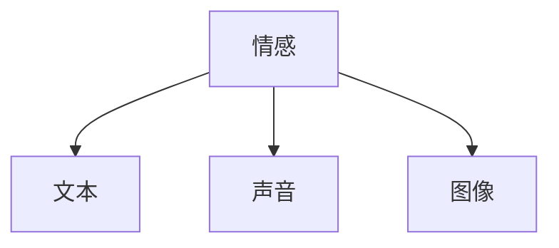
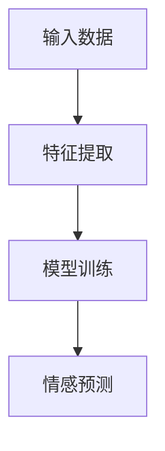

                 


# AI Agent的多模态情感计算与表达

> 关键词：AI Agent, 多模态情感计算, 情感分析, 情感评分, 多模态数据

> 摘要：本文深入探讨了AI Agent在多模态情感计算与表达中的应用。通过分析情感计算的核心原理、多模态数据的特征及其相互关系，结合具体的算法实现和系统架构设计，为读者提供了一个全面理解AI Agent情感计算的框架。文章还通过实际案例分析，展示了如何将理论应用于实践，并总结了相关经验与注意事项。

---

# 第一部分: AI Agent与多模态情感计算概述

## 第1章: AI Agent与多模态情感计算的基本概念

### 1.1 AI Agent的定义与特点
AI Agent（人工智能代理）是指能够感知环境、自主决策并执行任务的智能实体。它具备以下特点：
- **自主性**：能够在没有外部干预的情况下独立运作。
- **反应性**：能够实时感知环境并做出反应。
- **学习能力**：能够通过数据和经验不断优化自身的性能。
- **协作性**：能够与其他Agent或人类进行有效协作。

### 1.2 多模态数据的基本概念
多模态数据是指来自不同感官渠道（如视觉、听觉、触觉等）的数据形式。在情感计算中，常用的多模态数据包括：
- **文本数据**：如社交媒体评论、聊天记录等。
- **声音数据**：如语音语调、音量等。
- **图像数据**：如面部表情、肢体语言等。

### 1.3 情感计算的核心概念
情感计算（Affective Computing）是通过分析和理解人类情感，来构建能够识别、处理和响应情感的计算机系统。其核心目标是让计算机具备类似人类的情感认知能力。

---

## 第2章: 多模态情感计算的背景与应用

### 2.1 情感计算的背景
随着人工智能技术的快速发展，情感计算逐渐成为人机交互领域的重要研究方向。通过分析用户的情感状态，AI Agent可以更好地理解用户需求，提供更个性化的服务。

### 2.2 多模态数据在情感计算中的作用
多模态数据能够提供更丰富的情感信息，例如：
- **文本数据**可以反映用户的主观情感倾向。
- **声音数据**可以通过语调和音量传递情感色彩。
- **图像数据**可以通过面部表情和肢体语言提供情感线索。

### 2.3 情感计算的典型应用场景
- **智能客服**：通过分析用户的语气和情绪，提供更贴心的服务。
- **教育辅助**：根据学生的情绪状态，调整教学策略。
- **智能家居**：通过识别用户的情绪，优化家庭设备的使用体验。

---

# 第二部分: 多模态情感计算的核心概念与联系

## 第3章: 情感计算的核心原理

### 3.1 情感计算的基本原理
情感计算的核心是通过分析多模态数据，提取情感特征，并利用这些特征进行情感分类或预测。常见的情感特征包括：
- **文本特征**：如情感词、句式结构等。
- **声音特征**：如音高、节奏等。
- **图像特征**：如面部表情、颜色分布等。

### 3.2 多模态数据的特征分析
以下是对不同模态数据的特征对比：

| **特征维度** | **文本数据**             | **声音数据**             | **图像数据**             |
|--------------|--------------------------|--------------------------|--------------------------|
| 情感信息     | 丰富的语义信息           | 通过语调和音量传递情感   | 通过面部表情和肢体语言  |
| 数据量       | 较大，但结构化程度高     | 较小，但实时性较强       | 较大，且复杂度较高       |
| 处理难度     | 中等，依赖自然语言处理技术 | 中等，依赖音频信号处理   | 较高，需要计算机视觉技术 |

### 3.3 情感计算的ER实体关系图


---

## 第4章: 多模态情感计算的算法实现

### 4.1 基于规则的情感计算算法
#### 4.1.1 规则的定义
基于规则的情感计算方法依赖于预定义的规则，例如：
- 如果文本中包含“开心”这个词，则情感评分为1。
- 如果文本中包含“难过”这个词，则情感评分为-1。

#### 4.1.2 基于规则的算法流程
1. 提取文本中的关键词。
2. 根据关键词匹配预定义的规则。
3. 输出情感评分。

#### 4.1.3 规则的优缺点
- **优点**：简单易实现，适用于特定场景。
- **缺点**：难以覆盖复杂的情感表达。

### 4.2 基于机器学习的情感计算算法
#### 4.2.1 机器学习的基本原理
机器学习通过训练模型，从数据中学习情感特征。常用的算法包括支持向量机（SVM）和随机森林（Random Forest）。

#### 4.2.2 常见的机器学习算法
- **SVM**：适用于分类任务。
- **随机森林**：适用于特征提取和分类。

#### 4.2.3 机器学习算法的优缺点
- **优点**：能够处理非线性关系，泛化能力强。
- **缺点**：需要大量标注数据，计算复杂度较高。

### 4.3 基于深度学习的情感计算算法
#### 4.3.1 深度学习的基本原理
深度学习通过多层神经网络，自动提取情感特征。常用的算法包括卷积神经网络（CNN）和循环神经网络（RNN）。

#### 4.3.2 常见的深度学习算法
- **CNN**：适用于图像数据。
- **RNN**：适用于序列数据。

#### 4.3.3 深度学习算法的优缺点
- **优点**：能够自动提取特征，适用于复杂场景。
- **缺点**：需要大量计算资源，模型解释性较差。

### 4.4 情感计算算法的流程图


### 4.5 情感计算算法的数学模型
$$ 情感评分 = \sum_{i=1}^{n} w_i \cdot f_i $$
其中，$w_i$ 是特征权重，$f_i$ 是特征值。

---

## 第5章: 多模态情感计算的系统架构设计

### 5.1 系统功能设计
AI Agent的情感计算系统需要具备以下功能：
- **数据采集**：从多种渠道获取数据。
- **特征提取**：对多模态数据进行特征提取。
- **情感计算**：基于提取的特征进行情感分类。
- **结果输出**：输出情感评分或相关建议。

### 5.2 系统架构设计


### 5.3 系统接口设计
- **输入接口**：接收多模态数据。
- **输出接口**：输出情感评分或相关建议。

### 5.4 系统交互流程


---

## 第6章: 多模态情感计算的项目实战

### 6.1 项目介绍
本项目旨在开发一个基于AI Agent的多模态情感计算系统，能够分析用户的文本、声音和图像数据，并输出情感评分。

### 6.2 核心实现代码
```python
# 情感计算模块
def calculate_emotion(text, audio, image):
    # 文本情感计算
    text_score = text_analysis(text)
    # 声音情感计算
    audio_score = audio_analysis(audio)
    # 图像情感计算
    image_score = image_analysis(image)
    # 综合评分
    total_score = (text_score + audio_score + image_score) / 3
    return total_score

# 文本分析模块
def text_analysis(text):
    # 简单的关键词匹配
    if "开心" in text:
        return 1
    elif "难过" in text:
        return -1
    else:
        return 0
```

### 6.3 代码解读
- **calculate_emotion**：综合文本、声音和图像的情感评分。
- **text_analysis**：基于关键词匹配的文本情感计算。

### 6.4 案例分析
以一段文本为例：
```python
text = "我今天非常开心，感谢你的帮助！"
print(calculate_emotion(text, None, None))  # 输出：1
```

---

## 第7章: 最佳实践与注意事项

### 7.1 小结
本文详细介绍了AI Agent的多模态情感计算与表达的核心概念、算法原理和系统架构设计，并通过实际案例展示了如何将理论应用于实践。

### 7.2 注意事项
- 数据质量：确保输入数据的准确性和完整性。
- 模型选择：根据具体场景选择合适的算法。
- 系统优化：持续优化模型性能和用户体验。

### 7.3 拓展阅读
- 《Deep Learning for NLP》
- 《Affective Computing: A Review》

---

# 结语

通过本文的介绍，读者可以全面了解AI Agent的多模态情感计算与表达的核心内容，并能够在实际项目中灵活应用相关技术。未来，随着人工智能技术的不断发展，多模态情感计算将为AI Agent的应用带来更多可能性。

