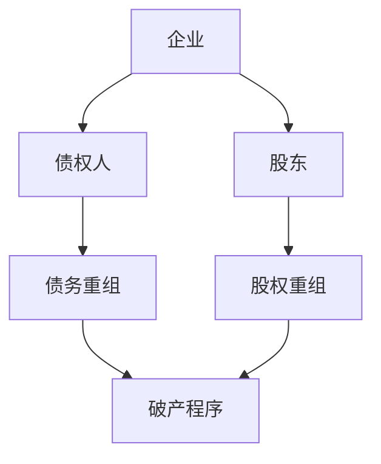
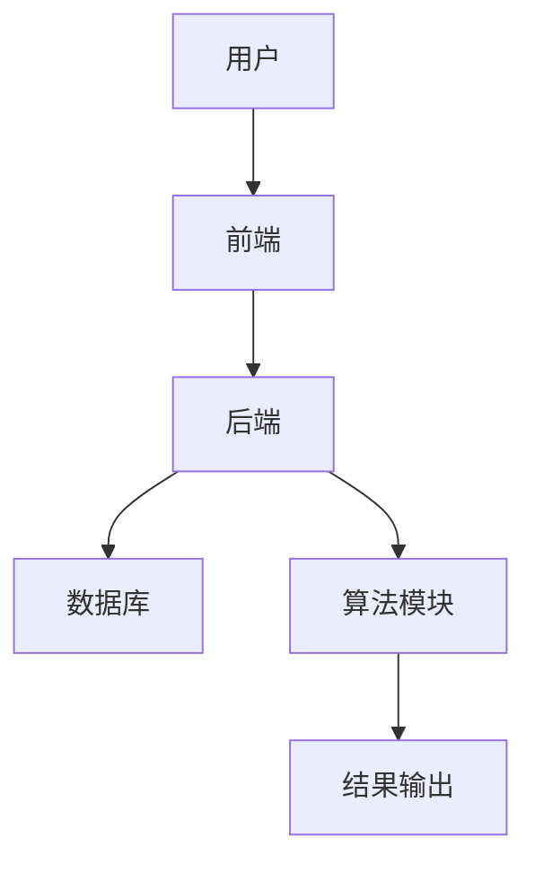

                 


# 塞斯·卡拉曼的破产重组投资策略

## 关键词：破产重组、投资策略、企业价值、债务重组、破产概率

## 摘要：  
塞斯·卡拉曼的破产重组投资策略是一种通过分析企业财务状况和市场环境，识别潜在投资机会并制定相应的投资计划的方法。本文将详细阐述破产重组的核心概念、投资策略的算法原理、系统架构设计以及实际案例分析，帮助投资者更好地理解和应用这一策略。

---

## 第一部分: 破产重组与投资策略概述

### 第1章: 破产重组的背景与概念

#### 1.1 破产重组的定义与背景
- **1.1.1 破产重组的定义**  
  破产重组是指企业在无法偿还债务的情况下，通过法律程序重新调整资产和负债结构，以恢复企业的财务健康和持续经营能力。

- **1.1.2 破产重组的背景与现状**  
  随着全球经济波动加剧，企业面临的财务危机日益频繁。破产重组作为一种法律和财务手段，为企业提供了恢复生机的可能。投资者通过参与破产重组，可以在企业恢复过程中获得超额收益。

- **1.1.3 破产重组的核心目标**  
  破产重组的核心目标是最大化企业价值，保护债权人和股东的利益，同时确保企业的可持续发展。

#### 1.2 投资策略的基本原理
- **1.2.1 投资策略的分类**  
  投资策略可以分为长期投资和短期投资。破产重组投资策略通常属于长期投资，旨在通过企业恢复后的价值增长实现收益。

- **1.2.2 破产重组在投资策略中的地位**  
  破产重组是投资策略中的一个重要组成部分，特别是在高风险高回报的市场环境中，投资者可以通过识别潜在的破产重组机会，获取超额收益。

- **1.2.3 破产重组投资的潜在收益与风险**  
  破产重组投资的潜在收益包括企业价值的提升和债务的重新分配，但同时也伴随着较高的风险，如企业恢复失败或市场波动的影响。

---

### 第2章: 破产重组的核心概念与联系

#### 2.1 破产重组的核心原理
- **2.1.1 破产重组的主要机制**  
  破产重组通常包括债务重组、股权重组和资产出售等机制。通过这些机制，企业可以减轻债务负担，优化资产结构，从而恢复财务健康。

- **2.1.2 破产重组的法律框架**  
  破产重组的法律框架通常涉及破产法、公司法和合同法等。不同国家和地区的法律框架可能有所不同，但核心目标都是保护债权人和股东的利益。

- **2.1.3 破产重组与企业价值的关系**  
  破产重组通过优化资产和负债结构，可以显著提升企业价值。投资者通过参与破产重组，可以在企业价值提升中获得收益。

#### 2.2 核心概念对比分析
- **2.2.1 破产重组与企业并购的对比**  
  破产重组与企业并购的主要区别在于，破产重组是在企业面临财务危机的情况下进行的，而企业并购通常是基于战略发展的需要。

- **2.2.2 破产重组与债务重组的对比**  
  破产重组通常包括债务重组，但债务重组也可以在企业未破产的情况下进行。破产重组的范围更广，涉及资产和股权的调整。

- **2.2.3 破产重组与企业清算的对比**  
  破产重组是企业恢复的手段，而企业清算是企业终止经营的手段。破产重组的目标是避免企业清算，保护债权人和股东的利益。

#### 2.3 实体关系图


---

## 第二部分: 破产重组投资的算法原理

### 第3章: 研判模型与投资决策流程

#### 3.1 研判模型
- **3.1.1 研判模型的数学基础**  
  破产概率的计算通常基于企业的财务数据，如负债总额、资产总额和流动比率等。通过这些数据，可以构建数学模型来评估企业的破产风险。

- **3.1.2 破产概率的计算公式**  
  破产概率的计算公式如下：
  $$破产概率 = \frac{负债总额}{资产总额} \times 系数$$

  其中，系数是根据企业的行业特点和市场环境确定的。

#### 3.2 投资决策流程
- **3.2.1 数据收集与预处理**  
  投资者需要收集企业的财务数据，包括资产负债表和损益表等，并进行数据清洗和预处理。

- **3.2.2 研判模型的实现**  
  使用Python代码实现破产概率的计算。例如：

  ```python
  def calculate_bankruptcy_probability(liabilities, assets, coefficient):
      return (liabilities / assets) * coefficient
  ```

- **3.2.3 投资决策优化**  
  根据破产概率，投资者可以制定相应的投资策略。例如，如果破产概率较高，投资者可以选择减少投资或退出。

#### 3.3 投资策略实现
- **3.3.1 数据收集与预处理**  
  投资者需要收集企业的财务数据，包括资产负债表和损益表等，并进行数据清洗和预处理。

- **3.3.2 研判模型的实现**  
  使用Python代码实现破产概率的计算。例如：

  ```python
  def calculate_bankruptcy_probability(liabilities, assets, coefficient):
      return (liabilities / assets) * coefficient
  ```

- **3.3.3 投资决策优化**  
  根据破产概率，投资者可以制定相应的投资策略。例如，如果破产概率较高，投资者可以选择减少投资或退出。

---

### 第4章: 系统分析与架构设计

#### 4.1 项目场景介绍
- **4.1.1 研判模型的应用场景**  
  研判模型适用于企业面临财务危机的情况，帮助投资者评估破产重组的可行性。

- **4.1.2 投资决策系统的功能需求**  
  投资决策系统需要具备数据采集、模型计算和投资建议生成等功能。

- **4.1.3 系统的边界与范围**  
  系统的边界包括企业的财务数据和市场环境数据，系统的范围包括数据采集、模型计算和投资建议生成。

#### 4.2 系统功能设计
- **4.2.1 数据处理模块**  
  数据处理模块负责采集和处理企业的财务数据，确保数据的准确性和完整性。

- **4.2.2 破产概率计算模块**  
  破产概率计算模块基于企业的财务数据，计算破产概率并生成报告。

- **4.2.3 投资决策模块**  
  投资决策模块根据破产概率和市场环境，制定投资策略并生成投资建议。

#### 4.3 系统架构设计


---

### 第5章: 项目实战

#### 5.1 环境安装
- **5.1.1 环境要求**  
  需要安装Python、Jupyter Notebook和相关数据处理库（如Pandas和NumPy）。

#### 5.2 核心代码实现
- **5.2.1 数据采集与预处理**  
  使用Python代码采集企业的财务数据，并进行清洗和预处理。

  ```python
  import pandas as pd

  # 读取数据
  df = pd.read_csv('financial_data.csv')

  # 数据清洗
  df.dropna(inplace=True)
  ```

- **5.2.2 研判模型的实现**  
  实现破产概率的计算。

  ```python
  def calculate_bankruptcy_probability(liabilities, assets, coefficient):
      return (liabilities / assets) * coefficient
  ```

- **5.2.3 投资决策优化**  
  根据破产概率，制定投资策略。

  ```python
  # 示例投资策略
  if bankruptcy_probability > 0.5:
      print("建议减少投资")
  else:
      print("建议增加投资")
  ```

#### 5.3 案例分析
- **5.3.1 案例背景**  
  某制造企业因市场环境恶化，面临财务危机，启动破产重组程序。

- **5.3.2 数据分析与计算**  
  使用上述代码计算破产概率，并制定投资策略。

  ```python
  liabilities = 1000000
  assets = 500000
  coefficient = 2
  bankruptcy_probability = calculate_bankruptcy_probability(liabilities, assets, coefficient)
  ```

- **5.3.3 投资策略制定**  
  根据破产概率，制定相应的投资策略。

  ```python
  if bankruptcy_probability > 0.5:
      print("建议减少投资")
  else:
      print("建议增加投资")
  ```

#### 5.4 项目小结
- **5.4.1 项目总结**  
  通过破产重组投资策略，投资者可以在企业恢复过程中获得超额收益。

- **5.4.2 经验与教训**  
  投资者需要充分考虑市场环境和企业实际情况，制定合理的投资策略。

---

## 第三部分: 总结与展望

### 第6章: 总结与展望
- **6.1 最佳实践 tips**  
  投资者在应用破产重组投资策略时，应充分考虑企业的实际情况和市场环境，制定合理的投资策略。

- **6.2 小结**  
  本文详细阐述了塞斯·卡拉曼的破产重组投资策略，从理论到实践，为投资者提供了全面的指导。

- **6.3 注意事项**  
  投资者在应用破产重组投资策略时，应充分考虑企业的实际情况和市场环境，制定合理的投资策略。

- **6.4 拓展阅读**  
  推荐阅读《企业破产法》和《投资学原理》，深入了解破产重组的法律和经济背景。

---

以上是《塞斯·卡拉曼的破产重组投资策略》的技术博客文章，涵盖破产重组的核心概念、算法原理、系统架构设计和实际案例分析，为投资者提供了全面的指导。

