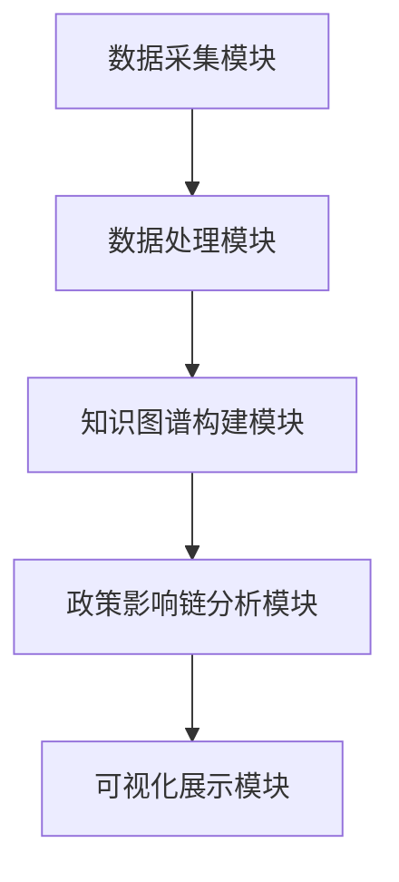
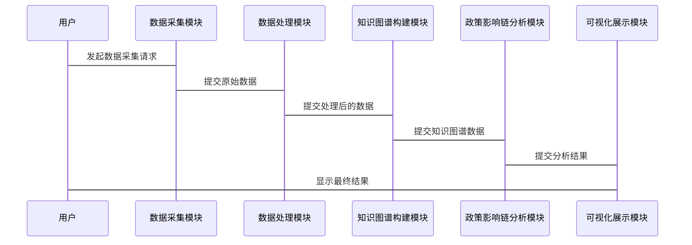

                 


# 构建基于知识图谱的金融监管政策影响链追踪系统

## 关键词：知识图谱、金融监管、政策影响链、系统构建、案例分析

## 摘要

本文系统地探讨了如何利用知识图谱构建金融监管政策影响链追踪系统。文章首先介绍了知识图谱和金融监管的基本概念，分析了两者结合的必要性和可能性。接着，详细阐述了知识图谱的构建方法，包括数据预处理、实体识别与关系抽取等关键步骤。随后，提出了基于知识图谱的政策影响链分析方法，设计了影响链的构建和传播路径分析的具体流程。最后，给出了系统的整体架构设计，并通过实际案例展示了系统的实现与应用效果，为金融监管领域的智能化提供了新的思路。

---

# 第一部分: 背景与核心概念

## 第1章: 知识图谱与金融监管政策概述

### 1.1 知识图谱的基本概念

#### 1.1.1 知识图谱的定义与特点

知识图谱是一种以图结构形式表示知识的语义网络，节点表示实体或概念，边表示实体之间的关系。知识图谱具有语义丰富、结构清晰、可扩展性强等特点，能够有效捕捉数据间的关联关系。


#### 1.1.2 知识图谱在金融领域的应用

在金融领域，知识图谱可用于风险评估、关联交易分析、监管合规等多个方面。例如，通过构建金融机构之间的关系图谱，可以帮助识别系统性风险。

#### 1.1.3 金融监管政策的核心要素

金融监管政策通常包括市场准入、资本充足、关联交易限制等内容。这些政策通过影响金融机构的行为，维护金融市场稳定。

### 1.2 金融监管政策影响链的概念

#### 1.2.1 金融监管的基本原理

金融监管通过设定规则和限制，约束金融机构的行为，确保市场的公平、透明和稳定。

#### 1.2.2 政策影响链的定义与作用

政策影响链描述了政策从制定到执行，再到对市场产生影响的全过程。通过构建影响链，可以清晰地追踪政策的效果。

#### 1.2.3 政策影响链的构建方法

政策影响链的构建通常包括政策文本分析、影响路径识别和效果评估等步骤。

---

## 第2章: 知识图谱与金融监管的结合

### 2.1 知识图谱在金融监管中的应用价值

#### 2.1.1 提高政策执行效率

知识图谱可以帮助监管机构快速识别政策执行中的关键节点，提高效率。

#### 2.1.2 增强政策透明度

通过可视化知识图谱，政策的执行过程更加透明，便于公众监督。

#### 2.1.3 优化监管资源配置

知识图谱的应用可以精准识别高风险领域，优化资源配置。

### 2.2 知识图谱与政策影响链的关系

#### 2.2.1 知识图谱的语义网络特性

知识图谱的语义网络特性使其能够有效捕捉政策影响链中的复杂关系。

#### 2.2.2 政策影响链的网络结构

政策影响链的网络结构与知识图谱的图结构具有相似性，便于建模。

#### 2.2.3 两者的结合方式

通过将政策影响链嵌入知识图谱，可以实现政策效果的动态追踪和分析。

---

# 第二部分: 知识图谱构建与分析

## 第3章: 知识图谱的构建方法

### 3.1 数据收集与预处理

#### 3.1.1 数据来源渠道

数据来源包括政策文件、新闻报道、监管报告等。

#### 3.1.2 数据清洗与标准化

数据清洗包括去重、去噪和格式统一。

#### 3.1.3 数据格式转换

将文本数据转换为结构化数据，便于后续处理。

### 3.2 实体识别与关系抽取

#### 3.2.1 实体识别的算法选择

常用实体识别工具包括RNN和BERT等。

#### 3.2.2 关系抽取的技术实现

关系抽取可以通过基于规则的方法或深度学习模型实现。

#### 3.2.3 实体与关系的存储结构

通常使用RDF或图数据库存储实体及关系。

### 3.3 知识图谱的构建流程

#### 3.3.1 数据流分析

从数据收集到存储的全流桯分析。

#### 3.3.2 知识图谱构建的步骤

包括数据预处理、实体识别、关系抽取和知识图谱存储。

#### 3.3.3 构建工具的选择与使用

常用工具包括Neo4j、OntoNotes等。

---

## 第4章: 知识图谱的分析与挖掘

### 4.1 知识图谱的可视化分析

#### 4.1.1 可视化工具的选择

推荐使用Gephi或Cytoscape等工具。

#### 4.1.2 知识图谱的网络分析

通过网络分析识别关键节点和影响路径。

#### 4.1.3 可视化结果的解读

解读网络图中的关键节点和关系分布。

### 4.2 知识图谱的语义分析

#### 4.2.1 基于图的语义分析方法

通过计算节点之间的语义相似度进行分析。

#### 4.2.2 知识图谱的语义相似度计算

使用余弦相似度或Jaccard系数计算语义相似度。

#### 4.2.3 语义网络的构建与应用

构建语义网络用于政策影响链的识别。

### 4.3 知识图谱的动态更新与维护

#### 4.3.1 动态更新的必要性

确保知识图谱的时效性和准确性。

#### 4.3.2 更新策略的制定

根据数据变化频率制定更新策略。

#### 4.3.3 更新工具的选择与使用

使用自动化工具定期更新知识图谱。

---

## 第5章: 金融监管政策影响链的分析

### 5.1 政策影响链的构建方法

#### 5.1.1 政策文本分析

通过NLP技术提取政策关键词和相关实体。

#### 5.1.2 政策影响路径识别

识别政策影响的直接和间接路径。

#### 5.1.3 政策影响链的可视化

将政策影响链可视化，便于分析。

### 5.2 政策影响链的传播路径分析

#### 5.2.1 传播路径的建模

使用图模型描述政策影响的传播过程。

#### 5.2.2 传播路径的权重计算

通过节点度和边权重计算传播路径的影响程度。

#### 5.2.3 传播路径的可视化

使用网络图展示政策影响的传播路径。

### 5.3 政策影响链的动态分析

#### 5.3.1 动态分析的必要性

及时发现政策执行中的问题。

#### 5.3.2 动态分析的方法

采用实时数据流处理技术进行动态分析。

#### 5.3.3 动态分析的应用场景

在金融市场波动和突发事件中快速响应。

---

## 第6章: 系统设计与实现

### 6.1 系统功能设计

#### 6.1.1 系统架构设计

采用分层架构，包括数据层、服务层和应用层。

#### 6.1.2 功能模块设计

包括数据采集、知识图谱构建、政策影响链分析和可视化展示等功能模块。

### 6.2 系统架构设计

#### 6.2.1 系统架构图

使用Mermaid绘制系统架构图。



#### 6.2.2 接口设计

定义RESTful API接口，实现模块之间的数据交互。

#### 6.2.3 系统交互流程

使用Mermaid绘制系统交互流程图。



### 6.3 系统实现

#### 6.3.1 环境安装

安装Python、Jupyter Notebook、Neo4j等工具。

#### 6.3.2 核心实现代码

以下是一个政策影响链分析的Python代码示例：

```python
from neo4j import GraphDatabase
from datetime import datetime

# 连接知识图谱数据库
driver = GraphDatabase.driver("neo4j://localhost:7687", auth=("user", "password"))

# 查询政策影响链
def get_policy_impact_chain(policy_id):
    with driver.session() as session:
        result = session.run(
            "MATCH (p:Policy {id: $policy_id}) "
            "MATCH (p)-[r:INFLUENCE]->(e:Entity) "
            "RETURN e.name, r.weight",
            policy_id=policy_id
        )
        return result.records

# 示例调用
policy_id = "2023-001"
impact_chain = get_policy_impact_chain(policy_id)
for record in impact_chain:
    print(f"Entity: {record['e.name']}, Impact: {record['r.weight']}")
```

#### 6.3.3 案例分析与解读

以某金融监管政策为例，分析其对金融机构的影响，并通过知识图谱展示影响链。

---

## 第7章: 项目实战

### 7.1 环境安装

安装必要的工具和库，如Python、Neo4j、NLTK等。

### 7.2 核心实现代码

实现政策影响链分析的代码，并进行详细解读。

### 7.3 案例分析

通过具体案例分析，验证系统的有效性和实用性。

### 7.4 项目小结

总结项目实施的经验和教训，提出改进建议。

---

## 第8章: 总结与展望

### 8.1 系统总结

总结系统构建的关键点和实现成果。

### 8.2 未来展望

探讨知识图谱在金融监管中的未来发展方向，如动态知识图谱、实时分析等。

### 8.3 最佳实践 Tips

- 定期更新知识图谱，保持数据的时效性。
- 在复杂场景下，结合其他技术（如机器学习）提升系统性能。

---

通过以上步骤，我们可以构建一个基于知识图谱的金融监管政策影响链追踪系统，为金融监管提供新的技术手段，提高政策执行的效率和透明度。

