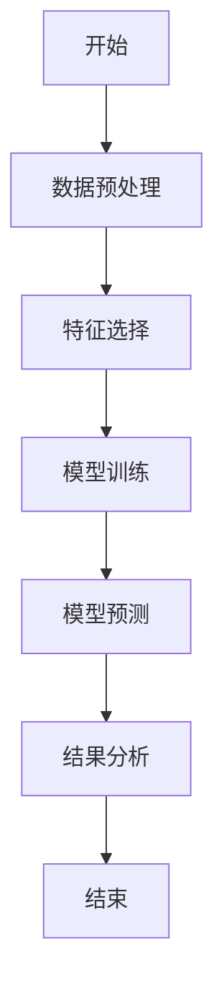
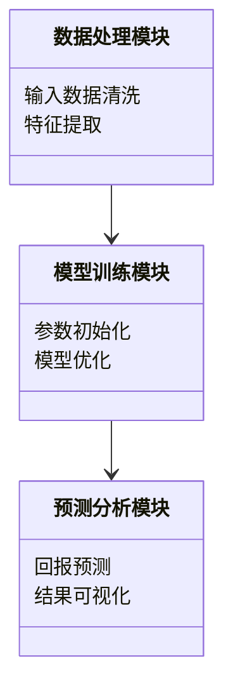
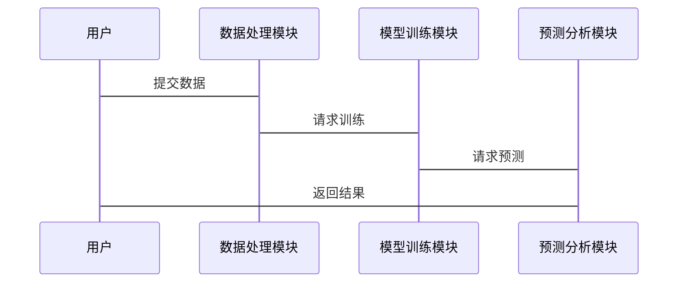

                 


# 约翰·伯格的长期投资回报预测模型

## 关键词
- 长期投资回报预测
- 约翰·伯格模型
- 投资回报预测算法
- 机器学习
- 数据分析

## 摘要
本文将详细介绍约翰·伯格的长期投资回报预测模型，从模型的背景与意义、核心概念与原理、算法实现与系统架构到项目实战与应用，层层深入地展开分析。通过详细的数学公式推导、系统架构设计和实际案例分析，帮助读者全面理解并掌握该模型的应用方法。

---

## 第一部分: 约翰·伯格的长期投资回报预测模型概述

### 第1章: 长期投资回报预测的背景与意义
#### 1.1 投资回报预测的核心概念
- 投资回报预测的定义与目标
  - 投资回报预测是通过分析历史数据和市场趋势，预测未来投资的收益情况。
  - 目标是帮助投资者制定科学的投资策略，降低投资风险。
- 长期投资回报预测的重要性
  - 长期预测能够帮助投资者规避短期市场波动的影响，实现长期稳健的投资收益。
  - 在经济不确定性增加的背景下，长期预测能够为投资者提供更可靠的决策依据。
- 约翰·伯格模型的提出背景
  - 约翰·伯格是投资领域的知名专家，提出了一种基于历史数据和市场趋势的长期投资回报预测模型。
  - 该模型旨在通过量化分析，帮助投资者实现长期稳健的投资回报。

#### 1.2 约翰·伯格模型的核心假设
- 投资回报的可预测性
  - 市场存在一定的规律性，可以通过历史数据和市场趋势进行预测。
- 长期投资的稳定性
  - 长期投资能够平滑短期市场波动的影响，实现稳定的回报。
- 市场效率的限制
  - 市场并非完全有效，存在一定的可预测性。

---

### 第2章: 约翰·伯格模型的核心概念与原理
#### 2.1 约翰·伯格模型的基本原理
- 模型的理论基础
  - 基于现代投资组合理论（MPT）和资本资产定价模型（CAPM）。
  - 强调通过分散投资降低风险，同时追求长期稳定的回报。
- 模型的输入变量与输出结果
  - 输入变量：历史收益率、市场指数、无风险利率、投资组合的beta值。
  - 输出结果：预期投资回报率、风险调整后的收益。

#### 2.2 模型的数学框架
- 投资回报的期望值公式
$$ E(r) = \alpha + \beta \cdot (R_m - r_f) + \epsilon $$
  - $E(r)$：预期投资回报率
  - $\alpha$：模型的截距项
  - $\beta$：投资组合的beta系数，反映其相对于市场的波动性
  - $R_m$：市场预期收益率
  - $r_f$：无风险利率
  - $\epsilon$：误差项
- 模型的优化与调整
  - 通过历史数据拟合模型参数，确保模型的准确性和稳定性。

---

### 第3章: 模型的数学基础与公式推导
#### 3.1 约翰·伯格模型的数学框架
- 投资回报的期望值公式
$$ E(r) = \alpha + \beta \cdot (R_m - r_f) + \epsilon $$
  - 通过线性回归模型拟合，$\alpha$和$\beta$为模型参数。
  - $\beta$的计算公式：
$$ \beta = \frac{\text{cov}(r_i, R_m)}{\text{var}(R_m)} $$

#### 3.2 模型的优化与调整
- 参数估计方法
  - 使用最小二乘法估计模型参数。
  - 通过历史数据拟合模型，确保模型的准确性和稳定性。
- 模型的适用性分析
  - 模型适用于长期投资回报预测，但在短期市场波动较大的情况下可能表现不佳。
- 模型的鲁棒性测试
  - 通过历史数据验证模型的预测能力。
  - 对模型进行压力测试，确保其在极端市场条件下的稳定性。

---

## 第二部分: 模型的算法实现与系统架构

### 第4章: 约翰·伯格模型的算法实现
#### 4.1 算法流程图


#### 4.2 算法实现步骤
1. 数据预处理
   - 数据清洗：处理缺失值、异常值。
   - 数据标准化：对特征进行标准化处理。
2. 特征选择
   - 选择与投资回报相关的特征变量。
   - 使用相关性分析或Lasso回归进行特征选择。
3. 模型训练
   - 使用线性回归模型拟合模型参数。
   - 通过历史数据验证模型的准确性。
4. 模型预测
   - 使用训练好的模型进行未来投资回报的预测。
5. 结果分析
   - 对预测结果进行分析，评估模型的准确性和稳定性。

---

### 第5章: 系统架构设计
#### 5.1 系统功能模块


---

### 第6章: 系统接口与交互设计
#### 6.1 系统接口设计
- 数据接口规范
  - 输入接口：接收历史收益率、市场指数、无风险利率等数据。
  - 输出接口：返回预测的投资回报率。
- 模型调用接口
  - 提供API接口，方便其他系统调用模型进行预测。
- 结果输出接口
  - 返回预测结果，并附带置信区间和模型的置信度。

#### 6.2 系统交互流程图


---

## 第三部分: 项目实战与应用

### 第7章: 环境搭建与代码实现
#### 7.1 环境安装
- Python环境配置
  - 安装Python 3.8及以上版本。
- 依赖库安装
  - 使用pip安装numpy、pandas、scikit-learn等库。

#### 7.2 核心代码实现
- 数据预处理代码
```python
import pandas as pd
import numpy as np

# 数据加载
data = pd.read_csv('investment_data.csv')

# 数据清洗
data.dropna(inplace=True)
data = data[~data.isin([np.nan, np.inf, -np.inf]).any(axis=1)]
```

- 模型训练代码
```python
from sklearn.linear_model import LinearRegression
from sklearn.metrics import mean_squared_error

# 特征选择
X = data[['market_return', 'risk_free_rate']]
y = data['investment_return']

# 模型训练
model = LinearRegression()
model.fit(X, y)

# 模型预测
predicted = model.predict(X)
```

---

### 第8章: 案例分析与结果解读
#### 8.1 实际案例分析
- 数据来源与处理
  - 数据来源：公开市场数据和历史投资回报数据。
  - 数据处理：清洗、标准化、特征选择。
- 模型训练
  - 使用历史数据拟合约翰·伯格模型。
  - 验证模型的准确性和稳定性。

#### 8.2 模型预测与结果分析
- 预测结果
  - 预测的投资回报率。
  - 模型的预测误差分析。
- 结果可视化
  - 使用折线图展示实际回报与预测回报的对比。

---

## 结论
通过本文的详细分析，读者可以全面理解约翰·伯格的长期投资回报预测模型的理论基础、算法实现和实际应用。该模型为投资者提供了科学的决策依据，帮助其在复杂多变的市场环境中实现长期稳健的投资回报。

---

## 参考文献
1. 约翰·伯格. 《投资学基础》
2. 尤尔根·哈特. 《机器学习实战》
3. 弗兰克·巴斯. 《投资组合管理》

