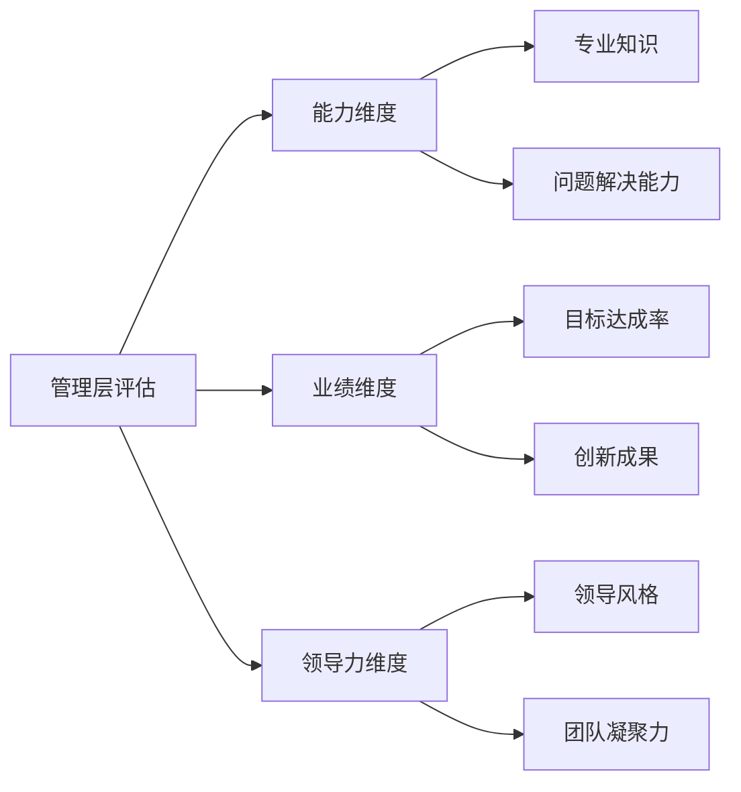
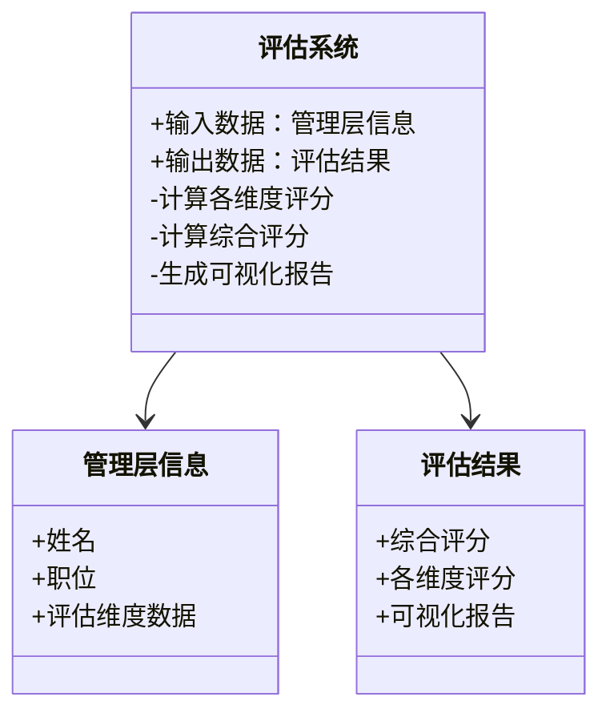

                 


# 《费雪的管理层质量评估方法》

## 关键词：管理层质量评估，费雪方法，评估模型，算法原理，系统设计，项目实战

## 摘要：  
本文系统地介绍了费雪的管理层质量评估方法，从背景介绍、核心概念、算法原理到系统设计与项目实战，全面解析了该方法的理论基础与实际应用。通过详细的数学模型和系统架构设计，本文为读者提供了一套完整的管理层质量评估解决方案，并结合实际案例展示了如何将该方法应用于企业管理实践中。文章最后总结了最佳实践和注意事项，帮助读者更好地理解和应用费雪方法。

---

# 第一部分: 费雪管理层质量评估方法的背景与核心概念

## 第1章: 费雪管理层质量评估方法的背景介绍

### 1.1 问题背景与问题描述  
在企业管理和组织行为学领域，管理层的质量评估是企业成功的关键因素之一。然而，传统的管理层评估方法往往存在以下问题：  
1. **评估维度单一**：通常只关注财务指标或主观评价，缺乏对管理层能力的全面评估。  
2. **权重分配不合理**：不同维度的重要性未得到准确量化，导致评估结果失真。  
3. **评估过程缺乏透明性**：主观性较强，难以量化和验证。  

### 1.2 费雪方法的提出与目标  
费雪的管理层质量评估方法是一种基于多维度分析的量化评估模型，旨在通过科学的权重分配和数据驱动的方法，全面评估管理层的能力和表现。其目标是：  
1. 提供一种客观、透明的评估方法。  
2. 帮助企业在招聘、晋升和培训中做出更科学的决策。  
3. 通过数据驱动的方式，优化企业管理体系。  

### 1.3 费雪方法的核心要素  
费雪方法的核心要素包括：  
1. **多维度评估**：从能力、业绩、领导力等多个维度对管理层进行评估。  
2. **权重分配**：根据企业需求和行业特点，为每个维度分配合理的权重。  
3. **数据驱动**：通过数据分析和建模，得出客观的评估结果。  

---

## 第2章: 费雪管理层质量评估模型的核心概念与联系  

### 2.1 核心概念的原理与属性  
费雪模型将管理层的评估维度划分为以下几个方面：  
1. **能力维度**：包括专业知识、决策能力、问题解决能力等。  
2. **业绩维度**：包括目标达成情况、团队绩效、创新成果等。  
3. **领导力维度**：包括团队凝聚力、领导风格、员工满意度等。  

### 2.2 核心概念的对比分析  
通过以下表格和Mermaid图，我们可以更清晰地理解费雪模型的核心概念及其联系：  

#### 对比表格  
| 维度 | 定义 | 权重 | 示例指标 |  
|------|------|------|----------|  
| 能力 | 专业知识和技能水平 | 30% | 学历背景、行业经验 |  
| 业绩 | 工作成果 | 40% | 目标达成率、团队绩效 |  
| 领导力 | 领导风格与团队管理 | 30% | 员工满意度、团队凝聚力 |  

#### Mermaid图  


---

## 第3章: 费雪管理层质量评估方法的算法原理  

### 3.1 算法原理的数学模型与公式  
费雪模型的核心是通过加权求和的方式，将各个维度的评分进行综合计算。其数学表达式如下：  

$$ \text{综合评分} = \sum_{i=1}^{n} w_i \cdot s_i $$  

其中，$w_i$ 是第 $i$ 个维度的权重，$s_i$ 是第 $i$ 个维度的评分。  

### 3.2 算法流程  
通过以下Mermaid流程图，我们可以清晰地理解费雪方法的评估流程：  


### 3.3 示例计算  
假设某企业管理层的评估结果如下：  
- 能力维度：80分，权重30%  
- 业绩维度：75分，权重40%  
- 领导力维度：90分，权重30%  

综合评分计算公式为：  

$$ \text{综合评分} = 0.3 \times 80 + 0.4 \times 75 + 0.3 \times 90 = 24 + 30 + 27 = 81 $$  

---

# 第二部分: 费雪管理层质量评估方法的系统设计与项目实战  

## 第4章: 系统分析与架构设计  

### 4.1 问题场景介绍  
以某企业为例，我们需要设计一个基于费雪方法的管理层质量评估系统。该系统的目标是：  
1. 收集管理层的评估数据。  
2. 计算各维度的评分和综合评分。  
3. 提供可视化的评估结果。  

### 4.2 系统功能设计  
通过以下Mermaid类图，我们可以理解系统的核心功能模块：  



### 4.3 系统架构设计  
通过以下Mermaid架构图，我们可以理解系统的整体架构：  


---

## 第5章: 项目实战  

### 5.1 环境安装与数据准备  
1. **环境安装**：安装Python、Pandas、Matplotlib等工具。  
2. **数据准备**：收集管理层的评估数据，包括能力、业绩、领导力等维度。  

### 5.2 核心代码实现  
以下是费雪方法的Python实现代码：  

```python
def fisher_assessment(scores, weights):
    return sum(w * s for w, s in zip(weights, scores))

# 示例数据
scores = [80, 75, 90]
weights = [0.3, 0.4, 0.3]
result = fisher_assessment(scores, weights)
print(f"综合评分: {result}")
```

### 5.3 代码解读与分析  
1. **函数定义**：`fisher_assessment`函数接受两个参数：`scores`（各维度评分）和 `weights`（各维度权重）。  
2. **计算过程**：通过`sum`函数对每个维度的评分乘以权重求和，得到综合评分。  
3. **示例计算**：输入各维度评分和权重，输出综合评分。  

### 5.4 实际案例分析  
以某企业为例，假设管理层的评估数据如下：  
- 能力维度：85分  
- 业绩维度：80分  
- 领导力维度：85分  

权重分配为：能力30%，业绩40%，领导力30%。  

综合评分计算如下：  

$$ \text{综合评分} = 0.3 \times 85 + 0.4 \times 80 + 0.3 \times 85 = 25.5 + 32 + 25.5 = 83 $$  

---

## 第6章: 最佳实践与注意事项  

### 6.1 小结  
费雪的管理层质量评估方法是一种科学、透明的评估模型，能够帮助企业更好地评估管理层的能力和表现。  

### 6.2 注意事项  
1. **数据准确性**：确保输入数据的准确性和完整性。  
2. **权重合理性**：根据企业需求和行业特点，合理调整各维度的权重。  
3. **模型优化**：根据实际应用效果，不断优化模型和评估方法。  

### 6.3 拓展阅读  
1. 《管理学原理》：深入理解管理层评估的理论基础。  
2. 《数据驱动的决策》：学习如何将数据驱动的方法应用于企业管理。  

---

# 结语  
通过本文的详细讲解，读者可以全面了解费雪的管理层质量评估方法，并将其应用于实际的企业管理实践中。希望本文能够为企业的管理层评估提供有价值的参考和指导。

