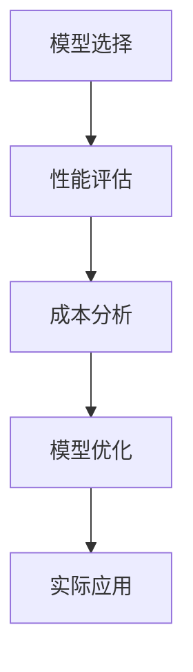
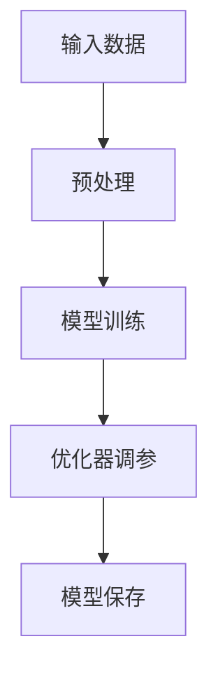
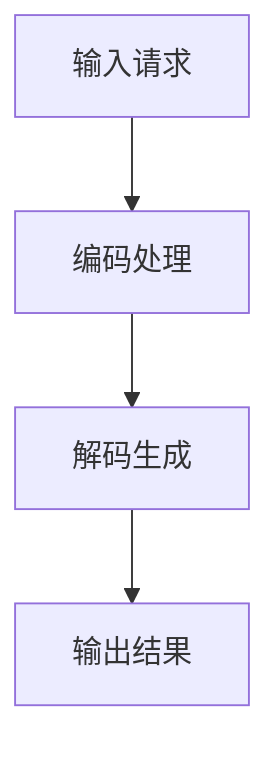
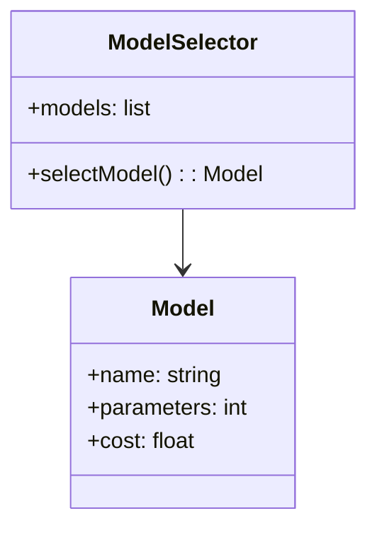
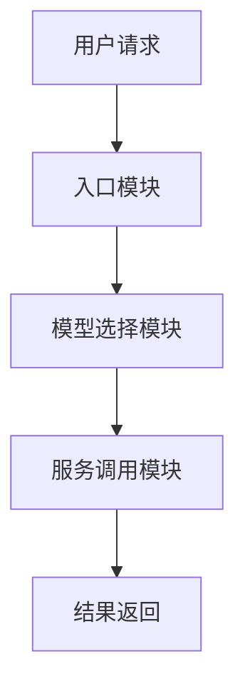

                 


```

# 选择合适的LLM模型：性能与成本的平衡

> 关键词：LLM模型、性能与成本、大语言模型、AI技术、模型选择、AI系统架构

> 摘要：在AI技术快速发展的今天，选择合适的LLM（大语言模型）模型对企业级应用至关重要。本文将从背景介绍、核心概念、算法原理、系统架构、项目实战等多角度，详细分析如何在性能与成本之间找到最佳平衡点，为企业和技术开发者提供实用的指导和建议。

---

# 第1章: LLM模型的背景与问题背景

## 1.1 LLM模型的背景介绍

### 1.1.1 大语言模型的定义与核心概念

- LLM（Large Language Model）的定义
- 大语言模型在AI技术中的核心地位
- 企业级应用中的LLM模型需求

### 1.1.2 LLM模型在AI技术中的地位

- 大语言模型在自然语言处理（NLP）中的作用
- LLM模型对AI产业发展的影响
- LLM模型在企业数字化转型中的价值

### 1.1.3 企业级应用中的LLM模型需求

- 企业对LLM模型的性能要求
- 企业对LLM模型的成本考量
- 企业对LLM模型的灵活性需求

## 1.2 问题背景与问题描述

### 1.2.1 LLM模型选择的核心挑战

- 性能与成本的权衡问题
- 不同场景下的模型适用性
- 模型的可扩展性与维护成本

### 1.2.2 性能与成本平衡的必要性

- 高性能模型的高昂成本问题
- 低成本模型的性能不足问题
- 找到适合具体场景的模型平衡点

### 1.2.3 问题解决的思路与方法

- 基于场景需求的模型选择策略
- 模型性能与成本的量化评估方法
- 模型优化与调优技术的应用

## 1.3 边界与外延

### 1.3.1 LLM模型选择的边界条件

- 数据规模与模型复杂度的关系
- 任务类型对模型选择的影响
- 环境限制对模型部署的影响

### 1.3.2 相关概念的外延与区别

- LLM与小语言模型（Small Language Model）的区别
- LLM与NLP技术的其他分支（如机器翻译、问答系统）的关系
- LLM与AI芯片、算力资源的相互作用

### 1.3.3 核心要素的组成与关系

- 模型参数、训练数据、计算资源之间的关系
- 模型性能、推理速度、资源消耗的相互影响
- 任务需求、用户反馈与模型优化的关系

## 1.4 核心概念结构与组成

### 1.4.1 LLM模型的主要组成部分

- 模型架构：如Transformer、BERT等
- 训练数据：文本数据集的构成与特点
- 模型参数：参数数量对模型性能的影响

### 1.4.2 性能与成本的评估维度

- 模型性能指标：准确率、召回率、F1值等
- 成本评估指标：计算资源消耗、推理时间、部署成本等
- 综合评估维度：性价比、可扩展性、可维护性

### 1.4.3 核心要素的相互作用

- 模型参数对性能和成本的双重影响
- 训练数据对模型泛化能力的影响
- 推理速度对实际应用场景的影响

---

# 第2章: LLM模型的核心概念与联系

## 2.1 核心概念原理

### 2.1.1 大语言模型的训练原理

- 基于Transformer的自注意力机制
- 深度学习中的前向传播与反向传播
- 梯度下降优化算法

### 2.1.2 模型参数与性能的关系

- 参数数量对模型容量的影响
- 参数数量对模型过拟合或欠拟合的影响
- 参数数量对模型推理速度的影响

### 2.1.3 模型推理过程的详细分析

- 输入处理：文本预处理与分词
- 编码过程：词向量表示与序列编码
- 解码过程：生成输出文本的过程

## 2.2 模型属性特征对比

### 2.2.1 模型参数数量对比

- 常见LLM模型的参数数量对比（如GPT-3、BERT、PaLM）
- 参数数量对模型复杂度和性能的影响
- 参数数量对计算资源的需求分析

### 2.2.2 训练数据量与模型性能

- 不同规模数据集对模型性能的影响
- 数据多样性对模型泛化能力的作用
- 数据质量对模型准确率的影响

### 2.2.3 推理速度与资源消耗对比

- 不同模型的推理速度对比
- CPU与GPU环境下的性能差异
- 内存占用与计算资源的关系

## 2.3 ER实体关系图



---

# 第3章: LLM模型的算法原理讲解

## 3.1 算法原理

### 3.1.1 大语言模型的训练流程



### 3.1.2 模型推理过程



### 3.1.3 深度学习模型的数学基础

- 线性代数基础：向量、矩阵运算
- 概率论基础：概率分布、条件概率
- 神经网络基础：激活函数、损失函数

## 3.2 算法实现

### 3.2.1 神经网络的前向传播

- 输入层、隐藏层、输出层的计算过程
- 权重矩阵与激活函数的作用
- 损失函数的计算公式

### 3.2.2 梯度下降优化

- 梯度下降的基本原理
- 学习率对优化过程的影响
- 动量优化与Adam优化器的对比

### 3.2.3 模型训练的数学公式

- 损失函数的定义：$$ L = \frac{1}{N}\sum_{i=1}^{N} (y_i - \hat{y}_i)^2 $$
- 优化目标：$$ \min_{\theta} L $$
- Adam优化器的更新公式：$$ \theta_{t+1} = \theta_t - \eta \frac{m_t}{v_t + \epsilon} $$

## 3.3 算法优化

### 3.3.1 参数剪枝技术

- 权重剪枝的原理与方法
- 结构化剪枝与非结构化剪枝的对比
- 剪枝对模型性能的影响分析

### 3.3.2 知识蒸馏技术

- 知识蒸馏的基本原理
- 老师模型与学生模型的角色分工
- 蒸馏过程中的损失函数设计

### 3.3.3 模型量化技术

- 模型量化的基本概念
- 4位整数量化与8位整数量化的效果对比
- 量化对模型推理速度的提升作用

---

# 第4章: 系统分析与架构设计方案

## 4.1 问题场景介绍

### 4.1.1 企业级应用中的LLM模型选择

- 电商领域的客服问答系统
- 金融领域的风险评估系统
- 医疗领域的诊断辅助系统

### 4.1.2 项目背景与目标

- 项目需求分析
- 项目目标设定
- 项目范围界定

## 4.2 系统功能设计

### 4.2.1 领域模型设计



### 4.2.2 系统架构设计



### 4.2.3 接口设计与交互流程

- API接口定义
- 请求与响应协议
- 接口调用流程

## 4.3 系统优化与调优

### 4.3.1 算法优化策略

- 模型压缩技术
- 并行计算优化
- 模型切分与分布式部署

### 4.3.2 系统性能监控

- 性能指标监控
- 日志分析与问题定位
- 系统资源使用情况监控

### 4.3.3 系统容错与恢复机制

- 故障容忍机制
- 自动恢复策略
- 容错设计原则

---

# 第5章: 项目实战

## 5.1 环境安装与配置

### 5.1.1 开发环境搭建

- 安装Python与相关库（如TensorFlow、PyTorch）
- 安装模型训练框架（如Hugging Face Transformers）
- 安装NVIDIA GPU驱动与CUDA toolkit（如需）

### 5.1.2 数据集准备

- 数据清洗与预处理
- 数据分块与存储优化
- 数据集格式转换

## 5.2 系统核心实现

### 5.2.1 模型选择模块实现

```python
def select_model(parameters, cost):
    if parameters > 100000000:
        return "GPT-3"
    elif cost < 100:
        return "BERT"
    else:
        return "ROBERTA"
```

### 5.2.2 模型训练与优化

```python
def train_model(model, optimizer, epochs):
    for epoch in range(epochs):
        for batch in data_loader:
            outputs = model(batch)
            loss = criterion(outputs, labels)
            optimizer.zero_grad()
            loss.backward()
            optimizer.step()
    return model
```

### 5.2.3 模型推理与评估

```python
def evaluate_model(model):
    with torch.no_grad():
        for batch in test_loader:
            outputs = model(batch)
            predictions = torch.argmax(outputs, dim=1)
            accuracy = (predictions == labels).mean()
            print(f"Accuracy: {accuracy.item()}")
    return accuracy
```

## 5.3 案例分析与详细解读

### 5.3.1 实际案例分析

- 某电商平台的客服问答系统优化
- 某金融公司的风险评估模型优化
- 某医疗平台的诊断辅助系统优化

### 5.3.2 代码实现与解读

- 模型选择策略的代码实现
- 模型训练与优化的代码解读
- 模型推理与评估的代码分析

## 5.4 项目小结

### 5.4.1 项目总结

- 项目目标达成情况
- 项目过程中遇到的问题及解决方案
- 项目成果与经验总结

### 5.4.2 实践中的注意事项

- 模型选择中的常见误区
- 代码实现中的注意事项
- 系统优化中的关键点

---

# 第6章: 最佳实践、小结、注意事项与拓展阅读

## 6.1 最佳实践

### 6.1.1 模型选择中的最佳实践

- 根据任务需求选择模型
- 从开源模型库中选择合适的模型
- 通过实验验证模型性能

### 6.1.2 系统优化中的最佳实践

- 采用模型量化技术减少资源消耗
- 利用并行计算加速推理速度
- 通过模型蒸馏技术降低计算成本

## 6.2 小结

### 6.2.1 核心内容回顾

- LLM模型选择的核心问题
- 性能与成本平衡的策略
- 系统优化与调优的关键点

### 6.2.2 重点内容总结

- 选择模型时需要综合考虑性能与成本
- 系统优化是降低资源消耗的有效手段
- 实践中需要结合具体场景进行调整

## 6.3 注意事项

### 6.3.1 实践中的注意事项

- 不要盲目追求高参数模型
- 注意模型的可扩展性与可维护性
- 确保模型的稳定性和可靠性

### 6.3.2 拓展阅读建议

- 关注最新的模型优化技术
- 学习相关的数学基础与算法原理
- 研究领域的最新研究成果

## 6.4 拓展阅读

### 6.4.1 相关技术领域

- 深度学习模型优化技术
- 自然语言处理（NLP）领域的最新进展
- AI系统架构设计的前沿研究

### 6.4.2 推荐书籍与论文

- 《Deep Learning》（Ian Goodfellow）
- 《自然语言处理入门》（Nathaniel J. Smith）
- 《Large Language Models：The New Frontier in AI》（OpenAI）

---

# 结语

选择合适的LLM模型是一个复杂而重要的任务，需要综合考虑性能与成本的平衡。通过本文的详细分析与实践指导，读者可以更好地理解如何在实际应用中选择和优化模型，从而为企业和技术开发者提供有价值的参考和指导。

```

