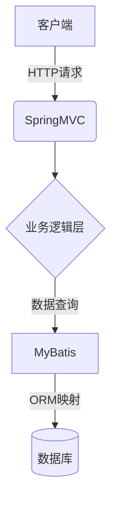

# 基于SSM的排课选课系统

## 1. 背景介绍

### 1.1 排课选课系统的重要性

在当今教育领域,排课选课系统扮演着至关重要的角色。它不仅能够优化学校的教学资源分配,提高课程安排的效率,还能为学生提供更加便捷的选课体验。随着教育信息化进程的不断推进,构建一个高效、智能的排课选课系统已经成为各大院校的当务之急。

### 1.2 传统排课选课系统的挑战

传统的排课选课系统通常采用人工操作的方式,存在诸多弊端:

- 工作量大,效率低下
- 难以满足多样化的课程需求
- 资源利用率不高
- 缺乏智能化调度

这些问题不仅加重了管理人员的工作负担,也影响了教学质量和学生体验。因此,迫切需要一种新型的排课选课系统来应对这些挑战。

### 1.3 基于SSM的排课选课系统

基于SSM(Spring、SpringMVC、MyBatis)框架的排课选课系统,是一种全新的解决方案。它将软件工程中的先进理念与智能算法相结合,从而实现了自动化的课程安排、资源调度和选课管理。该系统不仅能够极大地提高工作效率,还能为师生带来更加优质的教学体验。

## 2. 核心概念与联系

### 2.1 SSM框架

SSM框架是指Spring+SpringMVC+MyBatis的整合开发模式,它将这三种框架的优势有机结合,形成了一套高效、灵活的JavaEE开发架构。

- Spring: 提供了面向切面编程(AOP)和控制反转(IOC)等核心功能,简化了对象之间的依赖管理。
- SpringMVC: 基于MVC设计模式,实现了请求驱动型的Web层开发。
- MyBatis: 一种优秀的持久层框架,支持定制化SQL、存储过程以及高级映射等功能。

### 2.2 排课算法

排课算法是排课选课系统的核心部分,它需要综合考虑多种约束条件,如教师时间、教室容量、课程冲突等,从而生成一份满足各方需求的最优课程安排方案。常见的排课算法包括:

- 图着色算法
- 蚁群算法
- 遗传算法
- 模拟退火算法

### 2.3 选课机制

选课机制则负责管理学生的选课过程,包括选课规则的制定、选课时间的安排、选课结果的处理等。常见的选课机制有:

- 先到先得
- 按成绩排名
- 随机抽签

### 2.4 核心概念的联系

这三个核心概念在排课选课系统中密切相关:

- SSM框架为整个系统提供了架构支持,负责各个模块之间的通信和协作。
- 排课算法根据各种约束条件,生成最优的课程安排方案。
- 选课机制则根据学校的规则,为学生分配所选课程。

只有三者协同工作,排课选课系统才能高效、智能地运行。

## 3. 核心算法原理和具体操作步骤

在排课选课系统中,排课算法是最为核心和关键的部分。我们将重点介绍其中的图着色算法和蚁群算法的原理和具体实现步骤。

### 3.1 图着色算法

#### 3.1.1 算法原理

图着色算法源于著名的图着色问题,其目标是使用最少的颜色为图中的每个顶点着色,且相邻的顶点不能使用相同的颜色。在排课问题中,我们可以将每门课程视为一个顶点,如果两门课程在同一时间段则视为相邻,着色过程就相当于为每门课程安排时间段和教室。

算法的核心思想是先构建课程冲突图,然后基于图着色算法的着色策略,为每个课程安排一个合适的时间段和教室,使得冲突的课程不会被安排在同一时间段。

#### 3.1.2 算法步骤

1) 构建课程冲突图
    - 顶点表示课程
    - 如果两门课程时间冲突,则在两个顶点之间连一条边
2) 按照一定策略给顶点着色
    - 常用策略有贪心着色、最大度先着色等
3) 将同色顶点分配到同一时间段
4) 进一步分配教室资源

#### 3.1.3 数学模型

设有 $n$ 门课程,令 $G=(V,E)$ 表示课程冲突图,其中 $V$ 为课程顶点集合, $E$ 为冲突边集合。

定义着色函数 $f:V\rightarrow C$,将顶点 $v$ 着上颜色 $c\in C$,其中 $C$ 为可用颜色集合。

目标是找到最小的 $|C|$,使得:

$$
\forall (u,v)\in E: f(u)\neq f(v)
$$

也就是相邻顶点必须使用不同的颜色。

#### 3.1.4 算法复杂度

图着色算法的时间复杂度与着色策略有关,通常情况下是 $O(n^2)$ 级别的,其中 $n$ 为课程数量。空间复杂度为 $O(n+m)$,其中 $m$ 为冲突边数量。

### 3.2 蚁群算法

#### 3.2.1 算法原理  

蚁群算法是一种基于蚂蚁集群智能行为的优化算法,常用于解决组合优化问题。在排课问题中,我们可以将每个蚂蚁视为一种可能的课程安排方案,通过模拟蚂蚁在解空间中行走并留下信息素的过程,最终收敛到一个全局最优解。

算法的关键在于,蚂蚁在行走过程中会优先选择信息素浓度较高的路径,也就是之前被其他蚂蚁选择较多的优质解。通过不断迭代,优质解会被加强,而劣质解则会被弱化,最终收敛到一个满足所有约束条件的最优排课方案。

#### 3.2.2 算法步骤

1) 初始化
    - 确定蚂蚁数量
    - 为每个可选时间段添加微小信息素
2) 构造解
    - 每只蚂蚁按一定概率规则选择未排的课程及其时间段
    - 更新信息素矩阵
3) 蚂蚁循环
    - 重复步骤2,直到所有课程都被安排
4) 更新全局最优解
5) 信息素挥发
    - 模拟信息素挥发,避免过早收敛
6) 迭代直到满足停止条件

#### 3.2.3 数学模型

设有 $m$ 个时间段, $n$ 门待排课程,令 $\tau_{ij}$ 表示第 $i$ 门课程安排在第 $j$ 个时间段的信息素浓度。

对于第 $k$ 只蚂蚁,在第 $r$ 次迭代时选择第 $i$ 门课程安排在第 $j$ 个时间段的概率为:

$$
p_{ij}^k(r)=\frac{[\tau_{ij}(r)]^\alpha\cdot[\eta_{ij}]^\beta}{\sum\limits_{l\in allowed_k}[\tau_{il}(r)]^\alpha\cdot[\eta_{il}]^\beta}
$$

其中:
- $\alpha$ 为信息素重要程度因子
- $\beta$ 为启发式因子
- $\eta_{ij}$ 为启发式信息,如课程先后顺序、教师偏好等
- $allowed_k$ 为第 $k$ 只蚂蚁当前可选的时间段集合

#### 3.2.4 算法复杂度

蚁群算法的时间复杂度为 $O(n^2\cdot m\cdot iter)$,其中 $n$ 为课程数量, $m$ 为时间段数量, $iter$ 为迭代次数。空间复杂度为 $O(n\cdot m)$。

## 4. 数学模型和公式详细讲解举例说明

在上一节中,我们分别给出了图着色算法和蚁群算法的数学模型。现在,我们将通过具体的例子,对这些公式和概念进行详细的讲解和说明。

### 4.1 图着色算法示例

假设有6门课程,它们之间的冲突关系如下图所示:

```
    1 - 2
    |   |
    3 - 4
    |   |
    5 - 6
```

我们可以构建如下的课程冲突图 $G=(V,E)$:

$$
\begin{aligned}
V &= \{1,2,3,4,5,6\} \\
E &= \{(1,2),(1,3),(2,3),(2,4),(3,4),(3,5),(4,5),(4,6),(5,6)\}
\end{aligned}
$$

使用最大度先着色策略,首先给度数最大的顶点4着色,设颜色为红色。然后是顶点3,由于它与4相邻,因此给它着上另一种颜色,设为蓝色。依次类推,最终的着色方案为:

$$
\begin{aligned}
f(1)&=\text{红色} & f(4)&=\text{红色}\\
f(2)&=\text{蓝色} & f(5)&=\text{绿色}\\
f(3)&=\text{蓝色} & f(6)&=\text{绿色}
\end{aligned}
$$

也就是说,课程1和4可以安排在同一时间段,课程2和3安排在另一时间段,课程5和6安排在第三个时间段。最终只使用了3种颜色,即只需要3个时间段就可以安排这6门课程,避免了冲突。

### 4.2 蚁群算法示例

假设有5门课程,3个可选时间段。我们用一个5x3的信息素矩阵来表示每门课程安排在不同时间段的信息素浓度:

$$
\tau=\begin{bmatrix}
0.1 & 0.2 & 0.3\\
0.4 & 0.1 & 0.2\\
0.2 & 0.3 & 0.1\\
0.3 & 0.2 & 0.4\\
0.1 & 0.4 & 0.2
\end{bmatrix}
$$

设 $\alpha=1,\beta=2$,某只蚂蚁当前可选时间段集合为 $\{1,3\}$,且课程1和3的先后顺序得分为 $\eta_{11}=0.8,\eta_{13}=0.6$。那么,该蚂蚁选择课程1安排在时间段1的概率为:

$$
\begin{aligned}
p_{11}&=\frac{[0.1]^1\cdot[0.8]^2}{[0.1]^1\cdot[0.8]^2+[0.3]^1\cdot[0.6]^2}\\
&=\frac{0.1\cdot0.64}{0.1\cdot0.64+0.3\cdot0.36}\\
&\approx0.58
\end{aligned}
$$

选择课程1安排在时间段3的概率为:

$$
p_{13}=\frac{[0.3]^1\cdot[0.6]^2}{[0.1]^1\cdot[0.8]^2+[0.3]^1\cdot[0.6]^2}\approx0.42
$$

通过这种方式,蚂蚁可以根据信息素浓度和启发式信息,选择一个相对最优的时间段安排当前课程。多只蚂蚁通过不断迭代,最终会收敛到一个全局最优的排课方案。

## 5. 项目实践:代码实例和详细解释说明

在这一节中,我们将通过实际的代码示例,展示如何使用SSM框架和排课算法来开发一个排课选课系统。

### 5.1 系统架构

我们的排课选课系统采用经典的三层架构,包括:

- 表现层(View): 基于SpringMVC框架,负责接收请求和返回结果视图
- 业务逻辑层(Controller): 处理具体的业务逻辑,如排课、选课等
- 数据访问层(Model): 使用MyBatis框架对数据库进行增删改查操作



### 5.2 数据库设计

我们的系统需要使用4个核心表:

- `course`表: 存储课程基本信息
- `teacher`表: 存储教