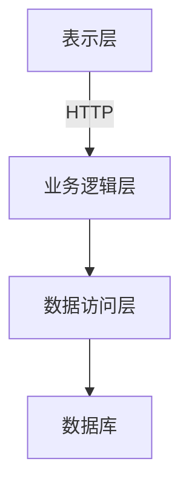

# 软件信息发布系统详细设计与具体代码实现

## 1. 背景介绍

### 1.1 软件信息发布系统概述

在当今快节奏的软件开发环境中,及时、高效地发布软件信息对于确保软件产品的质量、提高开发效率和加强团队协作至关重要。软件信息发布系统旨在为开发团队提供一个集中式的平台,用于管理、发布和跟踪软件相关的信息,如新版本发布说明、错误修复、功能更新等。

### 1.2 系统需求

一个高效的软件信息发布系统应该满足以下需求:

- 集中管理软件信息
- 支持多种信息类型(版本发布、Bug修复、新功能等)
- 版本控制和历史记录
- 通知和订阅机制
- 用户权限管理
- 搜索和过滤功能
- 可扩展性和可维护性

## 2. 核心概念与联系

### 2.1 发布(Release)

发布是指向用户或其他系统公开发布软件的新版本或更新。每个发布都包含一组相关的软件变更,如新功能、Bug 修复、性能优化等。

### 2.2 变更(Change)

变更是指对软件进行的任何修改,包括新增功能、Bug修复、重构等。每个变更都应该有详细的描述、作者、时间戳等元数据。

### 2.3 组件(Component)

组件是指软件的一个独立模块或子系统。通过对组件进行分类和标记,可以更好地管理和跟踪相关的变更和发布。

### 2.4 用户(User)

用户是指访问和使用软件信息发布系统的个人或团队成员。用户可以订阅感兴趣的发布、查看变更历史记录、提交新的变更等。

## 3. 核心算法原理和具体操作步骤

### 3.1 版本控制算法

版本控制是软件信息发布系统的核心功能之一。我们采用基于树的版本控制算法,每个发布都是一个节点,节点之间通过父子关系连接形成一棵树。

具体操作步骤如下:

1. 初始化一个空树
2. 每次创建新发布时,生成一个新节点,将其作为根节点插入树中
3. 如果新发布是基于某个已有发布,则将新节点作为该发布节点的子节点插入
4. 每个节点都包含相关的变更信息
5. 通过遍历树,可以获取任意发布的完整变更历史记录

该算法的时间复杂度为 O(log n),其中 n 是发布的数量,因为在最坏情况下需要遍历树的深度来定位父节点。

### 3.2 通知算法

为了让相关人员及时获取最新的软件信息,我们需要一个高效的通知算法。我们采用发布-订阅模式,用户可以订阅感兴趣的组件或发布类型。

具体算法步骤:

1. 维护一个订阅者列表,包含用户的订阅信息
2. 当有新发布或变更时,遍历订阅者列表
3. 对于每个订阅者,检查新发布/变更是否匹配其订阅条件
4. 如果匹配,则向该订阅者发送通知

该算法的时间复杂度为 O(k*n),其中 k 是订阅者数量,n 是发布/变更的数量,因为需要遍历所有订阅者并检查每个发布/变更。

### 3.3 搜索算法

为了快速查找特定的发布或变更信息,我们需要一个高效的搜索算法。我们采用倒排索引搜索算法。

具体步骤:

1. 为每个发布和变更构建倒排索引,将文本内容拆分为单词,并将单词映射到对应的发布/变更ID列表
2. 当用户输入搜索查询时,对查询进行分词
3. 查找每个查询词对应的发布/变更ID列表
4. 计算这些列表的交集,作为最终结果

该算法的时间复杂度取决于索引的大小和查询词的数量。在最坏情况下,时间复杂度为 O(k*n),其中 k 是查询词的数量,n 是索引的大小。

## 4. 数学模型和公式详细讲解举例说明

### 4.1 版本树模型

我们使用一种基于树的数据结构来表示版本控制系统中的发布关系。每个发布都是一个节点,节点之间通过父子关系连接形成一棵树。

定义版本树的数学模型如下:

$$
T = (N, E)
$$

其中:
- $N$ 是节点集合,表示所有发布
- $E$ 是边集合,表示发布之间的父子关系

对于任意节点 $n_i \in N$,我们定义:

- $P(n_i)$ 表示 $n_i$ 的父节点集合
- $C(n_i)$ 表示 $n_i$ 的子节点集合

则有:

$$
\forall n_i, n_j \in N, (n_i, n_j) \in E \Leftrightarrow n_j \in C(n_i) \land n_i \in P(n_j)
$$

根节点 $r$ 是没有父节点的节点:

$$
r = \{n_i | n_i \in N \land P(n_i) = \emptyset\}
$$

叶节点 $L$ 是没有子节点的节点集合:

$$
L = \{n_i | n_i \in N \land C(n_i) = \emptyset\}
$$

通过这种树形结构,我们可以高效地追踪任意发布的变更历史记录。对于节点 $n_i$,其变更历史记录 $H(n_i)$ 可以通过递归地合并其父节点的变更历史记录获得:

$$
H(n_i) = \bigcup_{n_j \in P(n_i)} H(n_j) \cup \text{Changes}(n_i)
$$

其中 $\text{Changes}(n_i)$ 表示节点 $n_i$ 自身包含的变更集合。

### 4.2 通知模型

为了实现高效的通知机制,我们采用发布-订阅模式。用户可以订阅感兴趣的组件或发布类型,当有新的发布或变更时,系统会自动向订阅者发送通知。

定义通知模型如下:

- 令 $U$ 表示用户集合
- 令 $S$ 表示订阅集合,每个订阅 $s \in S$ 包含一个订阅条件 $c(s)$ 和一个订阅者集合 $U(s) \subseteq U$
- 令 $R$ 表示发布集合
- 令 $\text{Matches}(r, s)$ 为一个布尔函数,表示发布 $r$ 是否匹配订阅 $s$ 的条件 $c(s)$

当有新发布 $r \in R$ 时,系统需要找到所有匹配的订阅,并向对应的订阅者发送通知:

$$
\text{Notify}(r) = \bigcup_{s \in S, \text{Matches}(r, s)} U(s)
$$

为了提高效率,我们可以预先计算每个订阅条件对应的发布集合:

$$
M(s) = \{r \in R | \text{Matches}(r, s)\}
$$

这样,当有新发布时,只需要检查与该发布匹配的订阅条件即可:

$$
\text{Notify}(r) = \bigcup_{s \in S, r \in M(s)} U(s)
$$

### 4.3 搜索模型

为了支持高效的搜索功能,我们采用倒排索引的数据结构。倒排索引将文本内容拆分为单词,并将每个单词映射到包含该单词的文档(发布或变更)的ID列表。

定义搜索模型如下:

- 令 $D$ 表示文档集合(发布和变更)
- 令 $V$ 表示词汇表,包含所有出现过的单词
- 定义倒排索引 $I: V \rightarrow \mathcal{P}(D)$,将每个单词 $w \in V$ 映射到一个文档ID集合 $I(w)$,表示包含该单词的文档

对于查询 $q = \{w_1, w_2, \ldots, w_k\}$,其搜索结果为各个单词对应文档集合的交集:

$$
\text{Search}(q) = I(w_1) \cap I(w_2) \cap \ldots \cap I(w_k)
$$

为了提高搜索效率,我们可以对倒排索引进行压缩和优化,例如:

- 去除常见的无意义单词(如 "the"、"and" 等)
- 合并同根词的索引
- 使用压缩编码来减小索引的存储空间

通过这些优化,我们可以在保证搜索质量的同时,显著提高搜索的响应速度。

## 5. 项目实践:代码实例和详细解释说明  

### 5.1 系统架构

我们采用经典的三层架构设计,包括表示层(前端)、业务逻辑层(后端)和数据访问层。



#### 表示层

表示层负责与用户交互,包括渲染UI界面、发送请求和展示数据。我们使用 React 框架开发单页面应用程序。

```jsx
// 发布列表组件
import React, { useEffect, useState } from 'react';
import { getReleases } from './api';

const ReleaseList = () => {
  const [releases, setReleases] = useState([]);

  useEffect(() => {
    const fetchReleases = async () => {
      const data = await getReleases();
      setReleases(data);
    };
    fetchReleases();
  }, []);

  return (
    <div>
      <h2>Release List</h2>
      <ul>
        {releases.map((release) => (
          <li key={release.id}>{release.name}</li>
        ))}
      </ul>
    </div>
  );
};

export default ReleaseList;
```

#### 业务逻辑层

业务逻辑层负责处理请求、执行业务逻辑和与数据访问层交互。我们使用 Node.js 和 Express 框架开发 RESTful API。

```javascript
// 发布 API 路由
const express = require('express');
const router = express.Router();
const releaseService = require('./releaseService');

// 获取所有发布
router.get('/', async (req, res) => {
  try {
    const releases = await releaseService.getAllReleases();
    res.json(releases);
  } catch (err) {
    res.status(500).json({ error: err.message });
  }
});

// 创建新发布
router.post('/', async (req, res) => {
  try {
    const release = await releaseService.createRelease(req.body);
    res.status(201).json(release);
  } catch (err) {
    res.status(400).json({ error: err.message });
  }
});

module.exports = router;
```

#### 数据访问层

数据访问层负责与数据库交互,执行CRUD操作。我们使用 Sequelize ORM 与 PostgreSQL 数据库进行交互。

```javascript
// 发布模型
const { Sequelize, DataTypes } = require('sequelize');
const sequelize = require('./database');

const Release = sequelize.define('Release', {
  name: {
    type: DataTypes.STRING,
    allowNull: false,
  },
  description: {
    type: DataTypes.TEXT,
  },
  version: {
    type: DataTypes.STRING,
  },
  // 其他字段...
});

module.exports = Release;
```

### 5.2 版本控制实现

我们使用基于树的数据结构来实现版本控制功能。每个发布都是一个节点,节点之间通过父子关系连接形成一棵树。

```javascript
// 版本树节点
class ReleaseNode {
  constructor(release) {
    this.release = release;
    this.children = [];
  }

  addChild(child) {
    this.children.push(child);
  }
}

// 版本树
class ReleaseTree {
  constructor() {
    this.root = null;
  }

  addRelease(release, parentId = null) {
    const node = new ReleaseNode(release);

    if (!this.root) {
      this.root = node;
    } else if (parentId) {
      const parent = this.findNode(this.root, parentId);
      if (parent) {
        parent.addChild(node);
      } else {
        throw new Error('Parent release not found');
      }
    } else {
      throw new Error('Root release already exists');
    }

    return node;
  }

  findNode(node, releaseId) {
    if (node.release.id === releaseId) {
      return node;
    }

    for (const child of node.children) {
      const found = this.findNode(child, releaseId);
      if (found) {
        return found;
      }