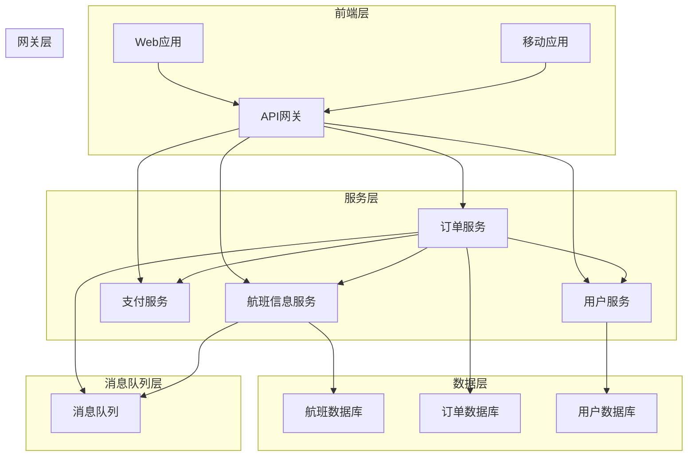

# 飞机售票系统详细设计与具体代码实现

## 1. 背景介绍

### 1.1 航空业的重要性

航空业是现代社会不可或缺的一部分,为全球旅客和货物运输提供了高效便捷的服务。随着经济的发展和人们生活水平的提高,航空旅行已经成为大众化的出行方式。因此,构建一个高效、可靠的飞机售票系统对于航空公司来说至关重要。

### 1.2 售票系统的挑战

设计和实现一个完善的飞机售票系统面临着诸多挑战:

- 高并发访问:在节假日或促销活动期间,系统需要承受大量的并发请求。
- 数据一致性:需要确保航班信息、订单信息等数据的准确性和一致性。
- 复杂的业务逻辑:涉及航班查询、订票、改签、退票等多个环节,业务逻辑复杂。
- 安全性:需要保护用户的个人信息和支付数据的安全。

### 1.3 系统架构选择

为了应对上述挑战,我们需要选择一种合适的系统架构。常见的架构有:

- 单体架构(Monolithic Architecture)
- 微服务架构(Microservices Architecture)
- 服务导向架构(Service-Oriented Architecture)

在本文中,我们将采用微服务架构,因为它具有良好的模块化、可扩展性和灵活性。

## 2. 核心概念与联系

### 2.1 微服务架构

微服务架构是一种将单一应用程序划分为多个小型服务的架构模式,每个服务运行在自己的进程中,并通过轻量级机制(如HTTP API)进行通信。这些服务围绕业务能力构建,可以由全自动部署机制独立部署,并且每个服务都可以使用不同的编程语言和数据存储技术堆栈。

### 2.2 系统核心组件

在我们的飞机售票系统中,主要包括以下核心组件:

- 航班信息服务(Flight Information Service)
- 订单服务(Order Service) 
- 支付服务(Payment Service)
- 用户服务(User Service)
- API网关(API Gateway)

这些组件通过明确定义的接口相互通信,构建了一个分布式的系统。

## 3. 核心算法原理具体操作步骤

### 3.1 航班查询算法

当用户查询航班信息时,系统需要高效地从海量航班数据中检索出符合条件的航班。我们可以采用以下算法:

1. **数据预处理**:将航班数据按照出发地、目的地、出发时间等字段建立倒排索引,加快检索速度。
2. **前缀树过滤**:根据用户输入的出发地和目的地,利用前缀树快速过滤掉不符合条件的航班。
3. **多路归并**:将过滤后的数据按照出发时间排序,采用多路归并算法合并有序数据。
4. **二分查找**:在归并后的有序数据中,利用二分查找算法快速定位出符合出发时间范围的航班。

该算法的时间复杂度为 O(m*log(n))。其中 m 为过滤后的航班数量,n 为总的航班数量。

### 3.2 订单处理流程

1. **下单**:用户选择航班后,向订单服务发送下单请求,包含航班信息和用户信息。
2. **生成订单**:订单服务生成订单号,并持久化订单数据。
3. **支付**:订单服务调用支付服务,发起支付流程。
4. **发布事件**:支付成功后,订单服务发布订单生成事件。
5. **更新库存**:航班信息服务监听到订单生成事件,更新对应航班的库存信息。
6. **发送通知**:订单服务发送订单确认通知给用户。

该流程采用了事件驱动架构,确保了数据的最终一致性。

## 4. 数学模型和公式详细讲解举例说明

在航班查询算法中,我们需要对大量航班数据进行高效检索。为了优化查询性能,我们可以借助数学模型对数据进行建模和索引。

### 4.1 倒排索引模型

倒排索引是一种常用的全文检索数据结构,它将每个单词与其出现的文档相关联,从而加快检索速度。在我们的场景中,我们可以将每个航班视为一个"文档",将出发地、目的地、出发时间等字段作为"单词"建立倒排索引。

假设我们有 n 个航班文档 $D = \{d_1, d_2, \ldots, d_n\}$,词典 $V = \{t_1, t_2, \ldots, t_m\}$ 包含了所有的索引项(如出发地、目的地等)。那么倒排索引可以表示为:

$$
I(t_i) = \{(d_j, w_{ij}) | t_i \in d_j\}
$$

其中 $w_{ij}$ 表示索引项 $t_i$ 在文档 $d_j$ 中的权重。通过倒排索引,我们可以快速找到包含特定索引项的所有文档。

### 4.2 前缀树模型

在处理用户输入的出发地和目的地时,我们可以利用前缀树(Trie)这种数据结构快速过滤不符合条件的航班。

前缀树是一种树形数据结构,其每个节点不是直接存储字符串,而是存储了当前字符在字符串中的位置。对于一个长度为 n 的字符串集合,插入和查找的时间复杂度均为 O(n)。

我们可以将所有出发地和目的地构建成两个前缀树,在查询时只需要遍历两棵树,找到前缀匹配的节点,就可以快速过滤掉不符合条件的航班。

## 5. 项目实践:代码实例和详细解释说明

### 5.1 系统架构图



上图展示了我们的飞机售票系统采用的微服务架构。系统分为前端层、网关层、服务层、数据层和消息队列层五个部分:

- **前端层**:包括 Web 应用和移动应用,为用户提供界面与系统交互。
- **网关层**:API 网关负责请求转发、鉴权、限流等功能。
- **服务层**:包含航班信息、订单、支付、用户等核心服务。
- **数据层**:各服务使用独立的数据库存储数据。
- **消息队列层**:用于服务间的事件驱动通信,实现最终一致性。

### 5.2 核心代码示例

#### 5.2.1 航班查询服务

```python
from collections import defaultdict
from typing import List

class FlightSearchService:
    def __init__(self, flights: List[Flight]):
        self.flights = flights
        self.origin_trie = self._build_trie([f.origin for f in flights])
        self.dest_trie = self._build_trie([f.destination for f in flights])
        self.inverted_index = self._build_inverted_index(flights)

    def search(self, origin: str, dest: str, date_range: DateRange) -> List[Flight]:
        origin_prefix = self.origin_trie.find_prefix(origin)
        dest_prefix = self.dest_trie.find_prefix(dest)

        if not origin_prefix or not dest_prefix:
            return []

        candidate_flights = self._merge_inverted_lists(
            self.inverted_index[origin_prefix],
            self.inverted_index[dest_prefix]
        )

        filtered_flights = [
            flight for flight in candidate_flights
            if date_range.contains(flight.departure_time)
        ]

        return filtered_flights

    def _build_trie(self, words: List[str]) -> Trie:
        ...

    def _build_inverted_index(self, flights: List[Flight]) -> DefaultDict[str, List[Flight]]:
        ...

    def _merge_inverted_lists(self, list1: List[Flight], list2: List[Flight]) -> List[Flight]:
        ...
```

上面的代码展示了航班查询服务的核心逻辑。我们首先利用前缀树快速过滤出发地和目的地,然后通过倒排索引合并两个有序列表,最后根据出发时间范围进行二分查找。

#### 5.2.2 订单服务

```python
from typing import List
from dataclasses import dataclass
import uuid
import payment_client
import event_publisher

@dataclass
class Order:
    id: str
    flight_id: str
    user_id: str
    status: OrderStatus

class OrderService:
    def __init__(self, order_repo: OrderRepository):
        self.order_repo = order_repo

    def create_order(self, flight_id: str, user_id: str) -> Order:
        order_id = str(uuid.uuid4())
        order = Order(order_id, flight_id, user_id, OrderStatus.PENDING)
        self.order_repo.save(order)

        payment_result = payment_client.pay(order_id, user_id, flight_id)
        if payment_result.success:
            order.status = OrderStatus.PAID
            self.order_repo.update(order)
            event_publisher.publish("order_created", order)
        else:
            order.status = OrderStatus.FAILED
            self.order_repo.update(order)

        return order
```

上面的代码展示了订单服务的创建订单流程。我们首先生成订单 ID,并持久化订单数据。然后调用支付服务进行支付,根据支付结果更新订单状态。如果支付成功,则发布订单创建事件。

#### 5.2.3 事件处理器

```python
import flight_service

def handle_order_created(order: Order):
    flight = flight_service.get_flight(order.flight_id)
    if flight:
        flight.remaining_seats -= 1
        flight_service.update_flight(flight)
    else:
        logging.error(f"Flight {order.flight_id} not found")

event_listener.subscribe("order_created", handle_order_created)
```

上面的代码展示了如何处理订单创建事件。我们订阅 "order_created" 事件,当有新订单创建时,会调用 `handle_order_created` 函数,从航班信息服务获取对应航班的信息,并更新剩余座位数。

## 6. 实际应用场景

我们的飞机售票系统可以应用于以下场景:

- **航空公司官网**:航空公司可以在自己的官网上集成该系统,为用户提供在线购票服务。
- **在线旅行社**:像 Expedia、Ctrip 这样的在线旅行社可以将该系统作为航班票务的核心模块。
- **企业差旅管理**:企业可以使用该系统为员工预订公务航班,方便差旅管理。

除了航空领域,该系统的核心架构和技术也可以应用于其他需要在线购票的场景,如火车票、演唱会门票等。

## 7. 工具和资源推荐

在实现飞机售票系统时,我们可以使用以下工具和资源:

- **编程语言**:Python、Java、Go 等。
- **Web 框架**:Django、Flask(Python)、Spring(Java)、Gin(Go)等。
- **数据库**:MySQL、PostgreSQL、MongoDB 等。
- **消息队列**:RabbitMQ、Kafka、ActiveMQ 等。
- **缓存**:Redis、Memcached 等。
- **容器化**:Docker、Kubernetes 等。
- **监控工具**:Prometheus、Grafana 等。
- **日志工具**:ELK Stack、Graylog 等。

此外,我们还可以参考一些优秀的开源项目,如 [Airline Reservation System](https://github.com/Manish-Giri/Airline-Reservation-System)、[Flight Booking System](https://github.com/Manish-Giri/Flight-Booking-System) 等。

## 8. 总结:未来发展趋势与挑战

### 8.1 发展趋势

未来,飞机售票系统将朝着以下方向发展:

1. **人工智能技术的应用**:利用机器学习算法对用户行为进行分析,提供个性化的推荐和营销策略。
2. **多模态交互**:支持语音、图像等多种交互方式,提升用户体验。
3. **区块链技