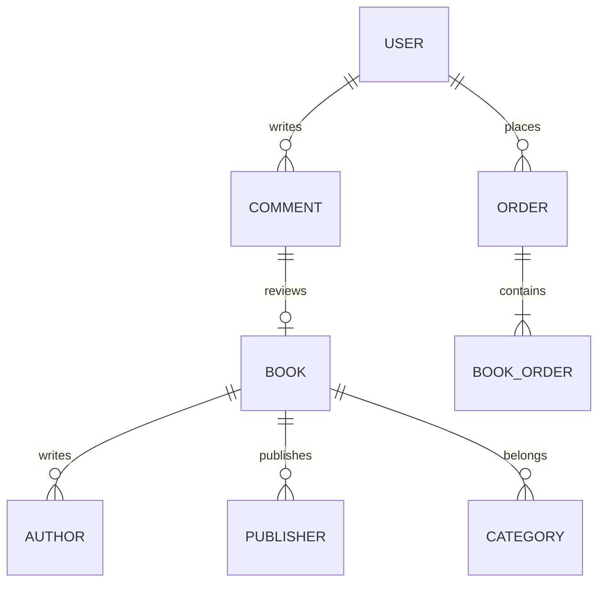

# 1. 背景介绍

## 1.1 图书管理系统的重要性

在当今信息时代,图书仍然是人类获取知识和娱乐的重要载体。无论是公共图书馆、学校图书馆还是书店,都需要一个高效的图书管理系统来确保图书资源的有序管理和读者需求的及时满足。

一个优秀的图书管理系统不仅能够提高工作效率,节省人力成本,而且还能为读者提供更好的借阅体验。它是连接图书资源和读者的桥梁,是现代图书服务的核心。

## 1.2 系统开发的挑战

开发一个完善的图书管理系统并非一蹴而就,需要解决诸多技术难题:

- 数据库设计合理,能够高效存储和检索大量图书信息
- 用户界面友好,操作简单直观
- 系统具有良好的可扩展性和可维护性
- 实现多角色权限管理,保证数据安全
- 集成多种功能模块,满足不同用户需求

## 1.3 本文内容概览

本文将详细介绍一个基于B/S架构的书店图书管理系统的设计与实现。我们将从需求分析开始,阐述系统的核心概念,介绍所采用的算法和数学模型,提供具体的代码实例,探讨实际应用场景,推荐相关工具和资源,并对系统的未来发展趋势进行展望。

# 2. 核心概念与联系 

## 2.1 系统角色

本系统包含三种主要角色:

1. **管理员**: 拥有最高权限,可以管理图书、用户和订单等全部信息。
2. **读者**: 可以查询图书、下单购买和评论图书。
3. **经销商**: 可以上传新书信息,管理自己的书籍库存。

## 2.2 业务流程

系统的核心业务流程包括:

1. 图书入库
2. 读者查询图书
3. 下单购买
4. 订单处理
5. 评论管理

## 2.3 关键数据模型

- 图书: 包括书名、作者、出版社、ISBN、价格等信息
- 用户: 包括用户名、密码、角色、联系方式等信息 
- 订单: 包括订单号、下单时间、订购图书、收货地址等信息
- 评论: 包括评论内容、评分、评论者等信息

这些数据模型之间存在着复杂的关联关系,需要合理的数据库设计来存储和管理。

# 3. 核心算法原理和具体操作步骤

## 3.1 图书搜索算法

### 3.1.1 问题描述

在图书数量庞大的情况下,如何快速精确地检索出用户需要的图书,是图书管理系统的一个核心问题。传统的线性搜索或哈希查找效率较低,无法满足实际需求。

### 3.1.2 算法原理

我们采用了**倒排索引**的思想,建立了一个基于B+树的高效索引结构。具体步骤如下:

1. 对每本图书的书名、作者、出版社等字段进行分词,生成关键词列表。
2. 将关键词及其对应的图书ID存入B+树索引中。
3. 搜索时,先对查询字符串分词,然后在B+树中查找对应的图书ID列表。
4. 对查询结果进行排序、过滤和分页等操作。

B+树的特点是每个节点存储的关键词数量较多,树高较矮,有利于减少磁盘IO次数,提高查询效率。

### 3.1.3 算法复杂度分析

设图书总数为N,平均每本书的关键词数为M。

- 建立索引的时间复杂度为$O(NM\log_BM)$,其中B为B+树的阶数。
- 查询时间复杂度为$O(Q\log_BM + K)$,其中Q为查询关键词数,K为命中图书数。

可见,在图书数量N较大时,查询效率基本与N无关,主要取决于索引的大小。

## 3.2 个性化推荐算法

### 3.2.1 协同过滤算法

为了提高用户体验,我们实现了一个基于**协同过滤**的个性化推荐算法。其核心思想是:对于活跃用户A,找到与其有相似兴趣爱好的邻居用户集合U,然后将U中用户喜欢而A没有购买过的图书推荐给A。

具体步骤如下:

1. 计算每两个用户之间的相似度,可以采用余弦相似度、皮尔逊相关系数等。
2. 对于目标用户A,选取与其相似度较高的K个用户作为邻居。
3. 统计邻居用户购买过而A没有购买的图书,根据相似度加权计算推荐分值。
4. 按推荐分值降序排列,返回前N个结果作为推荐列表。

该算法的优点是简单高效,但也存在热门书籍推荐过多、冷门书籍难以推荐等缺陷。我们可以引入一些调节因子来改善算法效果。

### 3.2.2 基于内容的推荐

除了协同过滤,我们还实现了一种**基于内容**的推荐算法。其基本思路是:

1. 针对每本图书,提取其书名、作者、类别等文本特征,并使用TF-IDF等方法计算特征权重。
2. 对用户历史购买记录进行相同的特征提取和权重计算,得到用户兴趣特征向量。
3. 计算每本图书与用户兴趣向量的相似度,将相似度较高的图书推荐给用户。

该算法的优点是可以发现一些协同过滤难以发现的"长尾"图书,缺点是对新书籍的推荐效果较差。我们可以将两种算法结合使用,取长补短。

# 4. 数学模型和公式详细讲解举例说明

## 4.1 相似度计算

### 4.1.1 余弦相似度

在协同过滤算法中,我们采用了余弦相似度来计算两个用户的相似程度。设有两个用户$u$和$v$,他们分别对$N$本书打过分,用向量$\vec{r_u}$和$\vec{r_v}$表示,则两个用户的余弦相似度定义为:

$$\text{sim}(u,v) = \cos(\vec{r_u},\vec{r_v}) = \frac{\vec{r_u} \cdot \vec{r_v}}{|\vec{r_u}||\vec{r_v}|} = \frac{\sum_{i=1}^N r_{u,i}r_{v,i}}{\sqrt{\sum_{i=1}^Nr_{u,i}^2}\sqrt{\sum_{i=1}^Nr_{v,i}^2}}$$

其中$r_{u,i}$和$r_{v,i}$分别表示用户$u$和$v$对第$i$本书的评分。余弦相似度的值域为$[0,1]$,值越大表示两个用户的兴趣越相似。

### 4.1.2 皮尔逊相关系数

另一种常用的相似度计算方法是皮尔逊相关系数,定义如下:

$$\text{sim}(u,v) = \frac{\sum_{i=1}^N(r_{u,i} - \overline{r_u})(r_{v,i} - \overline{r_v})}{\sqrt{\sum_{i=1}^N(r_{u,i} - \overline{r_u})^2}\sqrt{\sum_{i=1}^N(r_{v,i} - \overline{r_v})^2}}$$

其中$\overline{r_u}$和$\overline{r_v}$分别表示用户$u$和$v$的平均评分。皮尔逊相关系数的值域为$[-1,1]$,值越接近1表示两个用户的兴趣越相似。

在实际应用中,我们可以根据具体情况选择合适的相似度计算方法。

## 4.2 推荐分值计算

在协同过滤推荐算法中,我们需要计算目标用户未购买的图书的推荐分值,作为推荐排序的依据。常用的方法是**加权余弦相似度**,计算公式如下:

$$\text{score}(u,i) = \overline{r_u} + \frac{\sum_{v \in N(u)}(r_{v,i} - \overline{r_v})\text{sim}(u,v)}{\sum_{v \in N(u)}|\text{sim}(u,v)|}$$

其中:
- $u$表示目标用户
- $i$表示待推荐的图书
- $N(u)$表示与用户$u$相似的邻居用户集合
- $\overline{r_u}$和$\overline{r_v}$分别表示用户$u$和$v$的平均评分
- $r_{v,i}$表示用户$v$对图书$i$的评分
- $\text{sim}(u,v)$表示用户$u$和$v$的相似度

这个公式的基本思路是:先用目标用户的平均评分作为基准,然后根据相似用户对该图书的评分进行调整,相似度越高,调整的权重越大。

在基于内容的推荐算法中,我们通常采用**余弦相似度**来计算用户兴趣向量与图书特征向量之间的相似程度,作为推荐分值。

# 5. 项目实践:代码实例和详细解释说明

## 5.1 系统架构

我们采用了典型的B/S架构,其中:

- 浏览器作为客户端,使用HTML/CSS/JavaScript开发
- 服务端采用Python的Flask框架,提供RESTful API
- 使用MySQL作为后端数据库
- 引入Redis实现缓存,提高系统响应速度


## 5.2 数据库设计 

### 5.2.1 E-R模型

根据系统的业务需求,我们设计了如下的E-R模型:



### 5.2.2 表结构

根据E-R模型,我们在MySQL中创建了以下表:

```sql
CREATE TABLE book (
    book_id INT AUTO_INCREMENT PRIMARY KEY,
    title VARCHAR(100) NOT NULL,
    author VARCHAR(100),
    publisher VARCHAR(100),
    pubdate DATE,
    price DECIMAL(8,2),
    category VARCHAR(100),
    stock INT DEFAULT 0,
    sales INT DEFAULT 0
);

CREATE TABLE author (
    author_id INT AUTO_INCREMENT PRIMARY KEY,
    name VARCHAR(100) NOT NULL,
    nationality VARCHAR(50),
    bio TEXT
);

-- 其他表...
```

## 5.3 关键功能实现

### 5.3.1 图书搜索

```python
import redis
from flask import Blueprint, request

search_bp = Blueprint('search', __name__)
r = redis.Redis()

@search_bp.route('/search', methods=['GET'])
def search():
    keyword = request.args.get('keyword', '')
    if not keyword:
        return []
    
    # 从缓存中获取搜索结果
    cache_key = f'search:{keyword}'
    result = r.get(cache_key)
    if result:
        return result
    
    # 从数据库中搜索
    books = Book.query.filter(
        Book.title.like(f'%{keyword}%') |
        Book.author.like(f'%{keyword}%') | 
        Book.publisher.like(f'%{keyword}%')
    ).all()
    
    result = [book.to_dict() for book in books]
    
    # 将结果缓存
    r.setex(cache_key, 3600, json.dumps(result))
    
    return result
```

这是一个使用Flask实现的搜索功能的示例代码。我们首先检查是否有缓存的搜索结果,如果有则直接返回。否则,我们使用SQLAlchemy从数据库中查询包含关键词的图书,并将结果缓存到Redis中,有效期为1小时。

### 5.3.2 协同过滤推荐

```python
from math import sqrt

def cosine_sim(user1, user2):
    common = set(user1.keys()) & set(user2.keys())
    sum1 = sum([user1[item]**2 for item in user1])
    sum2 = sum([user2[item]**2 for item in user2])
    sum1sq = sqrt(sum1)
    sum2sq = sqrt(sum2)
    
    if sum1sq * sum2sq == 0:
        return 0
    
    sum_product = sum([user1[item] * user2[item] for item in common])
    return sum_product / (sum1sq * sum2sq)

def recommend(user_id, n=10):
    user = User.query.get(user_id)
    ratings = user.ratings
    
    # 计算与其他