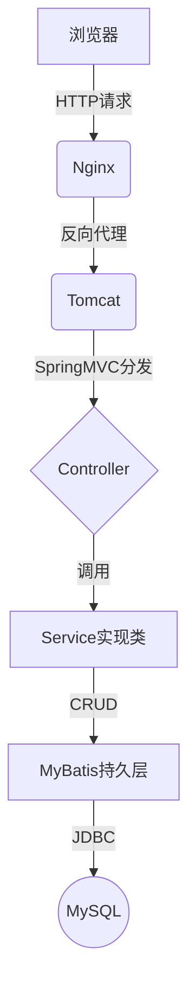

# 基于SSM的钢铁工厂管理系统

## 1. 背景介绍

### 1.1 钢铁工业概述

钢铁工业是国民经济的支柱产业之一,对于促进国家工业化进程和经济发展具有重要作用。钢铁产品广泛应用于建筑、机械、交通运输、能源等诸多领域,是现代社会不可或缺的基础材料。随着工业化和城镇化进程的不断推进,钢铁需求持续增长,对钢铁企业的管理水平提出了更高要求。

### 1.2 钢铁工厂管理现状及挑战

传统的钢铁工厂管理模式存在诸多弊端,如生产计划制定缺乏科学性、物料采购和库存管控效率低下、生产过程监控手段落后、质量管控体系不健全等,给企业的正常运营带来诸多阻碍。同时,随着信息技术的快速发展,钢铁企业亟需构建现代化的信息管理系统,提高管理效率,增强企业竞争力。

### 1.3 管理信息系统的重要性

管理信息系统(MIS)通过整合企业内外部数据资源,为决策者提供必要的信息支持,是现代企业管理的重要工具。引入MIS有助于钢铁企业实现生产计划科学制定、物资采购合理化、生产过程自动化监控、质量管理数字化等,从而提高企业运营效率,降低运营成本,增强企业竞争力。

## 2. 核心概念与联系

### 2.1 SSM架构

SSM(Spring+SpringMVC+MyBatis)是JavaEE领域广泛使用的轻量级开源框架集合,分别负责系统的持久层、业务逻辑层和表现层功能。

- Spring: 核心容器,负责对象的创建、装配及管理
- SpringMVC: 基于MVC设计模式的Web层框架
- MyBatis: 对数据库进行持久化操作的框架

三者有机结合,构建了高效、灵活、易于维护的企业级应用系统。

### 2.2 系统功能模块

钢铁工厂管理系统主要包括以下核心功能模块:

- 生产计划管理: 根据订单信息、库存情况等数据科学制定生产计划
- 物资采购管理: 实现物资需求计划制定、采购订单管理等功能
- 生产过程管理: 对生产设备状态、工序进度等实时监控,实现生产过程自动化管理
- 质量管理: 建立质量检测标准,对产品质量实施全流程监控
- 仓储管理: 对原材料、半成品、产成品等实现精细化管理
- 财务管理: 实现收支管理、成本核算等财务功能
- 人力资源管理: 员工信息管理、考勤管理、绩效考核等

各功能模块相互协作,共同实现钢铁工厂的高效、精细化管理。

## 3. 核心算法原理及具体操作步骤

### 3.1 生产计划优化算法

#### 3.1.1 问题描述

生产计划优化是一个典型的组合优化问题,需要在满足各种约束条件(如原材料供给、设备能力、交货期限等)的前提下,确定最优的生产计划,以实现成本最小化或利润最大化。该问题属于NP-Hard问题,求解过程较为复杂。

#### 3.1.2 数学模型

生产计划优化问题可以用整数规划模型来描述:

$$
\begin{aligned}
\min \quad & \sum_{i=1}^{n}c_ix_i\\
\text{s.t.}\quad
& \sum_{i=1}^{n}a_{ij}x_i\leq b_j,\quad j=1,2,\ldots,m\\
& x_i\in\mathbb{Z}^+,\quad i=1,2,\ldots,n
\end{aligned}
$$

其中:
- $n$为产品种类数
- $m$为约束条件数
- $x_i$为第$i$种产品的生产量(决策变量)
- $c_i$为第$i$种产品的单位生产成本
- $a_{ij}$为生产一单位第$i$种产品所需第$j$种资源的数量
- $b_j$为第$j$种资源的可用量

目标函数为总生产成本最小化。约束条件包括各种资源的可用量限制,以及决策变量为非负整数的要求。

#### 3.1.3 算法流程

1. 构建生产计划优化模型
2. 采用启发式算法(如遗传算法、模拟退火算法等)求解
3. 对算法参数(如种群规模、变异概率等)进行优化
4. 输出满足约束条件的最优生产计划方案

### 3.2 仓储管理算法

#### 3.2.1 问题描述

仓储管理的主要目标是最大限度地利用有限的仓储空间,实现高效的货物存取。需要合理规划库位布局,优化入库和出库路线,从而最小化搬运距离和作业时间。

#### 3.2.2 数学模型

仓储管理问题可以用作业排序模型来描述:

$$
\begin{aligned}
\min\quad&\sum_{i=1}^{n}\sum_{j=1}^{n}c_{ij}x_{ij}\\
\text{s.t.}\quad
&\sum_{j=1}^{n}x_{ij}=1,\quad i=1,2,\ldots,n\\
&\sum_{i=1}^{n}x_{ij}=1,\quad j=1,2,\ldots,n\\
&x_{ij}\in\{0,1\},\quad i,j=1,2,\ldots,n
\end{aligned}
$$

其中:
- $n$为作业数量
- $c_{ij}$为完成作业$i$后再执行作业$j$的代价(如搬运距离)
- $x_{ij}$为决策变量,若作业$j$紧随作业$i$执行则取1,否则取0

目标函数为最小化总代价。约束条件保证每个作业只被安排一次。

#### 3.2.3 算法流程

1. 构建作业排序模型
2. 采用启发式算法(如蚁群算法)求解
3. 对算法参数(如信息素浓度、蚂蚁数量等)进行优化
4. 输出最优的作业排序方案,指导入库和出库路线规划

### 3.3 质量管理算法

#### 3.3.1 问题描述

质量管理的目标是及时发现并排除产品缺陷,保证产品质量满足规定标准。传统的抽样检验方法存在一定缺陷,而基于机器学习的质量检测算法具有更高的精确度和鲁棒性。

#### 3.3.2 数学模型

产品质量检测可以建模为监督学习问题:

已知训练数据集$\mathcal{D}=\{(\boldsymbol{x}_i,y_i)\}_{i=1}^N$,其中$\boldsymbol{x}_i\in\mathbb{R}^d$为第$i$个样本的特征向量,$y_i\in\{0,1\}$为其标签(0表示合格,1表示缺陷)。目标是学习一个分类函数$f:\mathbb{R}^d\rightarrow\{0,1\}$,使其能够很好地预测新样本的标签。

常用的分类算法包括:
- 支持向量机(SVM): $f(\boldsymbol{x})=\text{sign}(\boldsymbol{w}^T\boldsymbol{x}+b)$
- 决策树: $f(\boldsymbol{x})=\sum_{t=1}^T\mathbb{I}(\boldsymbol{x}\in R_t)c_t$
- 神经网络: $f(\boldsymbol{x})=\sigma(\boldsymbol{W}^L\sigma(\boldsymbol{W}^{L-1}\cdots\sigma(\boldsymbol{W}^1\boldsymbol{x}+\boldsymbol{b}^1)\cdots)+\boldsymbol{b}^L)$

其中$\boldsymbol{w},b,\boldsymbol{W}^l,\boldsymbol{b}^l$等为模型参数,通过优化训练数据上的损失函数而获得。

#### 3.3.3 算法流程

1. 数据采集与预处理
2. 特征工程,提取反映产品质量的特征
3. 选择合适的分类算法,构建质量检测模型
4. 在训练数据上训练模型,优化模型参数
5. 在测试数据上评估模型性能
6. 将训练好的模型应用于实际的质量检测任务

## 4. 数学模型和公式详细讲解举例说明

以生产计划优化问题为例,详细讲解数学模型及公式:

假设一家钢铁厂生产两种产品A和B,需确定各产品的最优生产量。已知:
- 单位生产成本:产品A为$10元,产品B为$15元
- 原材料供给情况:钢材1000吨,焦炭500吨
- 生产一吨产品A需耗费钢材5吨,焦炭2吨
- 生产一吨产品B需耗费钢材8吨,焦炭3吨

建立整数规划模型如下:

$$
\begin{aligned}
\min\quad & 10x_1+15x_2\\
\text{s.t.}\quad
& 5x_1+8x_2\leq1000\\
& 2x_1+3x_2\leq500\\
& x_1,x_2\in\mathbb{Z}^+
\end{aligned}
$$

其中:
- $x_1$为产品A的生产量(吨)
- $x_2$为产品B的生产量(吨)
- 目标函数为总生产成本最小化
- 第一个约束条件为钢材供给量限制
- 第二个约束条件为焦炭供给量限制

求解该整数规划模型,可以得到最优生产计划为:$x_1=100,x_2=50$,即生产100吨产品A和50吨产品B,总成本为$2500元。

该例子说明了如何将实际生产问题转化为数学模型,并利用优化算法求解,从而获得最优决策方案。

## 5. 项目实践:代码实例和详细解释说明

本节将以生产计划优化模块为例,展示基于SSM框架的系统实现。

### 5.1 技术架构



系统采用B/S架构,前端使用Bootstrap+jQuery,后端使用SSM框架:

- Nginx作为Web服务器,提高系统并发能力
- Tomcat作为Servlet容器,运行SpringMVC
- Spring管理系统对象,实现业务逻辑
- MyBatis操作数据库,实现持久化功能

### 5.2 生产计划优化模块实现

#### 5.2.1 数据模型

```sql
CREATE TABLE `plan` (
  `id` int(11) NOT NULL AUTO_INCREMENT,
  `product_id` int(11) NOT NULL COMMENT '产品ID',
  `quantity` int(11) NOT NULL COMMENT '生产量',
  PRIMARY KEY (`id`)
) ENGINE=InnoDB DEFAULT CHARSET=utf8mb4;

CREATE TABLE `product` (
  `id` int(11) NOT NULL AUTO_INCREMENT,
  `name` varchar(50) NOT NULL COMMENT '产品名称',
  `cost` decimal(10,2) NOT NULL COMMENT '单位生产成本',
  PRIMARY KEY (`id`)
) ENGINE=InnoDB DEFAULT CHARSET=utf8mb4;

CREATE TABLE `material` (
  `id` int(11) NOT NULL AUTO_INCREMENT,
  `name` varchar(50) NOT NULL COMMENT '原材料名称', 
  `stock` int(11) NOT NULL COMMENT '库存量',
  PRIMARY KEY (`id`)
) ENGINE=InnoDB DEFAULT CHARSET=utf8mb4;

CREATE TABLE `bom` (
  `id` int(11) NOT NULL AUTO_INCREMENT,
  `product_id` int(11) NOT NULL COMMENT '产品ID',
  `material_id` int(11) NOT NULL COMMENT '原材料ID',
  `quantity` int(11) NOT NULL COMMENT '所需数量',
  PRIMARY KEY (`id`)
) ENGINE=InnoDB DEFAULT CHARSET=utf8mb4;
```

- plan表存储生产计划
- product表存储产品信息
- material表存储原材料信息
- bom表存储产品物料清单(BOM)

#### 5.2.2 算法实现

```java
// PlanService.java
public class PlanService {
    @Autowired
    private PlanMapper planMapper;
    
    public void optimize() {
        // 读取产品、原材料、BOM数据
        List<Product> products = planMapper.getProducts();
        List<Material> materials = planMapper.getM{"msg_type":"generate_answer_finish"}