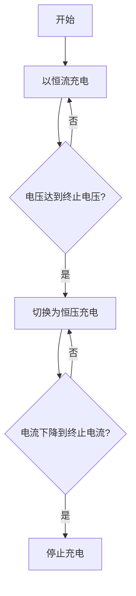

# 1. 背景介绍

## 1.1 太阳能充电器的重要性

随着可再生能源的日益重要,太阳能作为一种清洁、环保的能源,在各个领域得到了广泛应用。手机作为现代生活中不可或缺的通信工具,其电池续航时间一直是用户关注的焦点。传统的电网充电方式虽然方便,但存在一定的能源浪费和环境污染问题。相比之下,太阳能充电器可以利用太阳光直接为手机电池充电,不仅节省了电费,更重要的是减少了对环境的影响。

## 1.2 单片机在太阳能充电器中的作用

单片机是一种高度集成的微型计算机,具有体积小、功耗低、价格便宜等优点。在太阳能手机充电器的设计中,单片机可以实现对太阳能电池板的控制、对锂电池的充放电管理,以及与手机的通信等功能。通过合理的程序设计,单片机可以有效地提高太阳能充电器的工作效率和可靠性。

# 2. 核心概念与联系

## 2.1 太阳能电池

太阳能电池是利用光伏效应将太阳光直接转换为电能的装置。它由多个太阳能电池组件串联而成,通常采用单晶硅或多晶硅作为基体材料。太阳能电池的输出电压和电流主要取决于其面积和入射光强度。

## 2.2 锂电池

锂电池是一种具有高能量密度、无记忆效应的二次电池。在手机等便携式电子设备中,锂电池因其体积小、重量轻而被广泛使用。然而,锂电池也存在过充、过放等安全隐患,因此需要精确的充放电管理。

## 2.3 单片机

单片机是一种高度集成的微型计算机系统,由中央处理器(CPU)、存储器(RAM和ROM)、输入/输出接口等部分组成。它可以根据预先编写的程序,独立完成各种控制和计算任务。在太阳能手机充电器中,单片机负责协调太阳能电池和锂电池的工作,实现高效、安全的充电过程。

# 3. 核心算法原理和具体操作步骤

## 3.1 太阳能电池最大功率点跟踪算法(MPPT)

为了充分利用太阳能电池的输出功率,需要采用MPPT算法,使太阳能电池工作在其最大功率点。常用的MPPT算法有:

1. 扰动与观测法(P&O)
2. 增量电导法
3. 开路电压法
4. 短路电流法

其中,扰动与观测法是最常用的一种,具有简单、可靠、响应速度快的优点。该算法通过周期性地扰动工作电压,并观测功率的变化情况,从而调整工作电压,使太阳能电池接近最大功率点。

算法步骤如下:

1) 测量太阳能电池当前的电压$V(k)$和电流$I(k)$,计算功率$P(k)=V(k)I(k)$;
2) 给工作电压一个扰动$\Delta V$,得到新的电压$V(k+1)=V(k)+\Delta V$,测量新的电流$I(k+1)$,计算新的功率$P(k+1)=V(k+1)I(k+1)$;
3) 比较$P(k+1)$与$P(k)$的大小:
   - 若$P(k+1)>P(k)$,说明扰动方向正确,继续在该方向扰动;
   - 若$P(k+1)<P(k)$,说明扰动方向错误,反向扰动;
4) 重复步骤1~3,直至功率收敛到最大值。

该算法的流程图如下:

```mermaid
graph TD
    A[开始] --> B[测量V(k)、I(k)、P(k)]
    B --> C[给V(k)加扰动ΔV]
    C --> D[测量V(k+1)、I(k+1)、P(k+1)]
    D --> E{P(k+1)>P(k)?}
    E -->|是| F[继续在该方向扰动]
    F --> B
    E -->|否| G[反向扰动]
    G --> B
```

## 3.2 锂电池充放电控制算法

为了保证锂电池的安全和使用寿命,需要对其充放电过程进行严格控制。常用的控制策略包括:

1. 恒流恒压充电
2. 电池均衡
3. 温度保护
4. 过充过放保护

其中,恒流恒压充电是最基本的充电方式,可以有效防止锂电池过充。具体步骤如下:

1) 以较大的恒流对电池进行充电,直至电池电压达到设定的终止电压;
2) 切换为恒压充电模式,以终止电压对电池持续充电,直至充电电流下降到设定的终止电流;
3) 停止充电。

该算法的流程图如下:



# 4. 数学模型和公式详细讲解举例说明

## 4.1 太阳能电池数学模型

太阳能电池的输出特性可以用单二极管模型来描述,其数学表达式为:

$$I=I_\text{ph}-I_\text{rs}\left[\exp\left(\frac{q(V+IR_\text{s})}{nkT}\right)-1\right]-\frac{V+IR_\text{s}}{R_\text{sh}}$$

其中:
- $I$是太阳能电池输出电流;
- $I_\text{ph}$是光生电流,与入射光强度成正比;
- $I_\text{rs}$是反向饱和电流;
- $q$是电子电量,约为$1.602\times 10^{-19}$C;
- $V$是太阳能电池输出电压;
- $R_\text{s}$是太阳能电池的等效串联电阻;
- $R_\text{sh}$是太阳能电池的等效并联电阻;
- $n$是理想因子,一般取值在$1\sim 2$之间;
- $k$是玻尔兹曼常数,约为$1.381\times 10^{-23}$J/K;
- $T$是太阳能电池的工作温度,以K为单位。

通过对上述方程进行数值计算和曲线拟合,可以得到太阳能电池在不同工作条件下的I-V和P-V特性曲线,为MPPT算法的实现提供理论依据。

## 4.2 锂电池充电模型

锂电池的充电过程可以用电路模型来描述,如下图所示:

```mermaid
circuitDiagram
    ground (gnd)
    r1 (R0)
    r2 (R1)
    r3 (R2)
    c1 (C1)
    c2 (C2)
    battery (Vbat)
    
    r1 -- r2 -- r3 -- c2
    c1 -.- c2
    r1 <==> gnd
    battery <==> r3
```

其中:
- $R_0$表示电池的欧姆内阻;
- $R_1$和$C_1$表示电池的电荷传输过程;
- $R_2$和$C_2$表示电池的电荷传输过程;
- $V_\text{bat}$是电池的开路电压。

根据该模型,可以得到电池在充电过程中的电压响应方程:

$$V_\text{batt}(t)=V_0-IR_0-V_1-V_2$$
$$V_1=\phi_1e^{-\frac{t}{\tau_1}}$$
$$V_2=\phi_2e^{-\frac{t}{\tau_2}}$$

其中:
- $V_0$是电池的恒压源电压;
- $I$是充电电流;
- $\phi_1$和$\phi_2$是与电池内部参数有关的常数;
- $\tau_1$和$\tau_2$是与电池内部参数有关的时间常数。

通过对上述方程进行求解,可以得到电池在充电过程中的电压、电流和剩余电量等参数,为锂电池的充放电控制提供理论基础。

# 5. 项目实践:代码实例和详细解释说明 

## 5.1 硬件设计

太阳能手机锂电池充电器的硬件主要由以下几个部分组成:

1. 单片机控制器(如STC89C52RC)
2. 太阳能电池板
3. 锂电池及电池保护电路
4. 电源电路
5. 电压/电流检测电路
6. 手机接口电路

其中,单片机是整个系统的控制核心,负责执行MPPT算法、锂电池充放电控制算法,并与手机进行通信。其他电路则为单片机提供所需的电源、检测信号和接口。

## 5.2 软件设计

### 5.2.1 主程序流程

```c
#include <reg52.h>

void main()
{
    InitSystem(); // 初始化系统
    
    while(1)
    {
        MPPT(); // 执行MPPT算法
        BatteryCharge(); // 执行锂电池充电控制
        CommPhone(); // 与手机通信
    }
}
```

主程序的主要流程包括:初始化系统 -> 执行MPPT算法 -> 执行锂电池充电控制 -> 与手机通信。这几个函数在主循环中不断执行,实现对太阳能电池和锂电池的实时控制。

### 5.2.2 MPPT算法实现

```c
void MPPT()
{
    unsigned int V_pv, I_pv, P_pv, P_old;
    unsigned char dir = 0; // 扰动方向
    
    P_old = ReadPower(); // 读取当前功率
    
    while(1)
    {
        V_pv = ReadVoltage(); // 读取电压
        I_pv = ReadCurrent(); // 读取电流
        P_pv = V_pv * I_pv; // 计算功率
        
        if(P_pv > P_old) // 功率增加
        {
            P_old = P_pv;
            dir = !dir; // 保持扰动方向
        }
        else // 功率减小
        {
            P_old = P_pv;
            dir = !dir; // 反向扰动
        }
        
        if(dir) // 根据扰动方向调整电压
            IncreaseVoltage();
        else
            DecreaseVoltage();
    }
}
```

该函数实现了扰动与观测法MPPT算法。首先读取当前的功率值,然后进入循环。在循环中,读取电压和电流,计算功率,并与上一次的功率值进行比较。如果功率增加,则保持扰动方向;否则反向扰动。最后根据扰动方向调整工作电压。该过程不断重复,直至功率收敛到最大值。

### 5.2.3 锂电池充电控制

```c
void BatteryCharge()
{
    unsigned int V_batt, I_batt;
    unsigned char stage = 0; // 充电阶段
    
    while(1)
    {
        V_batt = ReadBattVoltage(); // 读取电池电压
        I_batt = ReadBattCurrent(); // 读取电池电流
        
        switch(stage)
        {
            case 0: // 恒流充电
                SetChargeCurrent(MAX_CURRENT);
                if(V_batt >= MAX_VOLTAGE)
                    stage = 1; // 进入恒压充电
                break;
                
            case 1: // 恒压充电
                SetChargeVoltage(MAX_VOLTAGE);
                if(I_batt <= TERM_CURRENT)
                    stage = 2; // 充电完成
                break;
                
            case 2: // 充电完成
                StopCharge();
                break;
        }
    }
}
```

该函数实现了锂电池的恒流恒压充电控制。首先设置为恒流充电模式,当电池电压达到设定的最大值时,切换为恒压充电模式。在恒压模式下,当充电电流下降到终止电流值时,停止充电。整个过程通过有限状态机的方式实现。

### 5.2.4 与手机通信

```c
void CommPhone()
{
    unsigned char cmd, data;
    
    if(ReceiveData(&cmd, &data)) // 接收手机发送的数据
    {
        switch(cmd)
        {
            case CMD_GET_STATUS: // 获取充电状态
                SendData(GetChargeStatus(), 0);
                break;
                
            case CMD_GET_CAPACITY: // 获取电池容量
                