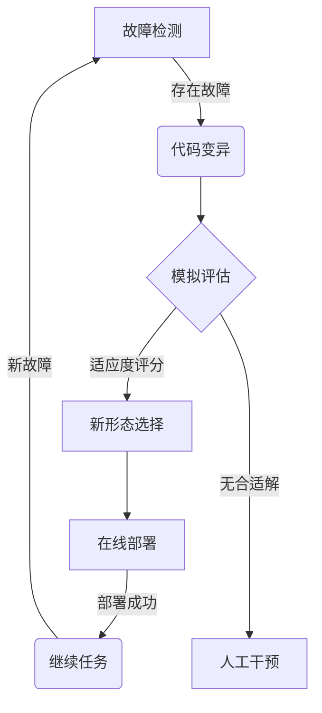

# 羽化算法:Agent自我修复的前沿技术

## 1.背景介绍

### 1.1 自主系统的重要性

在当今快节奏的技术发展时代,自主系统(Autonomous Systems)正在成为各领域不可或缺的关键组成部分。无论是工业自动化、机器人技术、无人驾驶汽车,还是复杂的软件系统,都需要具备自主性、智能化和可靠性。然而,这些系统在运行过程中难免会遇到各种故障、异常情况和不确定性,给系统的正常运转带来严重挑战。

### 1.2 传统故障处理方式的缺陷

传统上,我们通常依赖人工监控和维护来应对系统故障。但这种方式存在一些明显缺陷:

- 人工维护成本高昂且效率低下
- 无法及时发现和处理所有潜在故障
- 对于复杂系统,手动诊断和修复存在极大挑战

因此,赋予自主系统自我修复(Self-Healing)能力,使其能够在运行时自动检测、诊断并修复故障,已经成为当前研究的热点课题。

### 1.3 羽化算法的重要意义

羽化算法(Metamorphic Algorithm)作为一种创新的自我修复技术,为解决上述问题提供了全新的思路。它赋予了Agent(自主系统的核心单元)在运行时动态调整自身结构和行为的能力,从而实现自我修复。这项技术的出现,标志着自主系统向更高层次的智能化和自主性迈进,对提高系统的鲁棒性、可靠性和适应性具有重要意义。

## 2.核心概念与联系

### 2.1 Agent及其特征

在羽化算法中,Agent是指自主系统中具有一定智能和自主性的基本单元。一个Agent通常具备以下几个关键特征:

- 感知(Perception):能够感知环境和自身状态的变化
- 决策(Decision Making):根据感知信息做出决策
- 行为(Action):执行相应的行为以影响环境
- 学习(Learning):通过经验不断优化决策过程

Agent可以是物理实体(如机器人),也可以是软件实体(如智能代理)。多个Agent可以组成复杂的多Agent系统,通过协作完成更高级的任务。

### 2.2 Agent的自我修复需求

由于各种不确定因素的影响,Agent在执行任务时可能会遇到各种故障,如传感器失灵、执行器故障、软件错误等。这些故障会导致Agent无法正常工作,进而影响整个系统的运行。因此,Agent必须具备自我修复的能力,以确保任务的连续性和系统的鲁棒性。

传统的容错方法(如冗余设计、检查点重启等)虽然可以提高系统的可靠性,但无法从根本上解决故障问题。相比之下,自我修复技术可以让Agent在运行时动态调整自身结构和行为,主动检测、诊断并修复故障,从而实现持续不间断的运行。

### 2.3 羽化算法的核心思想

羽化算法的核心思想是赋予Agent"进化"的能力,使其能够在运行时根据环境变化和故障情况,动态调整自身的结构(如传感器布局、控制器参数等)和行为策略,从而达到自我修复的目的。

这种"进化"过程借鉴了生物进化的机理,通过对Agent的结构和行为进行有目的的变异和选择,不断优化和适应,最终获得一个能够自我修复的新的Agent形态,就像蝴蝶羽化一样。

羽化算法与其他自我修复技术(如基于模型的故障诊断、在线规划等)相比,具有以下优势:

- 无需预先建模,可以处理未知故障情况
- 具有较强的通用性,适用于各种类型的Agent
- 修复过程自动化,无需人工干预

因此,羽化算法被认为是实现真正自主系统的关键技术之一,具有广阔的应用前景。

## 3.核心算法原理和具体操作步骤

### 3.1 算法概述

羽化算法的核心思路是通过对Agent的结构和行为进行有目的的变异和选择,不断优化和适应,最终获得一个能够自我修复的新的Agent形态。算法主要包括以下几个关键步骤:

1. 故障检测
2. 代码变异
3. 模拟评估 
4. 新形态选择
5. 在线部署

其中,代码变异和模拟评估这两个步骤构成了算法的核心部分,是实现Agent"进化"的关键。

### 3.2 故障检测

故障检测是自我修复的前提。Agent需要通过监测自身状态和环境信息,判断是否存在故障。常用的故障检测方法有:

- 基于模型的残差检测
- 基于数据的异常检测
- 专家系统推理
- 硬件冗余检测

对于不同类型的Agent,可以采用不同的故障检测策略。一旦检测到故障,就会触发自我修复过程。

### 3.3 代码变异

代码变异是指对Agent的代码(包括感知、决策、行为等模块)进行有目的的变异,生成多个变异个体。常用的变异方法有:

- 参数微扰(Parameter Perturbation)
- 代码插桩(Code Instrumentation)
- 语法树变异(AST Mutation)
- 进化算法变异(如遗传算法)

变异的目标是生成具有不同结构和行为的Agent个体,以期在其中找到能够自我修复的解决方案。

### 3.4 模拟评估

对于每一个变异个体,需要在模拟环境中进行评估,判断其是否能够成功修复故障并完成任务。评估的关键是设计一个合理的适应度函数(Fitness Function),用于量化每个个体的性能表现。

适应度函数通常包括以下几个方面:

- 任务完成度
- 故障修复效果 
- 能耗/代价
- 鲁棒性/适应性

模拟评估的目的是筛选出适应度最高的个体,作为自我修复的候选解。

### 3.5 新形态选择

根据模拟评估的结果,算法会选择适应度最高的个体,作为Agent的新形态。如果有多个个体具有相近的适应度,可以结合其他启发式规则(如简单性、可解释性等)进行进一步选择。

### 3.6 在线部署

最后一步是将选定的新形态在线部署到实际系统中,替换原有的故障Agent。在部署之前,可以进行一些必要的检查和准备工作,以确保部署的安全性和连续性。

部署完成后,Agent就获得了自我修复的能力,可以继续执行任务。如果后续再次出现故障,整个自我修复过程会重新执行。

### 3.7 算法流程图

## 4.数学模型和公式详细讲解举例说明

羽化算法中的数学模型主要体现在代码变异和模拟评估两个环节。

### 4.1 代码变异模型

代码变异的目标是生成具有不同结构和行为的Agent个体。常用的变异模型包括:

1. **参数微扰模型**

参数微扰是指对Agent代码中的参数值进行小幅度的扰动,生成新的个体。设Agent的参数向量为$\vec{\theta}=(\theta_1,\theta_2,...,\theta_n)$,则新个体的参数向量可表示为:

$$\vec{\theta'}=\vec{\theta}+\vec{\epsilon}$$

其中$\vec{\epsilon}=(\epsilon_1,\epsilon_2,...,\epsilon_n)$是一个随机扰动向量,通常服从正态分布或其他概率分布。

2. **语法树变异模型**

语法树变异是指在Agent代码的抽象语法树(AST)上进行变异操作。常见的变异操作包括节点插入、删除、交换等。设代码的原始AST表示为$T$,变异后的AST为$T'$,则$T'$可以表示为:

$$T'=\mathcal{M}(T)$$

其中$\mathcal{M}$是AST变异算子,可以是一个或多个变异操作的组合。

3. **进化算法变异模型**

进化算法(如遗传算法、进化策略等)也可以用于Agent代码的变异。这种方法将代码表示为一个基因型(如二进制串、实数向量等),然后应用进化算法的变异操作(如基因突变、交叉等)生成新的个体。

无论采用何种变异模型,生成的新个体都需要经过模拟评估,筛选出适应度最高的自我修复解。

### 4.2 模拟评估模型

模拟评估的核心是设计一个合理的适应度函数,用于量化每个Agent个体的性能表现。适应度函数通常是一个多目标优化问题,需要权衡多个评价指标。

假设有$m$个评价指标,记为$f_1,f_2,...,f_m$,则适应度函数可以表示为:

$$\begin{aligned}
\text{Fitness}(\vec{x})&=F(f_1(\vec{x}),f_2(\vec{x}),...,f_m(\vec{x}))\\
&=\sum_{i=1}^m w_i\cdot f_i(\vec{x})
\end{aligned}$$

其中$\vec{x}$表示Agent个体的决策变量(如参数向量),$w_i$是第$i$个指标的权重系数,满足$\sum_{i=1}^m w_i=1$。

常见的评价指标包括:

- 任务完成度:$f_1(\vec{x})=\frac{\text{实际完成量}}{\text{理想完成量}}$
- 故障修复效果:$f_2(\vec{x})=1-\frac{\text{修复后残余故障}}{\text{原始故障}}$
- 能耗/代价:$f_3(\vec{x})=\frac{1}{\text{修复过程能耗}}$
- 鲁棒性:$f_4(\vec{x})=\frac{\text{适应环境变化的能力分数}}{\text{满分}}$

根据具体应用场景,可以选择合适的评价指标,并确定各指标的权重系数。

在模拟评估过程中,每个Agent个体在模拟环境中执行任务,并根据上述适应度函数计算其适应度分数。适应度最高的个体将被选择为自我修复的新形态。

需要注意的是,适应度函数的设计对算法性能有很大影响。一个合理的适应度函数不仅能够正确评估个体的性能,还需要具有足够的选择压力,使优良个体能够被有效筛选出来。

## 5.项目实践:代码实例和详细解释说明

为了更好地理解羽化算法的原理和实现,我们将以一个简单的机器人导航案例为例,展示算法的具体应用。

### 5.1 案例背景

假设有一个两轮差速机器人需要在一个已知的室内环境中导航,从起点移动到终点。机器人配备有激光雷达、里程计等传感器,可以感知自身位置和周围环境。机器人的运动由一个PID控制器控制,控制器参数需要根据环境和任务进行调整。

在导航过程中,机器人可能会遇到各种故障,如激光雷达失效、轮子打滑等,导致无法正常完成导航任务。我们的目标是使用羽化算法,赋予机器人自我修复的能力,使其能够自动检测并修复这些故障。

### 5.2 算法实现

我们将按照前面介绍的步骤,逐步实现羽化算法。

#### 5.2.1 故障检测

机器人的故障检测主要基于以下几个方面:

1. **里程计与激光雷达数据不一致**:比较里程计积分的位移与激光雷达测量的位移,如果差异超过阈值,则判断存在故障。

2. **激光数据异常**:分析激光数据的统计特征(如方差、峰度等),如果偏离正常范围,则判断激光雷达故障。

3. **控制器性能下降**:监测机器人的实际运动轨迹与期望轨