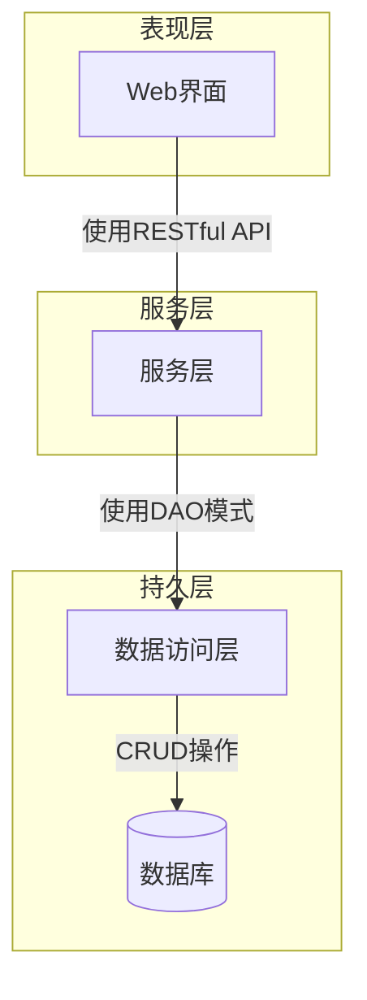

# 1. 背景介绍

## 1.1 医药行业概况

医药行业是一个关系到国计民生的重要行业。随着人口老龄化和医疗保健需求的不断增长,医药行业的重要性日益凸显。在这个行业中,药品的生产、销售和库存管理是核心环节之一。

## 1.2 进销存管理系统的重要性

进销存管理系统是医药企业的命脉,它确保药品的生产、销售和库存管理高效、准确、合规。一个优秀的进销存管理系统可以:

- 实时监控药品库存,防止断货或积压
- 优化供应链管理,降低运营成本
- 满足法规要求,确保药品质量安全
- 提高工作效率,减少人工差错

## 1.3 系统设计挑战

设计一个高效的进销存管理系统并非易事,需要解决诸多挑战:

- 数据量大,需要高性能的数据存储和查询
- 业务流程复杂,需要灵活的系统架构
- 安全性要求高,需要严格的权限管理
- 集成第三方系统,如ERP、仓储管理等

# 2. 核心概念与联系

## 2.1 进销存管理的核心概念

- 采购订单管理
- 销售订单管理  
- 库存管理
- 供应商管理
- 客户管理

## 2.2 相关概念及其关系

进销存管理系统与企业运营的其他环节密切相关,包括但不限于:

- 生产计划系统
- 质量管理系统
- 财务系统
- 物流运输系统

这些系统之间需要无缝集成,实现数据的高效流转和业务协同。

# 3. 核心算法原理和具体操作步骤

## 3.1 采购订单管理

### 3.1.1 采购需求生成

根据安全库存量、销售预测和现有库存量,系统自动生成采购需求计划。

### 3.1.2 供应商选择

系统根据供应商的历史表现、价格、交货时间等因素,自动或手动选择最佳供应商。

### 3.1.3 订单生成及审批

采购人员在系统中生成采购订单,根据订单金额、药品类型等条件,启动审批流程。

### 3.1.4 订单跟踪

系统自动跟踪订单状态,在接收货物后执行入库流程。

## 3.2 销售订单管理

### 3.2.1 订单生成

销售人员根据客户需求在系统中生成销售订单。

### 3.2.2 库存检查

系统自动检查库存量,如果库存不足则启动补货流程。

### 3.2.3 发货及物流

订单审批通过后,系统自动生成拣货、装箱及发运指令。

### 3.2.4 发票开具及对账

货物发出后,系统自动开具发票并执行应收账款管理。

## 3.3 库存管理

### 3.3.1 实时库存查询

系统实时更新并显示库存量、批次、有效期等信息。

### 3.3.2 库存调拨

系统支持在不同仓库之间调拨库存,优化库存分布。

### 3.3.3 盘点及库存调整

定期或临时进行盘点,发现库存差异后系统自动调整库存记录。

### 3.3.4 批次及有效期管理

系统自动监控药品批次和有效期,确保先进先出原则。

## 3.4 供应商管理

### 3.4.1 供应商信息维护

在系统中维护供应商的基本信息、历史记录、评级等数据。

### 3.4.2 供应商绩效评估

根据交货及时率、质量合格率等指标,系统自动评估供应商绩效。

### 3.4.3 供应商合作关系管理

系统记录与供应商的合同、付款条件等合作信息。

## 3.5 客户管理  

### 3.5.1 客户信息维护

在系统中维护客户的基本信息、信用额度、付款记录等数据。

### 3.5.2 客户关系管理

记录与客户的合同、售后服务、投诉处理等信息,加强客户关系。

### 3.5.3 客户分类及营销

根据客户类型、购买习惯等,系统自动进行客户分类,助力营销决策。

# 4. 数学模型和公式详细讲解举例说明

## 4.1 经济订货量模型 (EOQ)

经济订货量模型是确定最佳订货量的重要模型,能够平衡库存成本和订货成本。

$$
EOQ = \sqrt{\frac{2DC_o}{C_c}}
$$

其中:
- $EOQ$ 是经济订货量
- $D$ 是年度需求量  
- $C_o$ 是每次订货的成本
- $C_c$ 是每单位产品的库存持有成本

例如,某药品年需求量为10000单位,每次订货成本为50元,每单位库存成本为2元,则最佳订货量为:

$$
EOQ = \sqrt{\frac{2 \times 10000 \times 50}{2}} = 1000 \text{ 单位}
$$

## 4.2 安全库存量计算

为防止断货,需要保持一定的安全库存量:

$$
SS = Z \times \sigma_L \times \sqrt{LT}
$$

- $SS$ 是安全库存量
- $Z$ 是服务水平的标准正态分数 (例如95%对应1.65)
- $\sigma_L$ 是单位时间内的需求标准差
- $LT$ 是订货交货的领先时间

例如,某药品周需求量平均100单位,标准差为20单位,订货交货周期为2周,95%的服务水平对应$Z=1.65$,则安全库存量为:

$$
SS = 1.65 \times 20 \times \sqrt{2} \approx 46 \text{ 单位}
$$

# 5. 项目实践:代码实例和详细解释说明

本节将提供一个基于Java Spring框架的进销存管理系统实例,并对关键代码进行解释说明。

## 5.1 系统架构



系统采用经典的三层架构:

- 表现层: 提供Web界面,接收用户请求并显示结果
- 服务层: 处理业务逻辑,对表现层提供服务
- 持久层: 负责数据的存取,对服务层提供数据服务

## 5.2 数据模型

```java
@Entity
public class Product {
    @Id
    private String sku; // 产品唯一编码
    private String name;
    private BigDecimal price;
    
    // 其他属性...
    
    // getter/setter...
}

@Entity
public class Inventory {
    @EmbeddedId
    private InventoryKey id; // 复合主键:sku+仓库
    
    @Column(updatable = false)
    private int onHand; // 当前库存
    
    private int allocated; // 已分配未发货库存
    
    // 其他属性...
    
    // getter/setter...
}
```

上述代码展示了产品(Product)和库存(Inventory)的核心数据模型。

- 产品使用SKU(Stock Keeping Unit)作为唯一编码
- 库存使用复合主键InventoryKey(sku+仓库)确保唯一性
- 使用JPA注解简化数据库映射

## 5.3 采购订单管理

```java
@Service
public class PurchaseOrderService {
    
    @Autowired
    private PurchaseOrderRepository poRepo;
    
    @Autowired
    private InventoryService inventoryService;

    public PurchaseOrder createPurchaseOrder(List<PurchaseOrderItem> items, Supplier supplier) {
        PurchaseOrder po = new PurchaseOrder(supplier);
        po.setItems(items);
        po = poRepo.save(po);
        
        // 更新库存分配情况
        items.forEach(item -> inventoryService.allocateInventory(item));
        
        return po;
    }
    
    // 其他方法...
}
```

上述代码展示了创建采购订单的过程:

1. 创建采购订单对象,设置供应商和订单项目
2. 保存订单到数据库
3. 更新库存分配情况,防止重复出货

## 5.4 库存管理

```java
@Service
public class InventoryService {

    @Autowired
    private InventoryRepository inventoryRepo;
    
    public void allocateInventory(PurchaseOrderItem item) {
        Inventory inventory = findInventory(item.getSku(), item.getWarehouse());
        inventory.allocateInventory(item.getQuantity());
        inventoryRepo.save(inventory);
    }
    
    public void deallocateInventory(ShipmentItem item) {
        Inventory inventory = findInventory(item.getSku(), item.getWarehouse());
        inventory.deallocateInventory(item.getQuantity());
        inventoryRepo.save(inventory);
    }
    
    // 其他方法...
    
}
```

上述代码展示了库存分配和解分配的过程:

- allocateInventory: 在创建采购订单时,预先分配库存
- deallocateInventory: 在发货时,解除已分配的库存

这样可以确保库存不会重复出货,并及时更新库存状态。

# 6. 实际应用场景

进销存管理系统在医药行业有着广泛的应用场景:

- **制药企业**: 管理原料药、药品的生产、销售和库存
- **医药经销商**: 管理上游供应商采购,下游医院销售
- **医院药房**: 管理各种药品的采购、配送和临床使用
- **药品冷链物流**: 管理冷藏药品的运输、中转和配送

无论是大型制药企业还是小型药房,进销存管理系统都可以提高运营效率,降低成本,确保药品质量安全。

# 7. 工具和资源推荐

## 7.1 开发工具

- Java: 一种广泛使用的企业级编程语言
- Spring: 流行的Java应用框架,支持多层架构
- Hibernate/JPA: 对象关系映射框架,简化数据库操作
- Maven: 项目构建和依赖管理工具

## 7.2 数据库

- MySQL: 流行的开源关系型数据库
- PostgreSQL: 支持JSON等特性的开源对象关系数据库
- Oracle: 功能强大的商用关系型数据库

## 7.3 其他资源

- GS1标准: 制定了全球供应链标准,如GTIN、GLN等
- 21 CFR Part 11: FDA对电子记录和电子签名的规范
- ISA-95标准: 制定了企业与控制系统集成的标准

# 8. 总结:未来发展趋势与挑战

## 8.1 人工智能和大数据分析

未来的进销存管理系统将更多地利用人工智能和大数据分析技术,实现智能决策:

- 需求预测: 基于历史数据和外部因素预测未来需求
- 供应链优化: 优化库存分布、运输路线等降低成本
- 缺陷检测: 使用计算机视觉检测药品缺陷

## 8.2 物联网和区块链技术

- 物联网(IoT): 使用传感器实时监控药品状态和流转
- 区块链: 提供不可篡改的药品溯源和供应链信息

## 8.3 云计算和微服务架构

- 云计算: 提高系统的灵活性、可扩展性和成本效益
- 微服务: 将系统拆分为独立的、可组合的微服务

## 8.4 法规合规性挑战

医药行业面临着严格的法规要求,进销存系统需要满足:

- 数据完整性: 确保数据的完整和真实
- 审计跟踪: 记录所有操作以满足审计要求
- 权限管理: 严格控制对系统的访问和使用权限

# 9. 附录:常见问题与解答

## 9.1 如何保证药品质量安全?

进销存系统需要与质量管理系统紧密集成,对药品的生产、运输、储存等全流程进行质量监控和管控。同时,系统需要支持批次和有效期管理,确保先进先出原则。

## 9.2 如何处理特殊药品的管理?

对于冷藏药品、麻醉药品等特殊药品,需要在系统中设置特殊的库存管理规则,如温度监控、特殊存储条件、额外的权限控制等。

## 9.3 如何提高系统的性能和可