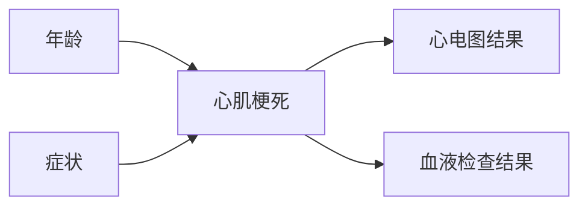

# 医院信息管理系统详细设计与具体代码实现

## 1. 背景介绍

### 1.1 医疗信息化的重要性

在当今快节奏的社会中,医疗保健行业面临着巨大的挑战。患者数量不断增加,医疗资源有限,同时医疗错误和低效率的问题也日益突出。为了应对这些挑战,医疗信息化已经成为了医疗机构提高运营效率、降低成本、提升医疗质量的关键举措。

医院信息管理系统(Hospital Information System, HIS)作为医疗信息化的核心,通过整合医院各个职能部门的信息流,实现了医疗数据的电子化管理,极大地提高了医疗服务的质量和效率。

### 1.2 医院信息管理系统的作用

一个完善的HIS系统可以为医院带来诸多好处:

- 实现医疗数据的电子化,消除重复录入,减少医疗差错
- 优化医院工作流程,提高工作效率
- 为临床决策提供数据支持,提升医疗质量
- 加强医疗资源的协同管理,降低运营成本
- 为医院管理层提供决策分析数据

### 1.3 系统开发的挑战

尽管HIS系统能够带来诸多好处,但其开发和实施也面临着不少挑战:

- 涉及多个复杂的子系统,需要精心设计
- 需要满足多方利益相关者的需求
- 医疗数据的安全性和隐私性要求很高
- 系统的可用性和可靠性直接关系到生命安全
- 需要与其他医疗系统进行数据交换和集成

## 2. 核心概念与联系

### 2.1 系统架构

一个完整的HIS系统通常由多个子系统组成,包括:

- 电子病历系统(EMR)
- 医嘱管理系统(OMS) 
- 护理信息系统(NIS)
- 药品管理系统(PMS)
- 医疗器械管理系统
- 财务管理系统
- 人力资源管理系统
- ...

这些子系统相互关联,共享数据,协同工作。系统架构的设计对于实现高效的数据流转至关重要。

### 2.2 数据标准

为了实现医疗数据的无缝交换和集成,需要遵循统一的数据标准,如:

- HL7标准:医疗数据交换的国际标准
- ICD-10:疾病编码标准 
- LOINC:检验观察标识码
- SNOMED CT:系统命名医学术语

遵循这些标准有助于确保数据的一致性和互操作性。

### 2.3 系统集成

现代医院通常已经拥有多个遗留系统,HIS需要与这些系统进行无缝集成,实现数据共享。常见的集成方式包括:

- 数据库层面集成
- 消息队列集成
- 企业服务总线(ESB)集成
- 基于标准(如HL7)的点对点集成

选择合适的集成策略对系统的性能和可扩展性至关重要。

## 3. 核心算法原理具体操作步骤

### 3.1 工作流引擎

医院的医疗服务过程可以抽象为一系列的工作流,如就诊流程、检查流程、手术流程等。工作流引擎负责对这些流程进行建模、执行和监控。

工作流引擎的核心算法通常基于有限状态机或Petri网等模型,用于描述和控制流程的执行路径。常见的开源工作流引擎包括Activiti、Camunda等。

#### 3.1.1 流程定义

使用流程建模工具(如Activiti Modeler)对业务流程进行图形化建模,定义流程中的活动、网关、事件等元素,并设置相应的属性和条件。

流程定义通常使用BPMN 2.0标准,可以导出为XML格式的流程部署文件。

#### 3.1.2 流程实例化和执行

在运行时,工作流引擎根据流程定义文件创建流程实例,并驱动实例按照预定义的路径执行。

每个活动可以与服务任务相关联,服务任务封装了实际的业务逻辑,如创建病历、开具处方等。工作流引擎负责协调活动的执行顺序和路径选择。

#### 3.1.3 流程监控

工作流引擎提供了监控和管理界面,允许查看流程实例的执行状态、挂起/激活实例、将实例转移到特定节点等操作。

此外,工作流引擎还支持历史数据查询,可以对已完成的流程实例进行审计和分析。

### 3.2 规则引擎

在医疗决策过程中,通常需要应用大量的规则和协议,如用药规则、检查规则、诊断规则等。规则引擎为此提供了一种高效、可维护的解决方案。

规则引擎将规则与业务逻辑代码分离,使用声明式的规则语言(如Drools规则语言)定义规则,通过规则引擎执行这些规则。

#### 3.2.1 规则定义

使用规则编辑器定义规则文件,每个规则文件包含一个或多个规则。规则通常由以下部分组成:

- 规则属性:规则的元数据,如名称、说明等
- 规则条件:规则执行的前提条件,使用模式匹配来检查事实数据
- 规则结果:满足条件后要执行的操作

#### 3.2.2 规则执行

在程序中,首先需要创建知识库(Knowledge Base)和会话(Session)。

知识库用于存储编译后的规则定义,会话用于插入事实数据并执行规则。规则引擎会遍历事实数据,找到匹配的规则并执行其结果操作。

#### 3.2.3 规则管理

规则引擎提供了规则的版本控制、规则流程控制等高级功能,确保规则执行的一致性和可追溯性。

此外,通过集成规则管理工具,可以方便地维护和部署规则,提高规则变更的效率。

### 3.3 基于约束的优化算法

在医院资源调度等场景中,需要在满足多种约束条件的前提下,寻找最优解。这可以使用基于约束的优化算法(Constraint Programming)来解决。

#### 3.3.1 问题建模

首先需要将优化问题形式化为决策变量、目标函数和约束条件:

- 决策变量:需要求解的未知数
- 目标函数:需要最大化或最小化的目标
- 约束条件:对决策变量的限制

#### 3.3.2 求解器

约束求解器(Constraint Solver)使用一种称为节点一致性技术(Node Consistency Techniques)的搜索算法来解决约束优化问题。

常见的求解器包括Google OR-Tools、IBM CPLEX等,它们提供了多种优化算法,如线性规划、整数规划、约束规划等。

#### 3.3.3 搜索策略

求解器通常使用启发式搜索策略来加速求解过程,如最小剩余值优先、最小约束度优先等。同时,可以设置求解的时间限制、求解目标等参数来控制求解过程。

#### 3.3.4 应用示例

资源调度是约束优化算法在医院中的一个典型应用场景,如床位调度、手术室调度等,需要在有限资源的约束下安排各项活动,使总体等待时间最小化。

## 4. 数学模型和公式详细讲解举例说明

### 4.1 马尔可夫决策过程在医疗决策中的应用

马尔可夫决策过程(Markov Decision Process, MDP)是一种用于建模序贯决策问题的数学框架,在医疗决策领域有广泛应用。

一个MDP模型通常由以下5个要素组成:

- 状态集合 $\mathcal{S}$
- 动作集合 $\mathcal{A}$  
- 转移概率 $P(s' | s, a)$:在状态$s$执行动作$a$后,转移到状态$s'$的概率
- 奖励函数 $R(s, a, s')$:在状态$s$执行动作$a$后转移到$s'$的即时奖励
- 折扣因子 $\gamma \in [0, 1)$:对未来奖励的衰减率

目标是找到一个策略$\pi: \mathcal{S} \rightarrow \mathcal{A}$,使得期望的累积折扣奖励最大:

$$
\max_\pi \mathbb{E}\left[ \sum_{t=0}^\infty \gamma^t R(s_t, a_t, s_{t+1}) \right]
$$

其中$s_0$是初始状态,$a_t = \pi(s_t)$是在状态$s_t$执行的动作。

#### 4.1.1 马尔可夫决策过程在糖尿病治疗中的应用

以糖尿病治疗为例,我们可以构建如下MDP模型:

- 状态$s$:包括患者的血糖水平、体重指数、并发症情况等
- 动作$a$:不同的治疗方案,如口服药物、胰岛素注射、生活方式干预等
- 转移概率$P(s' | s, a)$:在当前状态$s$采取治疗方案$a$后,转移到状态$s'$的概率
- 奖励函数$R(s, a, s')$:根据血糖控制情况、并发症发生率等设计合理的奖励
- 策略$\pi(s)$:为每个状态$s$推荐最优的治疗方案$a$

通过求解该MDP模型,我们可以得到一个最优策略,为患者推荐个性化、循证的治疗方案,从而最大限度地控制疾病并减少并发症。

### 4.2 贝叶斯网络在医学诊断中的应用

贝叶斯网络(Bayesian Network)是一种基于概率论的图形化模型,能够有效地表示因果关系和不确定性知识,在医学诊断领域有重要应用。

一个贝叶斯网络由两部分组成:

- 有向无环图$G = (V, E)$,其中$V$是节点集合,表示随机变量;$E$是有向边集合,表示变量之间的因果关系。
- 条件概率分布$P(X_i | Pa(X_i))$,表示每个节点$X_i$在给定其父节点$Pa(X_i)$的条件下的条件概率分布。

根据贝叶斯网络的结构和参数,我们可以计算任意事件的联合概率分布:

$$
P(X_1, X_2, \ldots, X_n) = \prod_{i=1}^n P(X_i | Pa(X_i))
$$

#### 4.2.1 贝叶斯网络在心肌梗死诊断中的应用

以心肌梗死诊断为例,我们可以构建如下贝叶斯网络模型:



其中:

- 节点$A$表示患者的年龄
- 节点$B$表示患者的症状,如胸痛、呼吸困难等
- 节点$C$表示患者是否发生心肌梗死,是我们需要诊断的目标
- 节点$D$和$E$分别表示心电图和血液检查的结果,作为观测证据

给定患者的年龄、症状、心电图和血液检查结果,我们可以根据贝叶斯网络计算患者发生心肌梗死的后验概率:

$$
P(C | A, B, D, E) \propto P(C | A, B) P(D | C) P(E | C)
$$

从而为医生提供有价值的诊断参考。

## 5. 项目实践:代码实例和详细解释说明

本节将以一个简化的门诊医生工作站系统为例,展示HIS系统的具体实现。

### 5.1 系统架构

```mermaid
graph TD
    subgraph Presentation
        UI[Web UI]
    end
    
    subgraph Application
        GW[API网关] -->|HTTP| BL1[病历服务]
        GW -->|HTTP| BL2[医嘱服务]
        GW -->|HTTP| BL3[检查服务]
    end
    
    subgraph Data
        DB1[电子病历数据库]
        DB2[医嘱数据库]
        DB3[检查数据库]
    end
    
    BL1 -->|JDBC| DB1
    BL2 -->|JDBC| DB2 
    {"msg_type":"generate_answer_finish"}