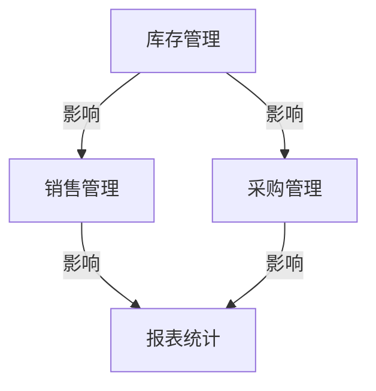

## 1.背景介绍

在现代化的服装批发和零售业中，进销存管理系统的作用不可忽视。它们为企业提供了有效管理库存、跟踪销售、预测需求等核心业务流程的工具。随着技术的发展，基于BS（Browser/Server）模式的进销存管理系统应运而生。本文将详细介绍基于BS模式的服装进销存管理系统的详细设计与具体代码实现。

### 1.1 什么是BS模式

BS模式，即浏览器/服务器模式，是一种网络应用程序的架构模式。在这种模式中，用户在浏览器中通过HTTP协议与服务器进行交互，服务器处理请求并返回结果，用户在浏览器中查看和操作结果。

### 1.2 为什么选择BS模式

BS模式具有许多优点，包括：
1. 客户端安装简单：用户只需要一个浏览器，无需安装其他软件。
2. 跨平台：无论是Windows、Mac还是Linux，只要有浏览器就可以访问。
3. 维护简单：所有的业务逻辑都在服务器端，更新和维护方便，无需对每个客户端进行维护。

## 2.核心概念与联系

基于BS模式的服装进销存管理系统，其核心概念主要包括库存管理、销售管理、采购管理、报表统计等。

### 2.1 库存管理

库存管理主要包括库存查询、库存盘点、库存调整等功能。用户可以实时查看库存量，定期进行库存盘点，根据实际情况调整库存。

### 2.2 销售管理

销售管理主要包括销售开单、销售退货、销售报表等功能。用户可以进行销售开单操作，处理客户退货，通过销售报表了解销售情况。

### 2.3 采购管理

采购管理主要包括采购开单、采购退货、采购报表等功能。用户可以进行采购开单操作，处理供应商退货，通过采购报表了解采购情况。

### 2.4 报表统计

报表统计主要包括库存报表、销售报表、采购报表等功能。用户可以通过各种报表，了解库存、销售、采购等情况。

这些核心概念之间的关系，可以通过以下图表进行展示。



## 3.核心算法原理具体操作步骤

基于BS模式的服装进销存管理系统的核心技术主要包括前端技术、后端技术、数据库技术等。

### 3.1 前端技术

前端技术主要包括HTML、CSS、JavaScript等。HTML用于创建网页结构，CSS用于美化网页，JavaScript用于实现网页交互。

### 3.2 后端技术

后端技术主要包括服务器端编程语言和框架，如Java、Spring Boot等。服务器端编程语言用于处理业务逻辑，框架用于简化开发流程。

### 3.3 数据库技术

数据库技术主要包括数据库管理系统和SQL语言，如MySQL、Oracle等。数据库管理系统用于存储和管理数据，SQL语言用于操作数据库。

## 4.数学模型和公式详细讲解举例说明

在进销存管理系统中，有一些核心的数学模型和公式，例如库存成本计算、销售额预测等。

### 4.1 库存成本计算

库存成本是指为了维持库存而产生的总成本。按照固定成本法，库存成本可以通过以下公式计算：

$$ IC = P \times Q $$

其中，$IC$表示库存成本，$P$表示单位商品的购买价格，$Q$表示商品的数量。

### 4.2 销售额预测

销售额预测是根据过去的销售数据，预测未来的销售额。我们可以使用简单的线性回归模型进行预测，公式如下：

$$ Y = a + bX $$

其中，$Y$表示预测的销售额，$X$表示时间，$a$和$b$是回归系数。

## 4.项目实践：代码实例和详细解释说明

接下来，我们将通过具体的代码实例，展示如何实现基于BS模式的服装进销存管理系统。

### 4.1 库存查询功能的实现

在库存查询功能中，用户可以通过输入商品名，查询该商品的库存量。以下是实现库存查询功能的HTML和JavaScript代码：

```html
<!-- HTML代码 -->
<div>
    <input type="text" id="name" placeholder="输入商品名">
    <button onclick="query()">查询</button>
</div>
<div id="result"></div>
```

```javascript
// JavaScript代码
function query() {
    var name = document.getElementById("name").value;
    var xhr = new XMLHttpRequest();
    xhr.open("GET", "/inventory?name=" + name, true);
    xhr.onreadystatechange = function() {
        if (xhr.readyState == 4 && xhr.status == 200) {
            var result = JSON.parse(xhr.responseText);
            document.getElementById("result").innerHTML = "库存量：" + result.quantity;
        }
    };
    xhr.send();
}
```

在上述代码中，用户通过输入商品名，点击查询按钮，发送一个GET请求到"/inventory"接口，查询该商品的库存量。服务器返回的结果通过JavaScript处理，显示在页面上。

### 4.2 销售开单功能的实现

在销售开单功能中，用户可以输入商品名、数量和价格，生成一张销售单。以下是实现销售开单功能的HTML和JavaScript代码：

```html
<!-- HTML代码 -->
<div>
    <input type="text" id="name" placeholder="输入商品名">
    <input type="number" id="quantity" placeholder="输入数量">
    <input type="number" id="price" placeholder="输入价格">
    <button onclick="createOrder()">开单</button>
</div>
```

```javascript
// JavaScript代码
function createOrder() {
    var name = document.getElementById("name").value;
    var quantity = document.getElementById("quantity").value;
    var price = document.getElementById("price").value;
    var xhr = new XMLHttpRequest();
    xhr.open("POST", "/order", true);
    xhr.setRequestHeader("Content-Type", "application/json");
    xhr.onreadystatechange = function() {
        if (xhr.readyState == 4 && xhr.status == 200) {
            alert("开单成功");
        }
    };
    xhr.send(JSON.stringify({
        name: name,
        quantity: quantity,
        price: price
    }));
}
```

在上述代码中，用户通过输入商品名、数量和价格，点击开单按钮，发送一个POST请求到"/order"接口，创建一张销售单。服务器处理请求，返回成功消息。

## 5.实际应用场景

基于BS模式的服装进销存管理系统可以广泛应用于服装批发和零售业。以下是一些具体的应用场景：

### 5.1 服装批发

在服装批发业中，企业需要管理大量的库存，跟踪销售情况，预测需求，以此来制定采购计划。基于BS模式的进销存管理系统可以有效解决这些问题。

### 5.2 服装零售

在服装零售业中，企业需要提供给客户实时的库存信息，处理客户的购买和退货请求，提供销售报表等。基于BS模式的进销存管理系统可以满足这些需求。

## 6.工具和资源推荐

以下是一些开发和运行基于BS模式的服装进销存管理系统的推荐工具和资源：

### 6.1 开发工具

1. Visual Studio Code：一个强大的代码编辑器，支持多种编程语言和插件。
2. Google Chrome：一个常用的浏览器，内置开发者工具，方便进行前端开发和调试。
3. Postman：一个API测试工具，可以发送各种HTTP请求，查看响应结果。

### 6.2 运行环境

1. Node.js：一个JavaScript运行环境，可以运行服务器端的JavaScript代码。
2. MySQL：一个关系型数据库管理系统，可以存储和管理数据。

## 7.总结：未来发展趋势与挑战

随着互联网技术的发展，基于BS模式的进销存管理系统将有更广阔的应用前景。然而，也面临一些挑战，需要我们进一步研究和解决。

### 7.1 发展趋势

1. 移动端的应用：随着移动互联网的发展，基于BS模式的进销存管理系统需要适应移动端的应用，如响应式设计、触摸操作等。
2. 数据分析和智能化：随着大数据和人工智能的发展，基于BS模式的进销存管理系统需要加强数据分析和智能化功能，如销售预测、库存优化等。

### 7.2 挑战

1. 性能优化：随着业务的发展，基于BS模式的进销存管理系统需要处理更大的数据量和更高的并发请求，性能优化成为一个重要的挑战。
2. 安全保障：随着网络攻击的增多，基于BS模式的进销存管理系统需要加强安全保障，如数据加密、防止SQL注入等。

## 8.附录：常见问题与解答

### 8.1 问题一：为什么选择BS模式，而不是CS模式？

答：BS模式比CS模式有许多优点，如客户端安装简单、跨平台、维护简单等。而且，随着互联网的发展，BS模式更适应现代的业务需求。

### 8.2 问题二：如何优化库存管理？

答：库存管理可以通过多种方式进行优化，如设置安全库存、采用先进先出法、定期进行库存盘点等。此外，还可以通过数据分析和预测，更精确地管理库存。

### 8.3 问题三：如何保障系统的安全？

答：系统的安全可以通过多种方式进行保障，如数据加密、使用HTTPS协议、防止SQL注入、设置权限控制等。{"msg_type":"generate_answer_finish"}