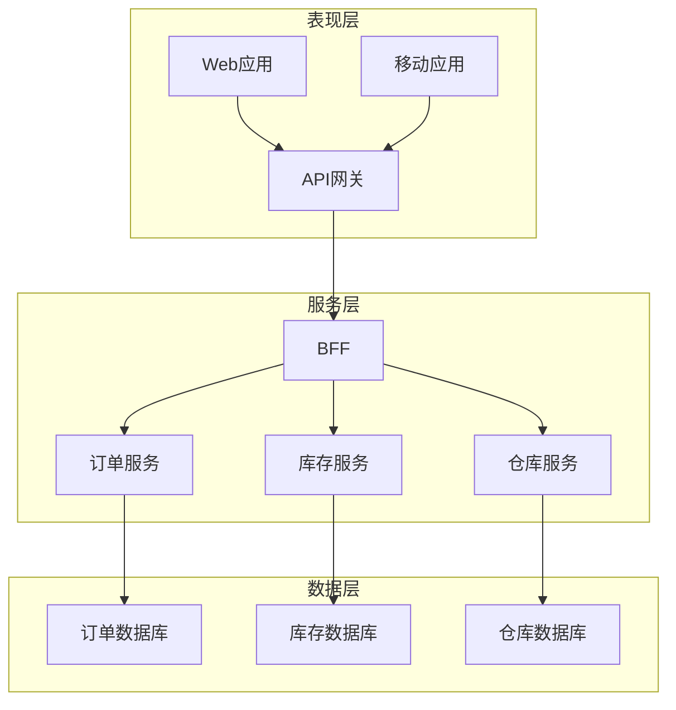

# 1. 背景介绍

## 1.1 仓库管理系统的重要性

在现代企业中,仓库管理系统扮演着至关重要的角色。它是确保物料、产品和资产高效流动的关键。有效的仓库管理不仅可以优化库存水平,降低运营成本,还能提高客户满意度并增强企业的竞争力。

## 1.2 传统仓库管理的挑战

传统的手工仓库管理存在诸多弊端:

- 人工操作效率低下,容易出错
- 缺乏实时库存数据,盲目补货导致资金占用
- 缺乏统一的系统,各部门协作困难
- 缺乏完整的审计追踪,物料流向不明

## 1.3 现代仓库管理系统的优势  

一个先进的仓库管理系统可以解决上述挑战,主要优势包括:

- 自动化作业流程,提高效率,减少人工错误
- 实时监控库存,优化补货策略
- 统一数据,集成上下游,提升协同能力  
- 完整的审计追踪,物料流向可视化

# 2. 核心概念与联系

## 2.1 仓库管理的核心概念

- 库存商品(SKU)
- 入库/出库
- 库位
- 拣货
- 盘点
- ...

## 2.2 相关系统的关系

仓库管理系统与企业的其他核心系统密切相关:

- ERP系统:计划、采购、生产等数据源
- WMS系统:高级仓储管理功能
- TMS系统:运输管理
- CRM系统:订单数据源
- ...

# 3. 核心算法原理和具体操作步骤  

## 3.1 库存管理算法

### 3.1.1 经典算法

常见的库存管理算法有:

- 先进先出(FIFO)
- 后进先出(LIFO)  
- 批次管理

### 3.1.2 现代算法

- ABC分类管理
- 经济订货量(EOQ)模型
- 材料需求计划(MRP)
- 分布式复杂库存优化

### 3.1.3 具体操作步骤

1) 建立商品主数据,包括编码、规格、供应商等
2) 确定库存策略,如安全库存、最大最小值等
3) 入库时,根据批次/先后顺序分配库位
4) 出库时,根据算法选择合适的库存
5) 定期盘点,核对系统库存
6) 根据实际需求调整库存策略

## 3.2 拣货路径优化算法

### 3.2.1 问题描述

给定一个仓库的布局,多个需要拣货的货品位置和数量,求拣货员的最优拣货路径,使路径总长度最短。这是一个典型的组合优化问题。

### 3.2.2 算法原理

1. 贪婪算法
    - 从最近的货品开始拣货
    - 计算复杂度低,但结果不一定最优

2. 动态规划
    - 将问题分解为子问题,自底向上求解
    - 时间复杂度高,但可以得到全局最优解

3. 启发式算法
    - 如遗传算法、蚁群算法等
    - 在合理时间内得到近似最优解

### 3.2.3 具体步骤

1) 获取订单明细,确定需拣货的货品
2) 构建仓库的数学模型,包括通道、货位等
3) 选择合适的算法,如动态规划
4) 计算最优路径
5) 输出路径给拣货员导航

## 3.3 仓库调度算法

### 3.3.1 问题描述  

在仓库中,存在多种作业类型,如入库、出库、拣货等。每种作业需要占用不同的资源,如人力、设备等。如何合理调度作业,最大化资源利用率,是一个复杂的组合优化问题。

### 3.3.2 算法原理

1. 优先级算法
    - 根据作业优先级排序
    - 简单,无需复杂计算
    - 可能导致资源利用率低

2. 启发式算法  
    - 遗传算法、蚂蚁算法等
    - 求解质量较好
    - 计算复杂度高

3. 约束编程
    - 建立作业和资源的数学模型
    - 在约束条件下求解最优调度方案
    - 可处理复杂约束,但求解器性能是瓶颈

### 3.3.3 具体步骤  

1) 获取所有待处理作业及其优先级
2) 获取可用资源,包括人力、设备等
3) 建立作业-资源的数学模型
4) 选择合适的算法,如约束编程
5) 计算最优调度方案
6) 将调度结果分派给作业执行人员

# 4. 数学模型和公式详细讲解举例说明

## 4.1 经济订货量(EOQ)模型

EOQ模型试图确定每次订货的最优数量,使得订货成本和库存成本之和最小。

设:
- D 为年度需求量
- S 为每次订货的固定成本  
- H 为每单位产品的年库存持有成本
- Q 为订货量

则:
- 年订货次数 = D/Q  
- 年订货成本 = D/Q * S
- 年库存持有成本 = Q/2 * H

总成本 TC = 年订货成本 + 年库存持有成本
$$ TC = \frac{DS}{Q} + \frac{QH}{2} $$

对总成本求导,并令导数等于0,可得最优订货量Q*:

$$ Q^* = \sqrt{\frac{2DS}{H}} $$

例如,某产品年需求量为10000件,每次订货固定费用100元,每件产品年库存成本2元。那么最优订货量为:

$$ Q^* = \sqrt{\frac{2 \times 10000 \times 100}{2}} = 1000 (件)$$

## 4.2 车辆路径规划模型

设车辆从配送中心出发,需经过n个目的地卸货,然后返回配送中心。求车辆的最短行驶路径。

可建立如下数学模型:

参数:
- $c_{ij}$ 为配送中心i到目的地j的距离
- $x_{ij}$ 是决策变量,若车辆经过路径(i,j),则$x_{ij}=1$,否则为0

目标函数:
$$\min \sum_{i=0}^{n}\sum_{j=0}^{n}c_{ij}x_{ij}$$

约束条件:
- 每个目的地只经过一次
$$\sum_{i=0}^{n}x_{ij}=1,\forall j=1,...,n$$
$$\sum_{j=0}^{n}x_{ij}=1,\forall i=1,...,n$$  
- 起点和终点为配送中心
$$\sum_{j=1}^{n}x_{0j}=1$$
$$\sum_{i=1}^{n}x_{i0}=1$$

这是一个经典的旅行商问题(TSP),可用整数规划或启发式算法求解。

# 5. 项目实践:代码实例和详细解释说明  

## 5.1 系统架构



上图展示了一个典型的企业仓库管理系统的微服务架构:

- 表现层: 包括Web应用和移动应用,为用户提供操作界面
- 服务层: 包括BFF(Backend for Frontend),订单/库存/仓库等核心服务
- 数据层: 包括订单/库存/仓库的数据库

各层通过RESTful API集成在一起。

## 5.2 核心代码示例

以下是一个使用Python编写的简单库存管理示例:

```python
# 商品类  
class Product:
    def __init__(self, sku, name, price):
        self.sku = sku
        self.name = name 
        self.price = price

# 库存条目类
class InventoryItem:
    def __init__(self, product, qty, batch):
        self.product = product
        self.qty = qty
        self.batch = batch

# 库存管理类  
class InventoryManager:
    def __init__(self):
        self.items = []
        
    # 入库
    def inbound(self, product, qty, batch):
        item = next((i for i in self.items if i.product.sku == product.sku and i.batch == batch), None)
        if item:
            item.qty += qty
        else:
            self.items.append(InventoryItem(product, qty, batch))
            
    # 出库 
    def outbound(self, product, qty):
        allocated = []
        remaining = qty
        for item in sorted(filter(lambda i: i.product.sku == product.sku, self.items), key=lambda i: i.batch):
            if item.qty <= remaining:
                allocated.append(item)
                remaining -= item.qty
                item.qty = 0
            else:
                item.qty -= remaining
                allocated.append(InventoryItem(item.product, remaining, item.batch))
                break
                
        self.items = [i for i in self.items if i.qty > 0]
        self.items.extend(allocated)
        
    # 查询库存    
    def check_inventory(self, product):
        total = sum(item.qty for item in self.items if item.product.sku == product.sku)
        return total
```

上述代码实现了基本的入库、出库(先进先出)和库存查询功能。在实际项目中,还需要考虑并发控制、事务一致性、异常处理等问题。

# 6. 实际应用场景

先进的仓库管理系统在各行各业都有广泛应用:

- 制造业: 管理原材料、在制品和产成品
- 零售业: 高效处理订单,提高履约能力
- 电子商务: 集成供应链,提升用户体验
- 物流行业: 跟踪货物流向,优化线路
- 医疗行业: 管理药品、器材等库存
- ...

# 7. 总结:未来发展趋势与挑战

## 7.1 发展趋势

- 智能化
    - 机器人拣货
    - 无人驾驶车辆
    - AI优化决策
- 自动化
    - 自动化入库出库
    - 自动化盘点
    - 无人值守仓库
- 集成化
    - 与ERP/WMS/TMS等系统集成
    - 打通上下游供应链
    - 可视化端到端物流

## 7.2 挑战

- 大数据处理
    - 海量物流数据
    - 实时数据流分析
- 复杂约束
    - 多维度库存策略
    - 多目标优化
- 系统集成
    - 遗留系统集成
    - 数据标准统一
    - 业务流程协同

# 8. 附录:常见问题与解答  

## 8.1 如何选择合适的库存管理策略?

不同的企业和产品线面临不同的挑战,需要量身定制库存策略。一般需要考虑:

- 产品特性:保质期、季节性、价值等
- 供应链情况:供应商交期、运输成本等
- 需求波动情况:平稳、季节性、不确定性等

常见策略有经济订货量模型、材料需求计划、分类库存管理等。也可结合多种策略,制定混合策略。

## 8.2 仓库自动化的优缺点是什么?

优点:

- 提高作业效率
- 降低人工成本
- 减少人为错误
- 实现24/7运营

缺点: 

- 高昂的前期投资
- 系统复杂,维护成本高
- 人机协作的挑战
- 技术更新换代快

因此,需要根据具体情况,权衡自动化的收益和成本。

总的来说,现代仓库管理系统正在通过创新技术不断演进,以满足日益复杂的企业需求。作为IT专业人士,我们有责任掌握最新技术,为企业带来切实的价值。{"msg_type":"generate_answer_finish"}